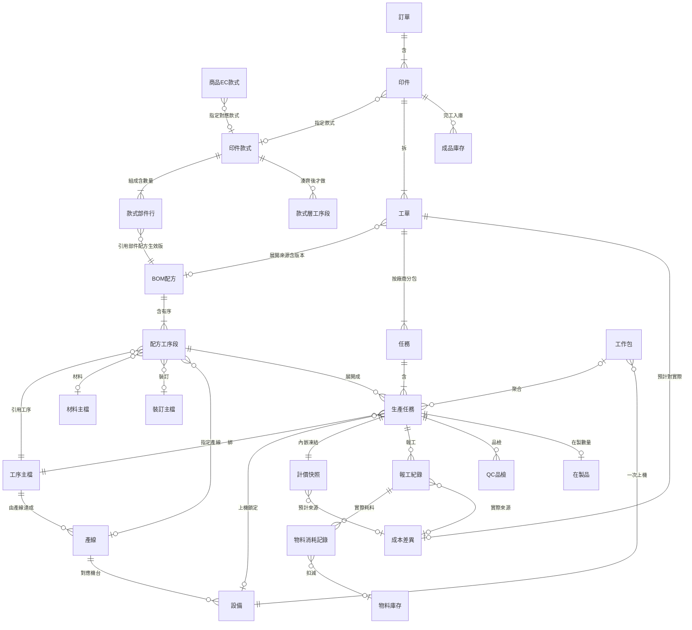

# 生產模組架構設計

> **這是生產模組的完整架構設計正本**（2026-06-13~14 多輪設計討論收斂）。落地前的設計藍圖、落地後各實體卡依此建。目的：**前期把設計定完整，避免事後打掉重做**。

> **設計大原則（2026-06-14）**：MES 是成熟領域、不重造輪子，以**分層骨幹為主、公司現況微調**——ISA-95 為資訊模型骨幹（配方→工單→回報三物件閉環）、成熟 SaaS（Dynamics／Odoo）補成本／KPI／排程、印刷專用 MIS（PrintVis／Avanti）補拼版／顏色。目的：用已驗證的架構導正現場、給高層可視化。完整 MES 五層架構與分階段見第九節；六權威研究每篇連結見 [[2026-06-14-生產MES第一版設計總覽]] § 相關卡。

## 一、製程分類樹（5 層，定案）

```
大類（印刷 / 後加工 / 物流 / 其他）        ← 製程群組的上層標籤
  └─ 製程群組（表面處理）                ← 工序的分類容器，工序可自由歸類
       └─ 工序（亮膜、軋型）             ← 客戶要的加工項，BOM 上的項目，有先後順序
            └─ 產線（上亮膜線、軋型線）    ← 達成工序的生產線；選供應商或自有；實際生產單位；對應工作站
                 └─ 設備/工作站（上膜機） ← 產線對應的機台
```

- **執行方（自有 vs 供應商）選在「產線」層**——同一條產線的活可一部分自有、一部分外包（產能溢出外發）。
- **產線是大家有概念的單位**：現場實際看產線在生產；產線對應工作站（設備）。

**彩盒例子**：客戶要彩盒（上膜＋軋型）→ 工序：亮膜 → 軋型（有順序）→ 產線：上亮膜線（選自有/外包）→ 軋型線 → 設備：上膜機、軋型機。

## 二、BOM vs 工單（兩條不耦合的線）

| | BOM（生產配方）| 工單（生產執行）|
|--|------|------|
| 是什麼 | 印件「該怎麼做」的配方 | 「實際生產出來」的執行單 |
| 何時 | 報價/規格階段（成交前算成本）| 成交後排產 |
| 內容 | 走哪些工序、每工序哪條產線、材料、成本 | 依 BOM 排程、分派、報工、追進度 |
| 回答 | 要做什麼、多少錢 | 實際做到哪 |
| 改它＝ | 改配方/成本（錢的事）| 改生產執行（生產的事）|
| 數量 | 一印件一份配方（商品款式可重用；EC 引用展開、線下客製可無）| 一印件可拆多張工單 |

關係：BOM 是藍圖，工單依 BOM 把工序展開成生產任務去執行。分開的理由＝報價/成本與生產執行互不干擾（錢找 BOM、生產卡住找工單）。類比：BOM 像食譜、工單像實際下廚的工單。

## 三、生產實體與掛接

**拆解鏈**：印件 ─含─ BOM（配方）；**工單 ─依 BOM 直接拆─▶ 生產任務**（任務層已於 2026-07-28 拍板移除，正本見 [production-stage-high-level-design](../../../../../production-stage-high-level-design.md)）。

| 實體 | 怎麼掛 |
|------|--------|
| **BOM** | 印件的生產配方：定義要哪些**工序**、每工序走哪條**產線**、產線選自有/供應商、順序、各成本 |
| **工單** | 印件的生產執行單位（一印件可多張）；**依 BOM 直接拆出生產任務** |
| **生產任務** | **直屬工單**，每條**產線**一個，綁 BOM、帶 工序＋產線＋設備＋執行方（唯讀）；報工/品檢/完成度的最小單位。外包分組唯一歸 [[派單]]（廠商×工單）、場內派工分組唯一歸 [[工作包]]，交付畫面以衍生分組（按廠商）呈現 |
| **工作包** | **一次上機＝單一設備**：聚合跨工單、同產線、同設備能力的生產任務包給師傅（派工），無狀態；開機費歸集與共用資源面積分攤的單元；要分多台機就拆多個工作包（見 [[工作包]]）|
| **設備佇列** | 每台設備一佇列、同設備跨訂單排一起（排程）|

> **任務（交付包）層已移除**（2026-07-28 拍板，正本見 [production-stage-high-level-design](../../../../../production-stage-high-level-design.md)）：原「按廠商分包」的交付追蹤職責拆解——外包分組唯一歸 [[派單]]、場內派工分組唯一歸 [[工作包]]，交付畫面以衍生分組（按廠商）呈現；[[PT-010-印務交付生管接收交接是否需要]] 的交付追蹤需要由派單承接。狀態鏈三層（生產任務→工單→印件）、異動鏈直接生產任務→工單鏡像。

## 四、兩個正交分組視角

一筆生產任務同時被多條正交視角分組（彼此無直接關係）：

| 視角 | 分組依據 | 誰用 / 目的 | 狀態 |
|------|---------|------------|------|
| 交付（任務包）| 同負責廠商 | 印務交付追蹤；外包獨立追進度 / 紙本派單；確認各廠商收到才標工單已交付 | 有 |
| 派工（工作包）| 生管統整給師傅（同一次上機 / 同產線）| 師傅看要一起做的單位 | 無 |
| 排程（設備佇列）| 同設備 | 同機跨訂單排一起、定順序 | — |

## 五、通用機制（不寫死的關鍵）

1. **設備靠「可執行製程」分類**，不自存設備類型枚舉——大類/產線由製程推導，新增類型不改 code（「平版/數位/大圖」其實是印刷大類下的產線，不是設備固有類型）。
2. **計價跟「工序的計價方法」走**，設備只填參數——後加工不必硬套印刷的千車模型。
3. **執行方選在產線層**（產線選自有/供應商）。
4. **師傅與設備解耦**——師傅可跨機、有專長，換人換機各自獨立。
5. **延遲/待機是附加「狀況」、不進主狀態**——主狀態回答「做到哪個階段」（單向、維持不動）；延遲＝系統衍生（比對預計完工日vs實際進度、可向上彙整）、待機＝人工標＋原因（等料/等前工序/等設備，其中等前工序即 [[工序相依性規則]]）。狀況與主狀態正交、另記一層，避免狀態爆炸。
6. **機台於工單建立時決定**（2026-07-22 拍板，推翻原「設備晚綁定」）——配方工序段宣告能力需求，印務於工單建立（製程規劃）時從同能力候選機台中比數量與成本選定；生產中換機走工單異動。一次上機＝單一設備、產能負載以設備為單位算不變。

## 六、關鍵設計決策與理由（防後人推翻）

| 決策 | 理由 |
|------|------|
| 製程 5 層樹（群組⊃工序⊃產線⊃設備）| 產線是現場實際生產單位、執行方決策層；工序是客戶要的加工項 |
| 設備不存類型枚舉、靠製程分類 | 枚舉寫死不可擴展，窮舉所有類型不可行 |
| 計價跟製程計價方法走（2026-07-23 校正為雙軌：印刷計價掛 [[設備]]、後加工計價掛 [[工序主檔]]） | 不同製程計價結構天生不同（印刷色數區間 vs 後加工面積/件數）|
| BOM 與工單不耦合 | 報價/成本變動與生產執行變動互不干擾 |
| 生產任務執行方綁 BOM、不可改 | 生產任務是裝 BOM 的容器，執行方是 BOM 決策 |
| 任務（交付包）層移除、生產任務直屬工單（2026-07-28 拍板） | 外包分組唯一歸派單（廠商×工單）、場內派工唯一歸工作包，交付畫面以衍生分組呈現；PT-010 的交付追蹤需要由派單承接 |
| 在途不向上複製狀態、靠呈現 | 工單底下混合態無法用單一狀態概括，運送在生產任務層/轉交單 |
| 延遲/待機當「狀況」不當主狀態 | 延遲是衍生（預計vs實際）、待機是可來回的處境，塞主狀態會爆炸；主狀態保持單向生命週期 |

## 七、分階段落地（每階段 BRD 先行、spec 後對齊）

| 階段 | 主題 | 內容 |
|:---:|------|------|
| 1 | 製程分類樹 | 製程卡（5 層）+ process-master spec 統一 |
| 2 | 設備（工作站）| 設備卡 + equipment spec 收尾（含 equipment-pricing-model change）|
| 3 | 生產實體 | 生產任務/工單卡對齊 + production-task spec；**任務（交付包）層已移除**（2026-07-28 拍板，與 §三／§六一致——生產任務直屬工單、狀態鏈三層、交付分組歸派單與工作包）|
| 4 | 派工 | 工作包卡 + work-package/scheduling spec |

## 八、待釐清（落地時釘死，先記不漏）

- **BOM 實體建模**（原流程起點缺口，已補）：款式與部件兩層的欄位正本見 [[印件配方]] 與 [[部件配方]]，展開規則（一段拆材料與工序兩任務、合併旗標、機台留空、數量與放損來源）見 [[配方展開規則]]；工序相依資料歸 [[工序相依性規則]]、自有與外包兩條執行流程歸 [[生產任務狀態]]、品檢接點歸 [[品檢紀錄]]。
- **交付/接收交接動作是否需要**：拿掉 task 後原「待交付→已交付」交接的去留，待現場確認 → [[PT-010-印務交付生管接收交接是否需要]]。
- **工序「供應商」（Figma）vs 執行方在產線層**：術語對應落地時釐清。
- **大類**：作為製程群組標籤、還是獨立一層。
- **工作包分組**：已定案（2026-07-22 拍板）——合批條件不寫死，由生管自主決定（實務常見依同工法／同工序），系統只提供跨工單候選視圖與打包操作、不強制聚合指紋；原「spec 同工序 vs 本設計同產線」的二擇命題作廢，見 [[工作包]]。

## 九、生產 MES 完整架構（2026-06-14 擴充：五層 + 分階段）

> 本節把上述生產執行骨架擴展為完整 MES。原則見卡頂「設計大原則」：分層骨幹（ISA-95 + SaaS + 印刷 MIS）+ 公司現況微調。第一版實體清單、現況缺口報告與啟用前待核對見 [[2026-06-14-生產MES第一版設計總覽]]。

### 配方與工單兩路徑（補第二節）

配方分兩層：[[印件配方]] 記「這件印刷品由哪些部件組成、每種幾個、要不要各開一張工單」，[[部件配方]] 記「一個部件怎麼做」且可被多個款式引用（共用部件只維護一份）；兩者都不綁印件實例。工單建立三條路徑（權威皆支援，Dynamics 三來源含手動）：

- **EC／重複品**：EC 商品指定對應款式，下單後印件帶入款式、自動展開所有工單草稿（免印務手填）。
- **線下引用**：印務在印件上選款式，引用時可調整部件組合（增刪部件、改數量）再展開。
- **線下全客製**：印件無款式，工單依實況手動規劃；做完可沉澱回部件配方供回頭單重用。

引用、調整、展開與沉澱的規則正本見 [[配方展開規則]]。
- 兩路徑工單建立當下都把計價規則**複製成計價快照**（凍結預計成本，見 [[計價快照]]），主檔事後改價不污染已建工單；未來「引用過往印件／EC 印件」即 EC 路徑的延伸。

### 五層資料架構（ER-model）

由上往下：A 配方（如何製造，可重用）／B 工單執行（這次做什麼）／C 回報（實際做了什麼）／D 成本（預計 vs 實際）／E 管理（KPI/排程/產能）。

> ER 以正規實體關係圖（crow's foot 基數）呈現。基數讀法：`||`＝恰好一、`o|`＝零或一、`|{`＝一或多、`o{`＝零或多（兩字元外側為上限、內側為下限）；實線＝結構關係、虛線（`..`）＝弱關係。五層歸屬：**A 配方**（商品EC款式・BOM配方・配方工序段・工序主檔・產線・設備・材料主檔・裝訂主檔）、**B 工單執行**（訂單・印件・工單・任務・生產任務・工作包・計價快照）、**C 回報**（報工紀錄・QC品檢・物料消耗記錄）、**D 成本**（成本差異）、**E 庫存與管理**（物料庫存・在製品・成品庫存）；生產績效指標為衍生 KPI（非實體、不入 ER 圖）。



### 完工與入庫分離（依業界拆）＋ 完整數量模型

完工（做出多少良品，生產績效、折損 KPI 來源）與入庫（進了多少成品庫存，庫存帳、出貨依據）是兩筆，不再合一。**七個數量的清單與定義正本在 [[齊套邏輯]] § 數量帳與額度公式（2026-07-27 統一），本表只留階段對照、不重述定義**：

| 數量 | 階段 |
|------|:---:|
| 目標數量 | P1 |
| 生產數量 | P1 |
| 良品數 / 不良品數 | P1 |
| 不良品處置數（補做／客戶照收／報廢，2026-07-21 拍板正名；報廢數為折損率分子）| P1 |
| 完工良品數（品檢掛印件層，[[品檢紀錄]]）| P1 |
| 入庫數（現階段＝完工良品數；成品庫存啟用後分離，見 [[成品庫存]]）| P2/P3 |
| 出貨數 / 累計送達 | P1 |

KPI：折損率＝報廢數/生產數量、良率＝良品數/生產數量、稼動率＝實際工時/可用工時。MTO 下 P1「完工良品＝可出貨」，P2/P3 才插入成品庫存層。

### 分階段啟用（架構 P0 全定義、實作分階段）

| 能力 | P0 架構 | P1 MVP | P2 | P3 |
|------|:---:|:---:|:---:|:---:|
| 配方/工序段/EC 綁定 | 定義 | EC展開+線下手動 | | |
| 工單→生產任務→工作包 | 定義 | 拆解/派工/上機 | | |
| 報工/QC/轉交→出貨完成 | 定義 | 全做 | | |
| 計價快照（預計，含開機費歸集）| 定義 | 全做 | | |
| 實際耗料/實際成本/成本差異 | 預留 | | 啟用 | |
| 折損率/稼動率 KPI | 預留 | | 啟用 | |
| 排程 | 定義 | 設備佇列(天) | | 有限產能(小時) |
| 併單面積分攤 | 預留 | 模數比例過渡 | | 面積精算(補尺寸+拼版) |
| 跨印務協調(工序相依) | 定義 | 相依鎖基礎 | | 有限產能協調 |

P0 就把五層實體與欄位掛點全定義，故 P2/P3 是「啟用」而非「重做」——資料結構由上往下、可擴充。

## 相關連結

- 相關實體：[[工單]]、[[生產任務]]、[[印件]]、[[部件配方]]、[[工作包]]、[[計價快照]]、[[成品庫存]]
- 相關規則：[[BOM結構]]、[[數量換算規則]]、[[齊套邏輯]]
- 相關狀態機：[[生產任務狀態]]
- 相關 OQ：[[PT-010-印務交付生管接收交接是否需要]]（交付/接收交接動作是否需要）
