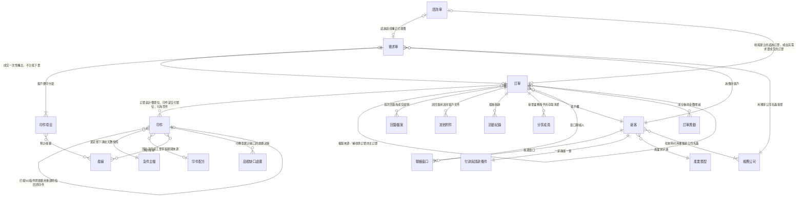
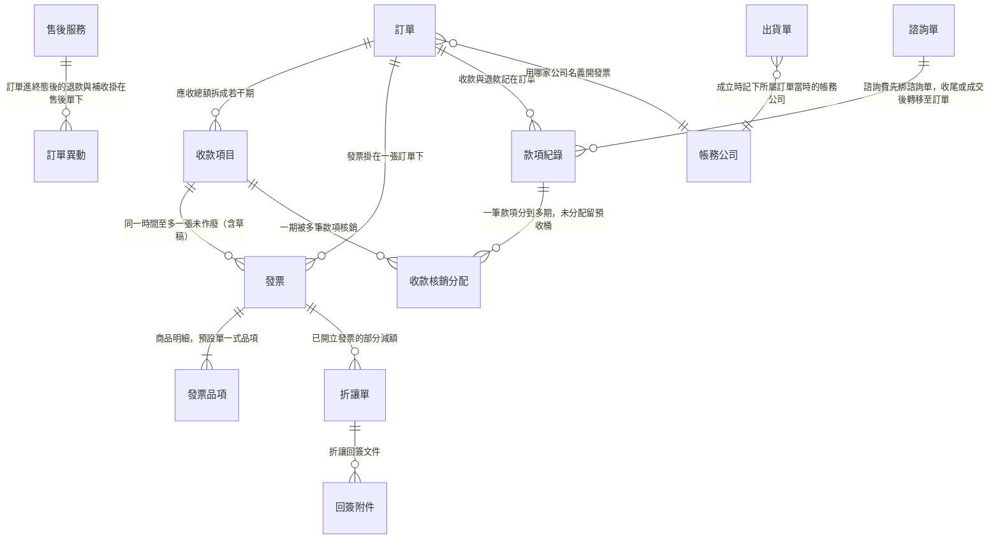
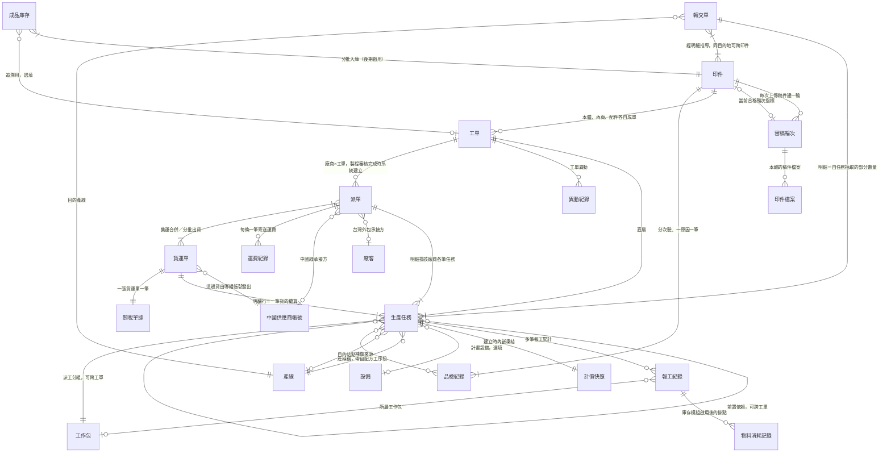
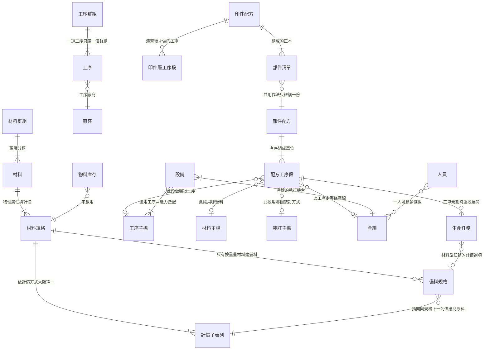
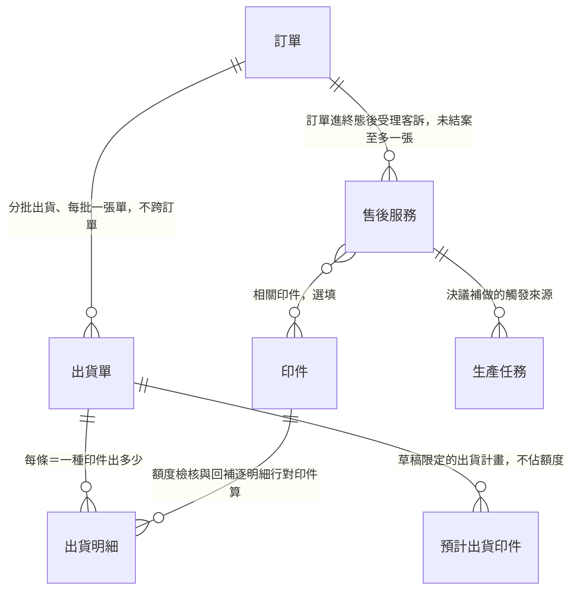
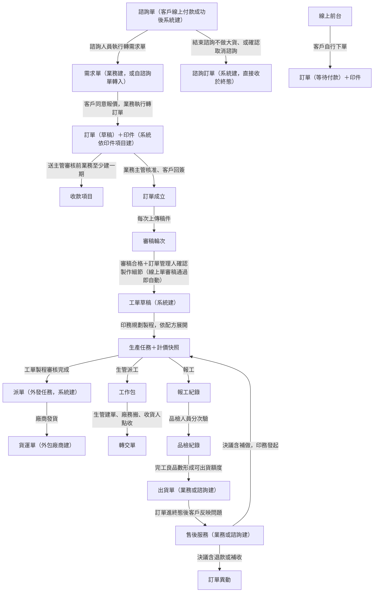
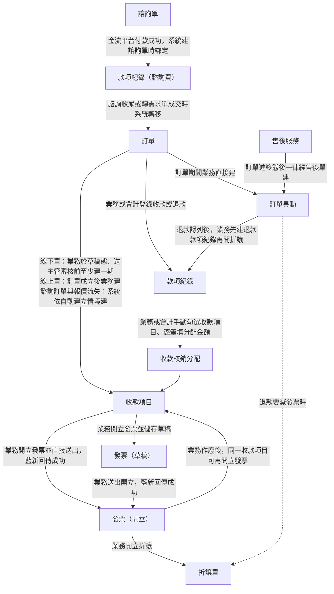
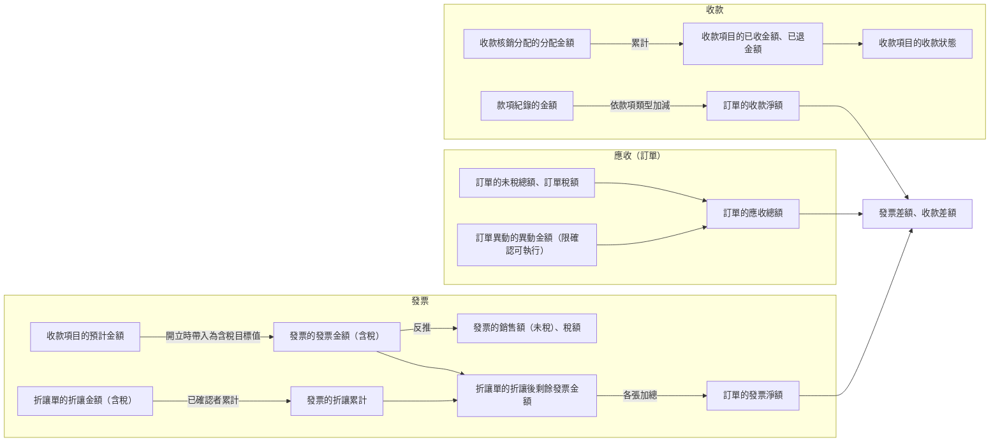
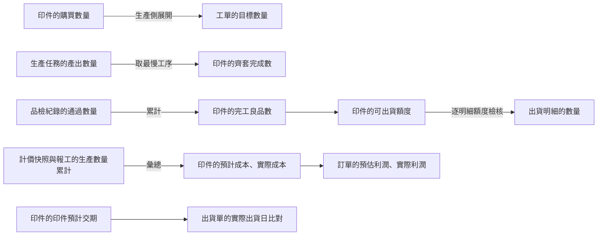

讀完這張卡，你會知道：

- 全系統每個實體跟誰相連、方向與基數是什麼（**關聯的唯一正本**：各領域總覽與各實體卡的「關鍵關聯」段都是視角摘要，基數與方向以本卡為準）
- 一筆生意從諮詢、報價、成交、生產、出貨到收款與售後，單據依什麼順序產生、誰觸發誰建立
- 款項與發票領域的實體怎麼掛在訂單、訂單異動、諮詢單、售後服務底下，以及錢的值怎麼流進三方對帳
- 各領域內部的值流去哪一張領域總覽看
- 本卡不放什麼：實體定義（各卡一句話定位）、欄位表（各實體卡）、狀態列舉與轉換（各狀態機卡）、計算公式本體（規則卡）

## 一、結構視圖（ER 圖＋基數）

全系統圖依領域分成下列子圖。跨子圖出現的實體是邊界節點，同一條關聯只畫在它的業務主場子圖一次。

| 子圖 | 範圍 |
|------|------|
| 1-1 | 售前與訂單管理 |
| 1-2 | 款項與發票 |
| 1-3 | 印前審稿與生產執行 |
| 1-4 | 生產主檔層 |
| 1-5 | 履約與售後 |

### 1-1 售前與訂單管理

[[人員]] 對各單據的指派（接單業務、訂單管理人、審核業務主管、評估印務主管、廠客負責人員）圖上省略，逐條列在關聯明細表。[[訂單]] 的額外費用明細（子表）各源皆未標基數，圖上不畫，明細表照實標「未標」。

### 1-2 款項與發票

款項與發票領域的實體欄位正本都在 [[帳務]]（帳務公司、發票、發票品項、折讓單、款項紀錄、收款項目、收款核銷分配各一子表）與 [[訂單異動]]。下列幾組明示不建關聯，避免後人補連：

| 實體 A | 實體 B | 為什麼不連 |
|--------|--------|-----------|
| [[帳務]] 的折讓單 | [[帳務]] 的款項紀錄 | 折讓只掛發票；折讓與退款款項只在對帳總額層對齊，反查走訂單活動紀錄（[[付款發票邏輯]]） |
| [[帳務]] 的發票 | [[帳務]] 的款項紀錄 | 發票與收款的對應經收款項目中介，發票不直接掛款項紀錄（[[發票狀態]]） |
| [[售後服務]] | [[帳務]] 的款項紀錄 | 退款金流記在所屬訂單的款項紀錄，售後單底下只掛退款訂單異動 |
| [[訂單異動]] | [[帳務]] 的收款項目、發票、款項紀錄 | 異動金額只影響訂單應收總額，不自動建立或修改款項與發票，由業務另行處理 |
| [[帳務]] 的發票 | [[帳務]] 的帳務公司 | 發票欄位表無帳務公司欄；開立時用的是所屬訂單的帳務公司（[[收款項目開立發票]] 主流程第 1 步） |

### 1-3 印前審稿與生產執行

### 1-4 生產主檔層

[[工序主檔]]、[[材料主檔]] 與 [[裝訂主檔]] 合稱 BOM 三類，計價規則正本見 [[BOM結構]]。[[尺寸範本]] 只被線上前台的商品設定引用，在 ERP 內部無關聯。

### 1-5 履約與售後

出貨單與售後服務的明示不建關聯與基數未標的子表關聯，登記在 [[履約與售後資料結構總覽]] § 一。

## 二、單據流視圖（產生順序與觸發）

### 2-1 端對端主線

- 各領域內部的細節流程不在本圖：訂單側見 [[訂單領域資料結構總覽]] § 二，生產側見 [[生產領域資料結構總覽]] § 二，出貨與售後見 [[履約與售後資料結構總覽]] § 二。
- 各單據的狀態怎麼轉不在本卡：[[諮詢單狀態]]、[[需求單狀態]]、[[訂單狀態]]、[[印件審稿狀態]]、[[印件印製狀態]]、[[工單狀態]]、[[生產任務狀態]]、[[派單狀態]]、[[轉交單狀態]]、[[出貨單狀態]]、[[售後服務狀態]]、[[訂單異動狀態]]。

### 2-2 款項與發票

- 訂單異動、發票與折讓單、款項紀錄是各走各的錢線：訂單異動管應收總額怎麼變，發票與折讓單管開了多少票，款項紀錄管實際收退多少錢。它們彼此不互相觸發，交會點只在 [[訂單]] 的金額欄位與三方對帳（[[對帳一致性]]）。
- 收款項目自動建立的情境與不得自動建立的情境，正本見 [[付款發票邏輯]] § 五B。
- 諮詢取消時系統先建半額退費 [[訂單異動]]、後把諮詢訂單轉「已取消」，先後順序正本見 [[諮詢收尾規則]]。
- 退款出金的後段（主管彙整退款清單、會計執行金流）正本見 [[現金流出把關]]、[[待出金退款清單組成]]。
- 各單據的狀態怎麼轉不在本卡：[[收款項目開發票狀態]]、[[收款項目收款狀態]]、[[發票狀態]]、[[折讓單狀態]]、[[款項狀態]]、[[訂單異動狀態]]。

## 三、資料流視圖（值的推導鏈）

### 3-1 錢的各條線收斂成三方對帳

- 三方對帳底線：訂單的應收總額 ＝ 訂單的發票淨額 ＝ 訂單的收款淨額，正本 [[對帳一致性]]。
- 發票金額、銷售額（未稅）、稅額的算式與取整，正本 [[付款發票邏輯]] § 五G；欄位定義見 [[帳務]]。
- 收款項目的開發票狀態由所掛發票的狀態推導，推導條件正本 [[收款項目開發票狀態]]。
- 哪些發票、款項不計入淨額（排除規則），正本在 [[對帳一致性]]、[[付款發票邏輯]]，本卡不複寫。
- 收款核銷分配的上限（分配合計與單期累計的上限）正本 [[付款發票邏輯]] § 五。

### 3-2 跨領域的值流

- 數量鏈、成本鏈的完整推導見 [[生產領域資料結構總覽]] § 三；金額鏈、日期鏈見 [[訂單領域資料結構總覽]] § 三；出貨數量鏈、售後鏈見 [[履約與售後資料結構總覽]] § 三。
- 守恆底線正本 [[齊套邏輯]]；利潤算式正本 [[生產績效指標]]；準時交貨判定正本 [[北極星指標]]。本卡只畫值跨過哪個領域邊界，不複寫算式。

## 四、關聯明細表（正本）

> 每行一條關聯。「建立時機」欄回答這條連結何時成立。領域總覽與實體卡關聯段跟本表不一致時，以本表為準，並回頭修領域總覽與實體卡。子表標「（子表）」，不是獨立實體卡的關聯對象照所屬實體卡的子表名稱寫。

### 4-1 售前與訂單管理

| 實體 A | 實體 B | 基數 | 業務意義 | 建立時機 |
|--------|--------|------|---------|---------|
| [[諮詢單]] | [[需求單]] | 1:1（兩端皆選填） | 諮詢談成轉正式報價；客戶原話與諮詢人員筆記帶入需求單的需求備註 | 諮詢人員執行轉需求單時系統寫入 |
| [[諮詢單]] | [[訂單]] | 1:1（兩端皆選填） | 諮詢收尾時建立的諮詢訂單，或由該諮詢轉出的需求單成交的訂單（[[訂單]] 的來源諮詢單欄） | 執行結束諮詢不做大貨、或確認取消諮詢時系統建立；或諮詢來源需求單成交時帶入 |
| [[需求單]] | [[訂單]] | 1:1（兩端皆選填） | 成交一次性轉出，不分批下單；線上單無需求單 | 業務於成交的需求單執行轉訂單 |
| [[需求單]] | 印件項目（子表） | 1:N | 客戶要印什麼；還不是印件，成交轉訂單時逐筆建立印件 | 業務建立 |
| 印件項目（[[需求單]] 子表） | [[產線]] | N:M | 預計產線 | 業務、諮詢或被指派的評估印務主管填寫 |
| [[需求單]] | [[廠客]] | N:1 | 詢價的客戶 | 業務選擇 |
| [[需求單]] | 聯絡窗口（[[廠客]] 子表） | N:1（選填） | 窗口聯絡人，成交轉訂單時帶入 | 業務選擇 |
| [[需求單]] | [[人員]] | N:1 | 接單業務 | 建單者帶入，業務主管可改派 |
| [[需求單]] | [[人員]] | N:M | 評估印務主管，被指派者取得編輯（代理）授權 | 業務指派 |
| [[需求單]] | [[帳務]] 的帳務公司 | N:1 | 用哪家公司名義接單、開發票與收款 | 業務建單時選擇 |
| [[訂單]] | [[印件]] | 1:N（0 起） | 訂單是計價單位、印件是交付與驗收單位；線下單與諮詢訂單允許零件印件 | 成交轉訂單時系統依需求單印件項目建立；訂單期間業務新增或複製加開；訂單成立前業務可真刪除 |
| [[訂單]] | [[訂單]] | N:1 | 複製建單的來源訂單 | 業務執行複製訂單時系統寫入 |
| [[訂單]] | [[訂單]] | N:1 | 補收款訂單指回主訂單 | 系統建立補收款訂單時（觸發事件各源皆未寫） |
| [[訂單]] | 額外費用明細（子表） | 未標（各源皆查不到） | 訂單建立時即確定的非印件費用項目 | 業務填入 |
| [[訂單]] | 回簽檔案（子表） | 1:N | 首次回簽為成交證明，之後可追加 | 業務上傳；首次上傳寫入回簽時間 |
| [[訂單]] | 其他附件（子表） | 1:N | 非回簽用途的客戶文件 | 業務或印務上傳；需求單參考附件於成交轉入 |
| [[訂單]] | 活動紀錄（子表） | 1:N | 稽核軌跡 | 系統於核可、外發、編輯、改派、複製、刪除印件等動作時寫入 |
| [[訂單]] | 分享成員（子表） | 1:N | 接單業務授予同事的存取清單 | 接單業務維護 |
| [[訂單]] | [[廠客]] | N:1 | 客戶欄，主檔改動訂單同步顯示新值 | 需求單成交帶入 |
| [[訂單]] | 聯絡窗口（[[廠客]] 子表） | N:1 | 窗口聯絡人，切換即整組換值 | 需求單帶入，業務可切換 |
| [[廠客]] | 聯絡窗口（子表） | 1:N | 候選窗口 | 廠客主檔維護 |
| [[廠客]] | 付款與請款條件（子表） | 1:1 | 付款方式、付款條件、月結日與匯款帳戶 | 廠客主檔維護 |
| [[廠客]] | 產業類型（字典） | N:1 | 產業別 | 廠客主檔維護 |
| [[廠客]] | [[帳務]] 的帳務公司 | N:M（廠客端至少一家） | 這家廠客往來時可用哪幾家公司名義開立單據 | 業務建檔時選擇 |
| [[廠客]] | [[人員]] | N:1 | 廠客負責人員 | 建檔時指定 |
| [[訂單]] | [[人員]] | N:1 | 接單業務 | 需求單成交帶入；業務主管可改派 |
| [[訂單]] | [[人員]] | N:1 | 訂單管理人 | 訂單成立時指定 |
| [[訂單]] | [[人員]] | N:1 | 審核業務主管 | 草稿建立時系統指派；審核通過前可重指定、審核通過後鎖定 |
| [[訂單]] | [[帳務]] 的帳務公司 | N:1 | 用哪家公司名義開發票，決定報價單與帳款歸屬 | 需求單成交帶入；業務可改 |
| [[印件]] | [[印件]] | N:1 | 打樣 NG-稿件問題棄用重建時，新印件指回原印件 | 系統複製新印件時寫入 |
| [[印件]] | [[急件主檔]] | N:1 | 選定當下凍結增減天數快照 | 業務於訂單編輯時逐印件選定，或線上前台購買時 |
| [[印件]] | [[印件配方]] | N:1（選填） | 配方的部件清單是工單草稿的展開來源 | 線上前台商品主檔帶入，或印務主管於印件上選定 |
| [[印件]] | [[產線]] | N:M | 預計產線 | 印務填寫 |
| [[印件]] | 品檢缺口處置（子表） | 1:N | 印務對品檢不通過累計缺口的處置決策 | 缺口形成後印務處置 |
| [[印件]] | [[人員]] | N:1 | 負責審稿人員；無值時審稿維度為待分派 | 線下單由訂單管理人分派；線上單系統自動分派 |

### 4-2 款項與發票

| 實體 A | 實體 B | 基數 | 業務意義 | 建立時機 |
|--------|--------|------|---------|---------|
| [[訂單]] | [[訂單異動]] | 1:N（0 起） | 訂單成立後的金額增減 | 訂單期間業務直接建；訂單進終態後經售後單建 |
| [[售後服務]] | [[訂單異動]] | 1:N（0 起）；反向 0 或 1 | 訂單進終態後的退款與補收掛在售後單底下 | 業務於售後單內建立訂單異動時填入，一經建立不可變動 |
| [[訂單異動]] | [[人員]] | N:1 | 建立人 | 系統於建立時寫入 |
| [[訂單異動]] | [[人員]] | N:1 | 核可人；補收免審時記確認生效的業務本人 | 系統於核可或確認生效時寫入 |
| [[訂單]] | [[帳務]] 的收款項目 | 1:N（0 起） | 把應收總額拆成若干期，各期分別追蹤開發票與收款 | 線下單：業務於草稿態、送主管審核前至少建一期，核准後可續增；線上單：訂單成立後業務建；系統自動建立的情境見 [[付款發票邏輯]] § 五B |
| [[帳務]] 的收款項目 | [[帳務]] 的發票 | 1:N（0 起）；同一時間至多一張未作廢（含草稿與開立失敗） | 一期一票；作廢後同一期可再開立發票重開 | 業務於收款項目選「開立發票」 |
| [[訂單]] | [[帳務]] 的發票 | 1:N（0 起） | 這張訂單開出的發票 | 同上，隨收款項目所屬訂單 |
| [[帳務]] 的發票 | [[帳務]] 的發票品項（子表） | 1:N | 商品明細，只在發票上維護 | 建立發票時系統帶入單一「式」品項，業務可改為多項 |
| [[帳務]] 的發票 | [[帳務]] 的折讓單 | 1:N（0 起） | 已開立發票的部分減額 | 業務開立折讓 |
| [[帳務]] 的折讓單 | 回簽附件（子表） | 1:N | 折讓回簽文件 | 業務上傳 |
| [[帳務]] 的折讓單 | [[人員]] | N:1 | 開立人 | 系統帶入操作者 |
| [[訂單]] | [[帳務]] 的款項紀錄 | 1:N（0 起） | 客戶實際付款與退款都記在訂單 | 業務或會計登錄；諮詢費於收尾或成交時自諮詢單轉入 |
| [[諮詢單]] | [[帳務]] 的款項紀錄 | 1:N（0 起） | 諮詢費款項先綁諮詢單；轉移後原諮詢單不再持有該筆款項 | 金流平台付款成功、系統建諮詢單時綁定；收尾建諮詢訂單或轉需求單成交時系統轉移至訂單 |
| [[帳務]] 的款項紀錄 | [[帳務]] 的收款核銷分配 | 1:N（0 起） | 一筆款項分到多期；未分配的部分留在預收桶 | 業務或會計手動核銷 |
| [[帳務]] 的收款項目 | [[帳務]] 的收款核銷分配 | 1:N（0 起） | 一期可被多筆款項核銷 | 同上 |
| [[帳務]] 的款項紀錄 | [[帳務]] 的收款項目 | N:M（經收款核銷分配） | 款項入帳到哪幾期 | 同上；收款項目取消時其核銷分配一併解除 |
| [[出貨單]] | [[帳務]] 的帳務公司 | N:1 | 寄件資訊用哪家公司的品牌名稱、電話、地址 | 建立出貨單時記下所屬訂單當時的帳務公司 |

### 4-3 印前審稿與生產執行

| 實體 A | 實體 B | 基數 | 業務意義 | 建立時機 |
|--------|--------|------|---------|---------|
| [[印件]] | [[審稿輪次]] | 1:N | 每次上傳稿件建一輪 | 上傳稿件時建立；免審時系統自動建一筆合格輪次 |
| [[印件]] | [[審稿輪次]] | 0 或 1（指標） | 當前合格輪次，指向最新合格的一輪 | 審稿判定合格時更新 |
| [[審稿輪次]] | 印件檔案（子表） | 1:N | 本輪的稿件檔案 | 上傳稿件時 |
| [[審稿輪次]] | [[人員]] | N:1（免審為空） | 審稿人員 | 系統分派或主管覆寫 |
| [[印件]] | [[工單]] | 1:N | 本體、內頁、配件各自成單，齊套邏輯換算完成度 | 製作細節確認（線上單審稿通過）起系統建工單草稿，可增開 |
| [[工單]] | [[生產任務]] | 1:N | 直屬；材料行也建為材料型生產任務 | 製程規劃或異動加開 |
| [[工單]] | 異動紀錄（子表） | 1:N | 工單異動的發起與確認 | 印務發起 |
| [[工單]] | [[人員]] | N:1 | 負責人（一張工單僅一位印務） | 印務主管分派 |
| [[工單]] | [[人員]] | N:M | 分享成員（檢視或編輯（代理）層級），機制見 [[單據分享與職務代理]] | 負責人或編輯（代理）成員授予；離職交接改派時清空 |
| [[工單]] | [[人員]] | N:1 | 工單審核主管 | 分派時指定，印務主管可改 |
| [[工單]] | [[印件配方]] | N:1（選填） | 來源印件配方；一次性客製品留空 | 展開時系統寫入 |
| [[工單]] | [[部件配方]] | N:1（選填） | 來源部件配方，另記展開當下的配方版本 | 展開時系統寫入 |
| [[生產任務]] | [[生產任務]] | 前置依賴 N:M | 到料量放行，可跨工單 | 印務於製程規劃時設定 |
| 配方工序段（[[部件配方]] 子表） | [[生產任務]] | 1:N | 逐段展開；同段掛材料與工序拆兩筆任務 | 工單規劃展開時 |
| [[生產任務]] | [[報工紀錄]] | 1:N | 產出的事實底稿；外發與加工廠由印務報工 | 師傅或印務報工 |
| [[報工紀錄]] | [[人員]] | N:1 | 報工人員；作廢人另記一欄 | 系統依操作者帶入 |
| [[報工紀錄]] | [[工作包]] | N:1（選填） | 所屬工作包，散落在多筆任務上的報工歸得回同一派工分組 | 報工時系統帶入 |
| [[報工紀錄]] | [[物料消耗記錄]] | 1:N | 耗料細帳；庫存模組啟用後才成立的掛點 | 庫存模組啟用後 |
| [[生產任務]] | [[計價快照]] | 1:1 內嵌 | 凍結任務小計（不含顏色）與各顏色費用 | 任務建立時 |
| [[生產任務]] | [[設備]] | N:1（選填） | 計畫設備；外發無我方機台時留空 | 製程規劃 |
| [[生產任務]] | [[產線]] | N:1 | 產線欄（產線標籤），排程與工廠總覽的產線歸戶取本欄 | 自配方工序段帶入，無則空；場內與外發任務一律必填；任務轉已作廢或報廢前可改 |
| [[生產任務]] | [[產線]] | N:1（需轉交為否者不填） | 目的站點，轉交單目的產線的取數來源 | 製程規劃；任務轉已作廢或報廢前可改 |
| [[生產任務]] | [[人員]] | N:1 | 指派師傅 | 生管派工 |
| [[生產任務]] | 補做來源單據（[[品檢紀錄]]、[[售後服務]]、[[貨運單]] 明細、報工事實） | 補做來源 N:M | 補做任務必填、可多筆，兼缺口承接標記 | 印務於印件發起補做時系統掛入 |
| [[生產任務]] | [[材料主檔]] 的備料規格 | N:1 | 材料型任務的計價選項；選定當下凍結備料參數 | 配方展開或製程規劃 |
| [[工作包]] | [[生產任務]] | 1:N | 派工分組，可跨工單跨印件 | 生管派工 |
| [[工作包]] | [[人員]] | N:1 | 這批工作交哪名師傅 | 建包時 |
| [[工單]] | [[派單]] | 1:N | 廠商×工單一張 | 製程審核完成時系統建立 |
| [[派單]] | [[生產任務]] | 1:N | 明細掛該廠商各筆外包任務 | 派單建立時 |
| [[派單]] | [[廠客]]（廠商身分為外包） | N:1 | 台灣外包的承接方，可改派 | 印務指派 |
| [[派單]] | [[中國供應商帳號]] | N:1 | 中國線的承接方，可改派 | 印務指派 |
| [[派單]] | [[印件]] | N:1（現況） | 現況平台以稿件為派單單位、綁定一張印件，遷移期間與廠商×工單粒度並存（遷移安排見 [[派單]]） | 現況：印務指派時 |
| [[派單]] | 運費紀錄（子表） | 1:N | 每條一筆寄送運費 | 寄送時記錄 |
| [[派單]] | [[貨運單]] | N:M | 集運合併與分批出貨 | 廠商發貨建貨運單時 |
| [[貨運單]] | [[中國供應商帳號]] | N:1 | 這趟貨由哪組帳號發出 | 廠商發貨建立時 |
| [[貨運單]] | [[生產任務]] | 明細行 N:1 | 一行＝一筆貨的攤算：回廠點收數量、重量、運費關稅攤回 | 廠商發貨建立，揀貨點收回填 |
| [[貨運單]] | 關稅單據（子表） | 1:1 | 按明細重量佔比攤 | 回台申報 |
| [[轉交單]] | [[生產任務]] | 明細 N:1 | 自任務抽部分數量，可跨工單跨印件 | 生管建單 |
| [[轉交單]] | [[印件]] | N:M | 經明細推導，單頭不綁印件 | 生管建單 |
| [[轉交單]] | [[產線]] | N:1 | 目的產線，取自建單當下來源生產任務的目的站點 | 生管建單 |
| [[轉交單]] | [[人員]] | N:1（各一） | 建單人、負責廠務、點收人、作廢人 | 各節點動作時系統寫入 |
| [[品檢紀錄]] | [[印件]] | N:1 | 分次驗、一原因一筆；通過累計＝完工良品數 | 品檢人員驗收 |
| [[品檢紀錄]] | [[人員]] | N:1 | 品檢人員 | 記錄時寫入 |
| [[品檢紀錄]] | [[轉交單]] | 物流關聯（不成關聯欄位） | 貨怎麼送到品檢站由轉交單回答；驗收數量不取轉交點收量 | 目的地為品檢站的轉交單被點收時 |
| [[成品庫存]] | [[印件]] | N:1 | 分批入庫（後期啟用；現行可出貨額度以印件層為準） | 入庫時 |
| [[成品庫存]] | [[工單]] | N:1（選填） | 追溯用，歸屬以印件為主 | 入庫時 |
| [[物料消耗記錄]] | [[生產任務]] | N:1 | 這道任務一共吃了多少料；庫存模組啟用後才成立 | 庫存模組啟用後 |

### 4-4 生產主檔層

| 實體 A | 實體 B | 基數 | 業務意義 | 建立時機 |
|--------|--------|------|---------|---------|
| [[印件配方]] | 部件清單（子表） | 1:N | 組成的正本 | 配方維護時 |
| 部件清單（[[印件配方]] 子表） | [[部件配方]] | N:1 | 共用作法只維護一份；不釘版本 | 配方維護時 |
| [[印件配方]] | 印件層工序段（子表） | 1:N（選填） | 所有部件湊齊之後才做的工序 | 配方維護時 |
| [[部件配方]] | 配方工序段（子表） | 1:N | 有序組成單位 | 配方維護時 |
| 配方工序段（[[部件配方]] 子表） | [[工序主檔]] 的工序 | N:1（選填，依段落類別） | 此段做哪道工序 | 配方維護時 |
| 配方工序段（[[部件配方]] 子表） | [[材料主檔]] 的備料規格或材料規格 | N:1（選填，依段落類別） | 此段用哪筆料；按重量材料選到備料規格，按面積、按數量材料選到材料規格 | 配方維護時 |
| 配方工序段（[[部件配方]] 子表） | [[裝訂主檔]] | N:1（選填，依段落類別） | 此段用哪個裝訂方式 | 配方維護時 |
| 配方工序段（[[部件配方]] 子表） | [[產線]] | N:1 | 此工序走哪條產線，展開時帶入生產任務的產線欄 | 配方維護時 |
| 工序群組（[[工序主檔]] 子表） | [[工序主檔]] 的工序 | 1:N | 一道工序只屬一個群組 | 主檔維護 |
| [[工序主檔]] | [[廠客]] | N:1 | 工序廠商，決定這段活自己做還是外發 | 主檔維護 |
| [[設備]] | [[產線]] | N:1 | 產線的執行機台 | 主檔維護 |
| [[設備]] | [[工序主檔]] | N:M | 適用工序＝選機能力匹配 | 主檔維護 |
| 材料群組（[[材料主檔]] 子表） | 材料（子表） | 1:N | 頂層分類 | 主檔維護 |
| 材料（[[材料主檔]] 子表） | 材料規格（子表） | 1:N | 物理屬性、進銷價與設備約束 | 主檔維護 |
| 材料規格（[[材料主檔]] 子表） | 計價子表列（子表） | 1:N | 依計價方式大類擇一形狀；按重量者一列即一筆供應商原料 | 主檔維護 |
| 材料規格（[[材料主檔]] 子表） | 備料規格（子表） | 1:N | 只有按重量材料建備料 | 主檔維護 |
| 備料規格（[[材料主檔]] 子表） | 計價子表列（供應商原料） | N:1 | 一筆備料從哪一列同規格的供應商原料切出來 | 主檔維護 |
| [[物料庫存]] | 材料規格（[[材料主檔]] 子表） | N:1 | 未啟用（現況無材料庫存管理） | — |
| [[人員]] | [[產線]] | N:M | 一人可顧多條線；轉交點收的可見範圍取此歸屬 | 主檔維護 |

### 4-5 履約與售後

| 實體 A | 實體 B | 基數 | 業務意義 | 建立時機 |
|--------|--------|------|---------|---------|
| [[訂單]] | [[出貨單]] | 1:N | 分批出貨，每次一張，不跨訂單 | 業務或諮詢於訂單中建出貨單草稿時系統帶入 |
| [[出貨單]] | 出貨明細（子表） | 1:N | 逐條記某印件出多少；狀態掛單頭 | 業務按「建立出貨單」通過額度檢核時，系統自預計出貨印件轉入 |
| 出貨明細（[[出貨單]] 子表） | [[印件]] | N:1 | 額度檢核、作廢回補與送達累計逐明細行對印件算 | 隨出貨明細成立 |
| [[出貨單]] | 預計出貨印件（子表） | 1:N | 草稿階段的出貨計畫，不佔額度 | 業務建草稿時系統預設帶入 |
| 預計出貨印件（[[出貨單]] 子表） | [[印件]] | 未標 | 這一批打算出哪件印件、預計多少 | 同上 |
| [[出貨單]] | [[人員]] | N:1 | 建單人 | 系統於建草稿時寫入 |
| [[訂單]] | [[售後服務]] | 1:N，同時未結案至多一張 | 訂單進終態後的客訴由售後單承接 | 業務或諮詢建單時帶入 |
| [[售後服務]] | [[印件]] | N:M（0 起） | 相關印件，受理層的指認 | 業務或諮詢受理時勾選 |
| [[售後服務]] | [[生產任務]] | 1:N（0 起） | 決議補做的觸發來源，同一張單只能被承接一次 | 印務依決議發起補做時系統掛入 |
| [[售後服務]] | [[人員]] | N:1（各一） | 建立者與結案者 | 建單與結案時系統寫入 |

## 五、跨領域接口

本卡涵蓋全部領域，本段改列跨過領域邊界的關聯，以及各領域的視角卡。

| 邊界實體 | 方向 | 說明 |
|---------|------|------|
| [[需求單]]、[[諮詢單]] → [[訂單]] | 售前 → 訂單管理 | 成交轉出或收尾建立，皆 1:1；售前領域尚無領域總覽卡 |
| [[諮詢單]] → [[帳務]] 的款項紀錄 | 售前 → 款項與發票 | 諮詢費款項先綁諮詢單，收尾或成交時轉移至訂單 |
| [[訂單]] → [[帳務]] 的收款項目、發票、款項紀錄；[[訂單]] → [[訂單異動]] | 訂單管理 → 款項與發票 | 款項與發票領域尚無領域總覽卡，本卡 § 一 1-2、§ 二 2-2、§ 三 3-1 即該領域的視角 |
| [[印件]] → [[審稿輪次]] | 訂單管理 → 印前審稿 | 印前審稿領域尚無領域總覽卡 |
| [[印件]] → [[工單]] | 訂單管理 → 生產執行 | 視角見 [[生產領域資料結構總覽]] |
| [[品檢紀錄]] → [[印件]] 的完工良品數 | 生產執行 → 履約與售後 | 完工良品數形成可出貨額度；視角見 [[履約與售後資料結構總覽]] |
| [[訂單]] → [[出貨單]]、[[售後服務]] | 訂單管理 → 履約與售後 | 視角見 [[履約與售後資料結構總覽]] |
| [[售後服務]] → [[訂單異動]] | 履約與售後 → 款項與發票 | 訂單進終態後的金額動作一律經售後單 |
| [[售後服務]] → [[生產任務]] | 履約與售後 → 生產執行 | 補做於原工單加開，不另開工單、不另建印件 |
| [[出貨單]] → [[帳務]] 的帳務公司 | 款項與發票 → 履約與售後 | 寄件資訊取成立當時的帳務公司 |
| [[計價快照]]與報工 → [[訂單]] 的利潤欄 | 生產執行 → 訂單管理 | 利潤率的成本面取自生產側成本彙總 |

## 六、維護規則

- 本卡是全系統**實體關聯的唯一正本**（含方向、基數、建立時機）。各領域總覽是領域視角，各實體卡「關鍵關聯」段是實體視角。
- 動任何關聯（增、改、刪、基數變）的順序：先改本卡，再改受影響的領域總覽，最後改實體卡視角摘要（`wiki-amend` 落點表強制檢查此順序）。
- 領域內部的單據流與資料流細節留在各領域總覽；本卡只畫端對端主線、跨領域值流，以及尚無領域總覽的款項與發票領域。
- 設計案帶來的關聯變動：`plan-design` 必含段①附「總覽差異」小節，`plan-audit` 以本卡為比對基準。
- 名詞與基數紀律：實體名與欄位名與各卡逐字一致，禁簡稱；禁「N 個」式彙稱（[[稽核誤判記錄]] § 一）。

## 範圍外

- 實體是什麼、有哪些欄位：各實體卡（如 [[訂單]]、[[印件]]、[[帳務]]、[[生產任務]]）。
- 狀態列舉與轉換條件：各狀態機卡（列於 § 二 2-1 與 2-2 末行）。
- 計算公式本體與排除規則：金額與對帳見 [[報價邏輯]]、[[對帳一致性]]、[[付款發票邏輯]]、[[訂單異動規則]]；數量見 [[齊套邏輯]]、[[數量換算規則]]；成本見 [[BOM結構]]；指標見 [[生產績效指標]]。
- 領域內部的單據流與資料流細節：[[訂單領域資料結構總覽]]、[[生產領域資料結構總覽]]、[[履約與售後資料結構總覽]]。
- 角色權責：`03-roles/` 各角色卡；人員擔任哪些角色見 [[人員]]。
- 介面版面與操作動線：屬 Prototype，本知識庫不承載。
- 未決議題：見 `08-open-questions/`，本卡不收未決內容。

## 相關卡

- 領域視角：[[訂單領域資料結構總覽]]、[[生產領域資料結構總覽]]、[[履約與售後資料結構總覽]]
- 實體正本：[[諮詢單]]、[[需求單]]、[[訂單]]、[[印件]]、[[訂單異動]]、[[帳務]]、[[廠客]]、[[人員]]、[[審稿輪次]]、[[工單]]、[[生產任務]]、[[報工紀錄]]、[[計價快照]]、[[工作包]]、[[派單]]、[[貨運單]]、[[轉交單]]、[[品檢紀錄]]、[[出貨單]]、[[售後服務]]、[[成品庫存]]、[[物料庫存]]、[[物料消耗記錄]]、[[印件配方]]、[[部件配方]]、[[工序主檔]]、[[材料主檔]]、[[裝訂主檔]]、[[設備]]、[[產線]]、[[急件主檔]]、[[中國供應商帳號]]、[[尺寸範本]]
- 規則正本：[[付款發票邏輯]]、[[對帳一致性]]、[[訂單異動規則]]、[[諮詢收尾規則]]、[[現金流出把關]]、[[報價邏輯]]、[[明細時點分界]]、[[齊套邏輯]]、[[數量換算規則]]、[[工序相依性規則]]、[[BOM結構]]、[[配方展開規則]]、[[生產績效指標]]
- 狀態機：[[收款項目開發票狀態]]、[[收款項目收款狀態]]、[[發票狀態]]、[[折讓單狀態]]、[[款項狀態]]、[[訂單異動狀態]]、[[訂單狀態]]、[[印件審稿狀態]]、[[印件印製狀態]]、[[工單狀態]]、[[生產任務狀態]]、[[出貨單狀態]]、[[售後服務狀態]]
- 檢索入口：[[erp_index]]、[[business-domain-taxonomy]]
