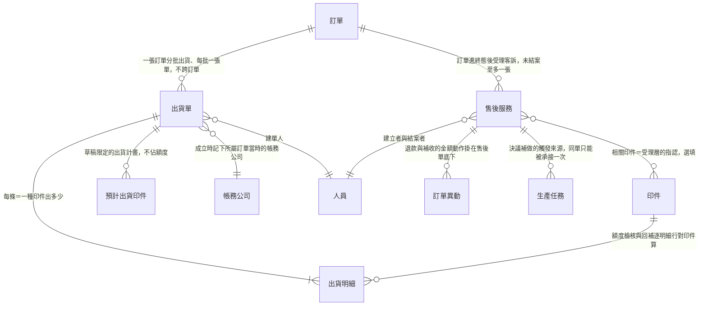
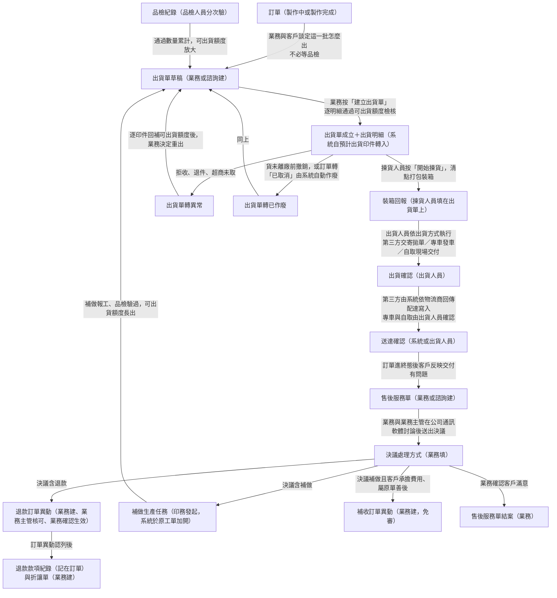
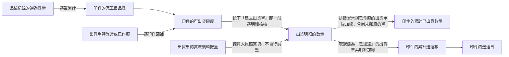
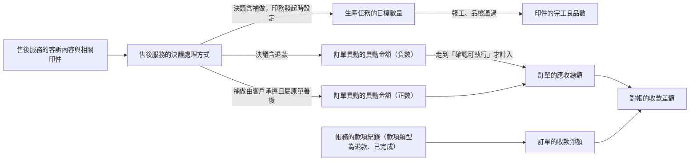

讀完這張卡，你會知道：

- 履約與售後領域每個實體跟誰相連、基數是什麼（**關聯的唯一正本**——各實體卡的「關鍵關聯」段是視角摘要，基數與方向以本卡為準）
- 貨做完之後，出貨側與售後側的單據依什麼順序產生、誰觸發誰建立
- 數量與金額的值怎麼從一個欄位流到下一個欄位，在哪裡收斂
- 本卡不放什麼：實體定義（各卡一句話定位）、欄位表（各實體卡）、狀態列舉與轉換（各狀態機卡）——接縫處只標狀態名與連結，不重畫

## 一、結構視圖（ER 圖＋基數）

子表層：出貨明細與預計出貨印件都是 [[出貨單]] 的子表，三源皆未宣告它們是獨立實體，`05-entities/` 亦無對應卡，本圖照此畫成子表節點。

圖上未畫的關聯，逐條說明：

| 實體 A | 實體 B | 為什麼不畫 |
|--------|--------|-----------|
| 預計出貨印件（子表） | [[印件]] | 基數未標。三源都只寫「這一批打算出哪些印件、各多少（印件×預計數量）」，沒有一源寫出正規基數 |
| 預計出貨印件（子表） | 出貨明細（子表） | 基數未標。三源都只寫「轉為」「成為」，沒有一源說明是不是一條對一條 |
| [[出貨單]] | 窗口聯絡人 | 基數未標，且不是連結欄位。收件人、收件人電話、收件地址三欄是文字欄位，只在建草稿時取窗口聯絡人的值當預設 |
| [[出貨單]] | [[品檢紀錄]] | 基數未標，且不是關聯欄位。兩者經 [[印件]] 的完工良品數間接連動，屬資料流不屬關聯 |
| [[售後服務]] | [[帳務]] 的款項紀錄 | 不是關聯。退款的金流記在所屬 [[訂單]] 的款項紀錄（款項類型＝退款），售後單底下只掛退款訂單異動；兩者只在對帳總額層對齊（見資料流與範圍外） |
| [[出貨單]] | [[成品庫存]] | 基數未標，且本實體 Phase 2/3 才啟用。只有 [[成品庫存]] 卡單向宣告出貨時從可出貨數扣減 |

明示不建關聯的三組，寫在「範圍外」段，避免後人補連。

## 二、單據流視圖（產生順序與觸發）

- 出貨鏈與售後鏈是兩段各自獨立的流程，交會點只有兩個：送達確認是售後受理的前提之一（訂單須先進終態），補做驗過後回到建出貨單這一步。
- 客戶趁客訴處理追加的新生意另開新訂單，不掛售後單、也不在原訂單內建訂單異動（[[訂單異動規則]]）。
- 出貨單的作廢有兩種來路：業務人工作廢，或 [[訂單]] 轉「已取消」時由系統自動作廢。出貨單轉異常的執行者三源皆未寫。
- 退款金流的後段在本圖之外：業務主管每月彙整退款清單交 [[會計]]，會計依報表執行金流，業務回頭掛匯款證明並把退款款項標成「已完成」（[[現金流出把關]]、[[待出金退款清單組成]]）。
- 例外移置不成單：品檢區擺不下或自取件要騰出揀貨動線時，[[廠務]] 把貨整批搬到暫存區，只掛標示卡並在 Slack 轉交回報通道留痕，不建 [[轉交單]]。
- 各單據的狀態怎麼轉不在本卡：[[出貨單狀態]]、[[售後服務狀態]]、[[印件狀態]]、[[訂單狀態]]、[[訂單異動狀態]]、[[款項狀態]]、[[折讓單狀態]]。

- 出貨單成立那一步推進狀態的範圍：含該印件出貨明細的首張出貨單成立時該印件轉「出貨中」，該訂單的首張成立時訂單轉「出貨中」，兩者皆自「製作中」或「製作完成」進入（正本 [[印件狀態]]、[[訂單狀態]]）；未含在明細裡的印件不動。

## 三、資料流視圖（值的推導鏈）

### 數量鏈（品檢通過向下放行、出貨事實向上累計）

- 守恆底線（正本 [[齊套邏輯]]）：[[印件]] 的產出數量 ≥ 良品數 ≥ 完工良品數 ≥ 累計已出貨數量 ≥ 累計送達數。
- 可出貨額度、額度回補與印件層缺口的算式本體在 [[印件]] 欄位表與 [[齊套邏輯]]，本卡只畫值流到哪、不複寫算式。
- 額度檢核取按下「建立出貨單」那一刻的最新額度，畫面上顯示的額度只是參考值；未離廠前改出貨明細數量時，檢核基準改取當下額度加上本單原明細已佔用的量。
- 介面上有兩個都叫「已出貨」的數，兩者都是衍生值、[[印件]] 層都不另存欄位：累計已出貨數量是佔用口徑（排除異常與已作廢的出貨單後加總，含尚未離廠的單），另一個顯示欄是已離廠量（狀態為運送中與已送達的出貨單其明細加總）。
- [[印件]] 的待驗量與齊套完成數屬生產側，算式正本見 [[印件]] 欄位表與 [[齊套邏輯]]，值流見 [[生產領域資料結構總覽]]。
- 短出結案時 [[印件]] 的購買數量與累計已出貨數量都原樣保留、不下修，差異看得見（正本 [[齊套邏輯]]）。
- [[成品庫存]] 的入庫數量與可出貨數是 Phase 2/3 才啟用的另一套扣帳口徑，現階段出貨額度以 [[印件]] 層為準。
- 日期鏈只有一條跨進本領域：[[出貨單]] 的實際出貨日（首次進入已出貨狀態群的日期，狀態定義見 [[出貨單狀態]]）流向印件準時交貨率，與 [[印件]] 的印件預計交期兩兩比對。[[出貨單]] 的出貨單預計出貨日只是這一張單的出貨計畫，不進任何比對，也不與印件預計交期同源。

- 預計出貨印件的預設數量＝購買數量 − 其他出貨單已佔用的量，排除口徑與累計已出貨數量同一套（排除異常與已作廢；已送達、運送中、未離廠的單都算），已送出去的量不會再被排一次（欄位正本 [[出貨單]]）。

### 售後鏈（客訴受理向下分流、金額向上認列）

- 決議只記到單頭層級：不逐印件記各自的處理方式、也不記補做數量。補做要補哪幾件、各補多少由 [[印務]] 發起補做時設定，記在補做生產任務的目標數量上（正本 [[售後服務規則]]）。
- 補做走完整生產與出貨鏈，與大貨等效。補做產出併入它承接的原任務所屬進度，[[印件]] 的完工良品數與累計送達數得高於購買數量，照實顯示、不蓋帽（正本 [[齊套邏輯]]）。
- 補做期間對象印件的印製維度全程維持「已送達」不動，活動都在工單層。
- 補做收費與否不設欄位，由是否掛補收訂單異動體現；公司吸收費用時不建任何金額單據。
- 退款的認列時點與核可的裁量範圍正本在 [[訂單異動規則]] 與 [[現金流出把關]]：主管核可只裁可不可以退，應收總額在業務執行「確認生效」那一刻才減去。
- 折讓單只掛發票、不關聯退款款項，退款款項與折讓單只在對帳總額層對齊（正本 [[付款發票邏輯]]）。
- 訂單進終態後明細金額一律鎖定，金額增減只剩售後單內的訂單異動一條路（正本 [[明細時點分界]]）。
- 結案時系統列出未完結的訂單異動與尚未出貨完成的補做量，但不阻擋結案；結案也不影響底下訂單異動繼續推進。

- 實際退錢的那筆款項紀錄掛在所屬 [[訂單]]，不掛售後單：售後單底下只有決議與退款訂單異動，錢退好沒由對帳的收款差額盯住；要看這張客訴退了哪幾筆錢，到訂單的款項清單找款項類型為退款的那幾筆。

## 四、關聯明細表（正本）

> 每行一條關聯。「建立時機」欄回答這條連結何時成立。實體卡關聯段與本表不一致時以本表為準，並回頭修卡。

| 實體 A | 實體 B | 基數 | 業務意義 | 建立時機 |
|--------|--------|------|---------|---------|
| [[訂單]] | [[出貨單]] | 1:N | 一張訂單可分批出貨，每一次出貨獨立成一張出貨單，不跨訂單 | 業務或諮詢（諮詢單轉來的訂單）於訂單中建出貨單草稿時由系統帶入所屬訂單，之後不可改 |
| [[出貨單]] | 出貨明細（子表） | 1:N | 一張出貨單載多條明細，逐條記某印件出多少；狀態掛單頭，一箱貨一起送達、一起異常 | 業務按「建立出貨單」通過額度檢核時，系統自預計出貨印件逐條轉入 |
| 出貨明細（子表） | [[印件]] | N:1 | 每條明細出的是一件印件的一部分數量，必須屬於本出貨單的訂單；額度檢核、作廢回補與送達累計都逐明細行對印件算 | 隨出貨明細成立 |
| [[出貨單]] | 預計出貨印件（子表） | 1:N | 草稿階段的出貨計畫，不佔可出貨額度、不進送達累計 | 業務建草稿時系統預設帶入所屬訂單全部未棄用的印件（預設數量＝購買數量 − 其他出貨單已佔用的量，排除異常與已作廢），業務可移除、可加回 |
| 預計出貨印件（子表） | [[印件]] | 未標 | 每條記這一批打算出哪件印件、預計多少 | 同上。印製維度已棄用的印件於建立出貨單那一刻由系統自動移除並提示 |
| 預計出貨印件（子表） | 出貨明細（子表） | 未標 | 草稿的出貨計畫在額度檢核通過那一刻變成正式出貨指令 | 系統於建立出貨單通過檢核時轉換 |
| [[出貨單]] | [[帳務]] 的帳務公司 | N:1 | 這批貨用哪家公司的名義寄出，寄件資訊的品牌名稱、電話、地址取這家公司 | 建立出貨單時記下所屬訂單當時的帳務公司，之後訂單改帳務公司不影響本單 |
| [[出貨單]] | [[人員]] | N:1 | 建單人 | 系統於建草稿時寫入 |
| [[出貨單]] | 窗口聯絡人 | 未標 | 收件人、收件人電話、收件地址三欄的預設值來源 | 業務建草稿時預設帶入；草稿儲存後不再隨訂單窗口聯絡人變動，手改值保留 |
| [[出貨單]] | [[品檢紀錄]] | 未標 | 上游依賴：品檢通過累計成完工良品數，完工良品數決定可出貨額度 | 不成關聯欄位，經 [[印件]] 層間接連動 |
| [[出貨單]] | [[成品庫存]] | 未標 | 出貨時從成品庫存的可出貨數扣減 | 成品庫存啟用後（Phase 2/3）；現階段額度以 [[印件]] 層為準 |
| [[出貨單]] | [[出貨單]] | 未標（三源皆無關聯欄位） | 原單轉異常或已作廢後要再出就開新單，新單是否記原單三源皆無 | 原單收於終態、額度已回補後業務重建草稿 |
| [[訂單]] | [[售後服務]] | 1:N，同時未結案至多一張 | 訂單進終態後的客訴由售後服務單承接；結案後客戶再投訴可開新單 | 業務或諮詢建單時帶入，之後不可改 |
| [[售後服務]] | [[印件]] | N:M（下限 0） | 相關印件是受理層的指認，售後單不持有印件、也不建印件 | 業務或諮詢受理時勾選，選填，結案前可改 |
| [[售後服務]] | [[訂單異動]] | 1:N（0 起）；反向 0 或 1 | 退款或補收的金額動作記在掛於售後單底下的訂單異動上 | 業務於售後單內建立訂單異動時填入關聯售後服務單，一經建立不可變動 |
| [[售後服務]] | [[生產任務]] | 1:N（0 起） | 決議補做時作為補做生產任務的觸發來源；補做任務加開在原印件的工單上，同一張售後單只能被承接一次 | 印務依決議發起補做時，系統自動掛入補做來源 |
| [[售後服務]] | [[人員]] | N:1 | 建立者與結案者各一欄 | 建單與結案時系統自動寫入 |

## 五、跨領域接口

| 邊界實體 | 方向 | 說明 |
|---------|------|------|
| [[訂單]] | 訂單管理 → 履約與售後 | 出貨單與售後服務都掛在訂單底下；訂單轉「已取消」時向下連鎖收掉未離廠的出貨單。訂單自身的關聯見 [[訂單領域資料結構總覽]] |
| [[印件]] | 訂單管理與生產執行 → 履約與售後 | 出貨明細、預計出貨印件與售後服務的相關印件都指向印件；印件對訂單的關聯見 [[訂單領域資料結構總覽]]，對工單與生產任務的關聯見 [[生產領域資料結構總覽]] |
| [[印件]] 的印件預計交期 | 訂單管理 → 履約與售後 | 交期承諾在訂單管理側壓定，履約側只取用來比對：[[出貨單]] 的實際出貨日不晚於該印件的印件預計交期即為準時，晚了即為逾期。比對取該印件的首張出貨單，判定算式正本見 [[北極星指標]]；印件預計交期的欄位正本見 [[印件]] |
| 窗口聯絡人 | 訂單管理 → 履約與售後 | 出貨單收件三欄的預設值來源；訂單對窗口聯絡人的關聯見 [[訂單領域資料結構總覽]] |
| [[帳務]] 的帳務公司 | 款項與發票 → 履約與售後 | 出貨單成立時記下所屬訂單當時的帳務公司，供寄件資訊取用；欄位正本見 [[帳務]] 帳務公司子表 |
| [[品檢紀錄]] | 生產執行 → 履約與售後 | 通過數量累計成 [[印件]] 的完工良品數，進而決定可出貨額度。品檢紀錄自身的關聯見 [[生產領域資料結構總覽]] |
| [[成品庫存]] | 生產執行 → 履約與售後 | Phase 2/3 啟用後出貨從成品庫存的可出貨數扣帳；成品庫存對印件與工單的關聯見 [[生產領域資料結構總覽]] |
| [[生產任務]] | 履約與售後 → 生產執行 | 售後決議補做後回到生產，由 [[印務]] 於原印件發起、系統經工單異動在原工單加開補做生產任務；補做不另開工單、不另建印件 |
| [[訂單異動]] | 履約與售後 → 款項與發票 | 售後單內建立的退款與補收都走訂單異動；訂單異動對訂單、對款項紀錄的關聯正本在 [[訂單異動]] 與 [[帳務]] 卡，款項與發票領域尚無總覽卡 |
| [[帳務]] 的款項紀錄與折讓單 | 履約與售後 → 款項與發票 | 售後退款認列後由業務建退款款項紀錄與折讓單；折讓單只掛發票 |
| [[審稿輪次]] | 履約與售後 → 印前審稿 | 售後補做不另建印件，原印件的稿件與審稿輪次都不動。印前審稿領域尚無總覽卡 |

## 六、維護規則

- 本卡是履約與售後領域**關聯與資料流的唯一正本**。動任何實體的關聯時先改本卡，實體卡的「關鍵關聯」段只改視角摘要（`wiki-amend` 落點表強制檢查此順序）。
- 一條關聯橫跨兩個領域時，正本歸該關聯業務主場的領域總覽。出貨單與售後服務的所有關聯歸本卡；印件對訂單歸 [[訂單領域資料結構總覽]]，印件對工單、生產任務、品檢紀錄、成品庫存歸 [[生產領域資料結構總覽]]。
- 設計案帶來的關聯變動：`plan-design` 必含段①附「總覽差異」小節，落卡時照差異改。
- 名詞與基數紀律：實體名與欄位名與各卡完全一致、禁簡稱；禁「N 個」式彙稱（[[稽核誤判記錄]]）。
- 每次修改追加 wiki/log.md，逐卡點名。

## 範圍外

- 實體定義與一句話定位：見各實體卡（[[出貨單]]、[[售後服務]]、[[印件]]、[[品檢紀錄]]、[[訂單異動]]、[[帳務]]、[[成品庫存]]）。
- 欄位表與各欄可否修改：見各實體卡的欄位段。出貨單的裝箱回報、出貨確認、送達確認都是出貨單上的欄位群，不是獨立單據，欄位正本見 [[出貨單]]。
- 狀態列舉與狀態轉換條件：見 [[出貨單狀態]]、[[售後服務狀態]]、[[印件狀態]]、[[訂單狀態]]、[[訂單異動狀態]]、[[款項狀態]]、[[折讓單狀態]]。
- 計算公式本體：可出貨額度、額度回補、守恆鏈、印件層缺口、短出結案與補做量的缺口帳分界見 [[齊套邏輯]]；退款送審、補收免審與應收總額認列見 [[訂單異動規則]]；售後建單前提、四種處理方式與補做執行規則見 [[售後服務規則]]；折讓與發票處置見 [[付款發票邏輯]]；對帳判準見 [[對帳一致性]]。
- 明示不建關聯的五組，本卡登記在此避免後人補連：出貨單與 [[轉交單]]（品檢通過品就地揀貨裝箱、不進轉交單體系，退回實物也不走轉交單）；出貨單與 [[貨運單]]（對客戶的出貨與中國回台的跨境物流是兩件事、不混用）；售後服務與客戶追加新生意的新訂單（另開訂單獨立報價收費，不掛售後單）；售後服務與 [[帳務]] 的款項紀錄（退款金流掛訂單，售後單底下只掛退款訂單異動）；出貨單與物流商（無物流商主檔，第三方物流是出貨方式的欄位值，回傳以托運單號對回）。
- 介面版面與操作動線：見 Prototype。
- 未決議題：見 `08-open-questions/`，本卡不收未決內容。

## 相關卡

- 實體正本：[[出貨單]]、[[售後服務]]、[[印件]]、[[品檢紀錄]]、[[訂單]]、[[訂單異動]]、[[帳務]]、[[生產任務]]、[[成品庫存]]、[[人員]]
- 規則正本：[[北極星指標]]（印件準時交貨率的判定算式）、[[工作天規則]]（逾期天數算法）、[[齊套邏輯]]、[[售後服務規則]]、[[訂單異動規則]]、[[印件生產流程]]、[[明細時點分界]]、[[現金流出把關]]、[[付款發票邏輯]]、[[對帳一致性]]、[[待出金退款清單組成]]
- 狀態機：[[出貨單狀態]]、[[售後服務狀態]]、[[印件狀態]]、[[訂單狀態]]、[[訂單異動狀態]]、[[款項狀態]]、[[折讓單狀態]]
- 業務情境：[[出貨與送達]]、[[售後受理與決議]]、[[品檢通過入庫]]、[[QC不通過補生產]]
- 角色：[[業務]]、[[諮詢]]、[[業務主管]]、[[揀貨人員]]、[[出貨人員]]、[[品檢人員]]、[[印務]]、[[會計]]、[[廠務]]
- 鄰域總覽：[[訂單領域資料結構總覽]]、[[生產領域資料結構總覽]]
- 檢索入口：[[erp_index]]、[[business-domain-taxonomy]]
