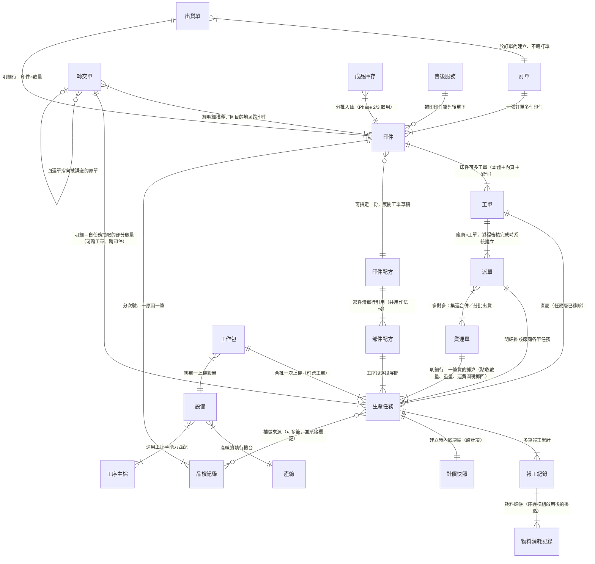
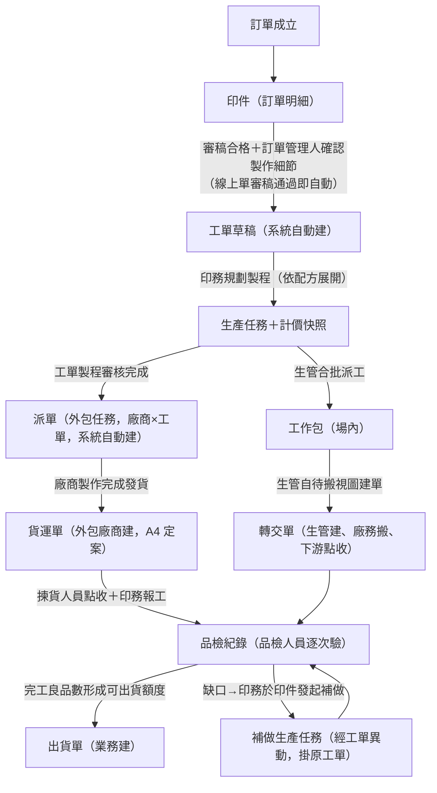
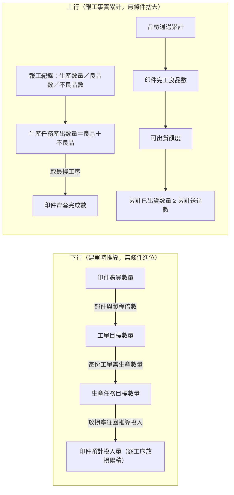
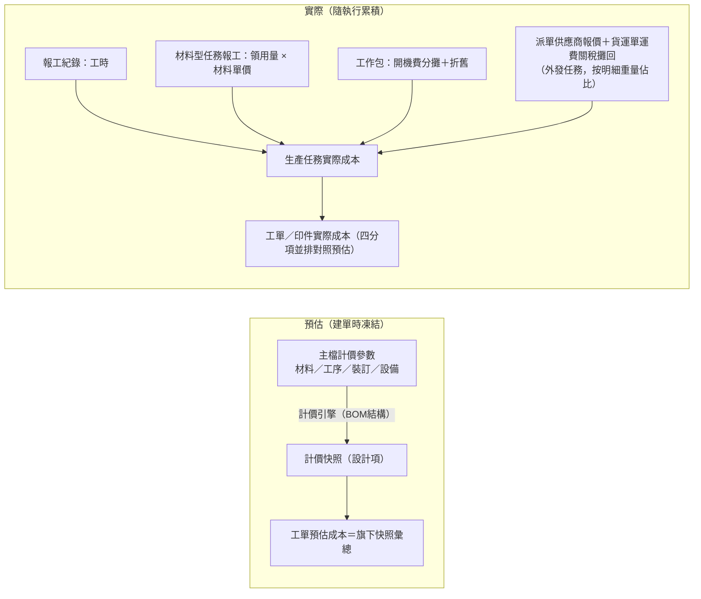

讀完這張卡，你會知道：

- 生產領域每個實體跟誰相連、基數是什麼（**關聯的唯一正本**——各實體卡的「關鍵關聯」段是視角摘要，基數與方向以本卡為準）
- 一筆生意跑下來，生產側的單據依什麼順序產生、誰觸發誰建立
- 數量與成本的值怎麼從一個欄位流到下一個欄位，在哪裡收斂
- 本卡不放什麼：實體定義（各卡一句話定位）、欄位表（各實體卡）、狀態列舉與轉換（各狀態機卡）——接縫處只標狀態名＋連結，不重畫

## 一、結構視圖（ER 圖＋基數）

主檔層（計價與展開來源，圖上省略）：部件配方工序段各選一項——[[工序主檔]]（群組→工序，帶工序廠商）／[[材料主檔]]（群組→材料→規格）／[[裝訂主檔]]（單層；裝訂廠商為設計新增欄位）；印刷計價掛 [[設備]]（現況雙軌）。執行方（自有／外包）＝各主檔承作廠商 → 展開帶出 [[生產任務]]「生產單位類別」（A1 定案）。

## 二、單據流視圖（產生順序與觸發）

- 派單與工單為**兩條獨立資料流**（B1 定案）：交會只有兩點——建立（製程審核完成）與收尾（貨回場後印務依點收結果對生產任務報工）。派單在途進程推進生產任務的粗狀態（已送集運商／運送中，映射正本 [[生產任務狀態]]）。
- 補印（售後）：售後拍板後由 [[印務主管]] 直接分配工單（A3 定案），不再經訂單管理人細節確認。
- 打樣 NG-製程問題：系統於同一印件自動建新打樣工單重跑；NG-稿件問題：棄用原印件、複製新印件重走審稿（[[打樣流程]]）。
- 各單據的狀態怎麼轉不在本卡：[[工單狀態]]／[[生產任務狀態]]／[[派單狀態]]／[[印件狀態]]／[[轉交單狀態]]／[[出貨單狀態]]。

## 三、資料流視圖（值的推導鏈）

### 數量鏈（下行規劃 → 上行收斂）

- 守恆底線（正本 [[齊套邏輯]]）：產出數量 ≥ 良品數 ≥ 完工良品數 ≥ 累計已出貨數量 ≥ 累計送達數；印件層缺口＝購買數量 − 完工良品數。
- 外發任務：產出數量同樣＝報工累計——[[印務]] 依揀貨點收結果報工，點收數量欄為對照憑據；到料放行看轉交單已點收量或前置已報工量（[[工序相依性規則]]）。
- 良品口徑與到料量：可轉交上限取**累計良品數**（工序之間只流轉良品）減未作廢轉交明細的佔用，與齊套完成數取產出數量是兩個並存的口徑；下游到料量掛**已點收**，並且只增不減——唯一的減記事由是回運單被點收（貨送錯站又已被點收時把貨搬回來，同時解除原誤送明細對來源任務的佔用）。生產任務轉報廢時，其產出數量與良品數自印件層累計排除（成本留、數量除，規則見 [[齊套邏輯]]）。
- 放損只進**數量推算**（工單建立時倒推投入），不進計價（Miles 2026-08-05）。
- 排除規則（哪些量不計入哪些彙總）正本在 [[齊套邏輯]]、[[生產績效指標]]、[[數量換算規則]]，本卡不複寫。

### 成本鏈

- 場內任務成本＝工時＋材料＋設備分攤；外發任務成本＝派單供應商報價＋貨運單運費關稅攤回（印務的收尾報工記數量、不產生工時成本）。材料分項取材料型生產任務報工的領用量 × 材料單價，耗料細帳的 [[物料消耗記錄]] 為庫存模組啟用後的掛點。
- 計價公式正本 [[BOM結構]]（已對 sensation-api 計價引擎全項核對）；指標推導正本 [[生產績效指標]]。

## 四、關聯明細表（正本）

> 每行一條關聯；「建立時機」欄回答這條連結何時成立。實體卡關聯段與本表不一致時以本表為準、並回頭修卡。

| 實體 A | 實體 B | 基數 | 業務意義 | 建立時機 |
|--------|--------|------|---------|---------|
| 訂單 | 印件 | 1:N | 訂單明細即印件 | 訂單成立 |
| 印件 | 工單 | 1:N | 本體＋內頁＋配件各自成單，齊套邏輯換算完成度 | 製作細節確認（線上單審稿通過）起、可增開 |
| 印件 | 印件配方 | N:1 | 指定配方即可展開工單草稿 | 印件建立後指定 |
| 印件配方 | 部件配方 | 部件清單行 N:1 | 共用作法只維護一份；「是否獨立開工單」開關決定併單 | 配方維護時 |
| 部件配方 | 生產任務 | 工序段 1:N | 逐段展開；同段掛材料與工序拆兩任務 | 工單規劃展開時 |
| 工單 | 生產任務 | 1:N | 直屬（任務層已移除）；材料行也建為材料型生產任務 | 規劃／異動加開 |
| 生產任務 | 生產任務 | 前置依賴 N:M | 到料量放行、可跨工單 | 展開帶入或印務設定 |
| 生產任務 | 報工紀錄 | 1:N | 產出與工時的事實底稿；外發收尾由印務報工 | 師傅／印務報工 |
| 報工紀錄 | 物料消耗記錄 | 1:N | 耗料細帳；**庫存模組啟用後才成立的掛點**——本階段工序型報工不收耗料，材料成本改由材料型任務報工的領用量承接 | 庫存模組啟用後 |
| 生產任務 | 計價快照 | 1:1 內嵌 | 凍結預估成本分項（設計項，repo 尚無） | 任務建立時 |
| 生產任務 | 設備 | N:1×2 | 計畫設備（印務規劃）→ 實際設備（生管分派覆寫） | 規劃／派工 |
| 生產任務 | 人員（師傅） | N:1 | 指派師傅，僅生管可改 | 派工 |
| 生產任務 | 品檢紀錄／貨運單明細／報工事實 | 補做來源 N:M | 補做任務必填、可多筆，兼缺口承接標記 | 印件發起補做時系統掛入 |
| 工單 | 派單 | 1:N | 廠商×工單一張；同工單兩家廠商＝兩張（A2）。發送、異動同步與中國線整單外發等行為規則見 [[派單]] | 製程審核完成系統自動建 |
| 派單 | 生產任務 | 1:N | 明細掛該廠商各筆外包任務 | 派單建立時 |
| 派單 | 外包廠商／中國廠商 | N:1 | 指派一家，可改派 | 印務指派 |
| 派單 | 印件 | N:1（as-is） | 現況平台以稿件為派單單位、綁定一張印件，遷移期間與廠商×工單粒度並存（as-is 與遷移安排見 [[派單]]） | 現況：印務指派時 |
| 派單 | 貨運單 | N:M | 集運合併＋分批出貨（B7） | 廠商發貨建貨運單時 |
| 貨運單 | 生產任務 | 明細行 N:1 | 一行＝一筆貨的攤算：點收數量、重量、運費關稅攤回 | 廠商發貨建立（A4）、揀貨點收回填 |
| 貨運單 | 關稅單據（子表） | 1:1 | 貨運單卡的關稅單據子表，按明細重量佔比攤 | 回台申報 |
| 轉交單 | 印件 | N:M | 關聯經明細承載——單頭不綁印件，由明細的來源生產任務往上推導；同目的地的一張單可跨印件 | 生管建單 |
| 轉交單 | 生產任務 | 明細 N:1 | 自任務抽部分數量、不超過可申請上限（良品口徑）、可跨工單跨印件 | 生管建單 |
| 轉交單 | 轉交單 | N:1（回運單側 0..1）| 回運單的「原轉交單連結」指向被誤送的那張單；用途是追溯與解除原誤送明細對來源任務的佔用 | 生管建回運單時填 |
| 品檢紀錄 | 印件 | N:1 | 分次驗、一原因一筆；通過累計＝完工良品數 | 品檢人員驗收 |
| 品檢紀錄 | 轉交單 | 待驗來源 | 品檢站在站量＝目的地為品檢站、狀態為**已點收**的轉交明細按印件彙總 | 品檢人員點收 |
| 工作包 | 生產任務 | 1:N | 合批一次上機、可跨工單跨印件，生管自主 | 生管派工 |
| 工作包 | 設備 | N:1 | 單一上機設備；開機費在工作包歸集一次 | 建包時 |
| 工作包 | 人員（師傅） | N:1 | 這批工作交誰執行 | 建包時 |
| 設備 | 產線 | N:1 | 產線的執行機台 | 主檔維護 |
| 人員 | 產線 | N:M | 一人可顧多條線；轉交點收的可見範圍與「我的站」判定取此歸屬 | 主檔維護 |
| 設備 | 工序主檔 | N:M | 適用工序＝選機能力匹配 | 主檔維護 |
| 印件 | 產線 | N:M | 預計產線標籤 | 規劃時 |
| 出貨單 | 訂單 | N:1 | 於訂單內建立、不跨訂單 | 業務建單 |
| 出貨單 | 印件 | 明細行 N:1 | 印件×數量、不超過可出貨額度；作廢／異常回補 | 建單時 |
| 成品庫存 | 印件 | N:1 | 分批入庫（Phase 2/3 啟用；現行可出貨額度以印件層為準） | 入庫時 |
| 物料庫存 | 材料主檔（規格） | N:1 | 未啟用（現況無材料庫存管理，消耗以報工衍生承載） | — |
| 售後服務 | 印件 | 1:N | 補印印件掛售後單下、系統補免審審稿輪次 | 售後決議補印 |
| 印件 | 印件 | 衍生來源 N:1 | 打樣 NG-稿件問題棄用複製時指回原印件 | 棄用重建時 |

## 五、跨領域接口

| 邊界實體 | 方向 | 說明 |
|---------|------|------|
| 訂單 | 售前／訂單管理 → 生產 | 訂單成立產生印件；生產側只讀訂單，取消由訂單向下連鎖 |
| 審稿輪次 | 審稿 → 生產 | 審稿合格＋已確認可製作是工單建立的前置；改稿不影響已建工單鎖定的檔案 |
| 出貨單 | 生產 → 履約 | 完工良品數形成可出貨額度後交棒出貨；出貨與送達的流程歸履約領域 |
| 訂單異動／售後服務 | 帳務／售後 ↔ 生產 | 補收退款走訂單異動（帳務領域）；補印經售後服務單回到生產 |
| 計價快照・預估成本 | 生產 → 帳務 | 毛利率與成本達成率的成本面取自生產側實際成本彙總 |

## 六、維護規則

- 本卡是生產領域**關聯與資料流的唯一正本**；動任何實體的關聯時先改本卡、實體卡只改視角摘要（`wiki-amend` 落點表強制檢查）。
- 領域內新增實體或關聯經 `plan-design` 設計時，必含段①附「總覽差異」；`plan-audit` 5-2 以本卡為比對基準。
- 名詞與基數紀律：實體名與各卡完全一致、禁簡稱；禁「N 個」式彙稱（[[稽核誤判記錄]] § 一）。

## 範圍外

- 各實體是什麼、有哪些欄位 → 各實體卡（[[工單]]、[[生產任務]]、[[印件]]、[[派單]]、[[轉交單]]、[[貨運單]]、[[報工紀錄]]、[[品檢紀錄]] 等）
- 狀態有哪些值、什麼條件下怎麼轉 → 各狀態機卡（[[工單狀態]]、[[生產任務狀態]]、[[派單狀態]]、[[印件狀態]]、[[轉交單狀態]]）；本卡接縫處只標狀態名與連結
- 數量與成本的公式本體、守恆與排除規則 → 規則卡（[[齊套邏輯]]、[[數量換算規則]]、[[報工規則]]）；本卡只畫值流到哪、不複寫算式
- 介面長什麼樣、操作怎麼走 → 屬實作層，本知識庫不承載

## 相關卡

- 規則正本：[[齊套邏輯]]、[[數量換算規則]]、[[工序相依性規則]]、[[BOM結構]]、[[配方展開規則]]、[[供應商報價規則]]、[[報工規則]]、[[印件生產流程]]、[[生產績效指標]]
- 狀態機：[[工單狀態]]、[[生產任務狀態]]、[[派單狀態]]、[[印件狀態]]、[[轉交單狀態]]、[[出貨單狀態]]
- 檢索入口：[[erp_index]]、[[business-domain-taxonomy]]
