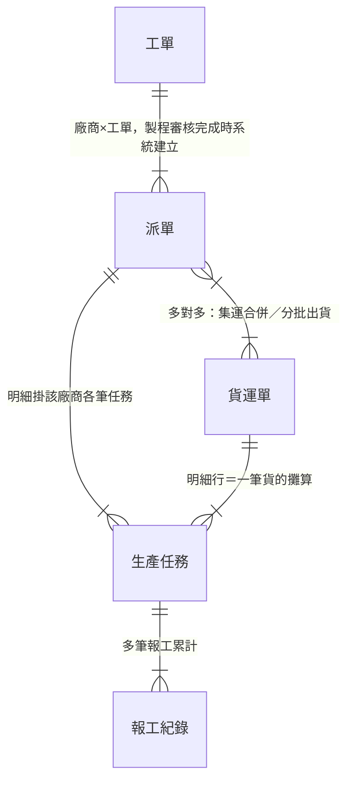
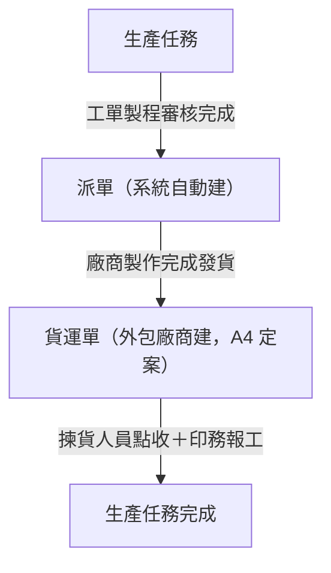

# 範例 - 資料結構總覽

> [!info] 本卡為撰寫範例的**凍結快照**，節錄 2026-08-05 版生產領域總覽的外發子集。本卡不是任何領域的正本，正本異動不回寫本卡。查生產領域結構請讀 [[生產領域資料結構總覽]]。對照重點：三視圖各自的職責與深度、明細表五欄的填法、as-is 標注、名詞逐字一致。

## 一、結構視圖（ER 圖＋基數）——節錄外發子集

**對照重點**：中文實體名加雙引號、正規基數記法。「明細行」這類子結構在關聯標籤講清楚，不另立實體。

## 二、單據流視圖（產生順序與觸發）——節錄

**對照重點**：

- 每個節點標「由誰建」
- 有裁決依據附編號（A4）
- 獨立資料流宣告寫在圖下文字（快照略）

## 三、資料流視圖（值的推導鏈）——節錄

**對照重點**：節點寫「哪張單據的哪個欄位」，且與實體卡逐字一致。計算規則一句話在箭頭上，公式本體留規則卡。

## 四、關聯明細表（正本）——節錄三行

| 實體 A | 實體 B | 基數 | 業務意義 | 建立時機 |
|--------|--------|------|---------|---------|
| 工單 | 派單 | 1:N | 廠商×工單一張；同工單兩家廠商＝兩張（A2） | 製程審核完成系統自動建 |
| 派單 | 貨運單 | N:M | 集運合併＋分批出貨（B7） | 廠商發貨建貨運單時 |
| 派單 | 印件 | N:1（as-is） | 現況平台以稿件為派單單位；設計定案粒度為廠商×工單，遷移期間並存 | 現況：印務指派時 |

**對照重點**：

- 五欄固定
- 裁決編號隨行附
- as-is 關聯標記與遷移說明的寫法見第三行

## 五、跨領域接口——節錄一行

| 邊界實體 | 方向 | 說明 |
|---------|------|------|
| 訂單 | 售前／訂單管理 → 生產 | 只寫邊界與方向，不畫鄰域內部 |

## 範圍外——節錄

- 各實體是什麼、有哪些欄位 → 各實體卡（[[工單]]、[[生產任務]]、[[派單]] 等）
- 狀態有哪些值、什麼條件下怎麼轉 → 各狀態機卡（[[生產任務狀態]]、[[派單狀態]]）；接縫處只標狀態名與連結
- 數量與成本的公式本體 → 規則卡（[[齊套邏輯]]、[[數量換算規則]]）

**對照重點**：逐條指明去處卡，不留「其餘不收」式空話。內容取自規範的不收清單中本領域實際會被誤放的項目。

## 相關卡

- [[規範 - 資料結構總覽]] — 撰寫規則與稽核維度（本快照的合規依據）
- [[範本 - 資料結構總覽]] — 骨架
- [[生產領域資料結構總覽]] — 快照來源（正本）
