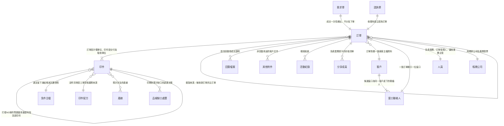
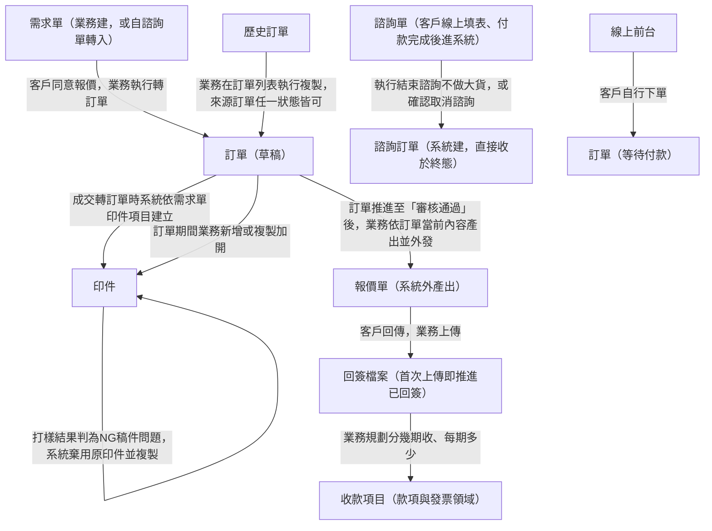
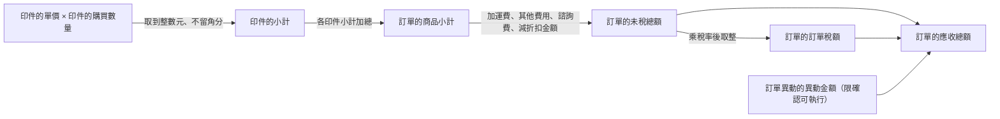
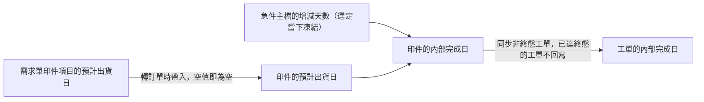
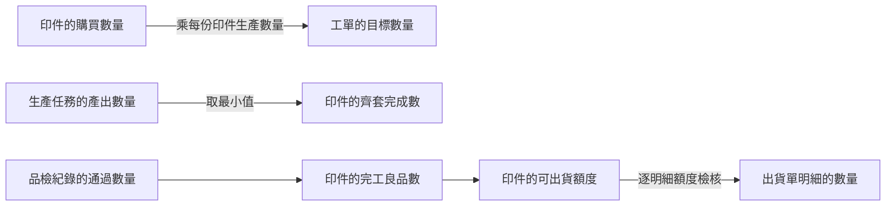

讀完這張卡，你會知道：

- 訂單領域每個實體跟誰相連、基數是什麼（**關聯的唯一正本**——各實體卡的「關鍵關聯」段是視角摘要，基數與方向以本卡為準）
- 一筆生意成交之後，訂單側的單據依什麼順序產生、誰觸發誰建立
- 金額、數量與日期的值怎麼從一個欄位流到下一個欄位，在哪裡收斂
- 本卡不放什麼：實體定義（各卡一句話定位）、欄位表（各實體卡）、狀態列舉與轉換（各狀態機卡）——接縫處只標狀態名＋連結，不重畫

## 一、結構視圖（ER 圖＋基數）

主檔層（圖上以單一節點呈現，不展開內部）：[[急件主檔]]、[[印件配方]]、[[產線]]、[[帳務]]的帳務公司、廠客主檔的客戶與窗口聯絡人。這些主檔的內部結構各歸其所屬領域，本卡只畫訂單與印件對它們的引用方向。

## 二、單據流視圖（產生順序與觸發）

- 圖上不畫狀態轉換，訂單自「草稿」到「審核通過」的推進條件見 [[訂單狀態]]。額外費用明細為[[訂單]]的子表，三源皆未標基數，已於 2026-09-11 呈報 Miles，關聯明細表照實標「未標」。
- 三條錢線各走各的：[[訂單異動]]、[[帳務]]的發票與收款項目與款項紀錄、[[出貨單]]，彼此不互相觸發，交會點只在[[訂單]]的金額欄位與可出貨額度。
- 特殊建立路徑：複製建單帶入來源原值、不帶工單與生產任務與稿件檔案與來源活動紀錄（[[訂單複製建單]]）；諮詢取消時系統先建半額退費[[訂單異動]]、後把訂單轉「已取消」，這個先後是硬性條件（[[諮詢收尾規則]]）；訂單進終態後要動金額一律先開[[售後服務]]單（[[訂單異動規則]]）。
- 各單據的狀態怎麼轉不在本卡：[[訂單狀態]]、[[印件狀態]]。

## 三、資料流視圖（值的推導鏈）

### 金額鏈（明細向上收斂）

- 小計在報價當下算出即定案，往後不再用單價回算（正本 [[報價邏輯]]）。
- 只有走到「確認可執行」的[[訂單異動]]才計入應收總額（正本 [[訂單異動規則]]）。
- 三方對帳底線：訂單的應收總額 ＝ 訂單的發票淨額 ＝ 訂單的收款淨額（正本 [[對帳一致性]]）。
- 印件層的金額分攤由業務建單時人工決定，無系統規則（正本 [[印件拆分規範]]）。

### 日期鏈（客戶承諾向下推導）

- 日期鏈的起點是需求單印件項目的預計出貨日，逐列填寫、無單頭欄位預填（欄位正本見 [[需求單]]）。
- 訂單期間新增或複製加開的印件，預計出貨日留空、逐件手填（欄位正本見 [[印件]]）。
- 扣減算式的正本在 [[印件]] 欄位表，重推與同步規則的正本在 [[訂單異動規則]]，本卡不複寫算式。

### 數量鏈（購買數量向下展開、產出向上收斂）

- 守恆底線（正本 [[齊套邏輯]]）：印件的產出數量 ≥ 印件的良品數 ≥ 印件的完工良品數 ≥ 印件的累計已出貨數量 ≥ 印件的累計送達數。
- 排除規則（轉報廢的任務其產出數量與良品數自印件層累計排除、成本仍以報工數結算）正本在 [[齊套邏輯]]，本卡不複寫。
- 工單建立當時取用印件的購買數量，之後訂單側加量不回寫既有工單（[[工單]] 欄位表）。

## 四、關聯明細表（正本）

> 每行一條關聯。「建立時機」欄回答這條連結何時成立。實體卡關聯段與本表不一致時以本表為準，並回頭修卡。

| 實體 A | 實體 B | 基數 | 業務意義 | 建立時機 |
|---|---|---|---|---|
| [[需求單]] | [[訂單]] | 1:1 | 成交一次性轉出，不分批下單。正本歸售前領域，本表列出供結構視圖對照 | 業務於成交的需求單執行轉訂單 |
| [[諮詢單]] | [[訂單]] | 1:1 | 諮詢收尾時建立諮詢訂單。正本歸售前領域，本表列出供結構視圖對照 | 執行結束諮詢不做大貨、或確認取消諮詢時（2026-09-11 裁決） |
| [[訂單]] | [[印件]] | 1:N | 訂單是計價單位、印件是交付與驗收單位 | 成交轉訂單時系統依[[需求單]]印件項目建立；訂單期間由業務新增或複製加開 |
| [[訂單]] | [[訂單]] | N:1 | 複製建單的來源訂單，雙向可追溯 | 業務執行複製訂單時系統寫入 |
| [[訂單]] | [[訂單]] | N:1 | 補收款訂單指回主訂單 | 系統建立補收款訂單時（觸發事件三源皆未寫） |
| [[訂單]] | 額外費用明細（子表） | 未標（三源皆查不到，已呈報） | 訂單建立時即確定的非印件費用項目 | 訂單建立時由業務填入 |
| [[訂單]] | 回簽檔案 | 1:N | 首次回簽為成交證明，之後可追加 | 業務於「報價待回簽」上傳；首次上傳寫入回簽時間，追加不覆寫 |
| [[訂單]] | 其他附件 | 1:N | 非回簽用途的客戶文件，逐筆帶用途說明 | 業務於其他附件區上傳；訂單「已取消」時無上傳入口 |
| [[訂單]] | 活動紀錄 | 1:N | 稽核軌跡 | 核可、外發、編輯、改派、複製等動作發生時由系統寫入 |
| [[訂單]] | 分享成員 | 1:N | 負責業務授予同事的存取清單，逐筆帶檢視或編輯（代理）層級 | 負責業務維護，即時生效；改派時依理由分類處置 |
| [[訂單]] | 客戶 | N:1 | 訂單對應一筆廠客主檔資料，主檔改動訂單同步顯示新值 | 建單時自廠客主檔帶入 |
| [[訂單]] | 窗口聯絡人 | N:1 | 一張訂單顯示一位窗口與其整組聯絡資料 | 業務選定或切換；切換時職稱、電話、信箱、聯絡地址整組換值 |
| 客戶 | 窗口聯絡人 | 1:N | 候選窗口為同一客戶底下的聯絡人 | 廠客主檔維護時 |
| [[訂單]] | [[人員]] | N:1 | 負責業務，一張訂單一位 | 需求單成交帶入；業務主管可改派 |
| [[訂單]] | [[人員]] | N:1 | 訂單管理人，負責審稿分派 | 訂單成立時指定（指派方式三源皆未寫） |
| [[訂單]] | [[人員]] | N:1 | 審核業務主管，核准訂單者 | 核准當下寫入 |
| [[訂單]] | [[帳務]]的帳務公司 | N:1 | 用哪家公司名義開發票，決定報價單與後續帳款歸屬 | 需求單成交帶入；成立後仍可改 |
| [[印件]] | [[印件]] | N:1 | 打樣 NG-稿件問題棄用重建時，新印件指回原印件 | 系統複製新印件時寫入 |
| [[印件]] | [[急件主檔]] | N:1 | 選定當下凍結該選項的增減天數快照，主檔事後改動不影響已選定的印件 | 業務於訂單編輯時逐印件選定 |
| [[印件]] | [[印件配方]] | N:1 | 配方的部件清單是工單草稿的展開來源 | EC 商品主檔帶入，或印務主管於印件上選定 |
| [[印件]] | [[產線]] | N:M | 預計涉及的產線 | 印務填寫 |
| [[印件]] | 品檢缺口處置（子表） | 1:N | 印務對品檢不通過累計缺口的處置決策 | 品檢不通過累計形成缺口後由印務處置 |

## 五、跨領域接口

| 邊界實體 | 方向 | 說明 |
|---|---|---|
| [[需求單]] | 售前 → 訂單管理 | 成交一次性轉出一張訂單（1:1，不分批下單）；需求單印件項目逐筆帶入[[印件]]。售前領域尚無總覽卡 |
| [[諮詢單]] | 售前 → 訂單管理 | 收尾（結束諮詢不做大貨、或取消諮詢）時建立一張諮詢訂單（1:1，2026-09-11 裁決）。[[諮詢單]]卡原寫 1:1、[[訂單]]卡原寫 N:1，以本卡為準並回頭修[[訂單]]卡 |
| [[工單]] | 訂單管理 → 生產執行 | [[印件]]的印製維度推進至「製程已確認」時產生工單草稿（1:N）。生產側關聯見 [[生產領域資料結構總覽]] |
| [[審稿輪次]] | 訂單管理 → 印前審稿 | 每次上傳稿件建一輪（[[印件]] 1:N [[審稿輪次]]）；[[印件]]另以當前合格輪次指標指向最新合格的一輪。印前審稿領域尚無總覽卡 |
| [[出貨單]] | 訂單管理 → 履約與售後 | [[訂單]] 1:N [[出貨單]]（支援分批出貨）；[[出貨單]] N:M [[印件]]（經出貨明細，同訂單多種印件可合箱、不可跨訂單）。履約與售後領域尚無總覽卡 |
| [[售後服務]] | 訂單管理 → 履約與售後 | [[訂單]] 1:N [[售後服務]]，且同一訂單同時最多一張未結案；限訂單已進終態才能建單 |
| [[訂單異動]] | 訂單管理 → 款項與發票 | [[訂單]] 1:N [[訂單異動]]；訂單進終態後建立的異動一律掛在[[售後服務]]單底下 |
| [[帳務]] | 訂單管理 → 款項與發票 | [[訂單]] 1:N 發票、1:N 收款項目、1:N 款項紀錄。款項與發票領域尚無總覽卡 |
| [[品檢紀錄]] | 生產執行 → 訂單管理 | 通過數量累計成[[印件]]的完工良品數，進而決定可出貨額度 |

## 六、維護規則

- 本卡是訂單領域**關聯與資料流的唯一正本**。動任何實體的關聯時先改本卡，實體卡的「關鍵關聯」段只改視角摘要（`wiki-amend` 落點表強制檢查此順序）。
- 一條關聯橫跨兩個領域時，正本歸該關聯業務主場的領域總覽。訂單與印件、訂單與其附屬子表歸本卡；印件與工單、印件與生產任務歸 [[生產領域資料結構總覽]]。
- 設計案帶來的關聯變動：`plan-design` 必含段①附「總覽差異」小節，落卡時照差異改。
- 每次修改追加 wiki/log.md，逐卡點名。

## 範圍外

- 實體定義與一句話定位：見各實體卡（[[訂單]]、[[印件]]、[[需求單]] 等）。
- 欄位表與各欄可否修改：見各實體卡的欄位段；明細鎖定的時點分界見 [[明細時點分界]]。
- 狀態列舉與狀態轉換條件：見 [[訂單狀態]]、[[印件狀態]]。
- 計算公式本體：金額見 [[報價邏輯]] 與 [[對帳一致性]]，數量見 [[齊套邏輯]] 與 [[數量換算規則]]，成本見 [[BOM結構]]。
- 介面版面與操作動線：見 Prototype。
- 待確認事項：見 `08-open-questions/`，本卡不收未決內容。

## 相關卡

- 實體正本：[[訂單]]、[[印件]]、[[需求單]]、[[諮詢單]]、[[訂單異動]]、[[急件主檔]]、[[人員]]、[[帳務]]
- 規則正本：[[報價邏輯]]、[[對帳一致性]]、[[訂單異動規則]]、[[明細時點分界]]、[[印件拆分規範]]、[[齊套邏輯]]、[[線下訂單流程]]
- 狀態機：[[訂單狀態]]、[[印件狀態]]
- 鄰域總覽：[[生產領域資料結構總覽]]
- 檢索入口：[[erp_index]]、[[business-domain-taxonomy]]
