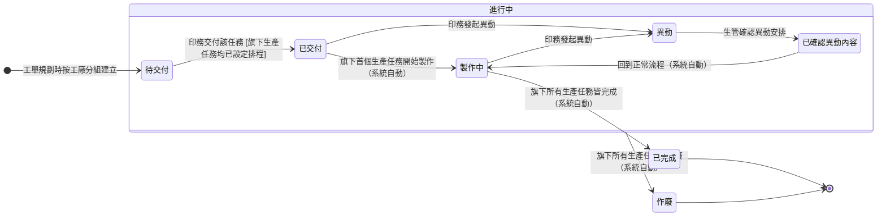

## 概述

任務（TaskStatus）是工單與生產任務之間的分組層：一張工單底下的生產任務可能分散在好幾個工廠做，把「同一工廠的所有生產任務」打包成一個任務，生管就能對著一個工廠整批派工、一次追進度，不必逐筆生產任務去管。

任務的狀態分兩段推進：**交付段由印務手動逐筆交付**——以任務為單位，哪個工廠準備好就先交付哪組，也可以從工單層把全部任務批次一起交付（操作便利，本質仍是逐任務生效）；**製作段由底層生產任務自動向上反映**——現場一報工任務就顯示製作中，全部做完自動完成，不開放手動改。進度彙整的計算規則正本在 [[齊套邏輯]]，本卡只定義狀態與轉換、不複述規則。

## 狀態列舉（正本）

> 本段是任務狀態的唯一正本。狀態的新增與修改是商業決策，直接在此卡維護。

| 狀態 | 說明 | 對應營運需求 |
|------|------|------------|
| 待交付 | 初始；工單規劃時按工廠分組建立，尚未交付產線 | 排程定稿前的等待區，工單收回只能在全組都還沒交付時 |
| 已交付 | 印務交付該任務；自有工廠通知生管接收、外包廠通知對應廠商 | 哪個工廠準備好就先交付哪組，不同工廠不必互等 |
| 製作中 | 旗下首個生產任務開始製作，自動向上反映 | 生管一眼看出哪個工廠已動工，不靠人工回報 |
| 異動 | 印務發起異動，該組進入變更處理 | 客戶改需求時，分組層也明確反映變更中 |
| 已確認異動內容 | 生管確認收到異動安排（中間態） | 確保變更有人接手，不會發了沒人知道 |
| 已完成 | 終態；旗下所有生產任務皆完成 | 全組做齊才算完成，避免分組進度虛報 |
| 作廢 | 終態；旗下所有生產任務皆作廢時自動標記（由下而上） | 整組不做了就自動收掉，不留空組 |

## 狀態機圖（UML）

依 UML 狀態機圖記法繪製：實心圓為初始點、雙圈為終止點、轉換標籤採「觸發事件 [守衛條件]」格式。「作廢」自複合狀態邊界出發，適用其內全部子狀態（不限定來源狀態，條件成立即自動轉入）。

## 轉換條件與觸發事件

| 轉換 | 觸發事件 | 條件 |
|------|---------|------|
| （建立）→ 待交付 | 工單規劃時建立 | 按工廠分組，每個工廠對應一個任務 |
| 待交付 → 已交付 | 印務交付該任務（可自工單層批次交付全部任務，逐任務生效） | 旗下生產任務均已設定開工日期（自有工廠需設定設備、外包廠需設定預計完工日期）；交付後通知生管（自有）或廠商（外包） |
| 已交付 → 製作中 | 旗下首個生產任務開始製作（系統自動向上反映） | — |
| 製作中 → 已完成 | 旗下所有生產任務皆完成（系統自動） | 取最少原則，一筆沒完成全組不算齊，見 [[齊套邏輯]] |
| 已交付／製作中 → 異動 | 印務發起異動 | 異動同時往上鏡像到工單，見 [[工單狀態]] |
| 異動 → 已確認異動內容 | 生管確認異動安排 | — |
| 已確認異動內容 → 製作中 | 異動處理完回到正常流程（系統自動） | — |
| 任一非終態 → 作廢 | 旗下所有生產任務皆作廢（系統自動，由下而上） | 不需手動操作 |

## 關鍵轉換的營運動機

- 待交付 → 已交付（印務逐任務交付）→ 動機：交付以任務為單位而非工單整體，不同工廠的製程準備不同步，先準備好的先交付先動工，不互相卡住；趕批次時也能從工單層一次交付全部任務 → 例子：ORD-2026-0512 的工單有 5 個任務，印刷與裱貼 3 組先交付開工，燙金 2 組設備排程未定先留在待交付。
- 製作段全自動（製作中／已完成）→ 動機：任務只是分組視角，進度事實在生產任務層的現場報工；若開放手動改任務狀態，就會跟下層事實打架對不上 → 例子：師傅報第一筆工，該組任務自動轉製作中，生管看板即時更新。
- 異動 → 已確認異動內容（生管確認）→ 動機：變更不能只是發出去，要生管確認收到並安排，才不會「異動發了、現場照舊做」 → 例子：客戶改規格，印務對裱貼任務發起異動，生管確認重新安排後該組回到製作中。
- 由下而上作廢 → 動機：整組生產任務都取消了，分組自動收掉、不留空殼任務污染派工看板。

## 與其他狀態機的關係

- 任務是向上反映鏈的中間層：[[生產任務狀態|生產任務]] 報工 → 任務 → [[工單狀態|工單]]。製作段下層驅動、交付段印務驅動，任務自己不主動推進。
- 首個任務交付會讓工單轉「工單已交付」，後續任務交付不重複推進工單，見 [[工單狀態]]。
- 任務進入異動時，工單鏡像顯示異動；全部任務離開異動後工單回到原狀態。
- 任務完成度取旗下生產任務的最少值，是齊套統計的中間一層，公式見 [[齊套邏輯]]。

## 範圍外

- **完成度怎麼彙整**（取最少原則、四層計算）：系統會自動彙整——本卡只承諾此行為，公式屬 [[齊套邏輯]]（規則正本），實作時勿自行發明
- 生產任務自身的流轉（含品檢型任務的特殊行為）→ 走 [[生產任務狀態]]
- 派工排程怎麼安排（指定工廠、設備、開工日期）→ 屬排程規劃，與狀態機無關，任何狀態都可調整派工
- 工單收回時待交付任務的清理 → 走 [[工單狀態]] 的收回機制

## 相關卡

- 規則：[[齊套邏輯]]（完成度取最少原則正本）、[[印件生產流程]]（單據層級結構）
- 實體：[[任務]]（本狀態機依附的主實體，按工廠分組的概念見此）
- 狀態機：[[工單狀態]]（向上）、[[生產任務狀態]]（向下，製作段唯一驅動來源）
- 角色：[[印務]]（交付任務、發起異動）、[[生管]]（接收任務、確認異動）
