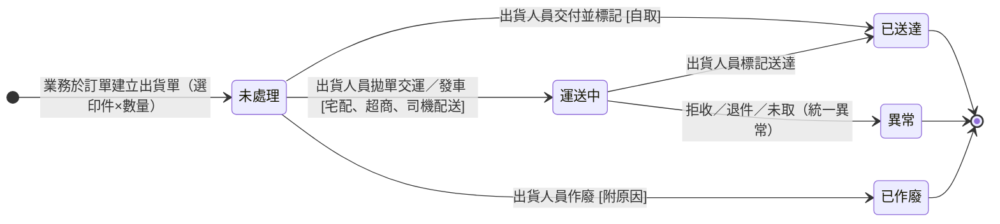

## 概述

出貨單（ShippingStatus）是訂單層的出貨單據：業務決定要出時，**在訂單中建立出貨單、選擇要出的印件與數量**（可選同訂單多個印件合箱，不可跨訂單）；一個印件可開多張出貨單支援分批出貨。出貨上限跟著入庫量走——品檢通過才入庫、入庫多少才能出多少。

**出貨單即揀貨指令**：成品完成最終品檢即入庫（可出貨，無成品倉庫存概念）；業務建立出貨單後，[[揀貨人員]]依出貨單把入庫成品打包裝箱、回報裝箱內容，再由[[出貨人員]]執行對外物流。揀貨裝箱是否納入狀態鏈（狀態顆粒度朝 EC 現況四態融合，方向已定）與裝箱回報的系統載體收斂中，見 [[SHP-007-揀貨裝箱回報載體與出貨單狀態顆粒度|SHP-007]]；下方狀態列舉為現行正本，SHP-007 拍板後調整。狀態的推進初期全由[[出貨人員]]人工標記。

## 狀態列舉（正本）

> 本段是出貨單狀態的唯一正本。狀態的新增與修改是商業決策，直接在此卡維護。

| 狀態 | 說明 | 對應營運需求 |
|------|------|------------|
| 未處理 | 初始；出貨單已建立（選定印件×數量），貨還在倉 | 出貨指令與實際出門分開，理貨（貼物流單、合箱、稱重）發生在此態 |
| 運送中 | 貨已離廠在途——宅配／超商＝拋單交運、司機配送＝發車 | 在途與到貨分開看，客戶問「到哪了」答得出來 |
| 已送達 | 終態；貨到客戶手上——宅配超商＝物流到貨、司機＝交付回報、自取＝現場交付當下 | 印件與訂單完成判定的依據 |
| 異常 | 終態；這次出貨有問題——拒收、退件、超商未取等統一視為異常，原因先不細分 | 出貨失敗明確收掉，要再出就建新出貨單 |
| 已作廢 | 終態；建錯單撤銷（附原因），作廢數量回補可出貨額度 | 建錯不留無效單據，額度回算 |

**出貨方式**（欄位，不拆狀態路徑）：宅配／超商／司機配送／自取。自取不經「運送中」——交付當下直接標已送達。

## 狀態機圖（UML）

依 UML 狀態機圖記法繪製：實心圓為初始點、雙圈為終止點、轉換標籤採「觸發事件 [守衛條件]」格式。推進初期皆為出貨人員人工標記。

## 轉換條件與觸發事件

| 轉換 | 觸發事件 | 條件 |
|------|---------|------|
| （建立）→ 未處理 | 業務於訂單中建立出貨單，選擇印件與數量 | 不可跨訂單；每印件的出貨數量不得超過可出貨額度（入庫數 − 已出貨數＋作廢回補），額度規則見 [[齊套邏輯]] |
| 未處理 → 運送中 | 出貨人員拋單交運（宅配／超商）或發車（司機配送） | 物流單列印與張貼屬此步的理貨作業 |
| 未處理 → 已送達 | 自取：客戶到廠，出貨人員交付並標記 | 不經運送中 |
| 運送中 → 已送達 | 出貨人員標記送達（宅配超商依物流到貨資訊、司機依交付回報） | 初期人工標記 |
| 運送中 → 異常 | 拒收、退件、超商未取等 | 統一視為異常、原因先不細分；要再出貨就建新出貨單 |
| 未處理 → 已作廢 | 出貨人員作廢（附原因） | 作廢數量回補該印件可出貨額度 |

## 關鍵轉換的營運動機

- 出貨單即揀貨指令 → 動機：成品先入庫（可出貨）暫存，業務決定出多少才建單、揀貨依單裝箱——揀貨人員從出貨單就知道今天包哪些、怎麼包，不靠口頭交代 → 例子：專輯手工完成、最終品檢通過入庫；三天後客戶說可出，業務建出貨單，揀貨依單裝箱後出貨。
- 一印件多張出貨單（分批） → 動機：客戶急要先出一部分是常態；每批一張單、各自獨立追蹤送達 → 例子：名片 1000 已入庫 580，先出 580（出貨單 A 運送中），餘量入庫後再出（出貨單 B）。
- 異常為終態、不回流 → 動機：「這次出貨有問題」要當一個明確結果收掉（後續對帳與責任都對著這張單），重出是新的決定、開新單；原因分類先不做，避免過早設計 → 例子：超商件七天未取退回，原單標異常；業務與客戶確認後改宅配，建新出貨單。
- 全部人工推進 → 動機：初期不串物流商系統，到貨資訊靠出貨人員查詢回填；之後補強自動化（如掃碼、物流狀態回寫）再演化。

## 與其他狀態機的關係

- 出貨額度的上游：[[生產任務狀態|品檢任務]] 通過數量 → 印件入庫量 → 可出貨額度（多工單印件取最小入庫，見 [[齊套邏輯]]）。
- 印件層收尾：該印件**所有出貨單皆已送達、且累計送達數量等於印件數量** → [[印件狀態|印件]] 印製維度轉「已送達」（系統自動）。
- 訂單層收尾：全部印件已送達 → [[訂單狀態|訂單]] 系統自動轉「訂單完成」；完成與發票、收款脫鉤（錢由對帳差額警示追、完成後客訴走 [[售後服務狀態|售後服務單]]）。
- 異常出貨單不計入印件送達累計；其貨物的重出走新出貨單。

## 範圍外

- **可出貨額度的計算**（入庫、已出貨、作廢回補、多工單取最小）：系統會自動計算——本卡只承諾此行為，公式屬 [[齊套邏輯]]（規則正本），實作時勿自行發明
- 揀貨裝箱的現場作業與回報載體（點收、裝箱、放明細、封箱、裝箱內容回報） → 收斂中，見 [[SHP-007-揀貨裝箱回報載體與出貨單狀態顆粒度|SHP-007]] 與 [[揀貨人員]]
- 運費的記錄與對帳（箱數、箱規、運費總表） → 屬出貨作業與對帳範疇，設計收斂中
- 異常的原因分類與理賠 → 刻意先不設計（拍板：統一當異常看）

## 相關卡

- 規則：[[齊套邏輯]]（可出貨額度正本）、[[印件生產流程]]、[[工序相依性規則]]（提前品檢支援臨時分批出貨）
- 實體：[[出貨單]]（本狀態機依附的主實體）
- 狀態機：[[印件狀態]]（送達的彙整層）、[[訂單狀態]]（完成的觸發）、[[生產任務狀態]]（入庫量的上游）
- 角色：[[業務]]／[[諮詢]]（決定出多少、建出貨單）、[[揀貨人員]]（依出貨單裝箱、回報裝箱內容）、[[出貨人員]]（拋單、交運、標記送達）、[[品檢人員]]（入庫量的把關）
- OQ：[[SHP-005-分批出貨觸發節點|SHP-005]]（外部確認：現場觸發節點實況）
