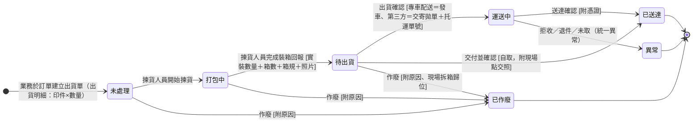

## 概述

出貨單（ShippingStatus）是訂單層的出貨單據：業務決定要出時，**在訂單中建立出貨單、選擇要出的印件與數量**（可選同訂單多個印件合箱，不可跨訂單）；一個印件可開多張出貨單支援分批出貨。出貨上限跟著入庫量走——品檢通過才入庫、入庫多少才能出多少。

**出貨單即揀貨指令**：成品完成最終品檢即入庫（可出貨，無成品倉庫存概念）；業務建立出貨單後，[[揀貨人員]]依出貨單把入庫成品打包裝箱、回報裝箱內容（裝箱回報直接記在出貨單上、回報動作推進狀態，2026-07-20 拍板，見 [[SHP-007-揀貨裝箱回報載體與出貨單狀態顆粒度|SHP-007]]），再由[[出貨人員]]執行對外物流。物流段狀態的推進初期由[[出貨人員]]人工標記。

## 狀態列舉（正本）

> 本段是出貨單狀態的唯一正本。狀態的新增與修改是商業決策，直接在此卡維護。揀貨段兩態（打包中／待出貨）為 2026-07-20 拍板納入（與 EC 現況四態融合）。

| 狀態 | 說明 | 對應營運需求 |
|------|------|------------|
| 未處理 | 初始；出貨單已建立（出貨明細選定），還沒有人開始揀貨 | 出貨指令與處理進度分開，「還沒人動」看得出來 |
| 打包中 | 揀貨人員按「開始揀貨」進入；清點、打包、裝箱進行中 | 業務隨時看得到「倉庫已經在處理我的單了」 |
| 待出貨 | 揀貨人員完成裝箱回報（實裝數量／箱數／箱規／照片）進入；貨已裝箱等出貨人員 | 揀貨與出貨的交棒點明確，裝箱證據留在單上 |
| 運送中 | 貨已離廠在途——出貨人員做**出貨確認**（時間＋操作人；第三方物流＝交寄拋單並填托運單號、專車配送＝發車）（EC 現況稱「已出貨」） | 在途與到貨分開看，客戶問「到哪了」答得出來 |
| 已送達 | 終態；貨到客戶手上——出貨人員做**送達確認**（時間＋操作人＋憑證：專車＝司機交付照、自取＝現場點交照、第三方＝回填物流商配達時間） | 印件與訂單完成判定的依據；每張單收尾必留「誰確認、何時、憑什麼說到了」 |
| 異常 | 終態；這次出貨有問題——拒收、退件、超商未取等統一視為異常，原因先不細分。**轉異常即逐印件自動回補可出貨額度**（與作廢同規則，2026-07-21 拍板見 [[SHP-010-異常出貨單可出貨額度是否回補\|SHP-010]] 決議） | 出貨失敗明確收掉，要再出就建新出貨單（額度已回補、建得出來） |
| 已作廢 | 終態；貨未離廠前撤銷（附原因），作廢明細數量逐印件回補可出貨額度 | 建錯或客戶取消不留無效單據，額度回算 |

**出貨方式**（欄位，不拆狀態路徑）：自取／專車配送（公司自行配送）／第三方物流（物流商：順豐／新竹物流／超商／其他）。三類共用同一套狀態與確認動作；自取不經「運送中」——待出貨後交付當下一次完成出貨與送達確認。

## 狀態機圖（UML）

依 UML 狀態機圖記法繪製：實心圓為初始點、雙圈為終止點、轉換標籤採「觸發事件 [守衛條件]」格式。揀貨段由揀貨人員推進，物流段初期為出貨人員人工標記。

## 轉換條件與觸發事件

| 轉換 | 觸發事件 | 條件 |
|------|---------|------|
| （建立）→ 未處理 | 業務於訂單中建立出貨單，設定出貨明細（印件×數量）與收件資訊 | 不可跨訂單；每條明細數量不得超過該印件可出貨額度（入庫數 − 已出貨數＋作廢回補），額度規則見 [[齊套邏輯]] |
| 未處理 → 打包中 | 揀貨人員按「開始揀貨」 | 揀貨指令進入處理 |
| 打包中 → 待出貨 | 揀貨人員完成裝箱回報 | 回報實裝數量、箱數、箱規、照片（裝箱照／秤重照）；實裝與明細要求不符時回報異常給業務處理、不自行判定 |
| 待出貨 → 運送中 | 出貨人員做出貨確認：專車配送＝發車、第三方物流＝交寄拋單 | 系統寫入出貨時間與操作人；第三方物流填托運單號；物流單列印與張貼屬此步作業 |
| 待出貨 → 已送達 | 自取：客戶到廠，出貨人員交付並確認 | 不經運送中；一次完成出貨與送達確認，附現場點交照 |
| 運送中 → 已送達 | 出貨人員做送達確認 | 系統寫入送達時間與操作人＋憑證：專車＝司機交付照、第三方＝出貨人員查物流商配達資訊後回填配達時間（不強制截圖，爭議時依托運單號向物流商調紀錄）；初期人工 |
| 運送中 → 異常 | 拒收、退件、超商未取等 | 統一視為異常、原因先不細分；轉異常即逐印件自動回補可出貨額度，要再出貨就建新出貨單；實物由揀貨／出貨作業把關，退回貨不設系統強制重驗，貨遺失時業務不建新單即可 |
| 未處理／打包中／待出貨 → 已作廢 | 作廢（附原因） | 貨未離廠皆可撤；已裝箱者現場拆箱歸位；作廢明細數量逐印件回補可出貨額度 |

## 關鍵轉換的營運動機

- 出貨單即揀貨指令 → 動機：成品先入庫（可出貨）暫存，業務決定出多少才建單、揀貨依單裝箱——揀貨人員從出貨單就知道今天包哪些、怎麼包（業務有指定裝箱方式就照指定，沒指定就依公版箱規自行判斷），不靠口頭交代 → 例子：專輯手工完成、最終品檢通過入庫；三天後客戶說可出，業務建出貨單，揀貨依單裝箱後出貨。
- 揀貨段兩態納入狀態鏈、回報記在出貨單上 → 動機：出貨單的一生就是這批貨的一生（開單 → 裝箱 → 出門 → 到貨），裝箱回報是「裝好了」的證據、直接留在同一張單上，一張單看得到全部經過；品檢回報（通過多少）與裝箱回報（裝了幾箱共多少個）拆成兩段，不再混發（現況混發造成出問題難定位）→ 例子：品檢回報通過 609 入庫；業務建單出 609；揀貨開始揀貨（打包中）、裝 1 箱馬克杯箱、實裝 609 附照片（待出貨）；出貨人員發車（運送中）。
- 一印件多張出貨單（分批） → 動機：客戶急要先出一部分是常態；每批一張單、各自獨立追蹤送達 → 例子：名片 1000 已入庫 580，先出 580（出貨單 A 運送中），餘量入庫後再出（出貨單 B）。
- 異常為終態、不回流 → 動機：「這次出貨有問題」要當一個明確結果收掉（後續對帳與責任都對著這張單），重出是新的決定、開新單；原因分類先不做，避免過早設計 → 例子：超商件七天未取退回，原單標異常；業務與客戶確認後改宅配，建新出貨單。
- 物流段人工推進 → 動機：初期不串物流商系統，到貨資訊靠出貨人員查詢回填；之後補強自動化（如掃碼、物流狀態回寫）再演化。揀貨段（開始揀貨、裝箱回報）由揀貨人員操作推進。

## 與其他狀態機的關係

- 出貨額度的上游：[[品檢紀錄]] 通過數量 → 印件入庫量 → 可出貨額度（多工單印件取最小入庫，見 [[齊套邏輯]]）。
- 印件層收尾：該印件**所有出貨單皆已送達、且累計送達數量等於印件數量** → [[印件狀態|印件]] 印製維度轉「已送達」（系統自動）。
- 訂單層收尾：全部印件已送達 → [[訂單狀態|訂單]] 系統自動轉「訂單完成」；完成與發票、收款脫鉤（錢由對帳差額警示追、完成後客訴走 [[售後服務狀態|售後服務單]]）。
- 異常出貨單不計入印件送達累計、其明細額度自動回補（[[齊套邏輯]]）；貨物的重出走新出貨單。

## 範圍外

- **可出貨額度的計算**（入庫、已出貨、作廢與異常回補）：系統會自動計算——本卡只承諾此行為，公式屬 [[齊套邏輯]]（規則正本），實作時勿自行發明
- 揀貨回報的欄位定義 → [[出貨單]]（欄位正本）；現場作業細節（點收順序、封箱）→ [[揀貨人員]]
- 運費的帳不做（訂單通常已先收運費）；箱數／箱規的留存供每月與第三方物流對帳（雙方箱數認知比對），對帳機制屬後續設計
- 異常的原因分類與理賠 → 刻意先不設計（拍板：統一當異常看）

## 相關卡

- 規則：[[齊套邏輯]]（可出貨額度正本）、[[印件生產流程]]、[[工序相依性規則]]（分次驗、隨驗隨入庫支援分批出貨）
- 實體：[[出貨單]]（本狀態機依附的主實體）
- 狀態機：[[印件狀態]]（送達的彙整層）、[[訂單狀態]]（完成的觸發）、[[生產任務狀態]]（入庫量的上游）
- 角色：[[業務]]／[[諮詢]]（決定出多少、建出貨單）、[[揀貨人員]]（依出貨單裝箱、回報裝箱內容）、[[出貨人員]]（拋單、交運、標記送達）、[[品檢人員]]（入庫量的把關）
- OQ：[[SHP-005-分批出貨觸發節點|SHP-005]]（外部確認：現場觸發節點實況）
