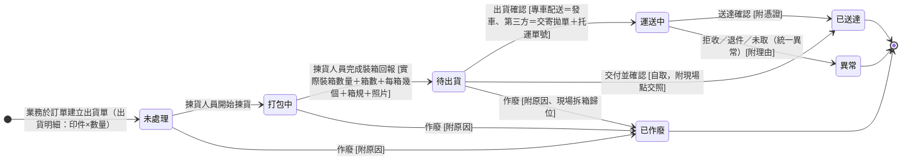

讀完這張卡，你會知道：

- 認識 [[出貨單]]（ShippingStatus）狀態機涵蓋的生命週期：從業務在訂單中選定要出的印件與數量開單（同訂單多個印件可合成一張，不跨訂單），到揀貨裝箱、離廠在途，最後收在送達、異常或作廢
- 看懂出貨單有哪幾種處境、每一格代表球在揀貨人員、出貨人員還是業務手上
- 掌握每個轉換由誰觸發、要滿足什麼條件才推得動，包含出貨與送達兩次確認各要留下什麼憑證
- 理解為什麼把揀貨段與物流段一起切進這條鏈：出貨單本身就是揀貨指令，一張單看得到這批貨從開單到到貨的全部經過
- 知道一個印件為什麼可以開多張出貨單分批出，以及出貨失敗為什麼做成不回流的終態

## 狀態列舉（正本）

> 本段是出貨單狀態的唯一正本。狀態的新增與修改是商業決策，直接在此卡維護。揀貨段設打包中／待出貨兩態。

| 狀態 | 說明 | 對應營運需求 |
|------|------|------------|
| 未處理 | 初始；出貨單已建立（出貨明細選定），還沒有人開始揀貨 | 出貨指令與處理進度分開，「還沒人動」看得出來 |
| 打包中 | 揀貨人員按「開始揀貨」進入；清點、打包、裝箱進行中 | 業務隨時看得到「倉庫已經在處理我的單了」 |
| 待出貨 | 揀貨人員完成裝箱回報（實際裝箱數量／箱數／每箱幾個／箱規／照片）進入；貨已裝箱等出貨人員 | 揀貨與出貨的交棒點明確，裝箱證據留在單上 |
| 運送中 | 貨已離廠在途——出貨人員做**出貨確認**（時間＋操作人；第三方物流＝交寄拋單並填托運單號、專車配送＝發車）（EC 現況稱「已出貨」） | 在途與到貨分開看，客戶問「到哪了」答得出來 |
| 已送達 | 終態；貨到客戶手上——出貨人員做**送達確認**（時間＋操作人＋憑證：專車＝司機交付照、自取＝現場點交照、第三方＝回填物流商配達時間） | 印件與訂單完成判定的依據；每張單收尾必留「誰確認、何時、憑什麼說到了」 |
| 異常 | 終態；這次出貨有問題——拒收、退件、超商未取等統一視為異常，原因先不細分、**理由必填**（自由文字，系統記下轉入時間）。**轉異常即逐印件自動回補可出貨額度**（與作廢同規則見 [[SHP-010-異常出貨單可出貨額度是否回補]] 決議） | 出貨失敗明確收掉，要再出就建新出貨單（額度已回補、建得出來）；理由與時間是事後追「這批為什麼沒送成、額度何時回來」的唯一依據 |
| 已作廢 | 終態；貨未離廠前撤銷（理由必填，系統記下轉入時間），作廢明細數量逐印件回補可出貨額度 | 建錯或客戶取消不留無效單據，額度回算 |

**出貨方式**（欄位，不拆狀態路徑）：自取／專車配送（公司自行配送）／第三方物流（物流商：順豐／新竹物流／超商／其他）。三類共用同一套狀態與確認動作；自取不經「運送中」——待出貨後交付當下一次完成出貨與送達確認。

## 狀態機圖（UML）

依 UML 狀態機圖記法繪製：實心圓為初始點、雙圈為終止點、轉換標籤採「觸發事件 [轉換條件]」格式。揀貨段由揀貨人員推進，物流段初期為出貨人員人工標記。

```mermaid
stateDiagram-v2
    direction LR

    [*] --> s_pending : 業務於訂單建立出貨單（出貨明細：印件×數量）

    state "未處理" as s_pending
    state "打包中" as s_packing
    state "待出貨" as s_packed
    state "運送中" as s_shipping
    state "已送達" as s_arrived
    state "異常" as s_failed
    state "已作廢" as s_void

    s_pending --> s_packing : 揀貨人員開始揀貨
    s_packing --> s_packed : 揀貨人員完成裝箱回報 [實際裝箱數量＋箱數＋每箱幾個＋箱規＋照片]
    s_packed --> s_shipping : 出貨確認 [專車配送＝發車、第三方＝交寄拋單＋托運單號]
    s_packed --> s_arrived : 交付並確認 [自取，附現場點交照]
    s_shipping --> s_arrived : 送達確認 [附憑證]
    s_shipping --> s_failed : 拒收／退件／未取（統一異常）[附理由]
    s_pending --> s_void : 作廢 [附原因]
    s_packing --> s_void : 作廢 [附原因]
    s_packed --> s_void : 作廢 [附原因、現場拆箱歸位]

    s_arrived --> [*]
    s_failed --> [*]
    s_void --> [*]
```

## 轉換條件與觸發事件

| 轉換 | 觸發事件 | 條件 |
|------|---------|------|
| （建立）→ 未處理 | 業務於訂單中建立出貨單，設定出貨明細（印件×數量）與收件資訊 | 不可跨訂單；每條明細數量不得超過該印件可出貨額度（算式見 [[印件]] 可出貨額度欄，回補規則見 [[齊套邏輯]]）。額度檢核以**按下建立的那一刻**的最新額度計（畫面上顯示的額度只是參考值，開著建單畫面的期間額度可能被別張單吃掉，也可能因別張單作廢或轉異常而回補）；額度不足時**整張單擋下**並顯示當下額度、**不做部分成立**（不自動把數量砍到額度內、不讓通過檢核的明細先成立），擋下訊息帶出兩條出路（等品檢再驗一批補足額度、或談短出由印務結案）；**業務在未離廠前修改出貨明細數量時重跑同一套檢核** |
| 未處理 → 打包中 | 揀貨人員按「開始揀貨」 | 揀貨指令進入處理 |
| 打包中 → 待出貨 | 揀貨人員完成裝箱回報 | 回報實際裝箱數量、箱數、每箱幾個、箱規、照片（裝箱照／秤重照）；實裝與明細要求不符時揀貨人員照實填實際裝箱數量並**在系統外（口頭或通訊軟體）通知業務**、不自行判定，系統不設異常回報功能。業務兩條處置皆走既有路徑：改出貨明細數量對齊實裝後照常推進本單（未出到的量留在額度裡、之後另建單補出），或作廢本單重建（貨未離廠可作廢、已裝箱者現場拆箱歸位、額度自動回補）。**不另設打包階段的異常態**——「異常」留給貨已離廠後的拒收與未取 |
| 待出貨 → 運送中 | 出貨人員做出貨確認：專車配送＝發車、第三方物流＝交寄拋單 | 系統寫入出貨時間與操作人；第三方物流填托運單號；物流單列印與張貼屬此步作業 |
| 待出貨 → 已送達 | 自取：客戶到廠，出貨人員交付並確認 | 不經運送中；一次完成出貨與送達確認，附現場點交照 |
| 運送中 → 已送達 | 出貨人員做送達確認 | 系統寫入送達時間與操作人＋憑證：專車＝司機交付照、第三方＝出貨人員查物流商配達資訊後回填配達時間（不強制截圖，爭議時依托運單號向物流商調紀錄）；初期人工 |
| 運送中 → 異常 | 出貨人員標記異常（拒收、退件、超商未取等）並填理由 | 統一視為異常、原因先不細分，但**理由必填**、系統記轉入時間（與作廢同格式，欄位見 [[出貨單]]）；轉異常即逐印件自動回補可出貨額度，要再出貨就建新出貨單；實物由揀貨／出貨作業把關，退回貨不設系統強制重驗，貨遺失時業務不建新單即可 |
| 未處理／打包中／待出貨 → 已作廢 | 作廢（附原因） | 貨未離廠皆可撤；已裝箱者現場拆箱歸位；作廢明細數量逐印件回補可出貨額度 |

## 關鍵轉換的營運動機

- 出貨單即揀貨指令 → 動機：成品完成最終品檢即入庫（可出貨）暫存、不另設成品倉的庫存管理，業務決定出多少才建單、揀貨依單裝箱——揀貨人員從出貨單就知道今天包哪些、怎麼包（業務有指定裝箱方式就照指定，沒指定就依公版箱規自行判斷），不靠口頭交代 → 例子：專輯手工完成、最終品檢通過入庫；三天後客戶說可出，業務建出貨單，揀貨依單裝箱後出貨。
- 揀貨段兩態納入狀態鏈、回報記在出貨單上 → 動機：出貨單的一生就是這批貨的一生（開單 → 裝箱 → 出門 → 到貨），裝箱回報是「裝好了」的證據、直接留在同一張單上，一張單看得到全部經過；品檢回報（通過多少）與裝箱回報（裝了幾箱共多少個）拆成兩段，不再混發（現況混發造成出問題難定位）→ 例子：品檢回報通過 609 入庫；業務建單出 609；揀貨開始揀貨（打包中）、裝 1 箱馬克杯箱、實裝 609 附照片（待出貨）；出貨人員發車（運送中）。
- 一印件多張出貨單（分批） → 動機：客戶急要先出一部分是常態；每批一張單、各自獨立追蹤送達 → 例子：名片 1000 已入庫 580，先出 580（出貨單 A 運送中），餘量入庫後再出（出貨單 B）。
- 異常為終態、不回流 → 動機：「這次出貨有問題」要當一個明確結果收掉（後續對帳與責任都對著這張單），重出是新的決定、開新單；原因分類先不做，避免過早設計 → 例子：超商件七天未取退回，原單標異常；業務與客戶確認後改宅配，建新出貨單。
- 物流段人工推進 → 動機：初期不串物流商系統，到貨資訊靠出貨人員查詢回填；之後補強自動化（如掃碼、物流狀態回寫）再演化。揀貨段（開始揀貨、裝箱回報）由揀貨人員操作推進。

## 與其他狀態機的關係

- 出貨額度的上游：[[品檢紀錄]] 通過數量 → 印件的完工良品數 → 可出貨額度（多工單印件不另設取小規則——品檢驗的是工序依賴圖終點的完成品，多工單天然已齊，見 [[齊套邏輯]]）。
- 印件層收尾：**排除異常與已作廢的出貨單之後**，該印件其餘出貨單**全部已送達、且累計送達數 ≥ 購買數量** → [[印件狀態]] 印製維度轉「已送達」（系統自動）。用 ≥ 而不用等號，是因為補做超量出貨與訂單完成前業務把購買數量改小這兩種情形下貨都已足額送到客戶手上，用等號會讓判定卡住。
- 訂單層收尾：全部印件已送達 → [[訂單狀態]] 系統自動轉「訂單完成」；完成與發票、收款脫鉤（錢由對帳差額警示追、完成後客訴走 [[售後服務狀態]]）。
- 異常出貨單不計入印件送達累計、其明細額度自動回補（[[齊套邏輯]]）；貨物的重出走新出貨單。

## 範圍外

- **可出貨額度的計算**：系統會自動計算——本卡只承諾此行為，算式正本在 [[印件]] 可出貨額度欄、回補規則見 [[齊套邏輯]]，實作時勿自行發明
- 揀貨回報的欄位定義 → [[出貨單]]（欄位正本）；現場作業細節（點收順序、封箱）→ [[揀貨人員]]
- 運費的帳不做（訂單通常已先收運費）；箱數／箱規的留存供每月與第三方物流對帳（雙方箱數認知比對），對帳機制屬後續設計
- 異常的原因分類與理賠 → 刻意先不設計（拍板：統一當異常看）

## 相關卡

- 規則：[[齊套邏輯]]（齊套判定與回補規則）、[[印件生產流程]]、[[工序相依性規則]]（分次驗、隨驗隨入庫支援分批出貨）
- 實體：[[出貨單]]（本狀態機依附的主實體）
- 狀態機：[[印件狀態]]（送達的彙整層）、[[訂單狀態]]（完成的觸發）、[[生產任務狀態]]（完工良品數的上游）
- 角色：[[業務]]／[[諮詢]]（決定出多少、建出貨單）、[[揀貨人員]]（依出貨單裝箱、回報裝箱內容）、[[出貨人員]]（拋單、交運、標記送達）、[[品檢人員]]（完工良品數的把關）
- 已拍板決議（封存，供追溯）：[[SHP-005-分批出貨觸發節點]]（分批建單逐明細檢核）、[[SHP-007-揀貨裝箱回報載體與出貨單狀態顆粒度]]（裝箱回報記在出貨單上、揀貨段兩態）
