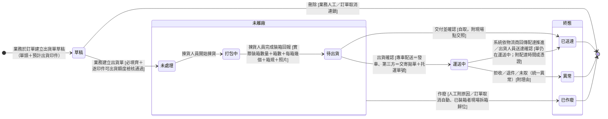

讀完這張卡，你會知道：

- 認識 [[出貨單]]（ShippingStatus）狀態機涵蓋的生命週期：從業務在訂單中先建草稿排這一批的出貨計畫、再選定要出的印件與數量建立出貨單（同訂單多個印件可合成一張，不跨訂單），到揀貨裝箱、離廠在途，最後收在送達、異常或作廢
- 看懂出貨單有哪幾種處境、每一格代表球在揀貨人員、出貨人員還是業務手上
- 掌握每個轉換由誰觸發、要滿足什麼條件才推得動，包含出貨與送達兩次確認各要留下什麼憑證
- 理解為什麼把揀貨段與物流段一起切進這條鏈：出貨單本身就是揀貨指令，一張單看得到這批貨從開單到到貨的全部經過
- 知道一個印件為什麼可以開多張出貨單分批出，以及出貨失敗為什麼做成不回流的終態

## 狀態列舉（正本）

> 本段是出貨單狀態的唯一正本。狀態的新增與修改是商業決策，直接在此卡維護。揀貨段設打包中／待出貨兩態。

| 狀態 | 說明 | 對應營運需求 |
|------|------|------------|
| 草稿 | 初始；業務排的出貨計畫，只有單頭與預計出貨印件，不佔可出貨額度、不進揀貨人員與出貨人員的清單、也不推進印件與訂單 | 出貨計畫與出貨指令分開，客戶談定的日期與收件資訊當下就記得下來，不必等品檢結果 |
| 未處理 | 業務按「建立出貨單」、出貨明細通過可出貨額度檢核後進入；還沒有人開始揀貨 | 出貨指令與處理進度分開，「還沒人動」看得出來 |
| 打包中 | 揀貨人員按「開始揀貨」進入；清點、打包、裝箱進行中 | 業務隨時看得到「倉庫已經在處理我的單了」 |
| 待出貨 | 揀貨人員完成裝箱回報（實際裝箱數量／箱數／每箱幾個／箱規／照片）進入；貨已裝箱等出貨人員 | 揀貨與出貨的交棒點明確，裝箱證據留在單上 |
| 運送中 | 貨已離廠在途——出貨人員做**出貨確認**（時間＋操作人；第三方物流＝交寄拋單並填托運單號、專車配送＝發車）（EC 現況稱「已出貨」） | 在途與到貨分開看，客戶問「到哪了」答得出來 |
| 已送達 | 終態；貨到客戶手上——出貨人員做**送達確認**（時間＋操作人＋憑證：專車＝司機交付照、自取＝現場點交照、第三方＝物流商回傳的配達時間） | 印件與訂單完成判定的依據；每張單收尾必留「誰確認、何時、憑什麼說到了」 |
| 異常 | 終態；這次出貨有問題——拒收、退件、超商未取等統一視為異常，原因先不細分、**理由必填**（自由文字，系統記下轉入時間）。**轉異常即逐印件自動回補可出貨額度**（與作廢同規則見 [[SHP-010-異常出貨單可出貨額度是否回補]] 決議） | 出貨失敗明確收掉，要再出就建新出貨單（額度已回補、建得出來）；理由與時間是事後追「這批為什麼沒送成、額度何時回來」的唯一依據 |
| 已作廢 | 終態；貨未離廠前撤銷（理由必填，系統記下轉入時間），作廢明細數量逐印件回補可出貨額度。兩種來路：業務人工作廢，或訂單轉「已取消」時由系統自動作廢未離廠的單（原因自動記「訂單取消」） | 建錯或客戶取消不留無效單據，額度回算；訂單取消時自動收掉未離廠的單，倉庫不會照著一張已作廢訂單的指令繼續出貨 |

**出貨方式**（欄位，不拆狀態路徑；值域正本見 [[出貨單]]）：自取、專車配送與各家第三方物流共用同一套狀態與確認動作；自取不經「運送中」——待出貨後交付當下一次完成出貨與送達確認。

## 狀態機圖（UML）

依 UML 狀態機圖記法繪製：實心圓為初始點、雙圈為終止點、轉換標籤採「觸發事件 [轉換條件]」格式。揀貨段由揀貨人員推進；物流段的專車配送與自取由出貨人員標記，第三方物流依物流商回傳的配達時間推進、人工確認為備援。複合狀態為可被規則句引用的集合詞（成員以本圖為正本）：「未離廠」＝貨還在廠內、可撤銷的處境；「終態」＝出貨單已收束的處境。作廢弧自「未離廠」邊界出發，同時涵蓋人工作廢與訂單取消觸發的自動作廢（處置相同、觸發者不同，見轉換表兩列）。草稿不屬「未離廠」——它還不是出貨指令，作廢只從「未處理」起算，草稿的出口是刪除（同樣一條弧涵蓋人工刪除與訂單取消連鎖的系統刪除，見轉換表兩列）。

```mermaid
stateDiagram-v2
    direction LR

    state "草稿" as s_draft

    [*] --> s_draft : 業務於訂單建立出貨單草稿（單頭＋預計出貨印件）

    state "未離廠" as OnSite {
        direction LR
        state "未處理" as s_pending
        state "打包中" as s_packing
        state "待出貨" as s_packed
        s_pending --> s_packing : 揀貨人員開始揀貨
        s_packing --> s_packed : 揀貨人員完成裝箱回報 [實際裝箱數量＋箱數＋每箱幾個＋箱規＋照片]
    }

    state "運送中" as s_shipping

    state "終態" as Final {
        direction LR
        state "已送達" as s_arrived
        state "異常" as s_failed
        state "已作廢" as s_void
    }

    s_draft --> s_pending : 業務建立出貨單 [必填齊＋逐印件可出貨額度檢核通過]
    s_draft --> [*] : 刪除 [業務人工／訂單取消連鎖]
    s_packed --> s_shipping : 出貨確認 [專車配送＝發車、第三方＝交寄拋單＋托運單號]
    s_packed --> s_arrived : 交付並確認 [自取，附現場點交照]
    s_shipping --> s_arrived : 系統依物流商回傳配達推進／出貨人員送達確認 [單仍在運送中；附配達時間或憑證]
    s_shipping --> s_failed : 拒收／退件／未取（統一異常）[附理由]
    OnSite --> s_void : 作廢 [人工附原因／訂單取消自動、已裝箱者現場拆箱歸位]

    s_arrived --> [*]
    s_failed --> [*]
    s_void --> [*]
```

## 轉換條件與觸發事件

| 轉換 | 觸發事件 | 條件 |
|------|---------|------|
| （建立）→ 草稿 | 業務或諮詢（諮詢單轉來的訂單）於訂單中建立出貨單草稿，填單頭並調整預計出貨印件 | 不可跨訂單；**訂單處於任何狀態（含終態）都建得出來**，不以訂單狀態或印件的印製維度另設把關（排這一批怎麼出是業務與客戶談出來的，跟單子當下停在哪一格無關）；預計出貨日必填；預計出貨印件由系統預設帶入，業務可移除、可加回（帶入範圍與預設數量的算法見 [[出貨單]]）；本步不檢核可出貨額度——額度要等品檢通過才長得出來 |
| 草稿 → 未處理 | 業務按「建立出貨單」 | 必填齊備（預計出貨日、出貨方式、收件人、收件地址，且至少一條預計出貨印件的數量大於 0）；印製維度為「已棄用」的印件**不出現在可選清單**（已棄用即不再交付，見 [[印件狀態]]；額度算式沒有棄用歸零機制，不排除就會讓已取消訂單的既有良品被誤出）。每條明細數量不得超過該印件可出貨額度（算式見 [[印件]] 可出貨額度欄，回補規則見 [[齊套邏輯]]）。額度檢核以**按下建立出貨單的那一刻**的最新額度計（畫面上顯示的額度只是參考值，開著草稿的期間額度可能被別張單吃掉，也可能因別張單作廢或轉異常而回補）；額度不足時**整張單擋下**、**不做部分成立**（不自動把數量砍到額度內、不讓通過檢核的明細先成立），擋下只告知「可出貨額度不足，出貨單未成立」。通過檢核即把預計出貨印件轉為出貨明細；建立那一刻預計出貨印件中印製維度已轉「已棄用」者由系統自動移除並提示，移除後沒有任何一條數量大於 0 時以必填檢核擋下。業務在新建畫面直接按「建立出貨單」時，系統先成草稿、同一動作立刻走本列，不另設直達未處理的路徑。成立時記下所屬訂單當時的帳務公司，供寄件資訊取用（欄位見 [[出貨單]]）。**業務在未離廠前修改出貨明細數量時重跑同一套檢核，但基準是「當下額度＋本單原明細已佔用的量」**（增量檢核）——不把本單自己吃掉的量先還回來算，連往下改數量都會被自己的佔用擋死，實裝與明細不符時「改明細對齊實裝」這條處置就走不通 |
| 草稿 → 刪除 | 業務刪除草稿 | 草稿唯一的出口是刪除、不走作廢（沒有出貨明細、沒佔額度，既沒有要回補的量也沒有要留的作廢紀錄）；不要求填理由；刪除後不再出現在清單上，紀錄留存供追溯 |
| 草稿 → 刪除（訂單取消連鎖） | 系統於所屬訂單轉「已取消」時刪除該訂單的草稿（見 [[訂單狀態]]） | 不要求人工填理由；已離開草稿的單改依下方兩列的作廢規則處理 |
| 未處理 → 打包中 | 揀貨人員按「開始揀貨」 | 揀貨指令進入處理 |
| 打包中 → 待出貨 | 揀貨人員完成裝箱回報 | 回報實際裝箱數量、箱數、每箱幾個、箱規、照片（裝箱照／秤重照）；實裝與明細要求不符時揀貨人員照實填實際裝箱數量並**在系統外（口頭或通訊軟體）通知業務**、不自行判定，系統不設異常回報功能。業務兩條處置皆走既有路徑：改出貨明細數量對齊實裝後照常推進本單（未出到的量留在額度裡、之後另建單補出），或作廢本單重建（貨未離廠可作廢、已裝箱者現場拆箱歸位、額度自動回補）。**不另設打包階段的異常態**——「異常」留給貨已離廠後的拒收與未取 |
| 待出貨 → 運送中 | 出貨人員做出貨確認：專車配送＝發車、第三方物流＝交寄拋單 | 系統寫入出貨時間與操作人；第三方物流填托運單號；重量（公斤）選填；物流單列印與張貼屬此步作業 |
| 待出貨 → 已送達 | 自取：客戶到廠，出貨人員交付並確認 | 不經運送中；一次完成出貨與送達確認，附現場點交照 |
| 運送中 → 已送達 | 第三方物流：系統依物流商回傳的配達時間自動推進；回傳未進來時由出貨人員做送達確認。專車配送：出貨人員做送達確認 | 系統一律寫入送達時間，人工確認另記操作人。第三方物流以物流商回傳的配達時間為憑證；備援的人工確認由出貨人員查得配達資訊後回填該時間（不強制截圖，爭議時依托運單號向物流商調紀錄）。專車配送附司機交付照。回傳只對「仍在運送中、出貨方式為第三方、托運單號相符」的單生效，已收終態的單忽略回傳；配達指物流商的簽收或取件完成事件，到店與配送中不算，超商件因此在客戶取件前停在運送中、未取退回照走異常。自動推進與人工確認同時到時先寫入者成立，後到者不改任何欄位並提示重新整理 |
| 運送中 → 異常 | 出貨人員標記異常（拒收、退件、超商未取等）並填理由 | 統一視為異常、原因先不細分，但**理由必填**、系統記轉入時間（與作廢同格式，欄位見 [[出貨單]]）；轉異常即逐印件自動回補可出貨額度，要再出貨就建新出貨單；實物由揀貨／出貨作業把關，退回貨不設系統強制重驗，貨遺失時業務不建新單即可 |
| 「未離廠」的任何狀態 → 已作廢 | 業務作廢（附原因） | 貨未離廠皆可撤；已裝箱者現場拆箱歸位；作廢明細數量逐印件回補可出貨額度 |
| 「未離廠」的任何狀態 → 已作廢（訂單取消連鎖） | 系統於所屬訂單轉「已取消」時自動作廢（見 [[訂單狀態]]） | 作廢原因自動記「訂單取消」、不要求人工填；其餘處置與人工作廢相同（已裝箱者現場拆箱歸位、明細數量逐印件回補額度）。**運送中與已送達的單不動**——貨已出門，後續要不要退、要不要收錢屬業務與客戶的善後商談，不由系統改寫已發生的事 |

## 關鍵轉換的營運動機

- 先草稿再出貨單 → 動機：業務與客戶談定這一批大概哪天出、送到哪的當下，不記下來就散在通訊軟體裡；能不能真的出貨要等品檢結果，兩件事之間的時間差就是草稿存在的理由。草稿不進倉庫的清單，倉庫才不會照著一張還沒算過帳的計畫去揀貨 → 例子：客戶講定 9 月 10 日要到貨，業務先把日期與收件資訊記在草稿上；品檢過了 495 本之後，同一張草稿直接建立成出貨單。
- 出貨單即揀貨指令 → 動機：成品完成最終品檢即入庫（可出貨）暫存、不另設成品倉的庫存管理，業務決定出多少才建單、揀貨依單裝箱——揀貨人員從出貨單就知道今天包哪些、怎麼包（業務有指定裝箱方式就照指定，沒指定就依公版箱規自行判斷），不靠口頭交代 → 例子：專輯手工完成、最終品檢通過入庫；三天後客戶說可出，業務建出貨單，揀貨依單裝箱後出貨。
- 揀貨段兩態納入狀態鏈、回報記在出貨單上 → 動機：出貨單的一生就是這批貨的一生（開單 → 裝箱 → 出門 → 到貨），裝箱回報是「裝好了」的證據、直接留在同一張單上，一張單看得到全部經過；品檢回報（通過多少）與裝箱回報（裝了幾箱共多少個）拆成兩段，不再混發（現況混發造成出問題難定位）→ 例子：品檢回報通過 609 入庫；業務建單出 609；揀貨開始揀貨（打包中）、裝 1 箱馬克杯箱、實裝 609 附照片（待出貨）；出貨人員發車（運送中）。
- 一印件多張出貨單（分批） → 動機：客戶急要先出一部分是常態；每批一張單、各自獨立追蹤送達 → 例子：名片 1000 已入庫 580，先出 580（出貨單 A 運送中），餘量入庫後再出（出貨單 B）。
- 異常為終態、不回流 → 動機：「這次出貨有問題」要當一個明確結果收掉（後續對帳與責任都對著這張單），重出是新的決定、開新單；原因分類先不做，避免過早設計 → 例子：超商件七天未取退回，原單標異常；業務與客戶確認後改宅配，建新出貨單。
- 第三方物流的送達以物流商回傳為主、人工為備援 → 動機：配達是物流商手上的事實，由它回傳比人工查詢再回填準確，客戶問「到了沒」答得出來；備援讓回傳沒進來的單不會卡在運送中。專車與自取沒有外部回傳可接，仍由現場的人確認 → 例子：順豐回傳配達時間後，這張單當天就收在已送達，出貨人員不必另外查詢。

## 與其他狀態機的關係

- 出貨額度的上游：[[品檢紀錄]] 通過數量 → 印件的完工良品數 → 可出貨額度（多工單印件不另設取小規則——品檢驗的是工序依賴圖終點的完成品，多工單天然已齊，見 [[齊套邏輯]]）。
- 印件層收尾：**排除草稿、異常與已作廢的出貨單之後**，該印件其餘出貨單**全部已送達、且累計送達數 ≥ 購買數量** → [[印件狀態]] 印製維度轉「已送達」（系統自動）。用 ≥ 而不用等號，是因為補做超量出貨與訂單完成前業務把購買數量改小這兩種情形下貨都已足額送到客戶手上，用等號會讓判定卡住。
- 訂單層收尾：全部未棄用印件已送達 → [[訂單狀態]] 系統自動轉「訂單完成」；完成與發票、收款脫鉤（錢由對帳差額警示追、完成後客訴走 [[售後服務狀態]]）。訂單收於終態不影響本卡建單——只要還有額度就建得出來（見上方建立列）。
- 印件與訂單轉「出貨中」的起點：含該印件出貨明細的首張出貨單由「草稿」轉「未處理」時該印件的印製維度推進，該訂單的首張走這條弧時訂單推進，兩者皆自「製作中」或「製作完成」進入（草稿本身不觸發；轉換正本見 [[印件狀態]]、[[訂單狀態]]）。
- 訂單取消時本層被連鎖收掉：草稿由系統刪除，未離廠的出貨單由系統自動作廢並回補額度，運送中與已送達的不動（連鎖全貌見 [[訂單狀態]]）。
- 異常出貨單不計入印件送達累計、其明細額度自動回補（[[齊套邏輯]]）；貨物的重出走新出貨單。

## 範圍外

- **可出貨額度的計算**：系統會自動計算——本卡只承諾此行為，算式正本在 [[印件]] 可出貨額度欄、回補規則見 [[齊套邏輯]]，實作時勿自行發明
- 揀貨回報的欄位定義 → [[出貨單]]（欄位正本）；現場作業細節（點收順序、封箱）→ [[揀貨人員]]
- 運費的帳不做（訂單通常已先收運費）；箱數／箱規的留存供每月與第三方物流對帳（雙方箱數認知比對），對帳機制屬後續設計
- 異常的原因分類與理賠 → 刻意先不設計（拍板：統一當異常看）

## 相關卡

- 規則：[[齊套邏輯]]（齊套判定與回補規則）、[[印件生產流程]]、[[工序相依性規則]]（分次驗、隨驗隨入庫支援分批出貨）
- 實體：[[出貨單]]（本狀態機依附的主實體）
- 狀態機：[[印件狀態]]（送達的彙整層）、[[訂單狀態]]（完成的觸發）、[[生產任務狀態]]（完工良品數的上游）
- 角色：[[業務]]／[[諮詢]]（決定出多少、建出貨單）、[[揀貨人員]]（依出貨單裝箱、回報裝箱內容）、[[出貨人員]]（拋單、交運、標記送達）、[[品檢人員]]（完工良品數的把關）
- 已拍板決議（封存，供追溯）：[[SHP-005-分批出貨觸發節點]]（分批建單逐明細檢核）、[[SHP-007-揀貨裝箱回報載體與出貨單狀態顆粒度]]（裝箱回報記在出貨單上、揀貨段兩態）
