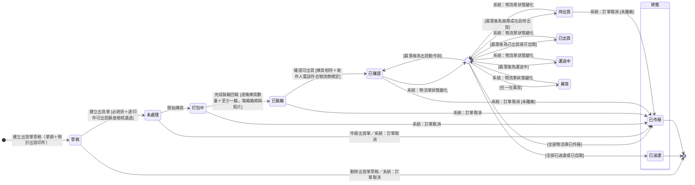

讀完這張卡，你會知道：

- 認識 [[出貨單]] 狀態機涵蓋的生命週期：從在訂單中先建草稿排這一批的出貨計畫、再選定要出的印件與數量建立出貨單（同訂單多個印件可合成一張，不跨訂單），到揀貨裝箱、確認可出貨後交由物流單出貨，最後收在送達或作廢
- 看懂出貨單有哪幾種處境，以及確認可出貨之後為什麼改由底下的物流單算出來
- 掌握每個轉換由哪些操作或物流單的變化觸發、要滿足什麼條件才推得動
- 分辨「未離廠」「部分離廠」「全數離廠」這幾個集合詞，以及各自能做什麼
- 知道異常為什麼不是終態、不回補額度

## 狀態列舉（正本）

> 本段是出貨單狀態的唯一正本。狀態的新增與修改是商業決策，直接在此卡維護。揀貨段設打包中／已裝箱兩態；已確認之後的狀態依底下未作廢的 [[物流單]] 計算（規則見下方「依物流單計算」）。

| 狀態 | 說明 | 對應營運需求 |
|------|------|------------|
| 草稿 | 初始；排好的出貨計畫，只有單頭與預計出貨印件，不佔可出貨額度、不進揀貨與出貨的待處理清單、也不推進印件與訂單 | 出貨計畫與出貨指令分開，客戶談定的日期與收件資訊當下就記得下來，不必等品檢結果 |
| 未處理 | 建立出貨單、出貨明細通過可出貨額度檢核後進入；還沒有人開始揀貨 | 出貨指令與處理進度分開，「還沒人動」看得出來 |
| 打包中 | 開始揀貨後進入；清點、打包、裝箱進行中 | 隨時看得到倉庫已經在處理這張單 |
| 已裝箱 | 完成裝箱回報後進入；尚無物流單；揀貨數量與裝箱資料仍可修正（條件見下方「揀貨不符與裝箱回報修正」） | 裝箱證據留在單上；物流單還沒產生，修正揀貨數量與裝箱資料不牽動物流單 |
| 已確認 | 確認可出貨後進入，系統同時依出貨方式產生物流單；出貨明細數量、揀貨數量與裝箱資料自此不能修正；之後依物流單計算，最落後的物流單在出貨動作前（見 [[物流單狀態]] § 推進規則）時停在這一格，含部分物流單拋單成功、其餘還沒拋單成功的情形 | 揀貨與出貨的交棒點明確；數量在物流單產生前鎖定，物流單與箱子對得上 |
| 待出貨 | 依物流單計算；最落後的物流單為第三方物流拋單成功、貨態為待出貨或查無資料；全部物流單拋單成功才進入 | 第三方物流已拋單、等物流商收件 |
| 已出貨 | 依物流單計算；最落後的物流單貨態為已出貨或可自取 | 這一批的貨都已交出或可自取 |
| 運送中 | 依物流單計算；最落後的物流單貨態為運送中 | 在途與到貨分開看，客戶問「到哪了」答得出來 |
| 異常 | 依物流單計算；任一未作廢物流單的貨態為「異常」（集合詞見 [[物流單狀態]]）即為異常，優先於其他計算結果；非終態，異常解除或該物流單作廢後重算；異常的細分名稱只看物流單 | 一筆出了狀況，整張單要讓人一眼看到；不寫細分名稱，多筆異常時才不會讀錯 |
| 已送達 | 終態；至少一筆未作廢物流單、且全部未作廢物流單貨態為已送達或已自取；轉入時寫入出貨明細的送達數量（欄位見 [[出貨單]]） | 印件與訂單完成判定的依據 |
| 已作廢 | 終態；來路有人工作廢（限未處理，理由必填）、全部物流單作廢、訂單轉「已取消」的連鎖作廢（後兩者不要求理由）；系統記下轉入時間 | 建錯或客戶取消不留無效單據，額度回算；訂單取消時自動收掉還沒離廠的單，倉庫不會照著一張已作廢訂單的指令繼續出貨 |

**出貨方式**（欄位，不拆出貨單的狀態路徑；選項與屬性見 [[出貨單]]）：各出貨方式經過哪些狀態看物流單（見 [[物流單狀態]]），本單取其最落後。自取、專車配送、其他不經待出貨與運送中；第三方物流不經已出貨。

### 集合詞

> 本段是下列集合詞的正本。集合詞依底下未作廢 [[物流單]] 的貨態判定，物流單是否離廠看 [[物流單狀態]] 的集合詞「已離廠」；出貨單的同一狀態可能落在不同集合詞（例：已確認可能是未離廠，也可能是部分離廠），所以不畫成狀態圖上的複合狀態。各集合詞互斥，涵蓋草稿以外的全部未作廢出貨單。出貨動作＝拋單、出貨確認或標記可自取；拋單失敗不推進貨態。

| 集合詞 | 定義 | 對應營運需求 |
|-------|------|------------|
| 未離廠 | 本單沒有物流單，或全部未作廢物流單的貨態都是待出貨或查無資料 | 貨還在廠內 |
| 部分離廠 | 至少一筆未作廢物流單已離廠，且仍有未作廢物流單的貨態是待出貨或查無資料 | 已有貨交出，只能逐筆處理 |
| 全數離廠 | 全部未作廢物流單都已離廠 | 這一批全部離開公司，算已出貨（取用處見 [[訂單]]、[[印件]]） |

## 狀態機圖（UML）

- 記法：實心圓為初始點、雙圈為終止點、轉換標籤採「觸發操作名稱 [轉換條件]」格式，系統推進寫「系統：業務事件」。已確認之後的推進是歸納型轉換：物流單一有變化就重算，畫成選擇節點，落入哪一格依下方「依物流單計算」。
- 複合狀態「終態」＝出貨單已收束的處境，為可被他卡引用的集合詞（成員以本圖為正本）。未離廠、部分離廠、全數離廠這幾個集合詞依物流單狀態判定，不畫成複合狀態（定義見上方「集合詞」）。
- 草稿不是出貨指令，出口是刪除，涵蓋人工刪除與訂單取消連鎖的系統刪除（見轉換表兩列）。

```mermaid
stateDiagram-v2
    direction LR

    state "草稿" as s_draft
    state "未處理" as s_pending
    state "打包中" as s_packing
    state "已裝箱" as s_packed
    state "已確認" as s_ready
    state "待出貨" as s_waiting
    state "已出貨" as s_shipped
    state "運送中" as s_transit
    state "異常" as s_exception

    [*] --> s_draft : 建立出貨單草稿（單頭＋預計出貨印件）

    state "終態" as Final {
        direction LR
        state "已送達" as s_arrived
        state "已作廢" as s_void
    }

    state recalc <<choice>>

    s_draft --> s_pending : 建立出貨單 [必填齊＋逐印件可出貨額度檢核通過]
    s_draft --> [*] : 刪除出貨單草稿／系統：訂單取消
    s_pending --> s_packing : 開始揀貨
    s_packing --> s_packed : 完成裝箱回報 [逐條揀貨數量＋至少一箱，每箱箱規與照片]
    s_packed --> s_ready : 確認可出貨 [揀貨相符＋收件人電話符合物流商規定]

    s_ready --> recalc : 系統：物流單狀態變化
    s_waiting --> recalc : 系統：物流單狀態變化
    s_shipped --> recalc : 系統：物流單狀態變化
    s_transit --> recalc : 系統：物流單狀態變化
    s_exception --> recalc : 系統：物流單狀態變化

    recalc --> s_ready : [最落後為出貨動作前]
    recalc --> s_waiting : [最落後為拋單成功且待出貨]
    recalc --> s_shipped : [最落後為已出貨或可自取]
    recalc --> s_transit : [最落後為運送中]
    recalc --> s_exception : [任一在異常]
    recalc --> s_arrived : [全部已送達或已自取]
    recalc --> s_void : [全部物流單已作廢]

    s_pending --> s_void : 作廢出貨單／系統：訂單取消
    s_packing --> s_void : 系統：訂單取消
    s_packed --> s_void : 系統：訂單取消
    s_ready --> s_void : 系統：訂單取消 [未離廠]
    s_waiting --> s_void : 系統：訂單取消 [未離廠]

    s_arrived --> [*]
    s_void --> [*]
```

## 轉換條件與觸發事件

| 轉換 | 觸發操作 | 條件 |
|------|---------|------|
| （建立）→ 草稿 | [[訂單]] OP-ORD-001 建立出貨單草稿 | 填單頭並調整預計出貨印件；不可跨訂單；**訂單處於任何狀態（含終態）都建得出來**，不以訂單狀態或印件的印製維度另設把關（排這一批怎麼出是與客戶談出來的，跟單子當下停在哪一格無關）；出貨單預計出貨日必填；預計出貨印件由系統預設帶入，可移除、可加回（帶入範圍與預設數量的算法見 [[出貨單]]）；本步不檢核可出貨額度——額度要等品檢通過才長得出來 |
| 草稿 → 未處理 | [[出貨單]] OP-SHP-003 建立出貨單 | 必填齊備（出貨單預計出貨日、出貨方式、收件人、收件地址，且至少一條預計出貨印件的數量大於 0）；印製維度為「已棄用」的印件**不出現在可選清單**（已棄用即不再交付，見 [[印件印製狀態]]；額度算式沒有棄用歸零機制，不排除就會讓已取消訂單的既有良品被誤出）。每條明細數量不得超過該印件可出貨額度（算式見 [[印件]] 可出貨額度欄，回補規則見 [[齊套邏輯]]）。額度檢核以**執行建立出貨單的那一刻**的最新額度計（畫面上顯示的額度只是參考值，開著草稿的期間額度可能被別張單吃掉，也可能因別張單作廢或物流單作廢而回補）；額度不足時**整張單擋下**、**不做部分成立**（不自動把數量砍到額度內、不讓通過檢核的明細先成立），擋下只告知「可出貨額度不足，出貨單未成立」。通過檢核即把預計出貨印件轉為出貨明細；建立那一刻預計出貨印件中印製維度已轉「已棄用」者由系統自動移除並提示，移除後沒有任何一條數量大於 0 時以必填檢核擋下。新建時直接執行建立出貨單，系統先成草稿、同一動作立刻走本列，不另設直達未處理的路徑。成立時記下所屬訂單當時的帳務公司，供寄件資訊取用（欄位見 [[出貨單]]）。**建立出貨單之後，以 [[出貨單]] OP-SHP-001 編輯出貨單只能修改出貨明細數量，限本單在未處理、打包中或已裝箱；不能增刪印件，也不能改收件資訊等其他欄位。修改出貨明細數量時重跑同一套檢核，但基準是「當下額度＋本單原明細已佔用的量」**（增量檢核）——不把本單自己吃掉的量先還回來算，連往下改數量都會被自己的佔用擋死，揀貨數量與明細不符時「改明細對齊揀貨數量」這條處置就走不通 |
| 草稿 → 刪除 | [[出貨單]] OP-SHP-002 刪除出貨單草稿 | 草稿唯一的出口是刪除、不走作廢（沒有出貨明細、沒佔額度，既沒有要回補的量也沒有要留的作廢紀錄）；不要求填理由；刪除後不再出現在清單上，紀錄留存供追溯 |
| 草稿 → 刪除（訂單取消連鎖） | 系統：所屬訂單轉「已取消」（見 [[訂單狀態]]） | 不要求人工填理由；已離開草稿的單改依下方兩列的作廢規則處理 |
| 未處理 → 打包中 | [[出貨單]] OP-SHP-004 開始揀貨 | 揀貨指令進入處理 |
| 打包中 → 已裝箱 | [[出貨單]] OP-SHP-005 完成裝箱回報 | 逐條明細回報揀貨數量；至少一箱，每箱回報箱規與至少一張裝箱照片（欄位見 [[出貨單]] § 裝箱資料）；本步不產生物流單；揀貨數量與明細數量不符時照實填、不自行判定，現場通知（處置先後見 [[出貨與送達]]），系統不設異常回報功能。處置走既有路徑：以 [[出貨單]] OP-SHP-001 編輯出貨單改出貨明細數量對齊揀貨數量後照常推進本單（未出到的量留在額度裡、之後另建單補出）。**不另設打包階段的異常態**。揀貨不符的判準與放行規則見下方「揀貨不符與裝箱回報修正」 |
| 已裝箱 → 已確認 | [[出貨單]] OP-SHP-023 確認可出貨 | 揀貨相符（判準見下方「揀貨不符與裝箱回報修正」）；收件人電話依物流商規定檢查：7-11 交貨便與全家必須是手機，順豐與新竹物流手機或市話擇一；系統同時依出貨方式產生物流單，並寫入每箱所屬物流單（拆單表見 [[出貨單]] § 裝箱資料，物流單的初始值見 [[物流單狀態]]）；自此出貨明細數量、揀貨數量與裝箱資料都不能修正 |
| 已確認／待出貨／已出貨／運送中／異常 → 依物流單重算 | [[物流單]] OP-SHP-007 拋單、[[物流單]] OP-SHP-008 出貨確認、[[物流單]] OP-SHP-017 標記可自取、[[物流單]] OP-SHP-020 標記例外、[[物流單]] OP-SHP-010 送達確認、[[物流單]] OP-SHP-009 交付確認、[[物流單]] OP-SHP-021 作廢物流單、系統：物流商回傳 | 本單任一未作廢物流單的拋單狀態或貨態改變、或有物流單作廢時重算；物流單各自的轉換條件見 [[物流單狀態]] |
| 依物流單重算 → 已確認 | 系統：重算結果 | 沒有物流單在「異常」，未作廢物流單最落後為出貨動作前（最落後順序見 [[物流單狀態]] § 推進規則） |
| 依物流單重算 → 待出貨 | 系統：重算結果 | 沒有物流單在「異常」，最落後為第三方物流拋單成功、貨態為待出貨或查無資料 |
| 依物流單重算 → 已出貨 | 系統：重算結果 | 沒有物流單在「異常」，最落後為已出貨或可自取 |
| 依物流單重算 → 運送中 | 系統：重算結果 | 沒有物流單在「異常」，最落後為運送中 |
| 依物流單重算 → 異常 | 系統：重算結果 | 任一未作廢物流單的貨態在「異常」；額度照常佔用、不回補（見 [[齊套邏輯]]） |
| 依物流單重算 → 已送達 | 系統：重算結果 | 至少一筆未作廢物流單，且全部未作廢物流單的貨態為已送達或已自取；系統寫入出貨明細的送達數量（算式見 [[出貨單]]） |
| 依物流單重算 → 已作廢 | 系統：其餘物流單都已作廢時，剩下這一筆也作廢 | 不要求理由；這一筆的未送達數量由系統預填、回補不重複（見 [[齊套邏輯]]） |
| 未處理 → 已作廢 | [[出貨單]] OP-SHP-012 作廢出貨單 | 只限本單在未處理；理由必填；整張明細數量逐印件回補可出貨額度（見 [[齊套邏輯]]） |
| 未處理／打包中／已裝箱／已確認／待出貨 → 已作廢（訂單取消連鎖） | 系統：所屬訂單轉「已取消」（見 [[訂單狀態]]） | 本單屬「未離廠」；作廢原因自動記「訂單取消」、不要求人工填；底下全部物流單同時作廢、不填未送達數量（物流單轉換見 [[物流單狀態]]）；系統不向物流商取消，已拋單者的托運在物流商端於系統外取消（過程見 [[出貨與送達]]）；已裝箱以後的單現場拆箱歸位；整張明細數量逐印件回補可出貨額度（見 [[齊套邏輯]]）。部分離廠與全數離廠的出貨單不在此列，處置見 [[訂單狀態]] 取消連鎖 |

### 依物流單計算

> 本段是出貨單在已確認之後的狀態計算規則正本。

- **計算來源**：只看未作廢的 [[物流單]]；已作廢物流單保留可查，不參與計算。
- **最落後**：取未作廢物流單在最落後順序上最落後的位置（順序見 [[物流單狀態]] § 推進規則）；可自取視同已出貨。部分物流單拋單成功、其餘還沒拋單成功時，本單停在已確認，全部拋單成功才轉待出貨。
- **異常優先**：任一未作廢物流單的貨態在「異常」時，本單為異常，不論其他物流單在哪一格。
- **已送達**：至少一筆未作廢物流單，且全部未作廢物流單的貨態為已送達或已自取；轉入後為終態，不再重算。
- **全部作廢**：未作廢物流單筆數歸零時，本單轉已作廢。

### 揀貨不符與裝箱回報修正

> 本段是揀貨不符的判準與放行規則的正本，也是裝箱回報修正的規則正本。裝箱回報修正不改出貨單狀態。

- **揀貨不符的判準**：任一條出貨明細的揀貨數量不等於數量，即為揀貨不符。
- **放行規則**：不符未解除前，系統擋下 [[出貨單]] OP-SHP-023 確認可出貨。兩數相符才能確認可出貨；確認後數量鎖住，各筆物流單的出貨動作不再檢查揀貨相符。
- **解除方式**：以 [[出貨單]] OP-SHP-001 編輯出貨單改出貨明細數量、對齊揀貨數量（可改的狀態見 [[出貨單]] 數量欄）；或以 [[出貨單]] OP-SHP-006 裝箱回報修正修正揀貨數量（條件見下方）。確認可出貨之後兩者都不能改。
- **各操作只改自己承載的欄位**：編輯出貨單改明細數量，裝箱回報修正改揀貨數量與裝箱資料。責任原則見 [[報工紀錄]] § 修正與作廢；誰能執行各操作見 [[出貨活動清單]]。
- **瑕疵或找不到的量**：照實填揀貨數量，處置在系統外協調，結果以既有動作落回（規則見 [[齊套邏輯#數量缺口照實填、處置在系統外協調]]）。
- **裝箱回報修正**：不改出貨單狀態；只在本單狀態為已裝箱時可做。每次修正把揀貨數量與裝箱資料整批取代；至少保留一箱；修正原因必填；修正前後內容留在裝箱回報修正紀錄（欄位見 [[出貨單]]）。修正過即視為已修正，定義見 [[報工紀錄]] § 修正與作廢。
- **修正與物流單**：已裝箱時還沒有物流單，修正不牽動物流單。
- **確認可出貨之後**：裝箱資料與數量都不能修正，箱保留為裝箱紀錄；要撤掉一箱時，改走作廢該箱所屬物流單、逐印件填未送達數量（過程見 [[出貨與送達]]）。

## 關鍵轉換的營運動機

- 先草稿再出貨單 → 動機：與客戶談定這一批大概哪天出、送到哪的當下，不記下來就散在通訊軟體裡；能不能真的出貨要等品檢結果，兩件事之間的時間差就是草稿存在的理由。草稿不進倉庫的清單，倉庫才不會照著一張還沒算過帳的計畫去揀貨 → 例子：客戶講定 9 月 10 日要到貨，先把日期與收件資訊記在草稿上；品檢過了 495 本之後，同一張草稿直接建立成出貨單。
- 出貨單即揀貨指令 → 動機：成品完成最終品檢即入庫（可出貨）暫存、不另設成品倉的庫存管理，決定出多少才建單、揀貨依單裝箱——倉庫從出貨單就知道今天包哪些、怎麼包（有指定裝箱方式就照指定，沒指定就依公版箱規判斷），不靠口頭交代 → 例子：專輯手工完成、最終品檢通過入庫；三天後客戶說可出，建出貨單後依單裝箱出貨。
- 揀貨段兩態納入狀態鏈、回報記在出貨單上 → 動機：出貨單的一生就是這批貨的一生（開單 → 裝箱 → 出門 → 到貨），裝箱回報是「裝好了」的證據、直接留在同一張單上，一張單看得到全部經過；品檢回報（通過多少）與裝箱回報（裝了幾箱共多少個）拆成兩段，不再混發（現況混發造成出問題難定位）→ 例子：品檢回報通過 609 入庫；建單出 609；開始揀貨（打包中）、裝 1 箱馬克杯箱、揀貨數量 609 附照片（已裝箱）；確認可出貨（已確認）；發車（已出貨）。
- 一印件多張出貨單（分批） → 動機：客戶急要先出一部分是常態；每批一張單、各自獨立追蹤送達 → 例子：名片 1000 已入庫 580，先出 580（出貨單 A 運送中），餘量入庫後再出（出貨單 B）。
- 已裝箱與已確認分兩格 → 動機：已裝箱是修正揀貨數量與裝箱資料的窗口；鎖在完成裝箱回報，揀錯就只能作廢重建。確認可出貨才產生物流單並鎖住數量，物流單不必隨裝箱修正頻繁增刪 → 例子：揀貨數量 609 誤填 600，在已裝箱改回 609 後才確認可出貨，系統此時才產生物流單。
- 未離廠含待出貨 → 動機：已拋單、物流商還沒收件時貨仍在廠內，訂單取消時整張撤銷比逐筆作廢少繞一圈；系統不串接向物流商取消，托運在物流商端以人工取消，漏取消時系統內沒有回收路徑，這個風險經取捨接受 → 例子：順豐已拋單、物流商還沒來收件時客戶取消訂單，系統作廢出貨單與物流單、整張回補額度，托運在物流商後台取消。
- 已確認之後取物流單的最落後 → 動機：一張出貨單常分成多筆托運；取最落後，還有貨沒交出時整張單不會顯示已出貨 → 例子：7-11 交貨便 3 箱分成三筆物流單，兩筆已到店、一筆拋單成功還在待出貨，出貨單顯示待出貨。
- 異常由物流單計算、非終態、不回補 → 動機：異常常常只是物流商資料沒同步，貨不一定沒送到；整張收掉再重出，可能讓已送到的貨又出一次。確定送不到的那一筆才作廢、填未送達數量 → 例子：順豐一筆物流單回傳異常，出貨單轉異常；隔天物流商回傳恢復為運送中，出貨單跟著回到運送中。
- 確認可出貨之後撤箱經作廢物流單 → 動機：數量與箱數在確認可出貨時鎖住，物流單與箱子才對得上；裝箱資料不記箱內內容，確認後直接刪箱，系統算不出少了哪些貨，送達數量會對不上，所以撤箱要經作廢物流單逐印件記下沒送到的量 → 例子：SH-2026-09-15001 用 7-11 交貨便裝 4 箱、確認可出貨後分成四筆物流單，第 1、2、4 筆拋單成功，第 3 筆因箱子太大被物流商拒收；作廢第 3 筆、填未送達數量，另建出貨單出這部分。

## 與其他狀態機的關係

- 已確認之後的計算來源：[[物流單狀態]]。確認可出貨時產生物流單；訂單取消連鎖作廢本單時底下物流單一併作廢；其餘物流單都已作廢時、剩下這一筆也作廢，本單轉已作廢。
- 出貨額度的上游：[[品檢紀錄]] 通過數量 → 印件的完工良品數 → 可出貨額度（多工單印件不另設取小規則——品檢驗的是工序依賴圖終點的完成品，多工單天然已齊，見 [[齊套邏輯]]）。
- 印件層收尾：哪些出貨單先排除、異常出貨單怎麼算，判定正本見 [[印件印製狀態]] 出貨中 → 已送達列。
- 訂單層收尾：全部未棄用印件已送達 → [[訂單狀態]] 系統自動轉「訂單完成」；完成與發票、收款脫鉤（錢由對帳差額警示追、完成後客訴走 [[售後服務狀態]]）。訂單收於終態不影響本卡建單——只要還有額度就建得出來（見上方建立列）。
- 印件與訂單轉「出貨中」的起點：含該印件出貨明細的首張出貨單由「草稿」轉「未處理」時該印件的印製維度推進，該訂單的首張走這條弧時訂單推進，兩者皆自「製作中」或「製作完成」進入（草稿本身不觸發；轉換正本見 [[印件印製狀態]]、[[訂單狀態]]）。
- 訂單取消時本層依集合詞分流：草稿由系統刪除，未離廠的出貨單由系統作廢並回補額度，部分離廠與全數離廠的處置見 [[訂單狀態]] 取消連鎖。
- 異常出貨單照常佔用可出貨額度、不計入印件累計送達數（見 [[齊套邏輯]]、[[印件]]）；送不到的那一筆以作廢物流單收掉，要重出就建新出貨單。

## 範圍外

- **可出貨額度的計算**：系統會自動計算——本卡只承諾此行為，算式正本在 [[印件]] 可出貨額度欄、回補規則見 [[齊套邏輯]]，實作時勿自行發明
- 誰在什麼範圍能做上表的各個操作、列印物流單 → [[出貨活動清單]]；檢視出貨單 → [[出貨與售後檢視活動清單]]；下載物流單檔案 → [[輸出活動清單]]
- 每一筆托運的狀態、回傳處理與作廢開放狀態 → [[物流單狀態]]
- 揀貨回報與裝箱資料的欄位定義 → [[出貨單]]（欄位正本）；現場作業細節（點收順序、封箱）→ [[揀貨人員]]
- 運費的帳不做（訂單通常已先收運費）；箱數、箱規與長、寬、高的留存供每月與第三方物流對帳（雙方箱數認知比對），對帳機制屬後續設計
- 異常的原因分類與理賠 → 不設計，異常的細分名稱只留在 [[物流單狀態]]

## 相關卡

- 規則：[[齊套邏輯]]（齊套判定與回補規則）、[[印件生產流程]]、[[工序相依性規則]]（分次驗、隨驗隨入庫支援分批出貨）
- 流程：[[出貨與交付流程群組]]（階段 1 出貨）
- 活動清單：[[出貨活動清單]]（觸發各轉換的活動）
- 實體：[[出貨單]]（本狀態機依附的主實體與操作登記處）、[[物流單]]（出貨動作等逐筆托運操作的登記處）、[[訂單]]（建立出貨單草稿的登記處）
- 狀態機：[[物流單狀態]]（已確認之後的計算來源）、[[印件印製狀態]]（送達的彙整層）、[[訂單狀態]]（完成的觸發與取消連鎖）、[[生產任務狀態]]（完工良品數的上游）
- 已拍板決議（封存，供追溯）：[[SHP-005-分批出貨觸發節點]]（分批建單逐明細檢核）、[[SHP-007-揀貨裝箱回報載體與出貨單狀態顆粒度]]（裝箱回報記在出貨單上、揀貨段兩態）
