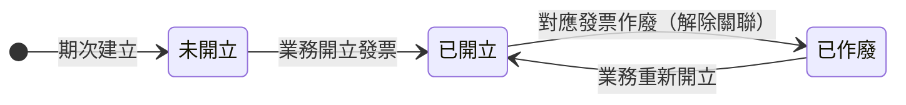
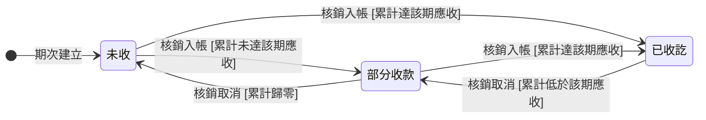

## 概述

請款期次（BillingInstallmentStatus，介面別名「收款項目」）管「這一期該收多少、何時開票、何時收款」的進度。印刷廠收錢與開發票的時點常常對不上：客戶可能先付訂金過幾週才要發票（先收後開）、也可能要先拿到發票去公司請款月底才匯款（先開後收），大宗訂單還會頭尾款分期。若把收款進度和開票進度綁在同一條狀態鏈，碰到先收後開就卡住，業務只能用備註硬記。

因此每個期次同時掛**兩條互不干擾的進度線**：開票進度由業務手動操作驅動、收款進度由實際入帳的核銷明細自動累計推導。期次金額怎麼規劃、開票時機、期次與發票一對一的對應規則，正本在 [[付款發票邏輯]]，本卡只定義兩條進度線的狀態與轉換、不複述規則。

## 狀態列舉（正本）

> 本段是請款期次兩條進度線狀態的唯一正本。狀態的新增與修改是商業決策，直接在此卡維護。

### 開票進度（業務手動驅動）

| 狀態 | 說明 | 對應營運需求 |
|------|------|------------|
| 未開立 | 初始；尚未為這期開發票 | 客戶還沒要票、或先收訂金階段 |
| 已開立 | 已開出發票並記下對應發票 | 客戶拿到發票可向其公司請款 |
| 已作廢 | 原發票作廢、關聯解除，可重新開立 | 統編或抬頭填錯時作廢重開，不必刪期次 |

### 收款進度（依入帳自動推導）

依「未取消且已完成」的核銷明細（一筆收款分攤到哪一期的紀錄）累計推導，業務不必手動標記：

| 狀態 | 推導門檻 | 對應營運需求 |
|------|---------|------------|
| 未收 | 累計已收等於 0 | 這期還沒收到任何錢 |
| 部分收款 | 累計已收介於 0 與該期應收之間 | 客戶分批付、或只付了部分 |
| 已收訖 | 累計已收達到該期應收 | 這期收齊 |

## 狀態機圖（UML）

依 UML 狀態機圖記法繪製：實心圓為初始點、轉換標籤採「觸發事件 [守衛條件]」格式。兩條進度線互不耦合，各畫一張；皆無終止點——期次跟著訂單收尾，自身不設終態。收款進度的轉換由累計金額跨越門檻觸發（系統自動），含收款取消時的回退。

開票進度：

收款進度：

## 轉換條件與觸發事件

| 進度線 | 轉換 | 觸發事件 | 條件 |
|------|------|---------|------|
| 開票 | 未開立 → 已開立 | 業務為這期開立發票 | 記下對應發票；期次與發票業務上一對一（一期一票） |
| 開票 | 已開立 → 已作廢 | 對應發票作廢 | 解除發票關聯；收款進度不動（收款歷史保留） |
| 開票 | 已作廢 → 已開立 | 業務重新開立發票 | 新發票重新關聯 |
| 收款 | 未收 ↔ 部分收款 ↔ 已收訖 | 核銷明細累計跨越門檻（系統自動） | 只計「未取消且已完成」的核銷明細；取消核銷會回退 |

## 關鍵轉換的營運動機

- 兩條進度線互不耦合 → 動機：對應印刷廠兩種真實收款節奏，綁在一起會讓其中一種卡住 → 例子：客戶先匯訂金 30,000，收款進度自動推導為「已收訖」、開票進度仍是「未開立」；月底客戶要發票，業務開立後開票進度才轉「已開立」，兩條線各走各的。
- 收款進度自動推導、不手動標記 → 動機：業務經手大量收款，手動勾「已收訖」必漏記；自動累加確保收款進度永遠等於實際入帳，餵 [[會計]] 月結對帳的數字才可信。
- 發票作廢只回退開票進度 → 動機：統編／抬頭填錯在實務常見，作廢重開不該連帶抹掉已收到的錢的紀錄，保留收款歷史是稽核要求 → 例子：某期已開發票且已收訖，發現統編誤填，業務作廢發票後開票進度回「已作廢」、收款進度維持「已收訖」，重開正確發票後回「已開立」。
- 拆期時原期次標記取消、新期次各自從零起算 → 動機：客戶臨時把一期拆成頭尾款是常態；一期一票對齊發票實務，拆票不拆期的話發票與期次對不齊，月結對帳會抓到差額 → 例子：應收 78,000 的期次拆成 2,500＋75,500 兩期，原期次標記取消（不再計入任何進度推導），兩筆新期次各自從「未開立／未收」起算、各對一張發票。
- 期次調整不觸發訂單回主管重審 → 動機：改到期日、改預計開票日、拆期在印刷廠天天發生，每改一次就回審會拖垮交期、淹沒主管；改記操作軌跡＋累計變更次數，[[業務主管]] 事後看指標追異常，把主管從逐筆簽核解放 → 例子：訂單已進製作中，客戶要求付款延後兩週，業務直接改到期日，系統記下調整（操作人、前後值）並累計變更次數，訂單狀態不動。

## 與其他狀態機的關係

- 開票進度的推進對象是 [[發票狀態|發票]]：期次與發票一對一，發票作廢帶動開票進度回「已作廢」。
- 折讓不動期次狀態：[[折讓單狀態|折讓單]] 引用發票扣減發票淨額，對帳層面反映、不回寫期次。
- 補收／退款的金額異動走 [[訂單異動狀態]]，與期次分屬不同實體；補收的異動確認可執行後不自動建期次（避免重複認列），由業務視需要另行規劃。
- 退款的實付走退款收款紀錄，不在本期次的收款推導範圍內（期次只累計正向應收的收款）。
- 期次規劃與調整不阻擋也不回退 [[訂單狀態|訂單]]。

## 範圍外

- **期次金額怎麼規劃、開票時機、一期一票的對應規則**：屬 [[付款發票邏輯]]（規則正本），實作時勿自行發明
- 期次的「取消」是標記不是狀態（拆期或作廢期次時標記，被標記的期次退出兩條進度線的推導），取消規則見 [[付款發票邏輯]]
- 三方對帳（應收＝發票淨額＝收款淨額）的完整邏輯 → 見 [[對帳一致性]]
- 收款紀錄自身的登錄與核銷操作 → 屬收款流程，見 [[付款發票邏輯]]

## 相關卡

- 規則：[[付款發票邏輯]]（期次規劃與開票時機正本）、[[對帳一致性]]（三方對帳底線）、[[訂單異動規則]]（補收確認可執行後不自動建期次）
- 實體：[[帳務]]（請款期次欄位正本）
- 狀態機：[[發票狀態]]（一期一票）、[[折讓單狀態]]（影響發票淨額不回寫期次）、[[訂單異動狀態]]（金額異動）、[[訂單狀態]]（不互相阻擋）
- 角色：[[業務]]／[[諮詢|諮詢人員]]（規劃期次、拆期、開票、核銷收款）、[[業務主管]]（事後看變更次數指標）、[[會計]]（月結對帳）
