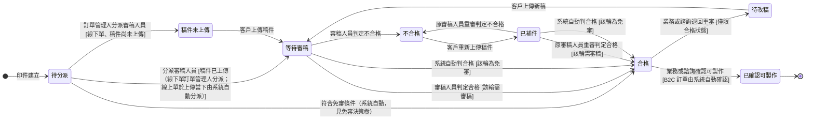

讀完這張卡，你會知道：

- 認識 [[印件]] 的審稿狀態機：記這份稿件審了沒、能不能印
- 看懂各處境代表球在審稿人員、業務還是客戶手上
- 掌握每個轉換由誰觸發、要滿足什麼條件才推得動
- 理解為什麼「合格」與「已確認可製作」分兩步，以及審稿與印製為什麼各自成一張狀態機

## 狀態列舉（正本）

> 本段是印件審稿狀態的唯一正本。狀態的新增與修改是商業決策，直接在此卡維護。

| 狀態 | 說明 | 對應營運需求 |
|------|------|------------|
| 待分派 | 初始；印件尚無負責審稿人員（判定條件即「無負責審稿人員」，與稿件是否已上傳無關） | 線下單回簽後等訂單管理人分派；稿件先到而人未派的印件停在此、不流失 |
| 稿件未上傳 | 已有負責審稿人員，尚未上傳稿件 | 人已派好、等客戶給稿（線下單先分派後補檔） |
| 等待審稿 | 稿件已上傳且已有負責審稿人員，等待審核 | 標示球在審稿人員手上 |
| 不合格 | 審稿人員判定稿件不符合要求，等客戶補件 | 標示球在客戶端，業務知道要去催件 |
| 已補件 | 客戶已重新上傳稿件，等這一輪的審稿人員重審 | 補件單獨標出；這輪誰審依每輪起始檢查（換人／難易度／免審）決定，規則見 [[審稿分配規則]] |
| 合格 | 審稿人員品質判定通過，等業務或諮詢確認可製作 | 品質判定與製作決策分兩步，合格不等於可投產 |
| 待改稿 | 業務或諮詢判斷客戶需改稿，退回等客戶重新上傳 | 品質已過但內容要變（換標誌、改文字），同一印件重走審稿 |
| 已確認可製作 | 終態；業務或諮詢確認可投產（B2C 自動／B2B 手動），[[印件印製狀態]] 得以開始推進 | 客戶不會再改稿的承諾點，之後才敢投料 |

## 狀態機圖（UML）

- 記法：實心圓為初始點、雙圈為終止點、轉換標籤採「觸發事件 [轉換條件]」格式。
- 審稿來回為常態，做成可逆；「已確認可製作」後不可退回。
- 銜接：到達「已確認可製作」後，[[印件印製狀態]] 才離開「等待中」往下推進。

## 轉換條件與觸發事件

| 轉換 | 觸發事件 | 條件 |
|------|---------|------|
| 待分派 → 稿件未上傳 | 訂單管理人分派審稿人員 | 線下單；稿件尚未上傳 |
| 待分派 → 等待審稿 | 分派審稿人員 | 稿件已上傳：線下單由訂單管理人分派；線上單於首次上傳當下由系統自動分派（分派規則見 [[審稿分配規則]]） |
| 待分派 → 合格 | 符合免審條件（系統自動） | 判定條件見 [[免審決策樹]]；免審印件不經分派 |
| 稿件未上傳 → 等待審稿 | 客戶上傳稿件（上傳當下建輪，正本見 [[審稿輪次]]） | — |
| 等待審稿／已補件 → 合格 | 這輪需審稿時由審稿人員判定合格；這輪為免審時由系統自動判合格 | 觸發者依該輪的免審值分流，見 [[免審決策樹]]；這輪由誰審見 [[審稿分配規則]] 的每輪起始檢查 |
| 等待審稿／已補件 → 不合格 | 審稿人員判定不合格 | — |
| 不合格 → 已補件 | 客戶重新上傳稿件 | 退補件可多次來回 |
| 合格 → 已確認可製作 | 業務或諮詢確認可製作；B2C 訂單由系統自動確認 | 終態；[[印件印製狀態]] 得以開始推進 |
| 合格 → 待改稿 | 業務或諮詢退回重審（原因選填、寫進訂單活動紀錄）| 僅限「合格」狀態；已確認可製作後不可退回；此時不建輪次（見 [[審稿輪次]] § 建立來源）|
| 待改稿 → 等待審稿 | 客戶上傳新稿 | 同一印件重走審稿；本輪的建立時點見 [[審稿輪次]] § 建立來源 |

## 關鍵轉換的營運動機

- 審稿與印製各自成一張狀態機 → 動機：兩件事的負責人、節奏、可逆性都不同——審稿是審稿人員在看稿、可能來回退補件，印製是現場在做、進度跟著底層生產任務自動往上反映；硬塞成一條狀態鏈，退一次補件就會把生產進度一起攪亂，所以兩張狀態機各記各的進度（連動見下方「與其他狀態機的關係」）。
- 「合格」與「已確認可製作」分兩步 → 動機：合格代表審稿人員品質判定通過，已確認可製作代表客戶不會再改稿、可投產，兩步分離品質判定與製作決策；B2C 訂單合格後系統自動確認（客戶下單即承諾），B2B 線下單需業務或諮詢手動確認 → 例子：ORD-2026-0512 的型錄稿審稿合格，業務跟客戶確認內容無誤後點「確認可製作」，系統才放行建工單。
- 「合格 → 待改稿」退回重審 → 動機：線下單客戶合格後仍可能改稿（換標誌、改文字），退回重審讓**同一印件**重新走審稿；與「棄用＋重建」分工——退回重審用於同一印件改稿（內容修改），棄用＋重建用於印件規格全換（名片改型錄、尺寸材質全變）→ 例子：客戶合格後要求把封面標誌換新版，業務退回待改稿，客戶上傳新稿後回到等待審稿。
- 退補件迴圈（等待審稿 ↔ 不合格 ↔ 已補件）可多次來回 → 動機：稿件有問題本就要退回重給、補正後再審，這段來回是印前常態，做成可逆才不必每退一次就建新印件；補件這輪誰審依每輪起始檢查決定（規則正本見 [[審稿分配規則]]）——未觸發換人、難易度更正、免審者回原審稿人員重審，避免換人重看浪費前輪審稿脈絡。
- 「待分派」為初始態 → 動機：線下單由 [[訂單管理人]] 於訂單回簽後手動分派（分派主體與時點正本見 [[審稿分配規則]]），分派與稿件上傳解耦——實務期望「傳檔 → 討論 → 分派 → 審稿」，但分派後才補檔也常見，兩種順序都要接得住；稿件先到而人未派的印件停在待分派並通知訂單管理人，不會沒人接。線上單印件於首次上傳當下由系統自動分派，待分派僅為上傳前的短暫停留 → 例子：ORD-2026-0630 的稿件先上傳而審稿人員未派，該印件停在「待分派」，系統通知訂單管理人。
- 免審直通（待分派 → 合格） → 動機：符合免審條件的印件（見 [[免審決策樹]]）不必走分派與審稿直接放行；B2C 再自動跳「已確認可製作」、B2B 等業務或諮詢確認。免審直通不限首輪——每一輪的 →合格 觸發來源（系統／審稿人員）依該輪免審值而定，既有弧不變；免審欄位的調整與生效時點正本見 [[免審決策樹]]。

## 與其他狀態機的關係

- 本卡到達「已確認可製作」後，[[印件印製狀態]] 才離開「等待中」往下推進；之前印製狀態一律停在「等待中」。
- 印件轉「已棄用」（見 [[印件印製狀態]]）時，審稿狀態保留原值作為棄用前稽核軌跡，棄用當下審到哪可回看；已棄用印件退出哪些清單見 [[印件印製狀態]]。
- 審稿狀態推進不影響已建工單鎖定的檔案（避免改稿影響已投產批次），鎖檔規則見 [[稿件管理規則]]。
- 訂單審稿段的三個狀態由本卡歸納而來，[[訂單狀態]] 只接收歸納結果。

## 範圍外

- 審稿輪次怎麼記、稿件怎麼鎖 → 見 [[稿件管理規則]]；哪些動作會建新的一輪、什麼時候建 → 見 [[審稿輪次]] § 建立來源
- 哪些印件可免審、判定條件 → 見 [[免審決策樹]]
- 分派候選條件與每輪起始檢查 → 見 [[審稿分配規則]]
- 印件的生產與出貨進度 → 見 [[印件印製狀態]]
- 打樣後稿件問題的棄用重建完整流程（含複製新印件） → 見 [[打樣流程]]
- 訂單審稿段的歸納細則：系統會依印件審稿狀態歸納訂單落點——本卡只承諾此行為，歸納結果見 [[訂單狀態]]，實作時勿自行發明

## 相關卡

- 規則：[[稿件管理規則]]（審稿輪次與鎖檔）、[[免審決策樹]]（免審直通條件與生效時點正本）、[[審稿分配規則]]（待分派的分派主體與時點正本）、[[打樣流程]]（打樣後棄用重建）
- 流程：[[印件審稿]]（審稿接力時序）、[[覆寫審稿分派]]（改派不改審稿狀態）
- 實體：[[印件]]（本狀態機依附的主實體）、[[審稿輪次]]（輪次建立時點正本）
- 狀態機：[[印件印製狀態]]（審稿放行後才推進、棄用時本卡保留原值）、[[訂單狀態]]（審稿段由本卡歸納）
- 角色：[[訂單管理人]]（線下單分派，驅動待分派離場）、[[審稿人員]]（驅動審稿判定）、[[業務]]／[[諮詢]]（確認可製作、退回重審，兩者同權）
