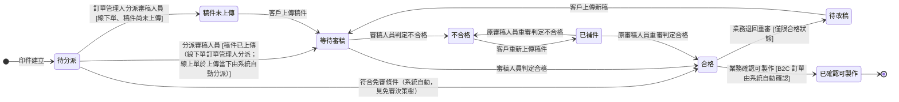
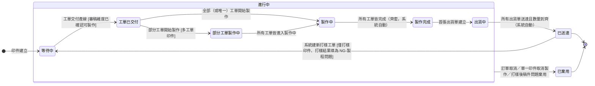

## 概述

印件（PrintItemStatus）同時擁有**兩個維度**的狀態。一份印件在工廠裡其實同時在跑兩件事：一是「這份稿件審了沒、能不能印」（審稿維度），二是「實際做到哪一步、出貨沒」（印製維度）。兩件事的負責人、節奏、可逆性都不同——審稿是審稿人員在看稿、可能來回退補件；印製是現場在做、進度跟著底層生產任務自動往上反映。若硬塞成一條狀態鏈，退一次補件就會把生產進度攪亂，所以拆成兩個獨立維度各記各的進度。

兩維度不是完全平行：審稿維度「已確認可製作」是印製維度開跑的前提。稿件還沒審過、正在補件、或合格後業務尚未確認，東西就不該先做下去，否則審完發現要改、已投產的就白做。怎麼算做齊、稿件鎖檔、免審條件的規則正本分別在 [[齊套邏輯]]／[[稿件管理規則]]／[[免審決策樹]]，本卡只定義狀態與轉換、不複述規則。

## 狀態列舉（正本）

> 本段是印件雙維度狀態的唯一正本。狀態的新增與修改是商業決策，直接在此卡維護。

### 審稿維度

| 狀態 | 說明 | 對應營運需求 |
|------|------|------------|
| 待分派 | 初始；印件尚無負責審稿人員（判定條件即「無負責審稿人員」，與稿件是否已上傳無關） | 線下單回簽後等訂單管理人分派；稿件先到而人未派的印件停在此、不流失 |
| 稿件未上傳 | 已有負責審稿人員，尚未上傳稿件 | 人已派好、等客戶給稿（線下單先分派後補檔） |
| 等待審稿 | 稿件已上傳且已有負責審稿人員，等待審核 | 標示球在審稿人員手上 |
| 不合格 | 審稿人員判定稿件不符合要求，等客戶補件 | 標示球在客戶端，業務知道要去催件 |
| 已補件 | 客戶已重新上傳稿件，等原審稿人員重審 | 補件單獨標出，重審回原審稿人員、不重新派件 |
| 合格 | 審稿人員品質判定通過，等業務確認可製作 | 品質判定與製作決策分兩步，合格不等於可投產 |
| 待改稿 | 業務判斷客戶需改稿，退回等客戶重新上傳 | 品質已過但內容要變（換標誌、改文字），同一印件重走審稿 |
| 已確認可製作 | 終態；業務確認可投產（B2C 自動／B2B 手動），觸發工單建立 | 客戶不會再改稿的承諾點，之後才敢投料 |

### 印製維度

| 狀態 | 說明 | 對應營運需求 |
|------|------|------------|
| 等待中 | 初始；審稿維度尚未到達「已確認可製作」，生產不啟動 | 稿沒定不投產，避免做完才退稿的整批報廢 |
| 工單已交付 | 工單已交付產線（工單的產生與分派見 [[工單狀態]]） | 標示單子已進工廠排程 |
| 部分工單製作中 | 部分工單已開始製作（多工單印件） | 多工單的印件看得出做了幾路 |
| 製作中 | 所有工單皆在製作中 | 全面開工的明確標示 |
| 製作完成 | 所有工單皆完成（齊套達標，見 [[齊套邏輯]]） | 做齊才算完成，不能缺一款就往出貨推 |
| 出貨中 | 至少一張出貨單已建立 | 分批出貨時看得出已開始出 |
| 已送達 | 終態（大貨印件）；該印件所有出貨單皆已送達、且累計送達數量等於印件數量（系統自動）。打樣印件的「已送達」非終態——客戶評審填 NG-製程問題時可回頭重跑（見打樣段） | 印件的正常收尾，分批出貨時最後一批送達才算 |
| 已棄用 | 終態；印件不再製作——訂單取消、單一印件取消製作、打樣後稿件問題棄用重建等 | 收掉不做的印件，並連動結算現場已投入的成本 |

> **打樣印件沿用同一印製維度**：打樣印件與大貨印件共用上表同一條印製維度狀態機（不另建打樣專屬狀態），差別僅在打樣印件多一個「打樣結果」欄位記錄 OK／NG（欄位見 [[印件]]），與兩個打樣專屬語意：（一）**樣品寄送建一般出貨單**，走既有分批出貨流程（樣品同樣經最終品檢入庫產生可出貨額度、揀貨裝箱回報照常），印製維度自然走「出貨中 → 已送達」，不另設打樣寄送流程；（二）**「已送達」對打樣印件非終態**——客戶評審後打樣結果填為「NG-製程問題」時，系統自動開一張不符合報告單（全欄位預填：原因＝製程、處置＝補做、數量＝全數、即開即結，業務零新增操作），處置動作＝於同一印件建新打樣工單並將印製維度自「已送達」拉回「等待中」重跑一輪，打樣結果同步重置回「待確認」；舊週期樣品報廢、入庫與送達累計按打樣週期歸零是「全數補做」的自然帳務結果（累計公式正本見 [[齊套邏輯]]）。大貨印件的「已送達」維持終態、無回頭。

### 兩維度的關聯

- 印製維度在審稿維度到達「已確認可製作」後才開始推進，之前一律停在「等待中」。
- 審稿維度推進不影響已建工單鎖定的檔案（避免改稿影響已投產批次），鎖檔規則見 [[稿件管理規則]]。
- 印件轉「已棄用」時，**審稿維度保留原值**作為棄用前稽核軌跡（棄用當下審到哪可回看）；已棄用印件退出待審清單、訂單完成度計算、新工單建立候選與出貨清單，詳情頁仍可查（稽核用途）。

## 狀態機圖（UML）

依 UML 狀態機圖記法繪製：實心圓為初始點、雙圈為終止點、轉換標籤採「觸發事件 [守衛條件]」格式。兩維度各畫一張。

審稿維度（審稿來回為常態，做成可逆；「已確認可製作」後不可退回）：

印製維度（由底層生產任務自動向上反映；「已棄用」自複合狀態邊界出發，適用其內全部子狀態）：

## 轉換條件與觸發事件

| 維度 | 轉換 | 觸發事件 | 條件 |
|------|------|---------|------|
| 審稿 | 待分派 → 稿件未上傳 | 訂單管理人分派審稿人員 | 線下單；稿件尚未上傳 |
| 審稿 | 待分派 → 等待審稿 | 分派審稿人員 | 稿件已上傳：線下單由訂單管理人分派；線上單於首次上傳當下由系統自動分派（分派規則見 [[審稿分配規則]]） |
| 審稿 | 待分派 → 合格 | 符合免審條件（系統自動） | 判定條件見 [[免審決策樹]]；免審印件不經分派 |
| 審稿 | 稿件未上傳 → 等待審稿 | 客戶上傳稿件（建立首輪審稿） | — |
| 審稿 | 等待審稿／已補件 → 合格 | 審稿人員判定合格 | 已補件由原審稿人員重審 |
| 審稿 | 等待審稿／已補件 → 不合格 | 審稿人員判定不合格 | — |
| 審稿 | 不合格 → 已補件 | 客戶重新上傳稿件 | 退補件可多次來回 |
| 審稿 | 合格 → 已確認可製作 | 業務確認可製作；B2C 訂單由系統自動確認 | 終態；觸發工單建立 |
| 審稿 | 合格 → 待改稿 | 業務退回重審 | 僅限「合格」狀態；已確認可製作後不可退回 |
| 審稿 | 待改稿 → 等待審稿 | 客戶上傳新稿 | 同一印件重走審稿 |
| 印製 | 等待中 → 工單已交付 | 工單交付產線 | 審稿維度須為「已確認可製作」 |
| 印製 | 工單已交付 → 部分工單製作中 | 部分工單開始製作 | 多工單印件 |
| 印製 | 工單已交付／部分工單製作中 → 製作中 | 所有工單皆進入製作中 | — |
| 印製 | 製作中 → 製作完成 | 所有工單皆完成（系統自動） | 齊套達標判定見 [[齊套邏輯]] |
| 印製 | 製作完成 → 出貨中 | 首張出貨單建立 | — |
| 印製 | 出貨中 → 已送達 | 所有出貨單皆已送達且累計送達數量＝印件數量（系統自動） | 異常出貨單不計入累計，見 [[出貨單狀態]] |
| 印製 | 已送達 → 等待中 | 打樣結果填為「NG-製程問題」，系統自動開不符合報告單（原因＝製程、處置＝補做）並建新打樣工單（系統自動） | 僅打樣印件（大貨無此轉換）；打樣結果同步重置回「待確認」；舊週期樣品報廢、入庫與送達累計按打樣週期歸零（見 [[齊套邏輯]]） |
| 印製 | 任一非終態 → 已棄用 | 訂單取消、單一印件取消製作、打樣後稿件問題棄用重建 | 審稿維度保留原值；連動現場已報工的生產任務報廢以結算成本 |

## 關鍵轉換的營運動機

- 審稿「已確認可製作」後印製維度才推進 → 動機：稿件沒確認可印就投產，等於拿料和工時去賭客戶不改稿；先卡住印製、確認後再放行，避免做完才退稿的整批報廢。
- 「合格」與「已確認可製作」分兩步 → 動機：合格代表審稿人員品質判定通過，已確認可製作代表客戶不會再改稿、可投產，兩步分離品質判定與製作決策；B2C 訂單合格後系統自動確認（客戶下單即承諾），B2B 線下單需業務手動確認 → 例子：ORD-2026-0512 的型錄稿審稿合格，業務跟客戶確認內容無誤後點「確認可製作」，系統才放行建工單。
- 「合格 → 待改稿」退回重審 → 動機：線下單客戶合格後仍可能改稿（換標誌、改文字），退回重審讓**同一印件**重新走審稿；與「棄用＋重建」分工——退回重審用於同一印件改稿（內容修改），棄用＋重建用於印件規格全換（名片改型錄、尺寸材質全變）→ 例子：客戶合格後要求把封面標誌換新版，業務退回待改稿，客戶上傳新稿後回到等待審稿。
- 退補件迴圈（等待審稿 ↔ 不合格 ↔ 已補件）可多次來回 → 動機：稿件有問題本就要退回重給、補正後再審，這段來回是印前常態，做成可逆才不必每退一次就建新印件；補件回**原審稿人員**重審，不重新派件，避免換人重看浪費前輪審稿脈絡。
- 「待分派」為審稿維度初始態 → 動機：線下單改由 [[訂單管理人]] 於訂單回簽後手動分派（見 [[審稿分配規則]]），分派與稿件上傳解耦——實務期望「傳檔 → 討論 → 分派 → 審稿」，但分派後才補檔也常見，兩種順序都要接得住；以「無負責審稿人員」為判定條件，稿件先到而人未派的印件停在待分派並通知訂單管理人，不會沒人接。線上單印件於首次上傳當下由系統自動分派，待分派僅為上傳前的短暫停留 → 例子：ORD-2026-0630 回簽後業務先上傳一件稿件，該印件停在待分派並通知訂單管理人，分派後直接進等待審稿。
- 免審直通（待分派 → 合格） → 動機：符合免審條件的印件（見 [[免審決策樹]]）不必走分派與審稿直接放行；B2C 再自動跳「已確認可製作」、B2B 等業務確認。**免審為印件可編輯欄位、次一輪生效**：免審直通本質是「該輪免審＝是時，該輪的 →合格 由系統自動觸發」，不限首輪——印件若於審稿中途才改為免審，其下一輪（補件）的 →合格 即由系統自動觸發；既有 →合格 弧不變，僅觸發來源（系統／審稿人員）依該輪免審值而定。
- 印製維度由底層自動向上反映 → 動機：印件做到哪該跟著現場實際報工自動反映，不必有人逐張印件回填；底層做到哪、印件就顯示到哪 → 例子：三張工單的印件，第一張開做時顯示「部分工單製作中」，三張全開做轉「製作中」，全部做齊自動轉「製作完成」。
- 打樣印件「已送達 → 等待中」回頭 → 動機：NG-製程問題代表樣品不良、工廠要重做一輪，印件狀態若停在已送達會讓「工廠在重做」不可見；回到等待中讓印製維度忠實反映重跑。回頭後原打樣工單保留「已完成」終態作前輪稽核軌跡、新工單自草稿起，印件聚合採取最落後（草稿工單未交付＝印件停等待中，新工單交付後照既有轉換續推）；舊週期樣品報廢讓入庫與送達累計按週期歸零，否則第二輪永遠湊不出「累計＝印件數量」→ 例子：精裝年報打樣 1 份送達客戶後燙金位置偏移，業務填 NG-製程問題，系統建新打樣工單、印件回等待中，第一輪樣品報廢；新樣品做出後再走出貨、送達，客戶確認 OK。
- 任一非終態 → 已棄用 → 動機：訂單取消或單一印件取消製作時，這件印件不再做了，要明確收掉並**連動現場已報工的生產任務轉報廢**，把已投入的工時與料算得出來（成本結算）；審稿維度保留原值，棄用當下審到哪可回看稽核 → 例子：客戶取消 ORD-2026-0512 其中一款貼紙，該印件轉已棄用，已印一半的印刷任務報廢（成本可見）、未開工的加工任務作廢（無成本）。

## 與其他狀態機的關係

- 印製維度是向上反映鏈的中段：底層 [[生產任務狀態|生產任務]] → [[任務狀態|任務]] → [[工單狀態|工單]] → 印件印製維度 → [[訂單狀態|訂單]]。底層做到哪、印件就反映到哪，本卡是這條鏈的彙整節點。
- 印件全部做齊（齊套達標）才把「製作完成」往上帶到訂單，怎麼算齊見 [[齊套邏輯]]。
- 印件轉「已棄用」時往下連動：已報工的生產任務轉報廢（結算已投入成本）、未開工的作廢，見 [[生產任務狀態]]；其下工單與任務的連動行為待釐清（[[PI-003-印件棄用時工單與任務連動行為|PI-003]]）。
- 審稿維度推進不會動到已建工單鎖定的檔案，鎖檔與審稿輪次規則見 [[稿件管理規則]]。

## 範圍外

- **齊套達標的計算**（多工單怎麼彙整）：系統會自動判定——本卡只承諾此行為，公式屬 [[齊套邏輯]]（規則正本），實作時勿自行發明
- 審稿輪次怎麼記、稿件怎麼鎖 → 見 [[稿件管理規則]]
- 哪些印件可免審、判定條件 → 見 [[免審決策樹]]
- 打樣後稿件問題的棄用重建完整流程（含複製新印件） → 見 [[打樣流程]]
- 出貨單自身的進度 → 屬出貨領域，本卡只看「出貨中／已送達」彙整結果

## 相關卡

- 規則：[[齊套邏輯]]（製作完成推進判定正本）、[[稿件管理規則]]（審稿輪次與鎖檔）、[[免審決策樹]]（免審直通條件）、[[打樣流程]]（打樣後棄用重建）
- 實體：[[印件]]（本狀態機依附的主實體）
- 狀態機：[[工單狀態]]／[[任務狀態]]／[[生產任務狀態]]（由下往上驅動印製維度；棄用連動報廢）、[[訂單狀態]]（印件齊套帶動訂單、訂單取消觸發棄用）
- 規則：[[審稿分配規則]]（待分派的分派主體與時點正本）
- 角色：[[訂單管理人]]（線下單分派，驅動待分派離場）、[[審稿人員]]（驅動審稿維度）、[[業務]]（確認可製作、退回重審）、[[印務]]／[[師傅]]（驅動印製維度）
