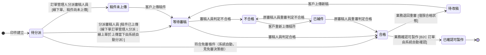
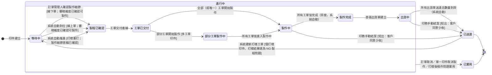

讀完這張卡，你會知道：

- 認識 [[印件]]（PrintItemStatus）的雙維度狀態機：審稿維度記「這份稿件審了沒、能不能印」，印製維度記「實際做到哪一步、出貨沒」
- 看懂兩維度各有哪些處境、每一格代表球在審稿人員、業務還是現場手上
- 掌握每個轉換由誰觸發、要滿足什麼條件才推得動
- 理解為什麼審稿與印製要拆成兩條各自推進的進度線，以及印製為什麼要等審稿放行才開跑
- 知道打樣印件為什麼沿用同一條印製維度，送達後仍可能回頭重跑一輪

## 狀態列舉（正本）

> 本段是印件雙維度狀態的唯一正本。狀態的新增與修改是商業決策，直接在此卡維護。

### 審稿維度

| 狀態 | 說明 | 對應營運需求 |
|------|------|------------|
| 待分派 | 初始；印件尚無負責審稿人員（判定條件即「無負責審稿人員」，與稿件是否已上傳無關） | 線下單回簽後等訂單管理人分派；稿件先到而人未派的印件停在此、不流失 |
| 稿件未上傳 | 已有負責審稿人員，尚未上傳稿件 | 人已派好、等客戶給稿（線下單先分派後補檔） |
| 等待審稿 | 稿件已上傳且已有負責審稿人員，等待審核 | 標示球在審稿人員手上 |
| 不合格 | 審稿人員判定稿件不符合要求，等客戶補件 | 標示球在客戶端，業務知道要去催件 |
| 已補件 | 客戶已重新上傳稿件，等這一輪的審稿人員重審 | 補件單獨標出；這輪誰審依每輪起始檢查（換人／難易度／免審）決定，規則見 [[審稿分配規則]] |
| 合格 | 審稿人員品質判定通過，等業務確認可製作 | 品質判定與製作決策分兩步，合格不等於可投產 |
| 待改稿 | 業務判斷客戶需改稿，退回等客戶重新上傳 | 品質已過但內容要變（換標誌、改文字），同一印件重走審稿 |
| 已確認可製作 | 終態；業務確認可投產（B2C 自動／B2B 手動），印製維度得以開始推進 | 客戶不會再改稿的承諾點，之後才敢投料 |

### 印製維度

| 狀態 | 說明 | 對應營運需求 |
|------|------|------------|
| 等待中 | 初始；審稿維度尚未到達「已確認可製作」，生產不啟動 | 稿沒定不投產，避免做完才退稿的整批報廢 |
| 製程已確認 | 印件上寫的製作細節已確認無誤，工單得以產生（線下單經 [[訂單管理人]] 確認；線上單規格標準化、系統自動到位） | 製作細節有錯就開工，錯的會一路做到底；先確認再開單，工單產生時內容已可信 |
| 工單已交付 | 工單已交付產線（工單的產生與分派見 [[工單狀態]]） | 標示單子已進工廠排程 |
| 部分工單製作中 | 部分工單已開始製作（多工單印件） | 多工單的印件看得出做了幾路 |
| 製作中 | 所有工單皆在製作中 | 全面開工的明確標示 |
| 製作完成 | 所有工單皆完成（齊套達標，見 [[齊套邏輯]]） | 做齊才算完成，不能缺一款就往出貨推 |
| 出貨中 | 至少一張出貨單已建立 | 分批出貨時看得出已開始出 |
| 已送達 | 終態（大貨印件）；排除異常與已作廢的出貨單之後，該印件其餘出貨單全部已送達、且累計送達數 ≥ 購買數量（系統自動）。打樣印件的「已送達」非終態——客戶評審填 NG-製程問題時可回頭重跑（見打樣段） | 印件的正常收尾，分批出貨時最後一批送達才算 |
| 已棄用 | 終態；印件不再製作——訂單取消、單一印件取消製作、打樣後稿件問題棄用重建等 | 收掉不做的印件，並連動結算現場已投入的成本 |

> **打樣印件沿用同一印製維度**：打樣印件與大貨印件共用上表同一條印製維度狀態機（不另建打樣專屬狀態），差別僅在打樣印件多一個「打樣結果」欄位記錄 OK／NG（欄位見 [[印件]]），與兩個打樣專屬語意：（一）**樣品寄送建一般出貨單**，走既有分批出貨流程（樣品同樣經最終品檢入庫產生可出貨額度、揀貨裝箱回報照常），印製維度自然走「出貨中 → 已送達」，不另設打樣寄送流程；（二）**「已送達」對打樣印件非終態**——客戶評審後打樣結果填為「NG-製程問題」時（業務零新增操作、該欄位值即留底），系統自動於同一印件建新打樣工單並將印製維度自「已送達」拉回「等待中」重跑一輪，接著隨即自動推進到「製程已確認」（製作細節首輪已確認、重打不改內容，不再走一次製作細節確認），打樣結果同步重置回「待確認」；舊週期樣品報廢、入庫與送達累計按打樣週期歸零重算（界線定義與歸零規則見下方「關鍵轉換的營運動機」段，歸零欄位清單見 [[齊套邏輯]]）。大貨印件的「已送達」維持終態、無回頭。

### 兩維度的關聯

- 印製維度在審稿維度到達「已確認可製作」後才開始推進，之前一律停在「等待中」。
- 審稿維度推進不影響已建工單鎖定的檔案（避免改稿影響已投產批次），鎖檔規則見 [[稿件管理規則]]。
- 印件轉「已棄用」時，**審稿維度保留原值**作為棄用前稽核軌跡（棄用當下審到哪可回看）；已棄用印件退出待審清單、訂單完成度計算、新工單建立候選與出貨清單，詳情頁仍可查（稽核用途）。

## 狀態機圖（UML）

依 UML 狀態機圖記法繪製：實心圓為初始點、雙圈為終止點、轉換標籤採「觸發事件 [轉換條件]」格式。兩維度各畫一張。

審稿維度（審稿來回為常態，做成可逆；「已確認可製作」後不可退回）：

```mermaid
stateDiagram-v2
    direction LR

    [*] --> r_unassigned : 印件建立

    state "待分派" as r_unassigned
    state "稿件未上傳" as r_none
    state "等待審稿" as r_waiting
    state "不合格" as r_failed
    state "已補件" as r_resub
    state "合格" as r_passed
    state "待改稿" as r_revise
    state "已確認可製作" as r_confirmed

    r_unassigned --> r_none : 訂單管理人分派審稿人員 [線下單、稿件尚未上傳]
    r_unassigned --> r_waiting : 分派審稿人員 [稿件已上傳（線下單訂單管理人分派；線上單於上傳當下由系統自動分派）]
    r_unassigned --> r_passed : 符合免審條件（系統自動，見免審決策樹）
    r_none --> r_waiting : 客戶上傳稿件
    r_waiting --> r_passed : 審稿人員判定合格
    r_waiting --> r_failed : 審稿人員判定不合格
    r_failed --> r_resub : 客戶重新上傳稿件
    r_resub --> r_passed : 原審稿人員重審判定合格
    r_resub --> r_failed : 原審稿人員重審判定不合格
    r_passed --> r_confirmed : 業務確認可製作 [B2C 訂單由系統自動確認]
    r_passed --> r_revise : 業務退回重審 [僅限合格狀態]
    r_revise --> r_waiting : 客戶上傳新稿

    r_confirmed --> [*]
```

印製維度（由底層生產任務自動向上反映；「已棄用」自複合狀態邊界出發，適用其內全部子狀態）：

```mermaid
stateDiagram-v2
    direction LR

    [*] --> p_waiting : 印件建立

    state "進行中" as Active {
        direction LR
        state "等待中" as p_waiting
        state "製程已確認" as p_confirmed
        state "工單已交付" as p_delivered
        state "部分工單製作中" as p_partial
        state "製作中" as p_making
        state "製作完成" as p_done
        state "出貨中" as p_shipping

        p_waiting --> p_confirmed : 訂單管理人確認製作細節 [線下單；審稿維度已確認可製作]
        p_waiting --> p_confirmed : 系統自動到位 [線上單；審稿維度已確認可製作]
        p_waiting --> p_confirmed : 系統自動推進 [打樣重打；製作細節首輪已確認]
        p_confirmed --> p_delivered : 工單交付產線
        p_delivered --> p_partial : 部分工單開始製作 [多工單印件]
        p_delivered --> p_making : 全部（或唯一）工單開始製作
        p_partial --> p_making : 所有工單皆進入製作中
        p_making --> p_done : 所有工單皆完成（齊套，系統自動）
        p_done --> p_shipping : 首張出貨單建立
    }

    state "已送達" as p_arrived
    state "已棄用" as p_discarded

    p_shipping --> p_arrived : 所有出貨單送達且數量到齊（系統自動）
    p_shipping --> p_arrived : 印務手動結案 [短出：客戶同意少收]
    p_making --> p_arrived : 印務手動結案 [短出：客戶同意少收]
    p_arrived --> p_waiting : 系統建新打樣工單 [僅打樣印件、打樣結果填為 NG-製程問題]
    Active --> p_discarded : 訂單取消／單一印件取消製作／打樣後稿件問題棄用

    p_arrived --> [*]
    p_discarded --> [*]
```

## 轉換條件與觸發事件

| 維度 | 轉換 | 觸發事件 | 條件 |
|------|------|---------|------|
| 審稿 | 待分派 → 稿件未上傳 | 訂單管理人分派審稿人員 | 線下單；稿件尚未上傳 |
| 審稿 | 待分派 → 等待審稿 | 分派審稿人員 | 稿件已上傳：線下單由訂單管理人分派；線上單於首次上傳當下由系統自動分派（分派規則見 [[審稿分配規則]]） |
| 審稿 | 待分派 → 合格 | 符合免審條件（系統自動） | 判定條件見 [[免審決策樹]]；免審印件不經分派 |
| 審稿 | 稿件未上傳 → 等待審稿 | 客戶上傳稿件（建立首輪審稿） | — |
| 審稿 | 等待審稿／已補件 → 合格 | 這輪需審稿時由審稿人員判定合格；這輪為免審時由系統自動判合格 | 觸發者依該輪的免審值分流，見 [[免審決策樹]]；這輪由誰審見 [[審稿分配規則]] 的每輪起始檢查 |
| 審稿 | 等待審稿／已補件 → 不合格 | 審稿人員判定不合格 | — |
| 審稿 | 不合格 → 已補件 | 客戶重新上傳稿件 | 退補件可多次來回 |
| 審稿 | 合格 → 已確認可製作 | 業務確認可製作；B2C 訂單由系統自動確認 | 終態；觸發工單建立 |
| 審稿 | 合格 → 待改稿 | 業務退回重審（原因選填、寫進訂單活動紀錄）| 僅限「合格」狀態；已確認可製作後不可退回；此時不建輪次 |
| 審稿 | 待改稿 → 等待審稿 | 客戶上傳新稿 | 同一印件重走審稿；新稿上傳時才建下一輪 |
| 印製 | 等待中 → 製程已確認 | 線下單：[[訂單管理人]] 確認印件的製作細節無誤；線上單：系統自動到位（規格標準化、不經人工確認） | 審稿維度須為「已確認可製作」；本轉換完成即產生工單草稿，由 [[印務主管]] 分派 |
| 印製 | 等待中 → 製程已確認 | 系統自動推進（打樣印件因 NG-製程問題重打，系統建新打樣工單後隨即推進） | 僅打樣印件的重打週期；製作細節首輪已確認、重打不改內容，故不再經 [[訂單管理人]] 的製作細節確認 |
| 印製 | 製程已確認 → 工單已交付 | 工單交付產線 | 工單須已完成製程審核（[[印務]] 展開製程、[[印務主管]] 核可，見 [[工單狀態]]）|
| 印製 | 工單已交付 → 部分工單製作中 | 部分工單開始製作 | 多工單印件 |
| 印製 | 工單已交付／部分工單製作中 → 製作中 | 所有工單皆進入製作中 | — |
| 印製 | 製作中 → 製作完成 | 所有工單皆完成（系統自動） | 齊套達標判定見 [[齊套邏輯]] |
| 印製 | 製作完成 → 出貨中 | 首張出貨單建立 | — |
| 印製 | 出貨中 → 已送達 | 排除異常與已作廢的出貨單之後，其餘出貨單全部已送達且累計送達數 ≥ 購買數量（系統自動） | 異常與已作廢的單都是已收掉的終態、額度已回補，故先排除再判定；數量用 ≥ 是為了吸收補做超量出貨與購買數量事後改小兩種情形（見 [[出貨單狀態]]）|
| 印製 | 製作中／製作完成／出貨中 → 已送達 | [[印務]] 手動結案（短出：客戶同意少收、不再補做剩餘數量）| 出貨數量到不了購買數量時的收尾；**購買數量與累計已出貨數量都原樣保留、不下修**（差異看得見）；由上而下批次連動：旗下未完成的工單一次推「已完成」、其下未完成的生產任務一併推完成（已報工數不動）。錢的處理與本轉換無關，見下方動機 |
| 印製 | 已送達 → 等待中 | 打樣結果填為「NG-製程問題」，系統自動建新打樣工單（不另開單據）| 僅打樣印件（大貨無此轉換）；停留「等待中」僅為一瞬、隨即自動推進「製程已確認」（見上一列）；打樣結果同步重置回「待確認」；舊週期樣品報廢、入庫與送達累計按打樣週期歸零（界線與歸零規則見下方營運動機段） |
| 印製 | 任一非終態 → 已棄用 | 訂單取消、單一印件取消製作、打樣後稿件問題棄用重建 | 審稿維度保留原值；連動現場已報工的生產任務報廢以結算成本 |

## 關鍵轉換的營運動機

- 審稿與印製拆成兩條獨立維度 → 動機：兩件事的負責人、節奏、可逆性都不同——審稿是審稿人員在看稿、可能來回退補件，印製是現場在做、進度跟著底層生產任務自動往上反映；硬塞成一條狀態鏈，退一次補件就會把生產進度一起攪亂，所以兩條線各記各的進度。
- 審稿「已確認可製作」後印製維度才推進 → 動機：稿件沒確認可印就投產，等於拿料和工時去賭客戶不改稿；先卡住印製、確認後再放行，避免做完才退稿的整批報廢。
- 「等待中」與「工單已交付」之間插入「製程已確認」→ 動機：印件上寫的製作細節（規格備註、數量、單位、加工要求）若有錯或寫不清，工單一開就會照錯的內容一路做到底、到品檢才發現。線下單全客製、製作細節由業務逐筆寫，先由 [[訂單管理人]] 過一次再開單，工單產生時內容已可信；線上單規格標準化、沒有人工填寫的餘地，故不設這道人工關卡、系統自動到位。**這道確認是內容確認、不是製程專業審核**——製程怎麼做由 [[印務]] 在工單上展開、[[印務主管]] 核可（見 [[工單狀態]]），兩者分屬工單建立前與建立後 → 例子：ORD-2026-0512 的型錄印件審稿確認可製作後，訂單管理人看到規格備註寫「封面燙金」但沒寫燙金範圍，在該印件的製作討論串向業務提出、補齊後才確認，工單才產生（系統內不設退回動作，見 [[印件製作細節確認]]）。
- 「合格」與「已確認可製作」分兩步 → 動機：合格代表審稿人員品質判定通過，已確認可製作代表客戶不會再改稿、可投產，兩步分離品質判定與製作決策；B2C 訂單合格後系統自動確認（客戶下單即承諾），B2B 線下單需業務手動確認 → 例子：ORD-2026-0512 的型錄稿審稿合格，業務跟客戶確認內容無誤後點「確認可製作」，系統才放行建工單。
- 「合格 → 待改稿」退回重審 → 動機：線下單客戶合格後仍可能改稿（換標誌、改文字），退回重審讓**同一印件**重新走審稿；與「棄用＋重建」分工——退回重審用於同一印件改稿（內容修改），棄用＋重建用於印件規格全換（名片改型錄、尺寸材質全變）→ 例子：客戶合格後要求把封面標誌換新版，業務退回待改稿，客戶上傳新稿後回到等待審稿。
- 退補件迴圈（等待審稿 ↔ 不合格 ↔ 已補件）可多次來回 → 動機：稿件有問題本就要退回重給、補正後再審，這段來回是印前常態，做成可逆才不必每退一次就建新印件；補件回**原審稿人員**重審，不重新派件，避免換人重看浪費前輪審稿脈絡。
- 「待分派」為審稿維度初始態 → 動機：線下單改由 [[訂單管理人]] 於訂單回簽後手動分派（見 [[審稿分配規則]]），分派與稿件上傳解耦——實務期望「傳檔 → 討論 → 分派 → 審稿」，但分派後才補檔也常見，兩種順序都要接得住；以「無負責審稿人員」為判定條件，稿件先到而人未派的印件停在待分派並通知訂單管理人，不會沒人接。線上單印件於首次上傳當下由系統自動分派，待分派僅為上傳前的短暫停留 → 例子：ORD-2026-0630 回簽後業務先上傳一件稿件，該印件停在待分派並通知訂單管理人，分派後直接進等待審稿。
- 免審直通（待分派 → 合格） → 動機：符合免審條件的印件（見 [[免審決策樹]]）不必走分派與審稿直接放行；B2C 再自動跳「已確認可製作」、B2B 等業務確認。**免審為印件可編輯欄位、次一輪生效**：免審直通本質是「該輪免審＝是時，該輪的 →合格 由系統自動觸發」，不限首輪——印件若於審稿中途才改為免審，其下一輪（補件）的 →合格 即由系統自動觸發；既有 →合格 弧不變，僅觸發來源（系統／審稿人員）依該輪免審值而定。
- 短出結案由 [[印務]] 在印件層手動執行 → 動機：印刷有短印的天然特性，客戶同意少收時要有人明確說「不再做了」，這個判斷在印務手上（他最清楚還做不做得出來），業務與印務談定後由印務結案。**購買數量不下修**——原本訂多少、實際出多少兩個數字都要留著，事後查得出差異；下修數量會同時銷毀原始訂購量、又把履約與金額綁死。**要不要退款是獨立維度**：可能少出但不退（雙方談定），要退則由 [[業務]] 開一張退款訂單異動——送 [[業務主管]] 核可（只裁能不能退、應收此刻不動），與客戶談定金額後執行「確認生效」，應收於此刻才下降（見 [[訂單異動規則]]）；訂單完成後同樣是這張退款訂單異動，只是改開在 [[售後服務]] 單底下，與本轉換拆開 → 例子：印件購買數量 1000、品檢通過並出貨 950，客戶同意少收，印務手動結案；印件轉「已送達」、旗下未完成工單批次推「已完成」，訂單得以推進；金額另議，談定不退就什麼都不做。
- 兩個方向的連動不同 → 動機：由下往上是**齊套**（取最落後者，見 [[齊套邏輯]]），因為做齊才算完成、不能缺一款就往下推；由上往下是**批次**（一次全推完），因為上層的決定（取消、棄用、短出結案）已經代表這批不再做了，不需要等下層逐筆收斂。
- 印製維度由底層自動向上反映 → 動機：印件做到哪該跟著現場實際報工自動反映，不必有人逐張印件回填；底層做到哪、印件就顯示到哪 → 例子：三張工單的印件，第一張開做時顯示「部分工單製作中」，三張全開做轉「製作中」，全部做齊自動轉「製作完成」。
- 打樣印件「已送達 → 等待中」回頭 → 動機：NG-製程問題代表樣品不良、工廠要重做一輪，印件狀態若停在已送達會讓「工廠在重做」不可見；回到等待中讓印製維度忠實反映重跑。回頭後原打樣工單保留「已完成」終態作前輪稽核軌跡、新工單自草稿起；印製維度回到「等待中」之後**隨即由系統自動推進「製程已確認」**——製作細節在首輪就已經確認過、重打不改內容，再要求 [[訂單管理人]] 確認一次只是空跑一道手續，新工單交付產線後照既有轉換續推 → 例子：精裝年報打樣 1 份送達客戶後燙金位置偏移，業務填 NG-製程問題，系統建新打樣工單、印件回等待中，第一輪樣品報廢；新樣品做出後再走出貨、送達，客戶確認 OK。
- **打樣週期歸零與週期界線**（規則正本）→ 舊週期樣品報廢，入庫與送達累計按打樣週期歸零重算，否則第一輪已送達的樣品還留在累計裡，第二輪一開始就滿足「累計送達數 ≥ 購買數量」，新樣品都還沒重做完就被判成已送達；歸零是「全數補做」的自然帳務結果，留底為印件上的「打樣結果」欄位值與新打樣工單本身（不另開單據，見 [[打樣流程]]）。**週期界線**＝由 NG-製程問題觸發、系統自動建立且帶週期重置標記的**最新一張**打樣工單，其建立時點即界線（含該時點本身，同一時點發生的量算新週期）；界線之前的量歸舊週期、不再計入，之後的重新累計。手動加開的打樣工單不帶這個標記、**不位移界線**（否則現場為了補幾份樣品加開一張單，就把整輪的累計洗掉）；帶標記的工單即使還是草稿也不可刪除（界線一旦消失，兩輪的量會混在一起算不回來）。歸零欄位清單與投入端不歸零的分界見 [[齊套邏輯]]。
- 任一非終態 → 已棄用 → 動機：訂單取消或單一印件取消製作時，這件印件不再做了，要明確收掉並**連動現場已報工的生產任務轉報廢**，把已投入的工時與料算得出來（成本結算）；審稿維度保留原值，棄用當下審到哪可回看稽核 → 例子：客戶取消 ORD-2026-0512 其中一款貼紙，該印件轉已棄用，已印一半的印刷任務報廢（成本可見）、未開工的加工任務作廢（無成本）。

## 與其他狀態機的關係

- 印製維度是向上反映鏈的中段：底層 [[生產任務狀態]] → [[工單狀態]] → 印件印製維度（任務層已移除） → [[訂單狀態]]。底層做到哪、印件就反映到哪，本卡是這條鏈的彙整節點。
- 印件全部做齊（齊套達標）才把「製作完成」往上帶到訂單，怎麼算齊見 [[齊套邏輯]]。
- 印件轉「已棄用」時往下連動：旗下工單一律轉「已取消」（見 [[工單狀態]]）；旗下生產任務依**有無實際投入事實**分流——場內任務看報工、外發任務看 [[派單]] 是否已發稿，有投入者轉報廢（投入是既成事實，報廢才算得出這批棄用花了多少錢，供品質成本分析與估算校正）、無投入者轉作廢（見 [[生產任務狀態]]）。混合情境（部分報廢部分作廢）不做由下而上的收斂判定，工單直接轉已取消——棄用是由上而下的決定，不等下層收斂。外發的活另有一段：系統提示 [[印務]] 處理名下派單、**不自動作廢**（要不要停做與怎麼跟廠商收尾由印務判斷，作廢規則見 [[派單狀態]]）。
- 審稿維度推進不會動到已建工單鎖定的檔案，鎖檔與審稿輪次規則見 [[稿件管理規則]]。

## 範圍外

- **齊套達標的計算**（多工單怎麼彙整）：系統會自動判定——本卡只承諾此行為，公式屬 [[齊套邏輯]]（規則正本），實作時勿自行發明
- 審稿輪次怎麼記、稿件怎麼鎖 → 見 [[稿件管理規則]]
- 哪些印件可免審、判定條件 → 見 [[免審決策樹]]
- 打樣後稿件問題的棄用重建完整流程（含複製新印件） → 見 [[打樣流程]]
- 出貨單自身的進度 → 屬出貨領域，本卡只看「出貨中／已送達」彙整結果

## 相關卡

- 規則：[[齊套邏輯]]（製作完成推進判定正本）、[[稿件管理規則]]（審稿輪次與鎖檔）、[[免審決策樹]]（免審直通條件）、[[打樣流程]]（打樣後棄用重建）
- 實體：[[印件]]（本狀態機依附的主實體）、[[派單]]（外發任務的發稿事實＝棄用連鎖時的投入判準）
- 狀態機：[[工單狀態]]／[[生產任務狀態]]（由下往上驅動印製維度；棄用連動報廢）、[[訂單狀態]]（印件齊套帶動訂單、訂單取消觸發棄用）、[[派單狀態]]（外發的活，棄用時只提示印務處理名下派單）
- 規則：[[審稿分配規則]]（待分派的分派主體與時點正本）
- 角色：[[訂單管理人]]（線下單分派，驅動待分派離場）、[[審稿人員]]（驅動審稿維度）、[[業務]]（確認可製作、退回重審）、[[印務]]／[[師傅]]（驅動印製維度）
