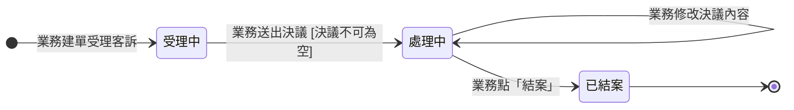

## 概述

售後服務單（AfterSalesTicketStatus）是客戶出貨後投訴（品質問題、缺件等）的處理進度狀態機，由業務建單、全程手動推進。這張單刻意做得很輕——**沒有主管核可關卡**，因為業務跟主管的討論已在通訊軟體線下完成，系統只記結論與決議，不重建線下已經跑完的核可流程；**不阻擋主訂單**，主訂單維持「已完成」不回退。

什麼情境該建售後單、決議怎麼分類（退款／補印／折讓／照常使用／混合）的規則正本在 [[售後服務規則]]，本卡只定義狀態與轉換、不複述規則。

## 狀態列舉（正本）

> 本段是售後服務單狀態的唯一正本。狀態的新增與修改是商業決策，直接在此卡維護。

| 狀態 | 說明 | 對應營運需求 |
|------|------|------------|
| 受理中 | 初始；業務已建單、尚未填入決議 | 給業務一個接收客訴的暫存空間，還沒決定怎麼處理 |
| 處理中 | 業務已填入決議並送出；下游關聯動作（退款異動單、補印印件）可開始建立與執行 | 標示這張單已有處理方向，下游可動工 |
| 已結案 | 終態；業務手動點「結案」，結案後不可重開 | 業務判斷處理完畢、明確收尾 |

## 狀態機圖（UML）

依 UML 狀態機圖記法繪製：實心圓為初始點、雙圈為終止點、轉換標籤採「觸發事件 [守衛條件]」格式。「處理中」上的自轉換表示決議可修改、狀態不變。

## 轉換條件與觸發事件

| 轉換 | 觸發事件 | 條件 |
|------|---------|------|
| （建立）→ 受理中 | 業務建單受理客訴 | 一張訂單最多 1 張未結案售後服務單 |
| 受理中 → 處理中 | 業務填入決議並點「送出決議」 | 決議欄位不可為空 |
| 處理中 → 處理中 | 業務修改決議內容 | 同態自轉換，修改留操作軌跡 |
| 處理中 → 已結案 | 業務點「結案」 | 人工判斷，系統不自動推進；若有未完結異動單會提示但允許強制結案 |
| 已結案 →（不可重開） | — | 客戶再投訴就建新單 |

## 關鍵轉換的營運動機

- 受理中 → 處理中（送出決議）→ 動機：業務填完決議就能開始建退款異動單或補印印件，不必等到結案才動下游；決議送出即表示方向已定、可同步執行 → 例子：客戶投訴 #ORD-2026-0512 色差，業務填決議「退款 5,000」送出，立即在單內建退款異動單 OA-015 送主管審核。
- 處理中 → 已結案（純手動）→ 動機：「處理完沒」只有業務看全貌才知道（客戶說可以了、補印已出貨），系統沒有足夠資訊自動判斷；強制結案讓業務在下游動作未完結時仍可收尾 → 例子：OA-015 退款已確認可執行、客戶確認滿意，業務點「結案」收掉這張售後單。
- 不可重開 → 動機：已結案紀錄反覆開關會讓稽核軌跡混亂（到底結了沒）；客戶再投訴就建新單，已結案的不計入「一訂單限一張未結案售後單」限制。
- 無主管核可關卡 → 動機：業務與主管的討論在線下完成、共識已成，系統再設一關只是重複簽核拖慢處理；單內建立的退款異動單本身仍走主管審核，金額把關沒有放掉。

## 與其他狀態機的關係

- 售後服務單處於任何狀態都不影響主 [[訂單狀態|訂單]]，訂單維持「已完成」不回退。
- 單內建立的退款／補印收費異動單走 [[訂單異動狀態]] 既有狀態機（負向異動含主管審核關卡），售後單結案前異動單可獨立運作。
- 補印走既有 [[印件狀態|印件]] 與 [[工單狀態|工單]] 流程，不另開生產路徑。

## 範圍外

- 決議分類（退款／補印／折讓／照常使用／混合）與建單判斷準則 → 見 [[售後服務規則]]（規則正本），實作時勿自行發明分類
- 退款／補印收費異動單自身的審核進度 → 走 [[訂單異動狀態]]
- 主訂單取消或完成的終態邏輯 → 見 [[訂單狀態]]
- 客訴的線下溝通與主管討論 → 發生在系統外，系統只記結論

## 相關卡

- 規則：[[售後服務規則]]（決議分類、建單條件的規則正本）
- 實體：[[售後服務]]（本狀態機依附的主實體）
- 狀態機：[[訂單異動狀態]]（單內退款／補印收費異動單的進度）、[[訂單狀態]]（主訂單不受售後單阻擋）、[[印件狀態]]（補印走既有流程）
- 角色：[[業務]]（全程手動推進、結案決策）、[[業務主管]]（線下討論，系統不建核可關卡；退款異動單審核仍在）
