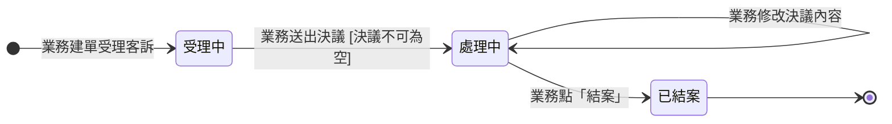

讀完這張卡，你會知道：

- 認識 [[售後服務]]（AfterSalesTicketStatus）狀態機涵蓋的生命週期：從業務受理客戶反映的問題（品質問題、缺件等），到填入決議、手動結案
- 看懂售後服務單有哪幾種處境、每一格代表這張客訴有沒有處理方向、下游的退款與補做動作能不能開始
- 掌握每個轉換由誰觸發、要滿足什麼條件才推得動（全程由業務手動推進，系統不自動結案）
- 理解這張單為什麼刻意做得很輕：不設主管核可關卡，也不阻擋主訂單
- 知道已結案為什麼不可重開，客戶再投訴要走哪一條路

## 狀態列舉（正本）

> 本段是售後服務單狀態的唯一正本。狀態的新增與修改是商業決策，直接在此卡維護。

| 狀態  | 說明                                    | 對應營運需求                  |
| --- | ------------------------------------- | ----------------------- |
| 受理中 | 初始；業務已建單、尚未填入決議                       | 給業務一個接收客訴的暫存空間，還沒決定怎麼處理 |
| 處理中 | 業務已填入決議並送出；下游關聯動作（退款／補收訂單異動、由印務發起的補做）可開始建立與執行 | 標示這張單已有處理方向，下游可動工       |
| 已結案 | 終態；業務手動點「結案」，結案後不可重開                  | 業務判斷處理完畢、明確收尾           |

## 狀態機圖（UML）

依 UML 狀態機圖記法繪製：實心圓為初始點、雙圈為終止點、轉換標籤採「觸發事件 [轉換條件]」格式。「處理中」上的自轉換表示決議可修改、狀態不變。

```mermaid
stateDiagram-v2
    direction LR

    [*] --> s_open : 業務建單受理客訴

    state "受理中" as s_open
    state "處理中" as s_processing
    state "已結案" as s_closed

    s_open --> s_processing : 業務送出決議 [決議不可為空]
    s_processing --> s_processing : 業務修改決議內容
    s_processing --> s_closed : 業務點「結案」

    s_closed --> [*]
```

## 轉換條件與觸發事件

| 轉換 | 觸發事件 | 條件 |
|------|---------|------|
| （建立）→ 受理中 | 業務建單受理客訴 | 所屬訂單已進終態（前提正本見 [[售後服務規則]]）；一張訂單最多 1 張未結案售後服務單 |
| 受理中 → 處理中 | 業務填入決議並點「送出決議」 | 決議欄位不可為空 |
| 處理中 → 處理中 | 業務修改決議內容 | 同態自轉換，修改留操作軌跡 |
| 處理中 → 已結案 | 業務點「結案」 | 人工判斷，系統不自動推進；若有未完結訂單異動或還沒出貨完成的補做量會提示但允許強制結案。**結案不影響底下訂單異動的推進**——已結案的售後單上，那些異動照自己的狀態機走完（見 [[訂單異動規則#狀態推進不依訂單狀態]]）|
| 已結案 →（不可重開） | — | 客戶再投訴就建新單 |

## 關鍵轉換的營運動機

- 受理中 → 處理中（送出決議）→ 動機：業務填完決議就能開始建退款訂單異動、或請印務發起補做，不必等到結案才動下游；決議送出即表示方向已定、可同步執行 → 例子：客戶投訴 ORD-2026-0512 色差，業務填決議「退款 5,000」送出，立即在單內建退款訂單異動 OA-015 送主管審核。
- 處理中 → 已結案（純手動）→ 動機：「處理完沒」只有業務看全貌才知道（客戶說可以了、補做的量已出貨），系統沒有足夠資訊自動判斷；結案時系統列出未完結的訂單異動與還沒出貨完成的補做量提醒業務，但確認後仍可強制結案（漏做退款不會無聲消失——三方對帳的收款差額警示會兜底，見 [[對帳一致性]]）→ 例子：OA-015 退款已確認可執行、客戶確認滿意，業務點「結案」收掉這張售後單。
- 不可重開 → 動機：已結案紀錄反覆開關會讓稽核軌跡混亂（到底結了沒）；客戶再投訴就建新單，已結案的不計入「一訂單限一張未結案售後單」限制。
- 無主管核可關卡 → 動機：業務與主管的討論在線下完成、共識已成，系統再設一關只是重複簽核拖慢處理；單內建立的退款訂單異動本身仍走主管審核，金額把關沒有放掉。

## 與其他狀態機的關係

- 售後服務單處於任何狀態都不影響主 [[訂單狀態]]：訂單維持終態不回退（訂單完成也不中斷正在跑的補做）。
- 單內建立的退款／補收訂單異動走 [[訂單異動狀態]] 既有狀態機（負向異動含主管審核關卡），售後單結案前訂單異動可獨立運作。
- 決議補做走既有補做機制：對象印件維持「已送達」（[[印件狀態]]），補做生產任務加開在原工單上、工單經異動重開（放行條件見 [[工單狀態]]），不另開生產路徑也不另建印件。

## 範圍外

- 決議處理方式的值域（不處理／退款／補做／退款+補做）→ 見 [[售後服務]] 欄位表（正本）；各方式怎麼走、建單前提與決議選項能不能選 → 見 [[售後服務規則]]，實作時勿自行發明分類
- 退款／補收訂單異動自身的審核進度 → 走 [[訂單異動狀態]]
- 補做量怎麼算、加開在哪張工單、驗過後額度怎麼長 → 走 [[工單狀態]] 與 [[生產任務狀態]]，本卡只承諾決議送出後補做可以發起
- 主訂單取消或完成的終態邏輯 → 見 [[訂單狀態]]
- 客訴的線下溝通與主管討論 → 發生在系統外，系統只記結論

## 相關卡

- 規則：[[售後服務規則]]（決議分類、建單前提與補做執行規則的正本）
- 情境：[[售後受理與決議]]（受理到結案的完成過程）、[[QC不通過補生產]]（補做的接力過程）
- 實體：[[售後服務]]（本狀態機依附的主實體）、[[生產任務]]（補做量的載體）
- 狀態機：[[訂單異動狀態]]（單內退款／補收訂單異動的進度）、[[訂單狀態]]（主訂單不受售後單阻擋）、[[印件狀態]]（對象印件維持已送達）、[[工單狀態]]（補做重開原工單的放行條件）、[[生產任務狀態]]（補做生產任務自身的進度）
- 角色：[[業務]]（全程手動推進、結案決策）、[[業務主管]]（線下討論，系統不建核可關卡；退款訂單異動審核仍在）
