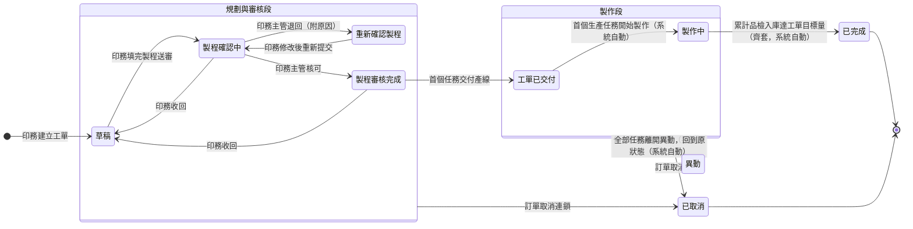

## 概述

工單（WorkOrderStatus）是生產排程的基本單位，由印務建立、填寫製程、送印務主管審核後交付產線。前半段（規劃與審核）靠印務與主管手動推進——因為是人在規劃製程、需要把關；後半段（交付與製作）由底層生產任務的報工自動往上反映——現場做到哪、工單就顯示到哪，印務不必手動回填。

工單另有兩條修正路徑，符合印刷現場製程常臨時調整的實況：印務發現製程填錯可**收回**重做（不必作廢重建）；訂單成立後客戶改需求時，**異動**由任務層往上帶動工單，處理完自動回到原狀態。怎麼算做齊的規則正本在 [[齊套邏輯]]，本卡只定義狀態與轉換、不複述規則。

## 狀態列舉（正本）

> 本段是工單狀態的唯一正本。狀態的新增與修改是商業決策，直接在此卡維護。

### 規劃與審核段

| 狀態 | 說明 | 對應營運需求 |
|------|------|------------|
| 草稿 | 初始；印務建立工單後可自由填寫製程 | 製程規劃定稿前的編輯空間 |
| 製程確認中 | 印務填完製程送印務主管審核 | 製程出門前有主管把關，標示球在主管手上 |
| 重新確認製程 | 主管退回要求修改，印務改完可重新提交 | 給印務修正機會、不作廢重建 |
| 製程審核完成 | 主管已核可製程，等待交付產線 | 核可後才能進產線，把關點明確 |

### 製作段（由底層自動向上反映）

| 狀態 | 說明 | 對應營運需求 |
|------|------|------------|
| 工單已交付 | 首個任務交付產線時觸發 | 標示單子已進工廠排程 |
| 製作中 | 至少一個生產任務已開始製作（報工觸發） | 現場一動工、工單即反映，不靠人工回填 |
| 異動 | 任務層有異動處理中時，工單鏡像顯示為異動；全部處理完自動回到原狀態 | 讓上層一眼看出這張工單正有變更在處理，異動期間完成度照算、生產不中斷 |

### 終態

| 狀態 | 說明 | 對應營運需求 |
|------|------|------------|
| 已完成 | 終態；累計品檢入庫數量達到工單目標生產數量（齊套達標，系統自動） | 做齊才算完成，避免做一半就被當成已齊往出貨推 |
| 已取消 | 終態；訂單取消時由上而下連鎖轉入 | 已取消訂單的工單不再佔用生產資源 |

## 狀態機圖（UML）

依 UML 狀態機圖記法繪製：實心圓為初始點、雙圈為終止點、轉換標籤採「觸發事件 [守衛條件]」格式。「異動」是任務層驅動的**鏡像狀態**——任一任務進入異動相關狀態時工單顯示異動、全部離開後**回到進入前的原狀態**（圖上以雙向虛線語意表達，回去的目標依進入時的狀態而定）。「業務取消訂單」的連鎖自兩個段落複合狀態邊界出發，適用其內全部子狀態。

## 轉換條件與觸發事件

| 轉換 | 觸發事件 | 條件 |
|------|---------|------|
| （建立）→ 草稿 | 印務建立工單 | 一張工單對應一位印務 |
| 草稿 → 製程確認中 | 印務填完製程後提交審核 | — |
| 製程確認中 → 重新確認製程 | 印務主管退回（附原因） | — |
| 重新確認製程 → 製程確認中 | 印務修改後重新提交 | — |
| 製程確認中 → 製程審核完成 | 印務主管核可製程 | — |
| 製程確認中／製程審核完成 → 草稿 | 印務執行「收回」並填寫原因 | 製程確認中：主管尚未開始審核；製程審核完成：所有任務尚未交付。已有任務交付則不可收回，改走異動流程 |
| 製程審核完成 → 工單已交付 | 首個任務交付產線 | 後續任務再交付不重複推進、不回退 |
| 工單已交付 → 製作中 | 首個生產任務開始製作（系統自動向上反映） | 異動結束回到製程審核完成後，若已有生產任務在製作中，新任務交付時直接進製作中 |
| 製作中 → 已完成 | 累計品檢入庫數量達到工單目標生產數量（系統自動） | 齊套達標判定見 [[齊套邏輯]] |
| 製作段任一狀態 → 異動 | 任一任務進入異動相關狀態（系統鏡像） | 異動期間完成度照算、現場照常生產 |
| 異動 → 原狀態 | 全部任務離開異動相關狀態（系統自動） | 回到進入異動前的狀態 |
| 任一非終態 → 已取消 | 訂單取消，由上而下連鎖 | 連鎖細節見 [[訂單狀態]] |

## 關鍵轉換的營運動機

- 前手動、後自動的分界 → 動機：規劃審核段是人在定製程、要主管把關；交付之後進度事實在現場報工，系統自動往上反映才不會「現場做到哪、系統顯示對不上」→ 例子：#ORD-2026-0512 的工單交付後，師傅第一筆報工一進系統，工單自動從「工單已交付」變「製作中」，印務沒碰任何狀態。
- 製作中 → 已完成（齊套自動）→ 動機：要等累計入庫達到目標量才算完成，做一半標完成會讓訂單誤以為這批已齊、提早往出貨推 → 例子：目標 1,000 份的工單入庫累計 800 份時維持「製作中」，補到 1,000 份才自動轉「已完成」。
- 收回路徑 → 動機：送審後發現製程填錯，給一條收回重做的路，不必作廢重開、不留無效單據 → 例子：印務送審後發現漏排一道上光工序，收回工單補上後重新送審。

## 與其他狀態機的關係

- 工單的製作段進度由下層自動向上反映：[[生產任務狀態|生產任務]] 報工 → [[任務狀態|任務]] → 工單。本卡只接收結果，多層傳遞的完整鏈路見 [[印件狀態]]。
- 異動由 [[任務狀態]] 的異動鏈往上鏡像（印務在任務層發起、生管確認），工單不自行進出異動。
- 工單做齊的數量往上彙整到 [[印件狀態]] 的印製維度，再反映到 [[訂單狀態]]。
- 一張工單只對應一位印務；要換印務走「重新確認製程」流程改派，不直接改負責人。

## 範圍外

- **齊套達標的計算細節**（累計入庫怎麼算、多任務怎麼彙整）：系統會自動判定達標——本卡只承諾此行為，計算公式屬 [[齊套邏輯]] 與 [[數量換算規則]]（規則正本），實作時勿自行發明
- 工單底下任務與生產任務自身的流轉 → 走 [[任務狀態]]／[[生產任務狀態]]
- 打樣工單與大貨工單的業務分流 → 見 [[打樣流程]]／[[印件生產流程]]
- 派工排程的安排方式 → 屬排程規劃，不在本卡

## 相關卡

- 規則：[[齊套邏輯]]（已完成自動推進的判定正本）、[[數量換算規則]]、[[印件生產流程]]（單據層級結構）、[[打樣流程]]（打樣工單分流）
- 實體：[[工單]]（本狀態機依附的主實體）
- 狀態機：[[任務狀態]]／[[生產任務狀態]]（由下往上反映進度）、[[印件狀態]]（數量往上彙整）、[[訂單狀態]]（取消連鎖來源）
- 角色：[[印務]]（建立、填製程、收回、交付）、[[印務主管]]（製程審核）、[[生管]]（異動確認）
