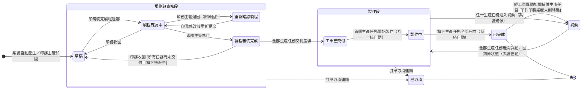

讀完這張卡，你會知道：

- 認識 [[工單]]（WorkOrderStatus）狀態機涵蓋的生命週期：生產排程的基本單位從製程規劃、主管審核、交付產線，走到旗下生產任務全部收工
- 看懂工單有哪些處境、每一格代表球在印務、印務主管還是現場手上
- 掌握每個轉換由誰觸發、要滿足什麼條件才推得動
- 理解為什麼前半段的規劃與審核靠人手動推進、後半段的交付與製作由底層報工自動往上反映
- 知道製程填錯與客戶改需求各走哪一條修正路徑，不必作廢重建

## 狀態列舉（正本）

> 本段是工單狀態的唯一正本。狀態的新增與修改是商業決策，直接在此卡維護。

### 規劃與審核段

| 狀態 | 說明 | 對應營運需求 |
|------|------|------------|
| 草稿 | 初始；系統自動產生或印務主管加開，分派後由印務填寫製程。尚未送審且旗下無 [[生產任務]] 的空草稿得由 [[印務主管]] 刪除，刪除不影響所屬 [[印件]] 的印製維度 | 製程規劃定稿前的編輯空間；誤確認製作細節或誤加開留下的空草稿可移除，不讓假待辦長期掛在待分派清單上 |
| 製程確認中 | 印務填完製程送印務主管審核 | 製程出門前有主管把關，標示球在主管手上 |
| 重新確認製程 | 主管退回要求修改，印務改完可重新提交 | 給印務修正機會、不作廢重建 |
| 製程審核完成 | 主管已核可製程，等待交付產線 | 核可後才能進產線，把關點明確 |

### 製作段（由底層自動向上反映）

| 狀態 | 說明 | 對應營運需求 |
|------|------|------------|
| 工單已交付 | **全部**任務交付產線後觸發（取最落後：所有生產任務皆已交付）| 標示整單已進工廠排程、下游才看得到 |
| 製作中 | 至少一個生產任務已開始製作（報工觸發） | 現場一動工、工單即反映，不靠人工回填 |
| 異動 | 生產任務有異動處理中時，工單鏡像顯示為異動；全部處理完自動回到原狀態 | 讓上層一眼看出這張工單正有變更在處理，異動期間完成度照算、生產不中斷 |

### 終態

| 狀態 | 說明 | 對應營運需求 |
|------|------|------------|
| 已完成 | 終態；旗下生產任務全部完成（含補做任務，系統自動——工單管製作帳，品質與可出貨帳歸印件層 [[品檢紀錄]]） | 製作收斂即完成，品質缺口由印件層品檢帳承接、不擋工單收尾 |
| 已取消 | 終態；訂單取消時由上而下連鎖轉入 | 已取消訂單的工單不再佔用生產資源 |

## 狀態機圖（UML）

依 UML 狀態機圖記法繪製：實心圓為初始點、雙圈為終止點、轉換標籤採「觸發事件 [轉換條件]」格式。「異動」是生產任務層驅動的**鏡像狀態**——任一生產任務進入異動相關狀態時工單顯示異動、全部離開後**回到進入前的原狀態**（圖上以雙向虛線語意表達，回去的目標依進入時的狀態而定）。「業務取消訂單」的連鎖自兩個段落複合狀態邊界出發，適用其內全部子狀態。

```mermaid
stateDiagram-v2
    direction LR

    [*] --> s_draft : 系統自動產生／印務主管加開

    state "規劃與審核段" as Planning {
        direction LR
        state "草稿" as s_draft
        state "製程確認中" as s_confirm
        state "重新確認製程" as s_redo
        state "製程審核完成" as s_approved
        s_draft --> s_confirm : 印務填完製程送審
        s_confirm --> s_redo : 印務主管退回（附原因）
        s_redo --> s_confirm : 印務修改後重新提交
        s_confirm --> s_approved : 印務主管核可
        s_confirm --> s_draft : 印務收回
        s_approved --> s_draft : 印務收回 [所有任務尚未交付且旗下無派單]
    }

    state "製作段" as Production {
        direction LR
        state "工單已交付" as s_delivered
        state "製作中" as s_making
        s_delivered --> s_making : 首個生產任務開始製作（系統自動）
    }

    state "異動" as s_mod

    s_approved --> s_delivered : 全部生產任務交付產線
    Production --> s_mod : 任一生產任務進入異動（系統鏡像）
    s_mod --> Production : 全部生產任務離開異動，回到原狀態（系統自動）

    state "已完成" as s_done
    state "已取消" as s_cancel

    s_making --> s_done : 旗下生產任務全部完成（系統自動）
    s_done --> s_mod : 經工單異動加開補做生產任務 [印件印製維度未到終態]
    Planning --> s_cancel : 訂單取消連鎖
    Production --> s_cancel : 訂單取消連鎖

    s_done --> [*]
    s_cancel --> [*]
```

## 轉換條件與觸發事件

| 轉換 | 觸發事件 | 條件 |
|------|---------|------|
| （建立）→ 草稿 | 依 [[工單]] § 建立來源 的分流建立：線下單由 [[訂單管理人]] 確認製作細節、印製維度推進至「製程已確認」時系統自動建第一張空草稿；線上單審稿通過即自動建立並帶入生產任務；要再增開由印務主管自行建立 | 印務主管統一分派給印務後主責移交；一張工單對應一位印務 |
| 草稿 → 製程確認中 | 印務填完製程後提交審核 | — |
| 製程確認中 → 重新確認製程 | 印務主管退回（附原因） | — |
| 重新確認製程 → 製程確認中 | 印務修改後重新提交 | — |
| 製程確認中 → 製程審核完成 | 印務主管核可製程 | — |
| 製程確認中／製程審核完成 → 草稿 | 印務執行「收回」並填寫原因 | 製程確認中：主管尚未開始審核；製程審核完成：所有生產任務尚未交付**且旗下無 [[派單]]**。已有生產任務交付、或旗下已有派單（工單含外包或中國廠商生產任務時，派單於製程審核完成當下由系統自動建立）則不可收回，改走異動流程 |
| 製程審核完成 → 工單已交付 | 全部生產任務交付產線（取最落後）| 所有生產任務皆已交付才推進——印務確認各負責廠商都收到、下游才看得到 |
| 工單已交付 → 製作中 | 首個生產任務開始製作（系統自動向上反映） | 異動結束回到製程審核完成後，若已有生產任務在製作中，新任務交付時直接進製作中 |
| 製作中 → 已完成 | 旗下生產任務全部完成（含補做生產任務，系統自動） | 判定正本見 [[齊套邏輯]] |
| 已完成 → 異動 | 經工單異動加開補做生產任務 | 補做重開的唯一入口；印件印製維度已到終態（已送達／已棄用）時擋下、改走 [[售後服務]] 補印（守衛依據 [[PT-034-工單補做重開守衛邊界]] 決議）；異動處理完回「製作中」續走 |
| 製作段任一狀態 → 異動 | 任一生產任務進入異動相關狀態（系統鏡像） | 異動期間完成度照算、現場照常生產 |
| 異動 → 原狀態 | 全部生產任務離開異動相關狀態（系統自動） | 回到進入異動前的狀態 |
| 任一非終態 → 已取消 | 訂單取消，由上而下連鎖 | 連鎖細節見 [[訂單狀態]]；印件棄用時亦一律轉此態，見 [[印件狀態]] |
| 任一非終態 → 已完成 | 印件短交結案，由上而下批次連動 | [[印務]] 在印件層結案（客戶同意少收、不再補做）時，旗下未完成工單一次推此態、其下生產任務一併推完成，已報工數不動；判定與動機見 [[印件狀態]] |

## 關鍵轉換的營運動機

- 交付產線（製程審核完成 → 工單已交付）→ 動機：「交付產線」是 [[印務]] 把生產任務放行給製作方的責任轉移動作——自有工廠通知 [[生管]] 接收、外包與中國廠商＝[[派單]] 發送給廠商；可逐任務交付、也可自工單層批次，全部任務交付後工單才轉「工單已交付」。日常溝通與單據上以「交付產線」稱之，與對客戶的實體交貨（[[出貨單狀態]]）、[[派單狀態]] 的狀態值「已交付工單」是三個不同所指 → 例子：一張工單三筆生產任務，印刷（自有）先交付、生管接收開始排程，燙金（外包）交付即派單發送；三筆都交付後工單轉「工單已交付」。
- 前手動、後自動的分界 → 動機：規劃審核段是人在定製程、要主管把關；交付之後進度事實在現場報工，系統自動往上反映才不會「現場做到哪、系統顯示對不上」→ 例子：ORD-2026-0512 的工單交付後，師傅第一筆報工一進系統，工單自動從「工單已交付」變「製作中」，印務沒碰任何狀態。
- 製作中 → 已完成（生產任務收斂自動）→ 動機：工單管製作帳——所有工序（含補做）都收工才算完成；能不能出貨看印件層品檢帳（[[品檢紀錄]]），兩本帳脫鉤→ 例子：目標 1,000 份的工單三筆生產任務全部完成即轉「已完成」；品檢刷掉 20 份時印務發起補做，工單經異動加開補做生產任務重開（轉換見上表「已完成 → 異動」），補做生產任務完成後再次轉「已完成」。
- 收回路徑 → 動機：送審後發現製程填錯，給一條收回重做的路，不必作廢重開、不留無效單據 → 例子：印務送審後發現漏排一道上光工序，收回工單補上後重新送審。
- 收回的窗口止於派單建立 → 動機：[[派單]] 是對外的協作單據，一經建立就已在派單管理頁上被看見；工單收回回草稿而派單留在外面，就出現「工單說還在規劃、派單說在等發稿」兩個真相。因此工單旗下只要已有派單，修正一律改走異動，讓對外那張單也跟著被處理 → 例子：全客製工單含一筆中國廠壓紋任務，主管核可當下系統已建派單；印務事後發現色數填錯，此時收回不可用，改由生產任務發起異動修正。

## 與其他狀態機的關係

- 工單的製作段進度由下層自動向上反映：[[生產任務狀態]] 報工 → 工單（任務層已移除）。本卡只接收結果，多層傳遞的完整鏈路見 [[印件狀態]]。
- 異動由生產任務的異動往上鏡像（印務在生產任務發起、生管確認），工單不自行進出異動。
- 工單做齊的數量往上彙整到 [[印件狀態]] 的印製維度，再反映到 [[訂單狀態]]。
- 一張工單只對應一位印務；改派於全生命週期皆可執行（含製作中），限印務主管操作並留異動紀錄，不需退回「重新確認製程」（欄位規則見 [[工單]] § 欄位（業務可見））。

## 範圍外

- **完成判定與數量彙整的計算細節**（生產任務怎麼算全完成、多任務怎麼彙整）：系統會自動判定——本卡只承諾此行為，計算公式屬 [[齊套邏輯]] 與 [[數量換算規則]]（規則正本），實作時勿自行發明
- 工單底下生產任務自身的流轉 → 走 [[生產任務狀態]]
- 打樣工單與大貨工單的業務分流 → 見 [[打樣流程]]／[[印件生產流程]]
- 派工排程的安排方式 → 屬排程規劃，不在本卡

## 相關卡

- 規則：[[齊套邏輯]]（已完成自動推進的判定正本）、[[數量換算規則]]、[[印件生產流程]]（單據層級結構）、[[打樣流程]]（打樣工單分流）
- 實體：[[工單]]（本狀態機依附的主實體）、[[派單]]（製程審核完成時自動建立，其存在即收回路徑的把關條件）
- 狀態機：[[生產任務狀態]]（由下往上反映進度）、[[印件狀態]]（數量往上彙整）、[[訂單狀態]]（取消連鎖來源）
- 角色：[[印務主管]]（加開、分派、製程審核）、[[印務]]（填製程、收回、交付——分派後的主責者）、[[生管]]（異動確認）
