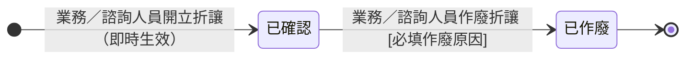

## 概述

折讓單（SalesAllowanceStatus，銷貨折讓證明單）從開立到可能作廢的狀態機，折讓單實體的欄位見 [[帳務]]。台灣統一發票制度下，已開出的發票金額若需減少（退費、折讓），不能直接改發票、必須另開折讓證明單（統一發票使用辦法第 20 條）。現階段開立即確認生效、不設待買受人確認的中間流程，未來需要再增補狀態。

折讓金額計算、發票可折讓金額的規則正本在 [[付款發票邏輯]]，本卡只定義狀態與轉換、不複述規則。

## 狀態列舉（正本）

> 本段是折讓單狀態的唯一正本。狀態的新增與修改是商業決策，直接在此卡維護。

| 狀態 | 說明 | 對應營運需求 |
|------|------|------------|
| 已確認 | 初始；開立即確認生效，所引用發票的可折讓金額即時扣減 | 折讓即時反映進對帳，業務開了就生效不用等 |
| 已作廢 | 終態；折讓開錯（金額錯、客戶撤回投訴、引用錯發票、重複開立）時作廢，發票可折讓金額回復 | 折讓的回退路徑，失效折讓退出對帳 |

## 狀態機圖（UML）

依 UML 狀態機圖記法繪製：實心圓為初始點、雙圈為終止點。「已確認」是持續有效態，只有開錯才走作廢。

## 轉換條件與觸發事件

| 轉換 | 觸發事件 | 條件 |
|------|---------|------|
| （建立）→ 已確認 | 業務／諮詢人員開立折讓 | 開立即確認生效；折讓總額不得超過所引用發票的可折讓金額 |
| 已確認 → 已作廢 | 業務／諮詢人員執行「作廢折讓」並填入原因 | 作廢後該發票的可折讓金額回復 |

## 關鍵轉換的營運動機

- 開立即確認（無草稿、無待確認）→ 動機：業務開折讓就是要即時生效影響對帳，多一個中間態只增加操作步驟而無實務意義 → 例子：客戶投訴 ORD-2026-0512 色差，業務開立 2,000 元折讓，即時生效、對帳面板的發票淨額同步扣減 2,000。
- 已確認 → 已作廢 → 動機：折讓開錯需要回退路徑，作廢讓發票的可折讓金額回到作廢前，帳目才正確 → 例子：上述折讓金額應為 3,000 而非 2,000，業務作廢原折讓後重開 3,000 元。

## 與其他狀態機的關係

- 折讓單引用「開立」狀態的 [[發票狀態|發票]]；一張發票可被多張折讓引用，折讓總額不超過發票金額。
- 三方對帳的發票淨額＝開立發票金額－已確認折讓金額；已作廢折讓不扣減。
- 折讓的作廢不影響訂單或異動單的狀態。

## 範圍外

- **開立與確認的串接細節**（電子發票平台的兩段式流程）：開立即確認是業務承諾，平台串接步驟屬實作規格，實作時勿自行發明
- 折讓金額上限、發票可折讓金額的計算 → 見 [[付款發票邏輯]]（規則正本）
- 發票自身的開立與作廢 → 走 [[發票狀態]]
- 三方對帳完整邏輯 → 見 [[對帳一致性]]

## 相關卡

- 規則：[[付款發票邏輯]]（折讓計算與對帳規則正本）、[[對帳一致性]]（三方對帳底線）、[[發票法規硬約束-ezPay-MIG]]（法規與平台限制）
- 實體：[[帳務]]（折讓單欄位正本）
- 狀態機：[[發票狀態]]（折讓引用的發票）、[[分期請款狀態]]（期次與發票的關係）
- 角色：[[業務]]／[[諮詢|諮詢人員]]（開立與作廢折讓）、[[會計]]（月結對帳）
