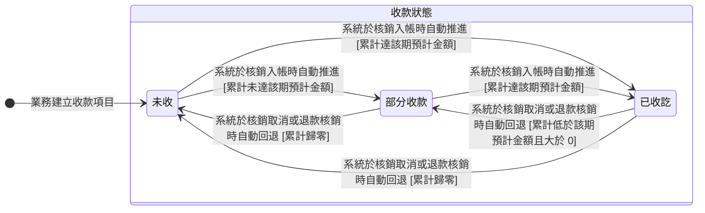

讀完這張卡，你會知道：

- 認識收款項目（欄位見 [[帳務]]）的收款狀態機：這一期的錢收到什麼程度
- 看懂未收、部分收款、已收訖三個處境各代表什麼
- 掌握收款狀態依實際入帳的核銷明細累計自動推導，業務不必手動標記
- 理解退款核銷與核銷取消為什麼會讓收款狀態回退
- 知道本卡與 [[收款項目開發票狀態]] 為什麼各自成卡、怎麼連動

## 狀態列舉（正本）

> 本段是收款項目收款狀態的唯一正本。狀態的新增與修改是商業決策，直接在此卡維護。

本狀態依「未取消且已完成」的核銷明細（一筆收款分攤到哪一期的紀錄）累計推導：

| 狀態 | 說明 | 對應營運需求 |
|------|------|------------|
| 未收 | 初始；累計已收等於 0 | 這期還沒收到任何錢 |
| 部分收款 | 累計已收介於 0 與該期預計金額之間 | 客戶分批付、或只付了部分 |
| 已收訖 | 累計已收達到該期預計金額（單一期次分配不得超過該期預計金額，正本見 [[付款發票邏輯]]，累計不會超過門檻） | 這期收齊 |

## 狀態機圖（UML）

- 記法：實心圓為初始點、轉換標籤採「觸發事件 [轉換條件]」格式；無終止點（收款項目跟著訂單收尾，自身不設終態）。
- 複合狀態「收款狀態」＝這一期的錢收到什麼程度的處境，可被他卡當集合詞引用；轉換由累計已收跨越門檻觸發（系統自動），含核銷取消與退款核銷時的回退。
- 銜接：轉換由 [[款項狀態]] 的已完成款項核銷帶動；開發票進度另見 [[收款項目開發票狀態]]。

## 轉換條件與觸發事件

| 轉換 | 觸發事件 | 條件 |
|------|---------|------|
| 未收 → 部分收款 | 系統於核銷入帳時自動推進 | 累計已收大於 0、未達該期預計金額 |
| 未收 → 已收訖 | 系統於核銷入帳時自動推進 | 累計已收達該期預計金額 |
| 部分收款 → 已收訖 | 系統於核銷入帳時自動推進 | 累計已收達該期預計金額 |
| 部分收款 → 未收 | 系統於核銷取消或退款核銷時自動回退 | 累計已收歸零 |
| 已收訖 → 部分收款 | 系統於核銷取消或退款核銷時自動回退 | 累計已收低於該期預計金額且大於 0 |
| 已收訖 → 未收 | 系統於核銷取消或退款核銷時自動回退 | 累計已收歸零 |

> 只計「未取消且已完成」的核銷明細；退款核銷累計到該期的已退金額並扣減已收（欄位見 [[帳務]]）。核銷怎麼分配、溢收怎麼處理，規則正本見 [[付款發票邏輯]]。

## 關鍵轉換的營運動機

- 收款狀態自動推導、不手動標記 → 動機：業務經手大量收款，手動勾「已收訖」必漏記；自動累加確保收款狀態永遠等於實際入帳，餵 [[會計]] 月結對帳的數字才可信。
- 核銷取消與退款核銷會回退 → 動機：收款狀態要反映這期實際留在公司的錢；登錯的核銷取消、或退了部分款，狀態還停在「已收訖」，催收就會漏掉這一期 → 例子：某期預計金額 30,000 已收訖，退款 5,000 核銷到該期後累計已收 25,000，收款狀態回「部分收款」。

## 與其他狀態機的關係

- 與 [[收款項目開發票狀態]] 的連動：兩者都掛在同一筆收款項目上，互不為前置條件、各自推進。先收訂金過幾週才開發票、先開發票月底才匯款，兩種順序都接得住。發票作廢不動本卡，收款歷史保留。收款項目被取消時，兩卡同時退出推導。
- 與 [[款項狀態]] 的連動：款項轉「已完成」後，它的核銷明細才計入本卡累計；款項本身不直接掛收款項目，對應透過收款核銷分配建立。
- 與 [[發票狀態]] 無直接連動：發票的開立與作廢只帶動 [[收款項目開發票狀態]]，收款項目與收款多對多、發票不直接掛款項紀錄。
- 與 [[訂單狀態]] 互不阻擋：收款狀態的推進不阻擋也不回退訂單狀態。
- 折讓不動本卡：[[折讓單狀態]] 扣減發票淨額，對帳層面反映、不回寫收款項目。
- 補收與退款的金額認列走 [[訂單異動狀態]]；退款實付走退款款項紀錄，核銷時才扣減本卡的累計已收。

## 範圍外

- **核銷分配怎麼分、單一期次分配上限、溢收留預收**：屬 [[付款發票邏輯]]（規則正本），實作時勿自行發明
- 收款項目的「取消」是標記不是狀態（被標記的收款項目退出推導），取消規則見 [[付款發票邏輯]]
- 這一期的發票開到哪一步 → 見 [[收款項目開發票狀態]]
- 款項紀錄自身的登錄與核銷操作 → 見 [[款項狀態]]、[[收款核銷分配]]
- 三方對帳底線等式與完整邏輯 → 見 [[對帳一致性]]

## 相關卡

- 規則：[[付款發票邏輯]]（核銷分配與分配上限正本）、[[對帳一致性]]（三方對帳底線）
- 流程：[[收款項目規劃]]（建立時的初始狀態）、[[收款核銷分配]]（核銷入帳與退款核銷）
- 實體：[[帳務]]（收款項目已收金額、已退金額欄位正本）
- 狀態機：[[收款項目開發票狀態]]（同一收款項目的開發票進度）、[[款項狀態]]（核銷來源）、[[發票狀態]]、[[折讓單狀態]]、[[訂單異動狀態]]、[[訂單狀態]]
- 角色：[[業務]]／[[諮詢]]（登錄收款核銷分配）、[[會計]]（月結對帳）
- OQ：[[BI-030-收款項目已收訖門檻的超收處置]]（已拍板 B 案封存：期次分配設上限、溢收留預收桶）
