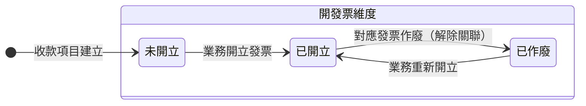
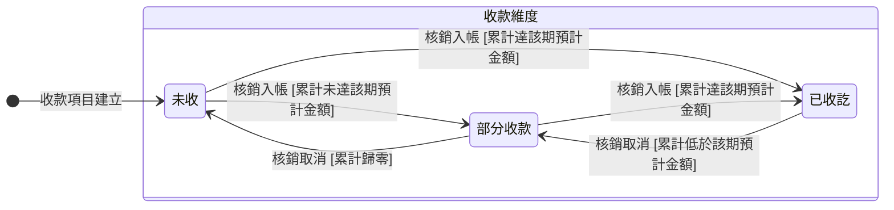

讀完這張卡，你會知道：

- 認識收款項目（BillingInstallmentStatus）狀態機涵蓋的生命週期：這一期該收多少、何時開發票、何時收款的進度怎麼走
- 看懂收款項目同時掛開發票與收款兩條互不干擾的進度線、各有哪些處境
- 掌握開發票狀態由業務手動推進、收款狀態依實際入帳的核銷明細累計自動推導
- 理解為什麼兩條進度線不綁在一起：印刷廠收錢與開發票的時點常常對不上
- 知道發票作廢只回退開發票狀態、收款項目取消後退出進度推導的營運理由

## 狀態列舉（正本）

> 本段是收款項目兩條進度線狀態的唯一正本。狀態的新增與修改是商業決策，直接在此卡維護。

### 開發票狀態（業務手動驅動）

| 狀態 | 說明 | 對應營運需求 |
|------|------|------------|
| 未開立 | 初始；尚未為這期開發票 | 客戶還沒要票、或先收訂金階段 |
| 已開立 | 已開出發票並記下對應發票 | 客戶拿到發票可向其公司請款 |
| 已作廢 | 原發票作廢、關聯解除，可重新開立 | 統編或抬頭填錯時作廢重開，不必刪收款項目 |

### 收款狀態（依入帳自動推導）

依「未取消且已完成」的核銷明細（一筆收款分攤到哪一期的紀錄）累計推導，業務不必手動標記：

| 狀態 | 推導門檻 | 對應營運需求 |
|------|---------|------------|
| 未收 | 累計已收等於 0 | 這期還沒收到任何錢 |
| 部分收款 | 累計已收介於 0 與該期預計金額之間 | 客戶分批付、或只付了部分 |
| 已收訖 | 累計已收達到該期預計金額（單一期次分配不得超過該期預計金額，正本見 [[付款發票邏輯]]，累計不會超過門檻） | 這期收齊 |

### 兩維度的關聯

- 兩條進度線互不耦合、各自推進：開發票狀態不是收款狀態的前置條件，反之亦然——先收訂金過幾週才開發票、先開發票月底才匯款兩種順序都接得住。

## 狀態機圖（UML）

- 記法：實心圓為初始點、轉換標籤採「觸發事件 [轉換條件]」格式；兩條進度線各畫一張圖、皆無終止點（收款項目跟著訂單收尾，自身不設終態）。
- 複合狀態＝可被引用的集合詞（成員以本圖為正本，不另立成員表）：「開發票維度」＝這一期的發票開立進度所處的處境；「收款維度」＝這一期的錢收到什麼程度的處境。
- 收款維度的轉換由累計已收跨越門檻觸發（系統自動），含核銷取消時的回退。

開發票維度：

收款維度：

## 轉換條件與觸發事件

| 進度線 | 轉換 | 觸發事件 | 條件 |
|------|------|---------|------|
| 開發票 | 未開立 → 已開立 | 業務為這期開立發票 | 記下對應發票；收款項目與發票業務上一對一（一期一票） |
| 開發票 | 已開立 → 已作廢 | 對應發票作廢 | 解除發票關聯；收款狀態不動（收款歷史保留） |
| 開發票 | 已作廢 → 已開立 | 業務重新開立發票 | 新發票重新關聯 |
| 收款 | 未收 ↔ 部分收款 ↔ 已收訖 | 核銷明細累計跨越門檻（系統自動） | 只計「未取消且已完成」的核銷明細；取消核銷會回退 |

## 關鍵轉換的營運動機

- 兩條狀態維度互不耦合 → 動機：對應印刷廠兩種真實收款節奏——客戶可能先付訂金、過幾週才要發票（先收後開），也可能要先拿到發票去自己公司請款、月底才匯款（先開後收），大宗訂單還會拆頭尾款分期；綁在同一條狀態鏈碰到先收後開就卡住，業務只能用備註硬記 → 例子：客戶先匯訂金 30,000，收款狀態自動推導為「已收訖」、開發票狀態仍是「未開立」；月底客戶要發票，業務開立後開發票狀態才轉「已開立」，兩條線各走各的。
- 收款狀態自動推導、不手動標記 → 動機：業務經手大量收款，手動勾「已收訖」必漏記；自動累加確保收款狀態永遠等於實際入帳，餵 [[會計]] 月結對帳的數字才可信。
- 發票作廢只回退開發票狀態 → 動機：統編／抬頭填錯在實務常見，作廢重開不該連帶抹掉已收到的錢的紀錄，保留收款歷史是稽核要求 → 例子：某期已開發票且已收訖，發現統編誤填，業務作廢發票後開發票狀態回「已作廢」、收款狀態維持「已收訖」，重開正確發票後回「已開立」。
- 取消的收款項目退出推導、新增的各自從零起算 → 動機：客戶臨時把一期改收頭尾兩款是常態；一期一票對齊發票實務，收款項目與發票對不齊的話月結對帳會抓到差額 → 例子：應收 78,000 的收款項目要改收 2,500 與 75,500 兩期，業務可以把原期次金額改成 2,500 再新增一筆 75,500，也可以取消原期次後新增兩筆；取消掉的那一筆不再計入任何進度推導，新增的各自從「未開立／未收」起算、各對一張發票。
- 收款項目調整不觸發訂單回主管重審 → 動機：改預計收款日、改預計開發票日、重排期次在印刷廠天天發生，每改一次就回審會拖垮交期、淹沒主管；改成留痕後由主管事後監督，把主管從逐筆簽核解放（調整的規則正本見 [[付款發票邏輯]]）→ 例子：訂單已進製作中，客戶要求付款延後兩週，業務直接改預計收款日，訂單狀態不動。

## 與其他狀態機的關係

- 開發票狀態的推進對象是 [[發票狀態]]：收款項目與發票一對一，發票作廢帶動開發票狀態回「已作廢」。
- 折讓不動收款項目狀態：[[折讓單狀態]] 引用發票扣減發票淨額，對帳層面反映、不回寫收款項目。
- 補收／退款的金額異動走 [[訂單異動狀態]]，與收款項目分屬不同實體；補收的異動確認可執行後不自動建收款項目（避免重複認列），由業務視需要另行規劃。
- 退款的實付走退款款項紀錄，核銷時扣減該期已收並累計到收款項目的「已退金額」（欄位見 [[帳務]]）；收款狀態（未收／部分收款／已收訖）依扣減後的已收推導。
- 收款項目規劃與調整不阻擋也不回退 [[訂單狀態]]。

## 範圍外

- **收款項目金額怎麼規劃、開發票時機、一期一票的對應規則**：屬 [[付款發票邏輯]]（規則正本），實作時勿自行發明
- 收款項目的「取消」是標記不是狀態（被標記的收款項目退出兩條進度線的推導），取消規則見 [[付款發票邏輯]]
- 三方對帳（應收＝發票淨額＝收款淨額）的完整邏輯 → 見 [[對帳一致性]]
- 款項紀錄自身的登錄與核銷操作 → 屬收款流程，見 [[付款發票邏輯]]

## 相關卡

- 規則：[[付款發票邏輯]]（收款項目規劃與開發票時機正本）、[[對帳一致性]]（三方對帳底線）、[[訂單異動規則]]（補收確認可執行後不自動建收款項目）
- 實體：[[帳務]]（收款項目欄位正本）
- 狀態機：[[發票狀態]]（一期一票）、[[折讓單狀態]]（影響發票淨額不回寫收款項目）、[[訂單異動狀態]]（金額異動）、[[訂單狀態]]（不互相阻擋）
- 角色：[[業務]]／[[諮詢]]（規劃收款項目、開發票、核銷收款）、[[業務主管]]（事後看變更次數指標）、[[會計]]（月結對帳）
- OQ：[[BI-030-收款項目已收訖門檻的超收處置]]（已拍板 B 案封存：期次分配設上限、溢收留預收桶）
