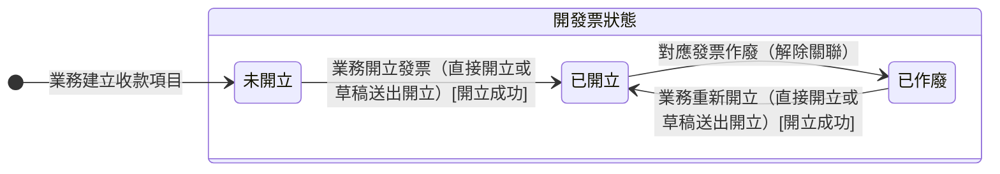

讀完這張卡，你會知道：

- 認識收款項目（欄位見 [[帳務]]）的開發票狀態機：這一期的發票開到哪一步
- 看懂未開立、已開立、已作廢三個處境各代表什麼
- 掌握開發票狀態隨業務開立與作廢發票推進，發票停在草稿期間不變
- 理解發票作廢只回退開發票狀態、不動收款進度的營運理由
- 知道本卡與 [[收款項目收款狀態]] 為什麼各自成卡、怎麼連動

## 狀態列舉（正本）

> 本段是收款項目開發票狀態的唯一正本。狀態的新增與修改是商業決策，直接在此卡維護。

| 狀態 | 說明 | 對應營運需求 |
|------|------|------------|
| 未開立 | 初始；這期從未開立成功過發票（首張發票停在草稿期間亦屬本態） | 客戶還沒要票、或先收訂金階段 |
| 已開立 | 對應發票已開立成功並記下關聯 | 客戶拿到發票可向其公司請款 |
| 已作廢 | 原發票作廢、關聯解除，可再建草稿或直接開立（重建的發票停在草稿期間維持本態） | 統編或抬頭填錯時作廢重開，不必刪收款項目 |

> 發票草稿不改變本狀態：草稿期間維持原值，開立成功才轉「已開立」（發票的處境見 [[發票狀態]]）。

## 狀態機圖（UML）

- 記法：實心圓為初始點、轉換標籤採「觸發事件 [轉換條件]」格式；無終止點（收款項目跟著訂單收尾，自身不設終態）。
- 複合狀態「開發票狀態」＝這一期的發票開立進度所處的處境，可被他卡當集合詞引用。
- 銜接：轉換由 [[發票狀態]] 的開立成功與作廢帶動；收款進度另見 [[收款項目收款狀態]]。

## 轉換條件與觸發事件

| 轉換 | 觸發事件 | 條件 |
|------|---------|------|
| 未開立 → 已開立 | 業務為這期開立發票成功（直接開立或草稿送出開立） | 記下對應發票；一個收款項目同一時間至多一張未作廢發票（含草稿，見 [[發票狀態]]）；建立草稿與開立失敗都不推進本狀態 |
| 已開立 → 已作廢 | 業務作廢對應發票 | 解除發票關聯；[[收款項目收款狀態]] 不動（收款歷史保留） |
| 已作廢 → 已開立 | 業務重新開立發票成功（直接開立或草稿送出開立） | 新發票重新關聯；重建草稿期間維持「已作廢」 |

## 關鍵轉換的營運動機

- 發票作廢只回退開發票狀態 → 動機：統編或抬頭填錯在實務常見，作廢重開不該連帶抹掉已收到的錢的紀錄，保留收款歷史是稽核要求 → 例子：某期已開發票且已收訖，發現統編誤填，作廢發票後開發票狀態回「已作廢」，收款狀態維持「已收訖」，重開正確發票後回「已開立」。
- 發票草稿期間開發票狀態不變 → 動機：草稿沒送平台、客戶手上沒有發票，這期實際上還沒開出發票；開發票狀態照實停在原值，待開發票的追蹤才不會漏掉這一期 → 例子：第 1 期業務建了草稿還在等客戶統編，開發票狀態仍是「未開立」，這期留在待開發票的追蹤範圍。
- 取消的收款項目退出推導、新增的各自從零起算 → 動機：客戶臨時把一期改收頭尾兩款是常態；一期一票對齊發票實務，收款項目與發票對不齊的話月結對帳會抓到差額 → 例子：應收總額 78,000 的收款項目要改收 2,500 與 75,500 兩期，走法見 [[付款發票邏輯]]；新增的每一期都從「未開立」起算、各對一張發票。
- 線下單各期收款項目於送審時由主管一併審過、核准後的調整不回主管重審 → 動機：主管在送審時已看過各期金額與日期，事前把關一次就夠；改預計開發票日、重排期次在印刷廠天天發生，核准後每改一次就回審會拖垮交期、淹沒主管，改成留痕讓主管查得到（原始日與變更次數欄位見 [[帳務]]，調整的規則正本見 [[付款發票邏輯]]）。

## 與其他狀態機的關係

- 與 [[收款項目收款狀態]] 的連動：兩者都掛在同一筆收款項目上，互不為前置條件、各自推進。先收訂金過幾週才開發票、先開發票月底才匯款，兩種順序都接得住。發票作廢只動本卡，收款狀態保留原值。收款項目被取消時，兩卡同時退出推導。
- 與 [[發票狀態]] 的連動：一個收款項目同一時間至多一張未作廢發票（含草稿）。發票開立成功帶動本卡轉「已開立」，發票作廢帶動本卡轉「已作廢」，發票停在草稿期間不帶動。
- 收款項目被刪除或取消時，該期的發票草稿一併消失；已開立的發票須先作廢（規則正本見 [[付款發票邏輯]]）。
- 與 [[款項狀態]] 無直接連動：款項的核銷只帶動 [[收款項目收款狀態]]，不動本卡。
- 與 [[訂單狀態]] 的連動：線下單送主管審核需至少一期未取消的收款項目（送審條件見 [[訂單狀態]]）。除此之外，本卡不阻擋也不回退訂單狀態，發票的建立與開立也不受訂單狀態限制。
- 折讓不動本卡：[[折讓單狀態]] 引用發票扣減發票淨額，對帳層面反映、不回寫收款項目。
- 補收與退款的金額異動走 [[訂單異動狀態]]，與收款項目分屬不同實體；異動生效後收款項目怎麼跟，規則正本見 [[訂單異動規則]] § 應收總額認列公式。

## 範圍外

- **收款項目金額怎麼規劃、開發票時機、一期一票的對應規則**：屬 [[付款發票邏輯]]（規則正本），實作時勿自行發明
- 收款項目的「取消」是標記不是狀態（被標記的收款項目退出開發票狀態與收款狀態的推導，該期的發票草稿一併消失），取消規則見 [[付款發票邏輯]]
- 這一期的錢收到什麼程度 → 見 [[收款項目收款狀態]]
- 發票自身的草稿、開立與作廢 → 見 [[發票狀態]]
- 三方對帳底線等式與完整邏輯 → 見 [[對帳一致性]]

## 相關卡

- 規則：[[付款發票邏輯]]（收款項目規劃與開發票時機正本）、[[對帳一致性]]（三方對帳底線）、[[訂單異動規則]]（補收確認可執行後不自動建收款項目）
- 流程：[[收款項目規劃]]（建立時的初始狀態）、[[收款項目開立發票]]（開立與作廢重開）
- 實體：[[帳務]]（收款項目欄位正本）
- 狀態機：[[收款項目收款狀態]]（同一收款項目的收款進度）、[[發票狀態]]（一期同一時間至多一張未作廢發票）、[[折讓單狀態]]（影響發票淨額不回寫收款項目）、[[訂單異動狀態]]（金額異動）、[[訂單狀態]]（線下單送審需至少一期，其餘不互相阻擋）
- 角色：[[業務]]／[[諮詢]]（規劃收款項目、建立發票草稿與開發票）、[[業務主管]]（線下單送審時審各期收款項目、核准後看變更次數）、[[會計]]（月結對帳）
