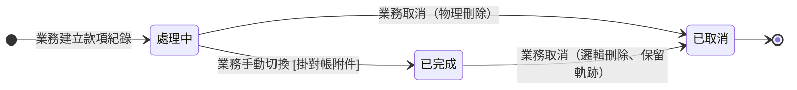

## 概述

收款紀錄（PaymentStatus）從業務先建到對帳完成或取消的狀態機，款項實體的欄位見 [[帳務]]。設計重點是把「錢有沒有實際入帳對齊」與「先把款項記下來」分兩段：業務常先建一筆款項佔位（處理中），等銀行入帳、對帳附件齊備後才切已完成；只有已完成的款項才計入收款淨額、才推進關聯異動單。收款與請款期次的核銷對應透過 [[分期請款狀態|請款期次]] 中介，本卡只定義款項自身三態與轉換、不複述對帳規則。

## 狀態列舉（正本）

> 本段是款項狀態的唯一正本。狀態的新增與修改是商業決策，直接在此卡維護；轉換的條件與觸發事件正本在 order-billing 行為規格。

| 狀態 | 說明 | 對應營運需求 |
|------|------|------------|
| 處理中 | 初始；業務先建紀錄、對帳資料（入帳憑證 / 匯款證明）未齊 | 不計入收款淨額、不影響請款期次收款維度、不推進關聯異動單；超過 7 天顯示「老化 N 天」提示 |
| 已完成 | 業務手動切換；切換條件＝掛上對帳附件且完成入帳期次核銷分配 | 計入收款淨額；退款款項已完成是退款做完的物理錨點，對帳應退差額據此歸零 |
| 已取消 | 終態；款項作廢 | 不計入收款淨額；退出對帳 |

## 狀態機圖（UML）

依 UML 狀態機圖記法繪製：實心圓為初始點、雙圈為終止點。款項由業務手動推進，無系統自動轉換。

## 轉換條件與觸發事件

| 轉換 | 觸發事件 | 條件 |
|------|---------|------|
| （建立）→ 處理中 | 業務建立款項紀錄 | 新建必填款項狀態、無預設值 |
| 處理中 → 已完成 | 業務手動切換 | 須掛至少一個對帳附件、且完成入帳期次核銷分配；無系統自動推進、不以月結閉檔機制控制 |
| 處理中 → 已取消 | 業務取消 | 處理中款項物理刪除（無對帳影響、不需留軌跡）|
| 已完成 → 已取消 | 業務取消 | 已完成款項邏輯刪除、保留稽核軌跡；取消後對帳應退差額重現引導重退 |
| 已完成 → 處理中 | （禁止）| 反向禁止（介面與資料層雙重保護）；如需修正改走「取消重建」|

> 收款與退款的「已完成」閘門皆為「對帳附件 + 期次核銷分配」，差別僅在語意：收款附件＝入帳憑證、核銷＝分配至期次（增加該期已收）；退款附件＝匯款證明、核銷＝退款核銷至期次（扣減該期已收）。退款款項已完成不回頭改關聯訂單異動狀態（認列已於異動核可時定），實際退款進度由 [[對帳一致性]] 的應退差額盯住。

## 關鍵轉換的營運動機

- 處理中 → 已完成 → 動機：把「先把款項記下來」與「錢真的對齊入帳」分兩段，避免未實際入帳的款項提前灌進收款淨額影響對帳 → 例子：業務收到客戶匯款通知先建處理中款項，待對帳單確認入帳、上傳匯款證明後才切已完成。
- 已完成 → 處理中 反向禁止 → 動機：已完成代表已計入收款淨額、已參與對帳，反向退回會讓帳面反覆跳動；要修正一律取消重建，保留可追溯軌跡。
- 處理中物理刪 vs 已完成邏輯刪 → 動機：處理中尚未影響任何帳，直接刪不留痕即可；已完成已參與對帳，取消須留軌跡供稽核，且讓對帳應退差額重現以引導重退。
- 處理中老化提示 → 動機：處理中款項久未切已完成（超過 7 天）代表對帳卡關，以「老化 N 天」提示業務跟進。

## 與其他狀態機的關係

- 款項透過 [[分期請款狀態|請款期次]] 的收款維度（未收 / 部分收款 / 已收訖）反映收款進度，款項本身不直接掛期次；核銷對應透過收款核銷分配建立。
- 退款款項（款項類型＝退款）切已完成不回頭改 [[訂單異動狀態|訂單異動]] 狀態——退款認列在異動單核可時即定，退款做完與否由對帳應退差額盯住，見 [[對帳一致性]]。

## 範圍外

- 收款核銷分配怎麼分、溢收預收怎麼處理 → 見 [[付款發票邏輯]]、[[分期請款狀態]]
- 三方對帳（應收＝發票淨額＝收款淨額）完整邏輯 → 見 [[對帳一致性]]
- 退款與折讓的關係、退款金流方向 → 見 [[發票法規硬約束-ezPay-MIG]] § 金額 sign 鐵則
- 核銷分配的可編輯規則：以款項完成條件（對帳附件 + 入帳期次分配）控制；月結閉檔鎖機制已取消（2026-06-15 裁決），prototype 殘留 lockedByPeriodClose 待移除

## 相關卡

- 規則：[[付款發票邏輯]]（收款核銷與對帳規則正本）、[[對帳一致性]]（三方對帳底線）
- 實體：[[帳務]]（收款紀錄欄位正本）
- 狀態機：[[分期請款狀態]]（收款維度由款項核銷推導）、[[訂單異動狀態]]（退款認列與款項脫鉤）
- 角色：[[業務]]（建立與切換款項）、[[會計]]（月結對帳）
