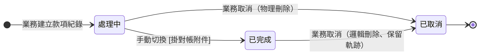

讀完這張卡，你會知道：

- 認識款項紀錄（PaymentStatus）狀態機涵蓋的生命週期：從業務先建一筆款項佔位、對帳附件齊備後切已完成，到作廢取消
- 看懂款項有哪三種處境、哪一種才計入收款淨額並推進關聯訂單異動
- 掌握每個轉換由誰觸發、切已完成要滿足什麼條件
- 理解為什麼把「先把款項記下來」與「錢真的對齊入帳」切成兩格
- 知道已完成不可退回處理中、處理中與已完成的取消方式不同的營運理由

## 狀態列舉（正本）

> 本段是款項狀態的唯一正本。狀態的新增與修改是商業決策，直接在此卡維護。

| 狀態 | 說明 | 對應營運需求 |
|------|------|------------|
| 處理中 | 初始；業務先建紀錄、對帳資料（入帳憑證 / 匯款證明）未齊 | 不計入收款淨額、不影響收款項目收款維度、不推進關聯訂單異動；超過 7 天顯示「老化 N 天」提示 |
| 已完成 | 手動切換（切換者見轉換表）；切換條件＝掛上對帳附件且完成入帳收款項目核銷分配。不可退回處理中，要修正改走取消重建 | 計入收款淨額；退款款項已完成是退款做完的物理錨點，對帳的收款差額據此歸零 |
| 已取消 | 終態；款項作廢 | 不計入收款淨額；退出對帳 |

## 狀態機圖（UML）

- 記法：實心圓為初始點、雙圈為終止點、轉換標籤採「觸發事件 [轉換條件]」格式。
- 款項全程由人手動推進，圖上沒有系統自動轉換。

```mermaid
stateDiagram-v2
    direction LR

    state "處理中" as s_pending
    state "已完成" as s_completed
    state "已取消" as s_cancelled

    [*] --> s_pending : 業務建立款項紀錄
    s_pending --> s_completed : 手動切換 [掛對帳附件]
    s_pending --> s_cancelled : 業務取消（物理刪除）
    s_completed --> s_cancelled : 業務取消（邏輯刪除、保留軌跡）
    s_cancelled --> [*]
```

## 轉換條件與觸發事件

| 轉換 | 觸發事件 | 條件 |
|------|---------|------|
| （建立）→ 處理中 | 業務建立款項紀錄 | 新建必填款項狀態、無預設值 |
| 處理中 → 已完成 | 收款與退款都由業務手動切換；退款於會計依待出金清單出金後、業務補匯款證明再切（見 [[待出金退款清單組成]]、[[退款執行]]）。例外：諮詢取消退費的退款由 [[諮詢]] 處理銀行退款後自行補證明並切（見 [[諮詢收尾規則]]） | (1) 須掛至少一個對帳附件。(2) 金額須全額有歸屬——分配至收款項目，或溢收餘額掛預收（未分配）、由對帳收款差額呈現（見 [[收款核銷分配]]）。(3) 無系統自動推進，也不以月結閉檔機制控制 |
| 處理中 → 已取消 | 業務取消 | 處理中款項物理刪除（無對帳影響、不需留軌跡）|
| 已完成 → 已取消 | 業務取消 | 已完成款項邏輯刪除、保留稽核軌跡；取消後對帳的收款差額重現引導重退 |

收款與退款切「已完成」的把關條件相同（對帳附件＋全額歸屬），兩者的語意差別如下：

| 面向 | 收款款項 | 退款款項 |
|------|---------|---------|
| 對帳附件 | 入帳憑證 | 匯款證明 |
| 全額歸屬 | 分配至收款項目（增加該期已收），或溢收餘額掛預收（未分配） | 退款核銷至收款項目（扣減該期已收） |

> 退款款項已完成不回頭改關聯訂單異動狀態（認列已於異動確認生效時定），實際退款進度由 [[對帳一致性]] 的收款差額盯住。

## 關鍵轉換的營運動機

- 處理中 → 已完成 → 動機：把「先把款項記下來」與「錢真的對齊入帳」分兩段，避免未實際入帳的款項提前灌進收款淨額影響對帳 → 例子：業務收到客戶匯款通知先建處理中款項，待對帳單確認入帳、上傳匯款證明後才切已完成。
- 已完成 → 處理中 反向禁止 → 動機：已完成代表已計入收款淨額、已參與對帳，反向退回會讓帳面反覆跳動；改走取消重建則留得下可追溯的軌跡。
- 處理中物理刪 vs 已完成邏輯刪 → 動機：處理中尚未影響任何帳，直接刪不留痕即可；已完成已參與對帳，取消須留軌跡供稽核，且讓對帳的收款差額重現以引導重退。
- 處理中老化提示 → 動機：處理中款項久未切已完成代表對帳卡關，讓卡住的款項自己浮上來，業務才會回去追這筆錢到底進沒進。

## 與其他狀態機的關係

- 款項透過 [[收款項目狀態]] 的收款維度（未收 / 部分收款 / 已收訖）反映收款狀態，款項本身不直接掛收款項目；核銷對應透過收款核銷分配建立。
- 退款款項（款項類型＝退款）切已完成不回頭改 [[訂單異動狀態]] 狀態——退款認列在訂單異動確認生效時即定，退款做完與否由對帳的收款差額盯住，見 [[對帳一致性]]。

## 範圍外

- 收款核銷分配怎麼分、溢收預收怎麼處理 → 見 [[付款發票邏輯]]、[[收款項目狀態]]
- 三方對帳（應收＝發票淨額＝收款淨額）完整邏輯 → 見 [[對帳一致性]]
- 退款與折讓的關係、退款金流方向 → 見 [[發票法規硬約束-ezPay-MIG]] § 金額 sign 鐵則
- 核銷分配的可編輯規則：以款項完成條件（對帳附件 + 入帳收款項目分配）控制，不設月結閉檔鎖

## 相關卡

- 規則：[[付款發票邏輯]]（收款核銷與對帳規則正本）、[[對帳一致性]]（三方對帳底線）
- 實體：[[帳務]]（款項紀錄欄位正本）
- 狀態機：[[收款項目狀態]]（收款維度由款項核銷推導）、[[訂單異動狀態]]（退款認列與款項脫鉤）
- 角色：[[業務]]（建立與切換款項）、[[會計]]（月結對帳）
