## 概述

派單狀態（平台介面稱「大陸處理狀態」）是外發稿件在外部協力廠端的進程線。派單以稿件（印件）為單位建立，指派給外部供應商（現況為中國廠商），用來追蹤外部廠商從接單、發稿、製作、出貨、集運到回台入庫或海外交付的整段當地進程。

打樣、大貨、補印、急件**不是狀態**，而是印件層級的屬性圖標（可疊加，急件由印務人工加註）；工單製作類型（介面稱「工單屬性」）六值：打樣／大貨（無打樣，直接製作大貨）／大貨（檔案同打樣單）／大貨（檔案有修改，以新檔案製作）／第二次打樣訂單（新工單）／盒型白樣製作＋大貨單（廠內）。不同製作類型的工單各自建派單、走同一條狀態鏈；打樣 NG 重打與補印以開新工單（新派單）承載，不在狀態鏈內回圈。

派單的管理主責在[[印務]]（外發承辦，內部稱「凹豆」），供應商負責回報進程。海外直發三態與台灣已入庫為終態，後續對帳以撈取終態派單為基準。兩條跨型別的作業裁決（2026-07-22）：打樣的通過與否**判定歸業務**（與客戶確認）、系統回寫操作歸印務（場內、外發無別）；外包大貨 NG 的補印**一律退原外包廠、由印務發起**（外發內容本為場內無法製作，不存在回台場內補做的岔路）——在本狀態鏈中以開新工單（新派單）承載。

本卡是這條進程的唯一詞彙正本。它與「生產任務」的內部製作狀態分離：生產任務維持粗顆粒、屬 [[生產任務狀態]]；回台物流的運費與關稅分攤屬 [[貨運單]]。

> 範圍註記：中國派單為現況平台已落地的實作；台灣外包派單的進程語意相同、尚未實作。本卡狀態列舉忠於現況平台事實（前端常數、後端狀態值域、dev 環境實際資料三方一致），節點語意與觸發者依 Miles 提供之關係圖回填（2026-07-23，原 [[PT-016-派單狀態13值鏈節點語意與觸發動作]] 已解答封存）。

## 狀態列舉（正本）

> 本段是派單狀態的唯一正本。狀態的新增與修改是商業決策，直接在此卡維護。其他卡（如 [[貨運單]]）引用狀態名、不另列清單。共 13 值。

| 狀態 | 對應工單狀態 | 說明 | 對應營運需求 |
|------|------------|------|------------|
| 未送大陸 | 審稿合格 | 初始；印件已通過審稿、尚未交辦供應商 | 已決定外發、但對方還沒接手，看得出卡在內部交辦 |
| 已交付工單 | 審稿合格 | 訂單管理人檢查工單內容無誤後切換，代表工單資料已確認可交辦 | 內容確認與派案分兩關，錯稿在交辦前攔下 |
| 已發稿 | 審稿合格 | 印務指派供應商時系統自動切換並記錄發稿時間 | 球已交到廠商手上，責任點與發稿時點都有記錄 |
| 製作中（整批） | 製作中 | 供應商開始生產時切換；一次性製作整批 | 整批與分批投產節奏不同，分開看交期 |
| 製作中（分批） | 製作中 | 供應商開始生產時切換；分批次製作 | 分批時可先收一部分，回收節點與整批不同 |
| 分批出貨中 | 運送中 | 分批製作的後續，或廠商先出部分數量；有出貨即可切，後續以 [[貨運單]] 追蹤 | 分批路徑的在途起點，與製作中分開才追得出貨到哪一批 |
| 已送集運商 | 運送中 | 整批回台走集運轉運：貨已交給集運商集中、待併櫃出貨 | 跨境物流多一站，顯式標出避免「做完了卻收不到貨」對不上 |
| 運回台灣中 | 運送中 | 貨在回台途中（承運商順豐直送可直接進此態；集運轉運由印務於集運站到貨時切換） | 在途與到貨分開，追得出貨卡在海運哪一段 |
| 已到貨品檢 | 到貨品檢中 | 運單貨物抵台自動觸發（由出貨品檢人員在 [[貨運單]]「認列工單」後觸發），貨抵台待點收品檢 | 到貨不等於可用，點收與品檢獨立一站 |
| 台灣已入庫 | 已完成 | 終態；出貨人員 QC 通過後切換，同時自動同步 EC 後台稿件狀態為已入庫；此後整筆稿件鎖定不可再變更 | 外發進程收尾，鎖定防止事後誤改 |
| 海外直發-分批 | 已完成 | 直達終態；分批直接在海外交付 | 不回台訂單的分批交付終態 |
| 海外直發-全出 | 已完成 | 直達終態；整批直接在海外交付 | 不回台訂單的整批交付終態 |
| 海外直發-送大陸客戶 | 已完成 | 直達終態；貨送大陸當地客戶，不經跨境物流 | 大陸在地交付終態 |

> 特殊：工單狀態「工單已作廢」由 EC 訂單取消觸發，獨立於主流程、與大陸處理狀態無對應；作廢屬 [[工單狀態]]，本卡不承載。

## 狀態機圖（UML）

依 UML 狀態機圖記法繪製，轉換標籤採「觸發者：觸發事件」格式。部分轉換為系統自動（指派供應商、供應商送出運單、貨物抵台認列、QC 通過同步 EC），其餘由對應角色於管理頁切換；ERP 端下拉不設順序閘門，可人工修正。

```mermaid
stateDiagram-v2
    direction LR

    [*] --> s_init : 稿件審稿合格、待派發

    state "未送大陸" as s_init
    state "已交付工單" as s_delivered
    state "已發稿" as s_sent
    state "製作中（整批）" as s_full
    state "製作中（分批）" as s_part
    state "分批出貨中" as s_partial_ship
    state "已送集運商" as s_forwarder
    state "運回台灣中" as s_returning
    state "已到貨品檢" as s_inspecting
    state "台灣已入庫" as s_warehoused
    state "海外直發-分批" as s_od_part
    state "海外直發-全出" as s_od_full
    state "海外直發-送大陸客戶" as s_od_cn

    state produce_route <<choice>>
    state ship_route <<choice>>

    s_init --> s_delivered : 訂單管理人：檢查工單內容無誤後切
    s_delivered --> s_sent : 印務：指派供應商（系統自動切、記發稿時間）
    s_sent --> produce_route : 供應商：開始生產
    produce_route --> s_full : [整批製作]
    produce_route --> s_part : [分批製作]

    s_part --> s_partial_ship : 供應商：先出部分數量（有出貨即可切）
    s_full --> ship_route : 系統自動：供應商送出運單（依路線分流）
    s_partial_ship --> ship_route : 系統自動：供應商送出運單（依路線分流）
    ship_route --> s_forwarder : [整批回台-集運轉運]
    ship_route --> s_returning : [整批回台-順豐直送]
    ship_route --> s_od_part : [海外直發-分批]
    ship_route --> s_od_full : [海外直發-全出]
    ship_route --> s_od_cn : [送大陸客戶]

    s_forwarder --> s_returning : 印務：集運站到貨（轉順豐送台）
    s_returning --> s_inspecting : 系統自動：運單貨物抵台（出貨品檢人員認列工單後觸發）
    s_inspecting --> s_warehoused : 出貨人員：QC 通過（同步 EC 稿件狀態為已入庫）

    s_warehoused --> [*]
    s_od_part --> [*]
    s_od_full --> [*]
    s_od_cn --> [*]
```

> 期間動作：製作中階段供應商可更新報價至「供應商印件報價」欄位（見 [[派單]] 委外金流），不影響狀態。

## 權限與強制規則

| 規則 | 內容 |
|------|------|
| 派案管理頁切狀態 | 印務（凹豆）與訂單管理人 |
| 貨運單管理頁切狀態 | 品檢出貨人員（認列工單觸發已到貨品檢、QC 通過切台灣已入庫） |
| 中國廠商端不可寫入的狀態 | 已交付工單、已發稿、已到貨品檢、台灣已入庫——這四態僅由 ERP 端流程寫入；中國廠商端（供應商平台）可更新其餘製作與出貨進程 |
| 入庫鎖定 | 稿件狀態為「台灣已入庫」後，整筆稿件在供應商端不可再變更 |

ERP 端下拉不設狀態順序閘門、可批量編輯，用於人工修正；正常流程依上方轉換的觸發者推進。

## 關鍵設計的營運動機

- 打樣與補印從狀態轉為工單製作類型 → 動機：打樣、大貨、補印是「這張工單是什麼性質的活」，不是「活做到哪了」；當維度混進狀態鏈，補印與二次打樣都要在鏈上開回圈、鏈越長越難維護。拆成類型後同一條進程鏈通用，重打與補印以新工單（新派單）另起一條進程。
- 分批路徑顯式建態（製作中（分批）→ 分批出貨中）→ 動機：分批時廠商邊做邊出，不分開就看不出「還在做」與「已在出」的差別，交期追蹤失準。
- 海外直發拆三終態 → 動機：分批直發、整批直發、送大陸客戶的物流與對帳路徑不同，單一「海外直發」態無法區分收尾方式。
- 已到貨品檢與台灣已入庫分兩態 → 動機：到貨後要先點收秤重（見 [[貨運單]] 的認列與秤重），數量與重量確認完才入庫；兩態分開才接得上點收異常的處理窗口。
- 終態作為對帳基準 → 動機：台灣已入庫與海外直發三態是派單的終點，後續對帳撈取終態派單結算委外成本；沒有明確終態就撈不出「這批外發到底花了多少」的封閉集合。
- 整批回台分集運轉運與順豐直送兩法 → 動機：集運轉運多一站（已送集運商），由印務在集運站到貨時往下推；順豐直送直接進運回台灣中，兩條路的追蹤點不同。

## 與其他狀態機的關係

- 派單與 [[生產任務狀態]] 分離：生產任務是內部製作單位、狀態粗顆粒，外發時把外部廠端的細部進程交給派單承載。
- 派單以稿件（[[印件]]）為單位、隨 [[工單狀態|工單]] 建立；大陸處理狀態是工單狀態的子狀態鏈（工單狀態五組各對應本卡若干狀態，見狀態列舉表「對應工單狀態」欄），工單已作廢由 EC 訂單取消觸發、與本卡狀態無對應。工單製作類型（工單屬性）決定這條進程承載的是打樣、大貨還是補印的活。
- 回台物流的運費、關稅、重量差異與分攤屬 [[貨運單]]，「已到貨品檢」對應貨運單的點收與秤重作業。

## 範圍外

- **生產任務的內部製作狀態與回台後推進**：屬 [[生產任務狀態]]，本卡只到外部廠端進程為止
- **回台物流的運費、關稅、重量差異、分攤、認列**：屬 [[貨運單]]
- **台灣對客戶的出貨**：屬 [[出貨單狀態]]
- **稿件本身的審稿狀態**（稿件未上傳／等待審稿／合格／不合格／已補件／作廢）：屬審稿領域，派單只顯示不承載
- **派單建立時的廠商類型路由細則**：屬派工與發包決策，本卡只承接「已是外發」的派單

## 相關卡

- 規則：[[印件生產流程]]（外發與回台進程的流程正本）
- 實體：[[生產任務]]、[[工單]]／[[印件]]（派單綁定對象）、[[貨運單]]（回台物流與運費關稅）
- 狀態機：[[生產任務狀態]]、[[出貨單狀態]]、[[工單狀態]]（本卡為其外發子狀態鏈）
- OQ：[[PT-016-派單狀態13值鏈節點語意與觸發動作]]（已解答封存，節點語意正本已回填本卡）
- 角色：[[印務]]（外發承辦，內部稱「凹豆」；派案與狀態管理主責）、訂單管理人（工單內容確認）、品檢出貨人員（認列與 QC 切狀態）、[[中國廠商]]（製作與出貨進程回報、期間更新報價）、[[生管]]（在途進度追蹤）
