## 概述

派單狀態（平台介面稱「大陸處理狀態」）是外發稿件在外部協力廠端的進程線。派單以稿件（印件）為單位建立，指派給外部供應商（現況為中國廠商），用來追蹤外部廠商從接單、發稿、製作、出貨、集運到回台入庫或海外交付的整段當地進程。

打樣、大貨、補印**不是狀態**，而是工單製作類型（介面稱「工單屬性」，六值：打樣／大貨（無打樣，直接製作大貨）／大貨（檔案同打樣單）／大貨（檔案有修改，以新檔案製作）／第二次打樣訂單（新工單）／盒型白樣製作＋大貨單（廠內））。不同製作類型的工單各自建派單、走同一條狀態鏈；打樣 NG 重打與補印以開新工單（新派單）承載，不在狀態鏈內回圈。

本卡是這條進程的唯一詞彙正本。它與「生產任務」的內部製作狀態分離：生產任務維持粗顆粒、屬 [[生產任務狀態]]；回台物流的運費與關稅分攤屬 [[貨運單]]。

> 範圍註記：中國派單為現況平台已落地的實作；台灣外包派單的進程語意相同、尚未實作。本卡狀態列舉忠於現況平台事實（前端常數、後端狀態值域、dev 環境實際資料三方一致），節點語意的動作主體未明處歸 [[PT-009-派單狀態13值鏈節點語意與觸發動作]]，不臆測補齊。

## 狀態列舉（正本）

> 本段是派單狀態的唯一正本。狀態的新增與修改是商業決策，直接在此卡維護。其他卡（如 [[貨運單]]）引用狀態名、不另列清單。共 13 值。

| 狀態 | 說明 | 對應營運需求 |
|------|------|------------|
| 未送大陸 | 初始；稿件尚未交付給外部供應商 | 已決定外發、但對方還沒接手，看得出卡在內部交辦 |
| 已交付工單 | 工單已交付供應商承接（與「已發稿」的動作主體區分見 [[PT-009-派單狀態13值鏈節點語意與觸發動作]]） | 承接責任點顯式化 |
| 已發稿 | 稿件已發給外部供應商（介面「發稿日期」記管理人員派案給中國供應商的時間） | 球已交到廠商手上，責任點清楚 |
| 製作中（整批） | 供應商一次性製作整批 | 整批與分批投產節奏不同，分開看交期 |
| 製作中（分批） | 供應商分批次製作 | 分批時可先收一部分，回收節點與整批不同 |
| 分批出貨中 | 分批製作的貨已開始分批出貨 | 分批路徑的在途起點，與製作中分開才追得出貨到哪一批 |
| 已送集運商 | 貨已交給集運商集中、待併櫃出貨 | 跨境物流多一站，顯式標出避免「做完了卻收不到貨」對不上 |
| 運回台灣中 | 貨在自大陸運回台灣的途中 | 在途與到貨分開，追得出貨卡在海運哪一段 |
| 已到貨品檢 | 貨已抵台、在收貨點收與品檢中（對應 [[貨運單]] 的點收與秤重） | 到貨不等於可用，點收與品檢獨立一站 |
| 台灣已入庫 | 終態；貨已入庫，整筆稿件鎖定不可再變更 | 外發進程收尾，鎖定防止事後誤改 |
| 海外直發-分批 | 海外直發路徑；分批直接在海外交付 | 不回台訂單的分批交付終態 |
| 海外直發-全出 | 海外直發路徑；整批直接在海外交付 | 不回台訂單的整批交付終態 |
| 海外直發-送大陸客戶 | 海外直發路徑；貨送大陸當地客戶 | 大陸在地交付，不經跨境物流 |

## 狀態機圖（UML）

依 UML 狀態機圖記法繪製。現況平台的狀態推進為**人工下拉選擇**（ERP 端不設轉換限制），本圖呈現的是典型營運進程順序，非系統強制的轉換閘門；系統強制的只有端別權限與入庫鎖定（見「轉換條件與觸發事件」）。

```mermaid
stateDiagram-v2
    direction LR

    [*] --> s_init : 稿件審稿合格、待派發

    state "未送大陸" as s_init
    state "已交付工單" as s_delivered
    state "已發稿" as s_sent
    state "製作中（整批）" as s_full
    state "製作中（分批）" as s_part
    state "分批出貨中" as s_partial_ship
    state "已送集運商" as s_forwarder
    state "運回台灣中" as s_returning
    state "已到貨品檢" as s_inspecting
    state "台灣已入庫" as s_warehoused
    state "海外直發-分批" as s_od_part
    state "海外直發-全出" as s_od_full
    state "海外直發-送大陸客戶" as s_od_cn

    state produce_route <<choice>>
    state ship_route <<choice>>

    s_init --> s_delivered : 供應商承接
    s_delivered --> s_sent : 派案發稿（ERP 端寫入）
    s_sent --> produce_route : 投產
    produce_route --> s_full : [整批製作]
    produce_route --> s_part : [分批製作]

    s_part --> s_partial_ship : 開始分批出貨
    s_full --> ship_route : 製作完成
    s_partial_ship --> ship_route : 批次出貨
    ship_route --> s_forwarder : [貨回台灣]
    ship_route --> s_od_part : [海外直發-分批]
    ship_route --> s_od_full : [海外直發-全出]
    ship_route --> s_od_cn : [送大陸客戶]

    s_forwarder --> s_returning : 集運商啟運
    s_returning --> s_inspecting : 抵台、點收品檢（ERP 端寫入）
    s_inspecting --> s_warehoused : 入庫（ERP 端寫入、入庫後鎖定）

    s_warehoused --> [*]
    s_od_part --> [*]
    s_od_full --> [*]
    s_od_cn --> [*]
```

## 轉換條件與觸發事件

現況平台不對狀態順序設系統閘門，ERP 端（印務／管理員）可於派單列表下拉直接改任一狀態、也可批量編輯；系統強制的規則只有兩條端別權限：

| 規則 | 內容 |
|------|------|
| 中國廠商端不可寫入的狀態 | 已交付工單、已發稿、已到貨品檢、台灣已入庫——這四態僅由 ERP 端流程寫入；中國廠商端（供應商平台）可更新其餘製作與出貨進程 |
| 入庫鎖定 | 稿件狀態為「台灣已入庫」後，整筆稿件在供應商端不可再變更 |

各節點的觸發動作主體（誰在什麼時點推進哪一態）現況未見系統文件明定，歸 [[PT-009-派單狀態13值鏈節點語意與觸發動作]] 釐清後回填。

## 關鍵設計的營運動機

- 打樣與補印從狀態轉為工單製作類型 → 動機：打樣、大貨、補印是「這張工單是什麼性質的活」，不是「活做到哪了」；當維度混進狀態鏈，補印與二次打樣都要在鏈上開回圈、鏈越長越難維護。拆成類型後同一條進程鏈通用，重打與補印以新工單（新派單）另起一條進程。
- 分批路徑顯式建態（製作中（分批）→ 分批出貨中）→ 動機：分批時廠商邊做邊出，不分開就看不出「還在做」與「已在出」的差別，交期追蹤失準。
- 海外直發拆三終態 → 動機：分批直發、整批直發、送大陸客戶的物流與對帳路徑不同，單一「海外直發」態無法區分收尾方式。
- 已到貨品檢與台灣已入庫分兩態 → 動機：到貨後要先點收秤重（見 [[貨運單]] 的認列與秤重），數量與重量確認完才入庫；兩態分開才接得上點收異常的處理窗口。

## 與其他狀態機的關係

- 派單與 [[生產任務狀態]] 分離：生產任務是內部製作單位、狀態粗顆粒，外發時把外部廠端的細部進程交給派單承載。
- 派單以稿件（[[印件]]）為單位、隨 [[工單狀態|工單]] 建立，但派單是獨立委外進程，不複寫工單／印件的內部轉換；工單製作類型（工單屬性）決定這條進程承載的是打樣、大貨還是補印的活。
- 回台物流的運費、關稅、重量差異與分攤屬 [[貨運單]]，「已到貨品檢」對應貨運單的點收與秤重作業。

## 範圍外

- **生產任務的內部製作狀態與回台後推進**：屬 [[生產任務狀態]]，本卡只到外部廠端進程為止
- **回台物流的運費、關稅、重量差異、分攤、認列**：屬 [[貨運單]]
- **台灣對客戶的出貨**：屬 [[出貨單狀態]]
- **稿件本身的審稿狀態**（稿件未上傳／等待審稿／合格／不合格／已補件／作廢）：屬審稿領域，派單只顯示不承載
- **派單建立時的廠商類型路由細則**：屬派工與發包決策，本卡只承接「已是外發」的派單

## 相關卡

- 規則：[[印件生產流程]]（外發與回台進程的流程正本）
- 實體：[[生產任務]]、[[工單]]／[[印件]]（派單綁定對象）、[[貨運單]]（回台物流與運費關稅）
- 狀態機：[[生產任務狀態]]、[[出貨單狀態]]
- OQ：[[PT-009-派單狀態13值鏈節點語意與觸發動作]]
- 角色：[[印務]]（派案與狀態管理）、[[中國廠商]]（製作與出貨進程回報）、[[生管]]（在途進度追蹤）
