## 概述

派單狀態（OutsourceDispatchStatus，平台介面稱「大陸處理狀態」）是「派單」這張單據在外部協力廠端的進程線。派單是獨立的外發委外單，綁定印件與工單、指派給外部供應商（外包廠商或中國廠商），用來追蹤外部廠商從接稿、打樣、大貨製作、補印、集運到回台或海外交付的整段當地進程。

來路（現階段支援）：

- 工單規劃後，對「需外發」的印件由印務指派外部供應商而建立（廠商類型路由：唯外包廠商與中國廠商才產生派單；自有工廠與加工廠在場內製作，不外發、不開派單）。

本卡只涵蓋外發委外單在外部廠端的進程狀態，是這條進程的唯一詞彙正本。它與「生產任務」的內部製作狀態分離：生產任務維持粗顆粒、回台到貨後由人工推進，屬 [[生產任務狀態]]；回台物流的運費與關稅分攤屬 [[貨運單]]。狀態怎麼變的規則「為什麼這樣定」正本在 [[印件生產流程]]，本卡只定義狀態與轉換、不複述規則。

> 範圍註記：中國派單為現況平台（電子商務角度）已落地的實作；台灣外包派單的進程語意相同、尚未實作。本卡狀態列舉忠於現況平台事實，未涵蓋之處標「待確認」、不臆測補齊。

## 狀態列舉（正本）

> 本段是派單狀態的唯一正本。狀態的新增與修改是商業決策，直接在此卡維護。其他卡（如 [[貨運單]]）引用狀態名、不另列清單。

| 狀態 | 說明 | 對應營運需求 |
|------|------|------------|
| 未送大陸 | 初始；派單已建立、指派了供應商，但稿件尚未發給對方 | 已決定外發、但對方還沒拿到稿，與「已發稿」分開才看得出卡在內部交辦 |
| 已發稿 | 稿件已發給外部供應商，等待對方開始作業 | 球已交到廠商手上，責任點清楚 |
| 打樣製作 | 供應商正在製作打樣樣品 | 打樣與大貨分階段追蹤，先確認樣品再投大貨 |
| 打樣寄送中 | 打樣樣品已寄出、在寄送途中 | 樣品在路上不等於已收到，在途獨立一站避免誤判 |
| 打樣已到貨 | 打樣樣品已送達、待確認結果 | 樣品到手等待判定，是打樣分支的決策點 |
| 重打樣 | 打樣未通過、退回重做 | 打樣 NG 時退回再做一輪，與一次過的路徑分流 |
| 打樣合格 | 打樣確認通過，可投大貨 | 大貨投產的前置關卡，標示樣品已過 |
| 大貨製作中（整批） | 供應商一次性製作整批大貨 | 整批與分批投產節奏不同，分開看交期與分批回收 |
| 大貨製作中（分批） | 供應商分批次製作大貨 | 分批時可先收一部分，與整批的回收節點不同 |
| 大陸補印中 | 大貨數量不足或瑕疵，供應商在大陸端補印 | 補印是大貨後的獨立補件路徑，與初次大貨分開計 |
| 已送集運商 | 貨已交給集運商集中、待併櫃出貨 | 跨境物流多一站，顯式標出避免「做完了卻收不到貨」對不上 |
| 運回台灣中 | 貨在自大陸運回台灣的途中 | 在途與到貨分開，業務與生管追得出貨卡在海運哪一段 |
| 補印貨回台灣 | 補印的貨在運回台灣途中 | 補印貨與初次大貨的回台批次分開追蹤 |
| 海外直發或交付 | 終態；貨不回台灣、直接在海外交付客戶 | 海外直發訂單不經回台環節，獨立終態避免硬套回台流程 |

> 終態說明：常規路徑回台到貨後，派單在外部廠端的進程即告段落，回台後的入庫與後續製作由人工在 [[生產任務狀態]] 推進，不在本卡再延伸狀態；海外直發或交付是不回台的另一終態。

## 狀態機圖（UML）

依 UML 狀態機圖記法繪製：實心圓為初始點、雙圈為終止點、菱形為分流判斷、轉換標籤採「觸發事件 [守衛條件]」格式。本卡為單鏈式含分支：打樣分支（含重打樣回圈）→ 打樣合格後進大貨分支（整批或分批）→ 集運回台；補印分支與海外直發分支為大貨後的另兩條去向。

```mermaid
stateDiagram-v2
    direction LR

    [*] --> s_init : 工單規劃時建立派單

    state "未送大陸" as s_init
    state "已發稿" as s_sent
    state "打樣製作" as s_proof_make
    state "打樣寄送中" as s_proof_ship
    state "打樣已到貨" as s_proof_arrived
    state "重打樣" as s_reproof
    state "打樣合格" as s_proof_pass
    state "大貨製作中（整批）" as s_bulk_whole
    state "大貨製作中（分批）" as s_bulk_split
    state "大陸補印中" as s_reprint
    state "已送集運商" as s_consolidator
    state "運回台灣中" as s_returning
    state "補印貨回台灣" as s_reprint_returning
    state "海外直發或交付" as s_overseas

    state bulk_route <<choice>>
    state ship_route <<choice>>

    s_init --> s_sent : 印務發稿給供應商
    s_sent --> s_proof_make : 供應商開始打樣
    s_proof_make --> s_proof_ship : 供應商寄出打樣
    s_proof_ship --> s_proof_arrived : 打樣送達
    s_proof_arrived --> s_reproof : 打樣判定不通過
    s_reproof --> s_proof_make : 供應商重做打樣
    s_proof_arrived --> s_proof_pass : 打樣判定通過

    s_proof_pass --> bulk_route : 投大貨
    bulk_route --> s_bulk_whole : [整批製作]
    bulk_route --> s_bulk_split : [分批製作]

    s_bulk_whole --> ship_route : 大貨製作完成
    s_bulk_split --> ship_route : 大貨製作完成
    ship_route --> s_consolidator : [貨回台灣]
    ship_route --> s_overseas : [海外直發]

    s_consolidator --> s_returning : 集運商出貨／系統推進
    s_returning --> [*]

    s_bulk_whole --> s_reprint : 數量不足或瑕疵需補印
    s_bulk_split --> s_reprint : 數量不足或瑕疵需補印
    s_returning --> s_reprint : 回台後發現需補印 [待確認]
    s_reprint --> s_reprint_returning : 補印完成、貨運回台灣
    s_reprint_returning --> [*]

    s_overseas --> [*]
```

## 轉換條件與觸發事件

| 轉換 | 觸發事件 | 條件 |
|------|---------|------|
| （建立）→ 未送大陸 | 印務於工單規劃時對需外發印件指派供應商、建立派單 | 廠商類型為外包廠商或中國廠商才建立派單 |
| 未送大陸 → 已發稿 | 印務將稿件發給外部供應商 | 稿件已備齊可外發 |
| 已發稿 → 打樣製作 | 供應商（中國廠商／外包廠商）開始製作打樣 | 該派單含打樣 |
| 打樣製作 → 打樣寄送中 | 供應商寄出打樣樣品 | — |
| 打樣寄送中 → 打樣已到貨 | 打樣樣品送達 | — |
| 打樣已到貨 → 重打樣 | 打樣判定不通過、退回重做 | 打樣 NG |
| 重打樣 → 打樣製作 | 供應商重做打樣 | 回到打樣製作再走一輪 |
| 打樣已到貨 → 打樣合格 | 打樣判定通過 | 打樣 OK，可投大貨 |
| 打樣合格 → 大貨製作中（整批） | 供應商一次性製作整批大貨 | 採整批投產 |
| 打樣合格 → 大貨製作中（分批） | 供應商分批次製作大貨 | 採分批投產 |
| 大貨製作中（整批／分批）→ 已送集運商 | 供應商完成大貨、交集運商集中 | 貨回台灣路徑 |
| 大貨製作中（整批／分批）→ 海外直發或交付 | 供應商完成大貨、於海外直接交付客戶 | 海外直發路徑（不回台） |
| 已送集運商 → 運回台灣中 | 集運商出貨／系統推進 | 併櫃後啟運回台 |
| 大貨製作中（整批／分批）→ 大陸補印中 | 大貨數量不足或瑕疵、供應商在大陸端補印 | 需補印 |
| 運回台灣中 → 大陸補印中 | 回台後發現需補印、由供應商於大陸端補印 | 待確認：回台後再觸發補印的判定主體與條件，現況平台未明示 |
| 大陸補印中 → 補印貨回台灣 | 補印完成、貨運回台灣 | 補印走回台 |

> 圖表互核：「大貨製作中（整批／分批）→ 已送集運商／海外直發」在圖上以 `ship_route` 選擇節點分流；「打樣合格 → 大貨（整批／分批）」以 `bulk_route` 分流；表中合併列對應圖中兩條同源邊。

## 關鍵轉換的營運動機

- 未送大陸與已發稿分兩態 → 動機：「已決定外發、指派了廠商」與「稿件真的交到對方手上」是兩件事，分開才看得出卡在內部交辦還是廠商端 → 例子：訂單 20260610006520 的工單 S-006520-W-802 已指派雅那印刷但稿件還沒整理好，派單停在「未送大陸」，印務知道要先把稿補齊。
- 打樣分支含重打樣回圈 → 動機：打樣是大貨的前置關卡，NG 要能退回重做而非另開單，重打樣回到「打樣製作」再走一輪，整段樣品進度連續可追 → 例子：稿件 2632 首版打樣顏色偏差，判定不通過轉「重打樣」，供應商調整後回到「打樣製作」做第二版。
- 跨境在途多站顯式建出（打樣寄送中／已送集運商／運回台灣中／補印貨回台灣）→ 動機：遠端廠商做完不等於貨已到手，把每一段在途獨立成狀態，生管才追得出貨卡在工廠、集運商還是海運路上 → 例子：某派單顯示「已送集運商」多日未動，生管即可追集運商而非追工廠。
- 海外直發或交付獨立終態 → 動機：海外直發訂單貨不回台、直接在當地交付，硬套回台流程會永遠收不了尾，獨立終態才能正確結案 → 例子：客戶在海外設點，整批大貨由中國廠商就近交付，派單走「海外直發或交付」結束、不進集運回台。

## 與其他狀態機的關係

- 派單與 [[生產任務狀態]] 分離：生產任務是內部製作單位、狀態粗顆粒，外發時把外部廠端的細部進程交給派單承載；回台到貨後的入庫與後續製作由人工在 [[生產任務狀態]] 推進，本卡不向下延伸。
- 派單綁定 [[工單狀態|工單]] 與 [[印件狀態|印件]]（指派的對象來自工單下的印件），但派單是獨立委外單，不複寫工單／印件的內部轉換。
- 回台物流的運費、關稅、重量差異與分攤屬 [[貨運單]]，貨運單引用本卡狀態名定位派單進度、不複述本卡狀態。

## 範圍外

- **生產任務的內部製作狀態與回台後人工推進**：回台到貨後怎麼入庫、怎麼接續製作 → 屬 [[生產任務狀態]]，本卡只到外部廠端進程為止
- **回台物流的運費、關稅、大陸申報重量 vs 台灣實秤的重量差異、按重量佔比分攤、關稅單據、運單認列狀態**：屬 [[貨運單]]（跨境物流單正本），本卡不涵蓋
- **台灣對客戶的出貨**：屬 [[出貨單狀態]]，與本卡的外發委外進程分離
- **打樣通過／不通過的判定規則與大貨投產前置關卡**：判定「為什麼這樣定」屬 [[印件生產流程]]、[[打樣流程]]（規則正本），本卡只承接判定結果驅動的狀態轉換
- **派單建立時的廠商類型路由細則（哪些印件需外發、如何選供應商）**：屬派工與發包決策，本卡只承接「已是外發」的派單

## 相關卡

- 規則：[[印件生產流程]]（外發與回台進程的流程正本）、[[打樣流程]]（打樣判定規則）
- 實體：[[生產任務]]（外發時外部進程歸派單的內部單位）、[[工單]]／[[印件]]（派單綁定對象）、[[貨運單]]（回台物流與運費關稅）
- 狀態機：[[生產任務狀態]]（內部製作、回台後人工推進）、[[出貨單狀態]]（台灣對客戶出貨）
- 角色：[[印務]]（指派供應商與發稿）、[[中國廠商]]／[[外包廠商]]（打樣與大貨製作進程回報）、集運商（已送集運商至運回台灣中的物流推進）、[[生管]]（在途進度追蹤）
