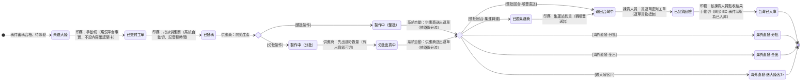

讀完這張卡，你會知道：

- 說出派單狀態（平台介面稱「大陸處理狀態」）追的是外發稿件在外部協力廠端從接單、發稿、製作、出貨、集運到回台入庫或海外交付的整段進程
- 分辨 13 個狀態各代表貨與責任在哪一站，以及海外直發三態與台灣已入庫是終態（後續對帳以撈取終態派單為基準）
- 說出誰推進狀態：管理主責在 [[印務]]（外發承辦，內部稱「凹豆」，含終態「台灣已入庫」）、供應商回報進程、[[揀貨人員]] 以貨運單認列觸發「已到貨品檢」並做點收登記
- 判斷打樣、大貨、補印、急件與委外製作情境為什麼都不是狀態（前四者為印件層屬性圖標、可疊加、急件由印務人工加註；委外製作情境六值是 [[派單]] 自身欄位、非 [[工單]] 屬性，欄位定義見各實體卡）——不同製作情境走同一條狀態鏈，打樣 NG 重打與補印以開新工單（新派單）承載、不在狀態鏈內回圈
- 分辨本卡與 [[生產任務狀態]]（場內製作、粗顆粒）、[[貨運單]]（回台物流與成本分攤）的分工

## 狀態列舉（正本）

> 本段是派單狀態的唯一正本。狀態的新增與修改是商業決策，直接在此卡維護。其他卡（如 [[貨運單]]）引用狀態名、不另列清單。共 13 值。

| 狀態 | 說明 | 對應營運需求 |
|------|------|------------|
| 未送大陸 | 初始；印件已通過審稿、尚未交辦供應商 | 已決定外發、但對方還沒接手，看得出卡在內部交辦 |
| 已交付工單 | 現況平台由 [[印務]] 手動切換、不設內容確認關卡；新設計不設此第二道確認（B9 定案 2026-08-05）——製程已過印務主管審核，[[印務]] 對生產任務執行「交付」即發送，本站僅為現況平台事實保留 | 現況：發送前多一站手動切；新設計：交付即發送 |
| 已發稿 | 印務指派供應商時系統自動切換並記錄發稿時間 | 球已交到廠商手上，責任點與發稿時點都有記錄 |
| 製作中（整批） | 供應商開始生產時切換；一次性製作整批 | 整批與分批投產節奏不同，分開看交期 |
| 製作中（分批） | 供應商開始生產時切換；分批次製作 | 分批時可先收一部分，回收節點與整批不同 |
| 分批出貨中 | 分批製作的後續，或廠商先出部分數量；有出貨即可切，後續以 [[貨運單]] 追蹤 | 分批路徑的在途起點，與製作中分開才追得出貨到哪一批 |
| 已送集運商 | 整批回台走集運轉運：貨已交給集運商集中、待併櫃出貨 | 跨境物流多一站，顯式標出避免「做完了卻收不到貨」對不上 |
| 運回台灣中 | 貨在回台途中（承運商順豐直送可直接進此態；集運轉運由印務於集運站到貨時切換） | 在途與到貨分開，追得出貨卡在海運哪一段 |
| 已到貨品檢 | [[揀貨人員]] 在 [[貨運單]]「認列工單」後觸發，貨抵台待點收（清點＋秤重）。此站做的是數量與到貨確認、不是品檢站的品質驗收（品質把關仍在入庫前最終品檢）；狀態名沿用現況平台用語 | 到貨不等於可用，點收獨立一站 |
| 台灣已入庫 | 終態；[[揀貨人員]] 完成點收（清點＋秤重）登記後，由 [[印務]] 依點收結果手動切換，同時自動同步 EC 後台稿件狀態為已入庫；此後整筆稿件鎖定不可再變更 | 外發進程收尾，鎖定防止事後誤改 |
| 海外直發-分批 | 直達終態；分批直接在海外交付（**本輪範圍外**，見下方註記）| 不回台訂單的分批交付終態 |
| 海外直發-全出 | 直達終態；整批直接在海外交付（**本輪範圍外**）| 不回台訂單的整批交付終態 |
| 海外直發-送大陸客戶 | 直達終態；貨送大陸當地客戶，不經跨境物流（**本輪範圍外**）| 大陸在地交付終態 |

> **海外直發三終態本輪不處理**（Miles 2026-08-01 裁決，見 [[SHP-013-海外直發三終態印件收尾與出貨帳]]）：ERP 只處理台灣 EC 訂單，EC 海外訂單當不存在。三個終態保留在列舉裡是因為現況平台已有這些值（忠於現況事實），但 ERP 端不為它們設計印件收尾與出貨帳——貨不回台就沒有台灣品檢與出貨單，印件與訂單的收尾一律走台灣線既有規則。日後要納入海外訂單時另開新卡。

> 派單與 [[工單]] 為兩個獨立單據、各自資料流（B1 定案 2026-08-05）：唯一交會是建立時點（工單製程審核完成時系統依外包生產任務建立派單）與收尾（貨回場後 [[印務]] 依點收結果對生產任務報工）。本卡不再承載與工單狀態的對應。

## 狀態機圖（UML）

依 UML 狀態機圖記法繪製，轉換標籤採「觸發者：觸發事件」格式。指派供應商與供應商送出運單為系統自動；回台段的貨運單認列由 [[揀貨人員]] 在系統上執行、該動作本身即切「已到貨品檢」（不另設背景自動同步），點收結果登記後的終態由 [[印務]] 切；其餘由對應角色於管理頁切換。ERP 端下拉不設順序限制，可人工修正。

```mermaid
stateDiagram-v2
    direction LR

    [*] --> s_init : 稿件審稿合格、待派發

    state "未送大陸" as s_init
    state "已交付工單" as s_delivered
    state "已發稿" as s_sent
    state "製作中（整批）" as s_full
    state "製作中（分批）" as s_part
    state "分批出貨中" as s_partial_ship
    state "已送集運商" as s_forwarder
    state "運回台灣中" as s_returning
    state "已到貨品檢" as s_inspecting
    state "台灣已入庫" as s_warehoused
    state "海外直發-分批" as s_od_part
    state "海外直發-全出" as s_od_full
    state "海外直發-送大陸客戶" as s_od_cn

    state produce_route <<choice>>
    state ship_route <<choice>>

    s_init --> s_delivered : 印務：手動切（現況平台事實，不設內容確認關卡）
    s_delivered --> s_sent : 印務：指派供應商（系統自動切、記發稿時間）
    s_sent --> produce_route : 供應商：開始生產
    produce_route --> s_full : [整批製作]
    produce_route --> s_part : [分批製作]

    s_part --> s_partial_ship : 供應商：先出部分數量（有出貨即可切）
    s_full --> ship_route : 系統自動：供應商送出運單（依路線分流）
    s_partial_ship --> ship_route : 系統自動：供應商送出運單（依路線分流）
    ship_route --> s_forwarder : [整批回台-集運轉運]
    ship_route --> s_returning : [整批回台-順豐直送]
    ship_route --> s_od_part : [海外直發-分批]
    ship_route --> s_od_full : [海外直發-全出]
    ship_route --> s_od_cn : [送大陸客戶]

    s_forwarder --> s_returning : 印務：集運站到貨（轉順豐送台）
    s_returning --> s_inspecting : 揀貨人員：貨運單認列工單（運單貨物抵台）
    s_inspecting --> s_warehoused : 印務：依揀貨人員點收結果手動切（同步 EC 稿件狀態為已入庫）

    s_warehoused --> [*]
    s_od_part --> [*]
    s_od_full --> [*]
    s_od_cn --> [*]
```

> 期間動作：製作中階段供應商可更新報價至「供應商印件報價」欄位（見 [[派單]] 委外金流），不影響狀態。

## 權限與強制規則

| 規則 | 內容 |
|------|------|
| 派案管理頁切狀態 | 印務（凹豆）；含「已交付工單」與終態「台灣已入庫」|
| 貨運單管理頁切狀態 | [[揀貨人員]]（認列工單觸發已到貨品檢；點收為清點＋秤重的登記動作，不切狀態）|
| 中國廠商端不可寫入的狀態 | 已交付工單、已發稿、已到貨品檢、台灣已入庫——這四態僅由 ERP 端流程寫入；中國廠商端（供應商平台）可更新其餘製作與出貨進程 |
| 入庫鎖定 | 稿件狀態為「台灣已入庫」後，整筆稿件在供應商端不可再變更 |
| 打樣通過與否的判定 | 歸 [[業務]]（與客戶確認）；系統回寫操作歸 [[印務]]（場內、外發無別） |
| 外包大貨 NG 的補印 | 一律退原外包廠、由 [[印務]] 發起（外發內容本為場內無法製作，不存在回台場內補做的岔路）；以開新工單（新派單）承載 |

ERP 端下拉不設狀態順序限制、可批量編輯，用於人工修正；正常流程依上方轉換的觸發者推進。

## 關鍵轉換的營運動機

- 打樣與補印從狀態轉為欄位（[[派單]] 的委外製作情境）→ 動機：打樣、大貨、補印是「這批委外是什麼性質的活」，不是「活做到哪了」；當維度混進狀態鏈，補印與二次打樣都要在鏈上開回圈、鏈越長越難維護。拆成欄位後同一條進程鏈通用，重打與補印以新工單（新派單）另起一條進程。
- 分批路徑顯式建態（製作中（分批）→ 分批出貨中）→ 動機：分批時廠商邊做邊出，不分開就看不出「還在做」與「已在出」的差別，交期追蹤失準。
- 海外直發拆三終態 → 動機：分批直發、整批直發、送大陸客戶的物流與對帳路徑不同，單一「海外直發」態無法區分收尾方式。
- 已到貨品檢與台灣已入庫分兩態 → 動機：到貨後要先點收秤重（見 [[貨運單]] 的認列與秤重），數量與重量確認完才入庫；兩態分開才接得上點收異常的處理窗口。
- 終態作為對帳基準 → 動機：台灣已入庫與海外直發三態是派單的終點，後續對帳撈取終態派單結算委外成本；沒有明確終態就撈不出「這批外發到底花了多少」的封閉集合。
- 整批回台分集運轉運與順豐直送兩法 → 動機：集運轉運多一站（已送集運商），由印務在集運站到貨時往下推；順豐直送直接進運回台灣中，兩條路的追蹤點不同。

## 與其他狀態機的關係

- 派單與 [[生產任務狀態]] 分離：生產任務是內部製作單位、狀態粗顆粒，外發時把外部廠端的細部進程交給派單承載。
- 派單以**廠商×工單**為單位（明細掛 [[生產任務]]）、於工單製程審核完成時系統建立（A2 定案 2026-08-05，as-is 現況以稿件為單位的註記見 [[派單]] § 營運背景）；派單與 [[工單]] 各自資料流、不設狀態對應（B1 定案）。[[派單]] 的「委外製作情境」決定這條進程承載的是打樣、大貨還是補印的活。
- 回台物流的運費、關稅、重量差異與分攤屬 [[貨運單]]，「已到貨品檢」對應貨運單的點收與秤重作業。

## 範圍外

- **生產任務的內部製作狀態與回台後推進**：屬 [[生產任務狀態]]，本卡只到外部廠端進程為止
- **回台物流的運費、關稅、重量差異、分攤、認列**：屬 [[貨運單]]
- **台灣對客戶的出貨**：屬 [[出貨單狀態]]
- **稿件本身的審稿狀態**（稿件未上傳／等待審稿／合格／不合格／已補件／作廢）：屬審稿領域，派單只顯示不承載
- **派單建立時的廠商類型路由細則**：屬派工與發包決策，本卡只承接「已是外發」的派單
- **派單建立的粒度與時機**：屬 [[派單]] § 營運背景（現況與設計定案的差異在彼），本卡只管建立之後的進程
- **台灣外包派單**：進程語意與本卡相同、尚未實作；本卡狀態列舉忠於中國派單的現況平台事實

## 相關卡

- 規則：[[印件生產流程]]（外發與回台進程的流程正本）
- 實體：[[生產任務]]、[[工單]]／[[印件]]（派單綁定對象）、[[貨運單]]（回台物流與運費關稅）
- 狀態機：[[生產任務狀態]]（在途粗狀態由本卡自動映射）、[[出貨單狀態]]、[[工單狀態]]（獨立資料流，僅建立時點交會）
- OQ：[[PT-016-派單狀態13值鏈節點語意與觸發動作]]（已解答封存，節點語意正本已回填本卡）
- 角色：[[印務]]（外發承辦，內部稱「凹豆」；派案與狀態管理主責，含終態「台灣已入庫」）、[[揀貨人員]]（貨運單認列觸發已到貨品檢、點收登記）、[[中國廠商]]（製作與出貨進程回報、期間更新報價）、[[生管]]（在途進度追蹤）
