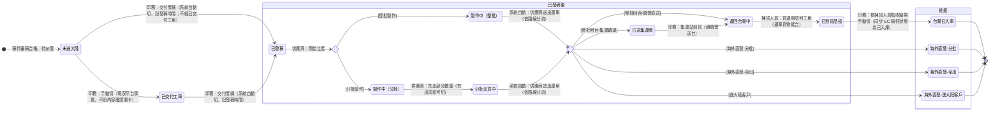

讀完這張卡，你會知道：

- 說出派單狀態（平台介面稱「大陸處理狀態」）追的是外發稿件在外部協力廠端從接單、發稿、製作、出貨、集運到回台入庫或海外交付的整段進程
- 分辨 13 個狀態各代表貨與責任在哪一站，以及海外直發三態與台灣已入庫是終態（終態派單是委外成本對帳的主要撈取範圍，作廢的單另計）；並分辨派單另有一條與進度鏈平行的作廢存在性
- 說出誰推進狀態：管理主責在 [[印務]]（外發承辦，內部稱「凹豆」，含終態「台灣已入庫」）、供應商回報進程、[[揀貨人員]] 以貨運單認列觸發「已到貨品檢」並做點收登記
- 判斷打樣、大貨、補做、急件與委外製作情境為什麼都不是狀態（前四者為印件層屬性圖標、可疊加、自所屬印件帶出——急件取印件的急件選項，設定正本見 [[印件]]；委外製作情境七值是 [[派單]] 自身欄位、非 [[工單]] 屬性，欄位定義見各實體卡）——不同製作情境走同一條狀態鏈，打樣 NG 重打與補做都由另一張派單承載、不在狀態鏈內回圈
- 分辨本卡與 [[生產任務狀態]]（內部製作進度，兩者各記各的）、[[貨運單]]（回台物流與運費關稅）的分工

## 狀態列舉（正本）

> 本段是派單狀態的唯一正本。狀態的新增與修改是商業決策，直接在此卡維護。其他卡（如 [[貨運單]]）引用狀態名、不另列清單。共 13 值。

| 狀態 | 說明 | 對應營運需求 |
|------|------|------------|
| 未送大陸 | 初始；印件已通過審稿、尚未交辦供應商 | 已決定外發、但對方還沒接手，看得出卡在內部交辦 |
| 已交付工單 | 製程已過印務主管審核，[[印務]] 對生產任務執行「交付」即發送、不設第二道內容確認關卡；本站僅為現況平台事實保留，**非必經**（自「未送大陸」執行交付可直接進「已發稿」）| 交付即發送，同一件事不必再按一次確認；本站保留是因為現況平台資料裡存在這個值 |
| 已發稿 | [[印務]] 對外包生產任務執行「交付產線」時系統自動切換並記錄發稿時間，執行交付時要求該筆已指派供應商。**觸發點只有這一個**——現況平台的自動切換掛在「指派供應商」那一刻，把觸發點移到交付是行為變更（D2 拍板甲），不是措辭對齊 | 球已交到廠商手上，責任點與發稿時點都有記錄；單一觸發點才不會出現「已發稿但還沒發送」 |
| 製作中（整批） | 供應商開始生產時切換；一次性製作整批 | 整批與分批投產節奏不同，分開看交期 |
| 製作中（分批） | 供應商開始生產時切換；分批次製作 | 分批時可先收一部分，回收節點與整批不同 |
| 分批出貨中 | 分批製作的後續，或廠商先出部分數量；有出貨即可切，後續以 [[貨運單]] 追蹤 | 分批路徑的在途起點，與製作中分開才追得出貨到哪一批 |
| 已送集運商 | 整批回台走集運轉運：貨已交給集運商集中、待併櫃出貨 | 跨境物流多一站，顯式標出避免「做完了卻收不到貨」對不上 |
| 運回台灣中 | 貨在回台途中（承運商順豐直送可直接進此態；集運轉運由印務於集運站到貨時切換） | 在途與到貨分開，追得出貨卡在海運哪一段 |
| 已到貨品檢 | [[揀貨人員]] 在 [[貨運單]]「認列工單」後觸發，貨抵台待點收（清點＋秤重）。此站做的是數量與到貨確認、不是品檢站的品質驗收（品質把關仍在入庫前最終品檢）；狀態名沿用現況平台用語 | 到貨不等於可用，點收獨立一站 |
| 台灣已入庫 | 終態；[[揀貨人員]] 完成點收（清點＋秤重）登記後，由 [[印務]] 依點收結果手動切換，同時自動同步 EC 後台稿件狀態為已入庫；此後整筆稿件鎖定不可再變更 | 外發進程收尾，鎖定防止事後誤改 |
| 海外直發-分批 | 直達終態；分批直接在海外交付（**本輪範圍外**，見下方註記）| 不回台訂單的分批交付終態 |
| 海外直發-全出 | 直達終態；整批直接在海外交付（**本輪範圍外**）| 不回台訂單的整批交付終態 |
| 海外直發-送大陸客戶 | 直達終態；貨送大陸當地客戶，不經跨境物流（**本輪範圍外**）| 大陸在地交付終態 |

> **海外直發三終態本輪不處理**（Miles 2026-08-01 裁決，見 [[SHP-013-海外直發三終態印件收尾與出貨帳]]）：ERP 只處理台灣 EC 訂單，EC 海外訂單當不存在。三個終態保留在列舉裡是因為現況平台已有這些值（忠於現況事實），但 ERP 端不為它們設計印件收尾與出貨帳——貨不回台就沒有台灣品檢與出貨單，印件與訂單的收尾一律走台灣線既有規則。日後要納入海外訂單時另開新卡。

### 作廢（存在性，不在 13 值鏈上）

派單另有一個與進度鏈平行的存在性：**有效**與**已作廢**。作廢回答的是「這張派單還算不算數」，不是「活做到哪一站」，所以不占 13 值鏈的位置。

| 項目 | 內容 |
|------|------|
| 誰能作廢 | [[印務]]；作廢時必填作廢原因（欄位見 [[派單]]）|
| 什麼時候能作廢 | 任一非終態的派單；已進終態（台灣已入庫、海外直發三態）的派單不可作廢 |
| 作廢後大陸處理狀態 | 凍結在作廢當下那一站，不再推進、也不改寫成別的值 |
| 作廢後這張單去哪 | 退出**執行面**的派單工作清單（不再出現在待交辦與追進度的名單裡）；單本身仍可查。帳務面不隨執行面一起消失——作廢派單在委外成本對帳上列不列、歸哪個月，依有無發稿而不同，取數規則正本見 [[供應商報價規則]] |
| 已發稿之後作廢的門檻 | 廠商可能已投入，[[印務]] 須先與廠商確認停做才能作廢；作廢當下把供應商報價調整為雙方談定的實付額（附調整原因）以結清廠商已發生的成本（金額路徑見 [[派單]] 委外金流），不另設沖帳。該實付額同時是對應外發生產任務轉「報廢」後留在任務帳上的成本（見 [[生產任務狀態]]）|

> 派單與 [[工單]] 為兩個獨立單據、各自資料流（B1 定案 2026-08-05）：唯一交會是建立時點（工單製程審核完成時系統依外包生產任務建立派單）與收尾（貨回場後 [[印務]] 對生產任務報工）。本卡不再承載與工單狀態的對應。

## 狀態機圖（UML）

- 記法：實心圓為初始點、雙圈為終止點、菱形為選擇偽狀態（依轉換條件分流）、轉換標籤採「觸發者：觸發事件」格式。
- 複合狀態＝可被引用的集合詞（成員以本圖為正本，不另立成員表）：「已發稿後」＝稿件已交到協力廠手上、這批活尚未收尾的處境；「終態」＝派單進程已收尾的處境。
- 圖上簡省兩類內容：作廢是與進度鏈平行的存在性、不占 13 值鏈位置（見 § 狀態列舉的作廢段）；[[印務]] 在 ERP 端下拉的人工修正不設順序限制、可批量編輯，不另畫弧（見轉換表「任一狀態 → 任一狀態」列）。

```mermaid
stateDiagram-v2
    direction LR

    [*] --> s_init : 稿件審稿合格、待派發

    state "未送大陸" as s_init
    state "已交付工單" as s_delivered

    state "已發稿後" as Sent {
        direction LR
        state "已發稿" as s_sent
        state "製作中（整批）" as s_full
        state "製作中（分批）" as s_part
        state "分批出貨中" as s_partial_ship
        state "已送集運商" as s_forwarder
        state "運回台灣中" as s_returning
        state "已到貨品檢" as s_inspecting
        state produce_route <<choice>>
        state ship_route <<choice>>

        s_sent --> produce_route : 供應商：開始生產
        produce_route --> s_full : [整批製作]
        produce_route --> s_part : [分批製作]
        s_part --> s_partial_ship : 供應商：先出部分數量（有出貨即可切）
        s_full --> ship_route : 系統自動：供應商送出運單（依路線分流）
        s_partial_ship --> ship_route : 系統自動：供應商送出運單（依路線分流）
        ship_route --> s_forwarder : [整批回台-集運轉運]
        ship_route --> s_returning : [整批回台-順豐直送]
        s_forwarder --> s_returning : 印務：集運站到貨（轉順豐送台）
        s_returning --> s_inspecting : 揀貨人員：貨運單認列工單（運單貨物抵台）
    }

    state "終態" as Final {
        state "台灣已入庫" as s_warehoused
        state "海外直發-分批" as s_od_part
        state "海外直發-全出" as s_od_full
        state "海外直發-送大陸客戶" as s_od_cn
    }

    s_init --> s_delivered : 印務：手動切（現況平台事實，不設內容確認關卡）
    s_init --> s_sent : 印務：交付產線（系統自動切、記發稿時間；不經已交付工單）
    s_delivered --> s_sent : 印務：交付產線（系統自動切、記發稿時間）

    ship_route --> s_od_part : [海外直發-分批]
    ship_route --> s_od_full : [海外直發-全出]
    ship_route --> s_od_cn : [送大陸客戶]
    s_inspecting --> s_warehoused : 印務：依揀貨人員點收結果手動切（同步 EC 稿件狀態為已入庫）

    s_warehoused --> [*]
    s_od_part --> [*]
    s_od_full --> [*]
    s_od_cn --> [*]
```

> 期間動作：製作中階段供應商可更新報價至「供應商報價」欄位（見 [[派單]] 委外金流），不影響狀態。

## 轉換條件與觸發事件

| 轉換 | 觸發事件 | 條件 |
|------|---------|------|
| （建立）→ 未送大陸 | 工單製程審核完成時系統依外包生產任務建立派單 | 稿件審稿合格、待派發；一張派單＝廠商×工單 |
| 未送大陸 → 已交付工單 | [[印務]] 於派案管理頁手動切換 | 現況平台事實保留、非必經；不設內容確認關卡 |
| 未送大陸 → 已發稿 | [[印務]] 對外包生產任務執行「交付產線」，系統自動切換並記錄發稿時間 | 該筆生產任務已指派供應商；不經「已交付工單」直達 |
| 已交付工單 → 已發稿 | 同上 | 同上 |
| 已發稿 → 製作中（整批） | 供應商開始生產 | 一次性製作整批 |
| 已發稿 → 製作中（分批） | 供應商開始生產 | 分批次製作 |
| 製作中（分批）→ 分批出貨中 | 供應商先出部分數量 | 有出貨即可切，後續以 [[貨運單]] 追蹤 |
| 製作中（整批）→ 已送集運商 | 系統依供應商送出運單自動分流 | 整批回台且走集運轉運 |
| 製作中（整批）→ 運回台灣中 | 同上 | 整批回台且走順豐直送 |
| 分批出貨中 → 已送集運商 | 同上 | 分批回台且走集運轉運 |
| 分批出貨中 → 運回台灣中 | 同上 | 分批回台且走順豐直送 |
| 製作中（整批）／分批出貨中 → 海外直發-分批／海外直發-全出／海外直發-送大陸客戶 | 同上 | 貨不回台、於海外交付；直達終態，本輪範圍外（見 § 狀態列舉的裁決註記）|
| 已送集運商 → 運回台灣中 | [[印務]] 於集運站到貨時切換（轉順豐送台） | 僅集運轉運路線 |
| 運回台灣中 → 已到貨品檢 | [[揀貨人員]] 在 [[貨運單]] 執行「認列工單」 | 運單貨物抵台；該動作本身即切，不另設背景自動同步 |
| 已到貨品檢 → 台灣已入庫 | [[印務]] 依 [[揀貨人員]] 點收（清點＋秤重）結果手動切換 | 終態；同時同步 EC 後台稿件狀態為已入庫，此後整筆稿件鎖定不可再變更 |
| 任一狀態 → 任一狀態 | [[印務]] 於 ERP 端下拉修正 | 不設順序限制、可批量編輯，僅供人工修正；正常流程仍依上列各轉換的觸發者推進 |
| 任一非終態（有效）→ 已作廢 | [[印務]] 作廢派單並填作廢原因 | 存在性轉換、不在 13 值鏈上（故不畫於上圖）；已發稿之後作廢須先與廠商確認停做並把供應商報價調整為談定的實付額，作廢後大陸處理狀態凍結原地、單退出執行面的派單工作清單，帳務面的列入與歸月規則見 [[供應商報價規則]] |

## 關鍵轉換的營運動機

- 打樣與補做從狀態轉為欄位（[[派單]] 的委外製作情境）→ 動機：打樣、大貨、補做是「這批委外是什麼性質的活」，不是「活做到哪了」；當維度混進狀態鏈，補做與二次打樣都要在鏈上開回圈、鏈越長越難維護。拆成欄位後同一條進程鏈通用：打樣重打以新工單（連帶新派單）另起一條進程，補做則在原工單加開生產任務、外發時為該任務另開一張派單。
- 分批路徑顯式建態（製作中（分批）→ 分批出貨中）→ 動機：分批時廠商邊做邊出，不分開就看不出「還在做」與「已在出」的差別，交期追蹤失準。
- 海外直發拆三終態 → 動機：分批直發、整批直發、送大陸客戶的物流與對帳路徑不同，單一「海外直發」態無法區分收尾方式。
- 已到貨品檢與台灣已入庫分兩態 → 動機：到貨後要先點收秤重（見 [[貨運單]] 的認列與秤重），數量與重量確認完才入庫；兩態分開才接得上點收異常的處理窗口。
- 終態作為對帳基準 → 動機：台灣已入庫與海外直發三態是派單的終點，後續對帳撈取終態派單結算委外成本；沒有明確終態就撈不出「這批外發到底花了多少」的封閉集合。已發稿後才作廢的單沒有終態日、卻仍有要付給廠商的錢，因此另有一套列入與歸月的算法（算法見 [[供應商報價規則]]）。
- 作廢做成存在性而不是鏈上第 14 值 → 動機：13 值鏈回答的是「活做到哪一站」，作廢回答的是「這張單還算不算數」，兩件事混在同一條鏈上會讓鏈的語意不純、每個節點都要多解釋一次；現況系統的收尾本來就靠上層單據作廢（稿件作廢、訂單已取消），鏈本身沒有取消態，做成平行存在性與現況同構 → 例子：某派單走到「製作中（整批）」時上游印件棄用，印務作廢該單，狀態就停在「製作中（整批）」不改寫，事後仍看得出當初停在哪一站。
- 已發稿之後作廢要先與廠商確認停做 → 動機：發稿代表球已在廠商手上、可能已投料開工，系統單方面把單收掉不會讓對方停工，反而讓已投入的成本無人認領；先確認停做才作廢，等於把「對外把話講清楚」設成作廢的前提。已發生的成本以調整供應商報價結清（金額路徑見 [[派單]] 委外金流），與點收超交、短少折價共用同一條路徑，不為作廢另造一套沖帳 → 例子：廠商已裁好料才接到停做通知，雙方談定材料費後，印務把供應商報價改成該金額再作廢。
- 整批回台分集運轉運與順豐直送兩法 → 動機：集運轉運多一站（已送集運商），由印務在集運站到貨時往下推；順豐直送直接進運回台灣中，兩條路的追蹤點不同。

## 與其他狀態機的關係

- 派單與 [[生產任務狀態]] 分離：生產任務是內部製作單位、狀態粗顆粒，外發時把外部廠端的細部進程交給派單承載。
- 派單以**廠商×工單**為單位（明細掛 [[生產任務]]）、於工單製程審核完成時系統建立（A2 定案 2026-08-05，as-is 現況以稿件為單位的註記見 [[派單]] § 營運背景）；派單與 [[工單]] 各自資料流、不設狀態對應（B1 定案）。[[派單]] 的「委外製作情境」決定這條進程承載的是打樣、大貨還是補做的活。
- 回台物流的運費、關稅、重量差異與分攤屬 [[貨運單]]，「已到貨品檢」對應貨運單的點收與秤重作業。
- 上游收掉活時只提示、不自動作廢派單：[[印件狀態]] 轉已棄用、[[訂單狀態]] 轉已取消、或工單異動砍掉外包生產任務時，系統提示 [[印務]] 處理名下派單，由印務判斷要不要停做、怎麼跟廠商收尾（作廢規則見本卡 § 狀態列舉的作廢段）。判斷所需的上游事實在派單上看得到——所屬印件與訂單的當下狀態隨上游即時反映（欄位見 [[派單]]），印務據此挑出上游已棄用或已取消的派單來處理，不另造提示記號。

## 範圍外

- **生產任務的內部製作狀態與回台後推進**：屬 [[生產任務狀態]]，本卡只到外部廠端進程為止
- **回台物流的運費、關稅、重量差異、分攤、認列**：屬 [[貨運單]]
- **台灣對客戶的出貨**：屬 [[出貨單狀態]]
- **稿件本身的審稿狀態**（稿件未上傳／等待審稿／合格／不合格／已補件／作廢）：屬審稿領域，派單只顯示不承載
- **打樣通過與否的判定與系統回寫分工**：屬 [[打樣流程]] 與 [[印務]] 職責，本卡只承載派單自身的進程推進
- **外包大貨 NG 的補做由誰發起、由哪張單承載**：屬 [[印件生產流程]]，本卡只承載派單自身的進程推進
- **派單建立時的廠商類型路由細則**：屬派工與發包決策，本卡只承接「已是外發」的派單
- **派單建立的粒度與時機**：屬 [[派單]] § 營運背景（現況與設計定案的差異在彼），本卡只管建立之後的進程
- **台灣外包派單**：進程語意與本卡相同、尚未實作；本卡狀態列舉忠於中國派單的現況平台事實

## 相關卡

- 規則：[[印件生產流程]]（外發與回台進程的流程正本）、[[供應商報價規則]]（委外成本對帳的列入與歸月規則正本，含作廢派單）
- 實體：[[生產任務]]、[[工單]]／[[印件]]（派單綁定對象）、[[派單]]（本狀態機依附的主實體，含上游印件與訂單狀態的可見欄位）、[[貨運單]]（回台物流與運費關稅）
- 狀態機：[[生產任務狀態]]（各記各的、本卡不映射過去；外發已發稿是其報廢分流的判準）、[[印件狀態]]／[[訂單狀態]]（上游收掉活時的提示來源）、[[出貨單狀態]]、[[工單狀態]]（獨立資料流，僅建立時點交會）
- OQ：[[PT-016-派單狀態13值鏈節點語意與觸發動作]]（已解答封存，節點語意正本已回填本卡）、[[PT-044-派單缺作廢與取消收尾路徑]]（已解答封存，作廢存在性拍板紀錄）
- 角色：[[印務]]（外發承辦，內部稱「凹豆」；派案與狀態管理主責，含終態「台灣已入庫」）、[[揀貨人員]]（貨運單認列觸發已到貨品檢、點收登記）、[[中國廠商]]（製作與出貨進程回報、期間更新報價）、[[生管]]（在途進度追蹤）
