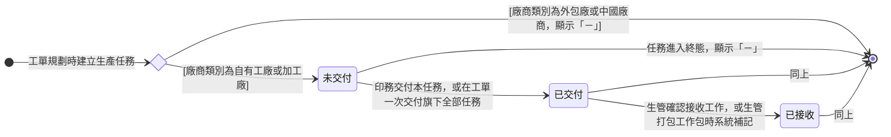

讀完這張卡，你會知道：

- 認識 [[生產任務]] 的「交付狀態」：系統依交付時間與接收工作推導的衍生狀態，回答這筆自有工廠或加工廠的活交給現場了沒、現場接手了沒
- 看懂各個交付狀態代表球在誰手上
- 掌握推導條件，以及外發任務與已收尾的任務為什麼顯示「－」
- 理解任務層的交付怎麼決定工單何時轉「工單已交付」

## 狀態列舉（正本）

> 本段是生產任務交付狀態的唯一正本。狀態的新增與修改是商業決策，直接在此卡維護。

| 狀態 | 說明 | 對應營運需求 |
|------|------|------------|
| 未交付 | 初始（自有工廠與加工廠任務）；本任務的交付時間無值 | 生管知道這筆還沒交到產線 |
| 已交付 | 交付時間有值，接收工作無值 | 交了還沒人接，看得出卡在生管 |
| 已接收 | 接收工作有值 | 現場已接手；沒人接的交付等於沒交付 |

本狀態不設終態：廠商類別為外包廠或中國廠商的任務，以及生產任務狀態屬「終態」（[[生產任務狀態]]）的任務，本欄顯示「－」、不推導。

### 推導條件

依序判定，第一個成立的就是結果。交付時間、接收工作、廠商類別的欄位見 [[生產任務]]。

| 順序 | 結果 | 條件 |
|------|------|------|
| 1 | 「－」 | 廠商類別為外包廠或中國廠商，或生產任務狀態屬「終態」 |
| 2 | 已接收 | 接收工作有值 |
| 3 | 已交付 | 交付時間有值 |
| 4 | 未交付 | 其餘 |

## 狀態機圖（UML）

- 記法：實心圓為初始點、菱形為選擇偽狀態（依廠商類別分流）、轉換標籤採「觸發事件 [轉換條件]」格式；本狀態沒有手動改狀態的動作，每條弧都是交付、接收等既有動作寫入欄位後的推導結果。
- 「－」不是狀態，是不推導的標示，圖上畫成直接結束；任務因報工修改自「已完成」退回時（[[生產任務狀態]]），本狀態依當下欄位重新推導。
- 銜接：旗下有效生產任務的交付時間到齊時，[[工單狀態]] 推進「工單已交付」。

## 轉換條件與觸發事件

| 轉換 | 觸發事件 | 條件 |
|------|---------|------|
| （建立）→ 未交付 | 工單規劃時建立生產任務 | 廠商類別為自有工廠或加工廠 |
| （建立）→ 「－」 | 工單規劃時建立生產任務 | 廠商類別為外包廠或中國廠商 |
| 未交付 → 已交付 | [[印務]] 交付本任務，或在 [[工單]] 一次交付旗下全部生產任務 | 系統寫入交付時間與操作人（欄位見 [[生產任務]]） |
| 已交付 → 已接收 | [[生管]] 確認接收工作（[[印務]] 與 [[印務主管]] 可代行，代行範圍見 [[生管]]） | 系統寫入接收工作；寫入後不清除 |
| 已交付 → 已接收 | [[生管]] 打包派工時，勾選的任務尚未接收（打包見 [[工作包]]） | 系統補記接收工作：接收人為派工者、時間為派工時間；寫入後不清除 |
| 任一狀態 → 「－」 | 任務進入「終態」（[[生產任務狀態]]） | 不再推導 |

## 關鍵轉換的營運動機

- 交付以生產任務為單位記錄 → 動機：工單「全部任務交付」要有逐筆依據，才看得出是哪一筆還沒交；印務多半在工單上一次交完，批次交付只是同一個動作一次做完 → 例子：一張工單三筆自有工廠任務，印務在工單一次交付，三筆同時轉「已交付」；生管接收印刷那筆後，只有印刷轉「已接收」，另兩筆仍是「已交付」。
- 加工廠任務與自有工廠同樣推導 → 動機：加工廠算場內，交了沒、現場接了沒同樣要看得出來，狀態變化不因場內或加工而不同；差別只在加工廠的活由印務報工、不打包給師傅 → 例子：同一張工單的上光加工廠任務，印務交付後為「已交付」，生管確認接收後轉「已接收」。
- 外發任務（外包廠與中國廠商）顯示「－」→ 動機：外發的活一交付就是派單發送給廠商，沒有生管接收這一步，外部進度另有 [[派單狀態]] 追蹤，這裡再顯示一套只會重複 → 例子：同一張工單的燙金外包任務交付後，本欄顯示「－」，進度看它的派單。

## 與其他狀態機的關係

- [[工單狀態]]：旗下有效生產任務（不含已作廢、報廢）的交付時間皆有值時，工單「製程審核完成 → 工單已交付」；交付時間各廠商類別都記，本狀態只對自有工廠與加工廠任務推導。轉換正本在 [[工單狀態]]。
- [[工單狀態]] 的印件短出結案把旗下任務批次推「已完成」時，這些任務的本欄顯示「－」。
- 工單異動加開的生產任務交付時間無值，為「未交付」；交付後工單依 [[工單狀態]] 既有轉換推進。
- [[生產任務狀態]]：任務屬「終態」時本欄顯示「－」；兩者互不推動。
- [[生產任務轉交狀態]]：同一筆任務的另一條衍生進度，兩者互不影響。
- [[派單狀態]]：外發任務交付後的外部進程在此追蹤，不映射到本狀態。

## 範圍外

- 交付時間、接收工作、廠商類別的欄位定義 → [[生產任務]]（正本）
- 派工怎麼分組、生管怎麼排程 → 場內合批見 [[工作包]]，派工排程規劃屬排程模組
- 外發任務交付後的外部進程 → [[派單狀態]]
- 手動轉換：不設；每一格都由欄位推導

## 相關卡

- 規則：[[印件生產流程]]（交付產線與接收在生產流程中的位置）
- 實體：[[生產任務]]（本狀態依附的主實體）、[[工單]]（批次交付的入口）
- 狀態機：[[工單狀態]]（交付到齊推進工單已交付）、[[生產任務狀態]]、[[生產任務轉交狀態]]、[[派單狀態]]
- 角色：[[印務]]（交付）、[[生管]]（確認接收，主責）、[[印務主管]]（代行接收）
