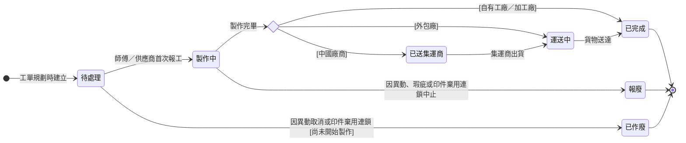

## 概述

生產任務（ProductionTaskStatus）是生產流程裡真正動手做的最底層單位：一筆實際派給師傅或供應商的活。它的進度是整條向上反映鏈的源頭——師傅或供應商一報工，這筆任務就推進，連帶把任務、工單、印件、訂單一路往上帶動。

最大特色是**工廠類型決定狀態路徑**：自有工廠與加工廠做完就算完成；外包廠做完還要送回來，多一段「運送中」；中國廠商做完先送集運商集中再運回，多「已送集運商」一段。把在途狀態顯式建出來，現場與業務才看得出貨卡在哪一段、不會把「在路上」誤當成「已到」。怎麼往上彙整、怎麼算做齊的規則正本在 [[齊套邏輯]]，本卡只定義狀態與轉換、不複述規則。

## 狀態列舉（正本）

> 本段是生產任務狀態的唯一正本。狀態的新增與修改是商業決策，直接在此卡維護。

| 狀態 | 說明 | 對應營運需求 |
|------|------|------------|
| 待處理 | 初始；生產任務已建立，等待師傅或供應商開始做。指派師傅只是欄位更新，不觸發狀態變更 | 排程定了不等於動工了，狀態忠於現場事實 |
| 製作中 | 首次報工觸發，師傅或供應商已開始做 | 一報工即推進並往上帶動各層，現場不必另外更新上層狀態 |
| 已送集運商 | 中國廠商做完、貨已交給集運商集中（僅中國廠商路徑） | 跨境物流多一站，顯式標出避免「做完了卻收不到貨」對不上 |
| 運送中 | 貨物在回程路上（外包廠與中國廠商路徑） | 在途與到貨分開看，業務與生管追得出貨卡在哪一段 |
| 已完成 | 終態；製作完畢（自有／加工廠）或貨物送達（外包／中國廠商） | 完成事實往上彙整進齊套統計 |
| 已作廢 | 終態；尚未開始製作即因異動取消（無成本） | 派錯或需求變更時乾淨收掉，不留無效任務污染進度 |
| 報廢 | 終態；製作中因異動或瑕疵中止（已有成本） | 與已作廢區分有無投入成本，損耗看得見 |

### 依工廠類型的路徑

| 工廠類型 | 路徑 |
|---------|------|
| 自有工廠 | 待處理 → 製作中 → 已完成 |
| 加工廠 | 待處理 → 製作中 → 已完成（與自有工廠相同） |
| 外包廠 | 待處理 → 製作中 → 運送中 → 已完成 |
| 中國廠商 | 待處理 → 製作中 → 已送集運商 → 運送中 → 已完成 |

## 狀態機圖（UML）

依 UML 狀態機圖記法繪製：實心圓為初始點、雙圈為終止點、菱形為分流判斷、轉換標籤採「觸發事件 [守衛條件]」格式。製作完畢後的去向由工廠類型決定。

## 轉換條件與觸發事件

| 轉換 | 觸發事件 | 條件 |
|------|---------|------|
| （建立）→ 待處理 | 工單規劃時建立生產任務 | 指派師傅為欄位更新，不觸發狀態變更 |
| 待處理 → 製作中 | 師傅（自有／加工）或供應商（外包／中國）首次報工 | 向上反映鏈的起點，往上帶動任務／工單各層 |
| 製作中 → 已完成 | 製作完畢 | 僅自有工廠／加工廠路徑 |
| 製作中 → 運送中 | 供應商標記製作完畢 | 僅外包廠路徑 |
| 製作中 → 已送集運商 | 供應商標記製作完畢、貨交集運商 | 僅中國廠商路徑 |
| 已送集運商 → 運送中 | 集運商出貨 | 僅中國廠商路徑 |
| 運送中 → 已完成 | 貨物送達 | 外包廠與中國廠商路徑 |
| 待處理 → 已作廢 | 因異動取消，或印件棄用連鎖 | 尚未開始製作（無成本） |
| 製作中 → 報廢 | 因異動或瑕疵中止，或印件棄用連鎖 | 已有投入成本，報廢讓已報工成本可結算 |

## 關鍵轉換的營運動機

- 待處理 → 製作中（首次報工）→ 動機：以報工為觸發點，現場一開始做、系統各層自動跟上，師傅與供應商只做一個動作、不必另外更新上層狀態 → 例子：師傅對 ORD-2026-0512 的印刷任務報第一筆工，生產任務轉「製作中」，所屬任務、工單同步反映。
- 外包／中國廠商的在途狀態 → 動機：遠端工廠做完不等於貨已到手，「運送中」「已送集運商」顯式建出來，生管才追得出貨卡在哪一段、預估何時能進下一步 → 例子：中國廠商的盒型任務顯示「已送集運商」五天未動，生管即可追集運商而非追工廠。
- 已作廢與報廢分兩個終態 → 動機：還沒開做就取消（無成本）與做到一半中止（已有成本）對成本與損耗統計意義不同，分開才看得見損耗 → 例子：異動把 500 份改 300 份，未開工的加工任務作廢、已印一半的印刷任務報廢重開。

## 品檢型任務

品檢（QC）已併入生產任務框架：型別＝品檢的生產任務，每張印件強制配一筆，共用本卡的狀態機、不另設獨立狀態。與一般生產任務的差異：

- 品檢任務的進度**不走向上反映鏈**（不帶動任務／工單推進），它的完成結果直接影響印件的入庫數量。
- 來源生產任務作廢時，關聯的品檢任務一併作廢，避免源頭沒了、品檢還掛著。
- 不良品處置（重工／允收／報廢）走不符合報告機制，屬品檢規則，不在本卡。

## 與其他狀態機的關係

- 生產任務是向上反映鏈的起點：首次報工 → [[任務狀態|任務]] 製作中 → [[工單狀態|工單]] 製作中 → [[印件狀態|印件]] 印製維度推進 → [[訂單狀態|訂單]] 製作中。完整多層鏈路見 [[印件狀態]]。
- 做齊的數量往上彙整到任務與工單，齊套統計見 [[齊套邏輯]]。
- 異動流程中的取消與中止由 [[任務狀態]] 的異動鏈往下落到本層（作廢／報廢）。
- [[印件狀態|印件]] 轉「已棄用」（訂單取消、單一印件取消製作）時連鎖到本層：已報工的轉報廢、未開工的轉已作廢，讓已投入成本可結算；中間的工單／任務層連動行為待 [[PI-003-印件棄用時工單與任務連動行為|PI-003]] 拍板。

## 範圍外

- **多筆生產任務怎麼彙整成任務／工單完成度**（取最少原則、四層計算）：系統會自動彙整——本卡只承諾此行為，公式屬 [[齊套邏輯]]（規則正本），實作時勿自行發明
- 數量在不同計量單位間的換算 → 見 [[數量換算規則]]
- 派工怎麼分組、生管怎麼指派 → 見 [[任務狀態]]（按工廠分組）與派工排程規劃
- 品檢的判定標準與不良品處置細節 → 屬品檢規則，不在本卡

## 相關卡

- 規則：[[齊套邏輯]]（向上彙整與做齊判定正本）、[[數量換算規則]]、[[印件生產流程]]
- 實體：[[生產任務]]（本狀態機依附的主實體）
- 狀態機：[[任務狀態]]／[[工單狀態]]／[[印件狀態]]／[[訂單狀態]]（由下往上的反映鏈）
- 角色：[[師傅]]／供應商（報工推進）、[[印務]]（異動下的作廢與報廢）、[[品檢人員]]（品檢型任務）
