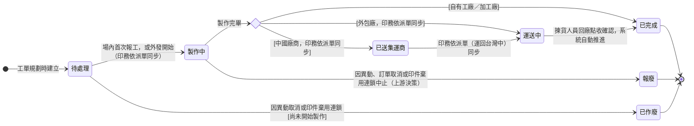

## 概述

生產任務（ProductionTaskStatus）是生產流程裡真正動手做的最底層單位：一筆實際派給師傅或供應商的活。它的進度是整條向上反映鏈的源頭——師傅或供應商一報工，這筆任務就推進，連帶把任務、工單、印件、訂單一路往上帶動。

最大特色是**工廠類型決定狀態路徑**：自有工廠與加工廠在場內做完就算完成；外包廠做完還要送回來，多一段「運送中」；中國廠商做完先送集運商集中再運回，多「已送集運商」一段。把在途狀態顯式建出來，現場與業務才看得出貨卡在哪一段、不會把「在路上」誤當成「已到」。

外發（外包廠、中國廠商）的這幾段外發物流狀態，是**工單視角的粗進度**，由 [[印務]] 依 [[派單]] 的狀況手動同步更新回工單——派單是外發委外單，持詳細的 [[派單狀態]]（大陸處理狀態 14 值，記外部廠商的打樣／大貨／補印／集運／回台當地進程），生產任務只記「這張工單的貨到哪一段」的粗狀態。**兩個實體不重疊**：派單是「那張外發單的細節」、生產任務是「工單自己的貨流到哪了」，印務看派單、手動把粗狀態同步回生產任務。怎麼往上彙整、怎麼算做齊的規則正本在 [[齊套邏輯]]，本卡只定義狀態與轉換、不複述規則。

## 狀態列舉（正本）

> 本段是生產任務狀態的唯一正本。狀態的新增與修改是商業決策，直接在此卡維護。

| 狀態 | 說明 | 對應營運需求 |
|------|------|------------|
| 待處理 | 初始；生產任務已建立，等待師傅或供應商開始做。指派師傅只是欄位更新，不觸發狀態變更 | 排程定了不等於動工了，狀態忠於現場事實 |
| 製作中 | 已開始做：場內由首次報工觸發；外發則由印務依 [[派單]] 開始製作的狀況同步 | 一推進即往上帶動各層，現場不必另外更新上層狀態 |
| 已送集運商 | 中國廠商做完、貨已交集運商集中（僅中國廠商路徑）；印務依 [[派單]] 大陸處理狀態手動同步 | 跨境物流多一站，顯式標出避免「做完了卻收不到貨」對不上 |
| 運送中 | 貨物在回程路上（外包廠與中國廠商路徑）；印務依 [[派單]]（運回台灣中）／外發回報手動同步 | 在途與到貨分開看，業務與生管追得出貨卡在哪一段 |
| 已完成 | 終態；場內製作完畢（自有／加工廠），或外發貨物回廠完成點收（揀貨人員點收確認即自動推進，中國線與台灣外包流程一致） | 完成事實往上彙整進齊套統計 |
| 已作廢 | 終態；尚未開始製作即因異動取消（無成本） | 派錯或需求變更時乾淨收掉，不留無效任務污染進度 |
| 報廢 | 終態；製作中因上游決策中止——異動、訂單取消或印件棄用連鎖（已有成本）。品質缺口不走此終態（見 § 品檢與本卡的關係） | 與已作廢區分有無投入成本，損耗看得見 |

### 依工廠類型的路徑

外發物流段（運送中／已送集運商）由印務依 [[派單]] 狀況手動同步；派單的詳細 14 值外部進程見 [[派單狀態]]，兩實體不重疊。

| 工廠類型 | 路徑 |
|---------|------|
| 自有工廠 | 待處理 → 製作中 → 已完成 |
| 加工廠 | 待處理 → 製作中 → 已完成（與自有工廠相同） |
| 外包廠 | 待處理 → 製作中 → 運送中 → 已完成（外發；外部詳細進程見 [[派單狀態]]，台灣外包派單模組尚未實作） |
| 中國廠商 | 待處理 → 製作中 → 已送集運商 → 運送中 → 已完成（外發；外部詳細進程見 [[派單狀態]]，回台運費關稅見 [[貨運單]]） |

## 狀態機圖（UML）

依 UML 狀態機圖記法繪製：實心圓為初始點、雙圈為終止點、菱形為分流判斷、轉換標籤採「觸發事件 [守衛條件]」格式。製作完畢後的去向由工廠類型決定；外發的在途段由印務依 [[派單]] 手動同步（外部詳細進程不在本圖，屬 [[派單狀態]]）。

## 轉換條件與觸發事件

| 轉換 | 觸發事件 | 條件 |
|------|---------|------|
| （建立）→ 待處理 | 工單規劃時建立生產任務 | 指派師傅為欄位更新，不觸發狀態變更 |
| 待處理 → 製作中 | 場內：師傅（自有／加工）首次報工；外發：印務依 [[派單]] 開始製作（已發稿／大貨製作）的狀況同步 | 向上反映鏈的起點，往上帶動任務／工單各層 |
| 製作中 → 已完成 | 場內製作完畢 | 僅自有工廠／加工廠路徑 |
| 製作中 → 運送中 | 印務依 [[派單]]／外發回報「貨在回程」手動同步 | 僅外包廠路徑 |
| 製作中 → 已送集運商 | 印務依 [[派單]] 大陸處理狀態「已送集運商」手動同步 | 僅中國廠商路徑 |
| 已送集運商 → 運送中 | 印務依 [[派單]]「運回台灣中」手動同步 | 僅中國廠商路徑 |
| 運送中 → 已完成 | 揀貨人員完成回廠點收確認（清點＋秤重），系統自動推進並將貨登記在暫存區——外包流程一致（2026-07-20 拍板）：中國線的點收載體為 [[貨運單]] 明細、台灣外包直接對生產任務做點收確認（外包派單模組成形後再評估掛單） | 外包廠與中國廠商路徑；點收異常（短少／損壞）回報印務處理 |
| 待處理 → 已作廢 | 因異動取消，或印件棄用連鎖 | 尚未開始製作（無成本） |
| 製作中 → 報廢 | 因異動、訂單取消中止，或印件棄用連鎖（純上游決策） | 已有投入成本，報廢讓已報工成本可結算；品質缺口不走此轉換（東西做壞的處置見 § 品檢與本卡的關係） |

## 關鍵轉換的營運動機

- 待處理 → 製作中 → 動機：以開始動工為觸發點，現場一開始做、系統各層自動跟上 → 例子：師傅對 ORD-2026-0512 的印刷任務報第一筆工，生產任務轉「製作中」，所屬任務、工單同步反映。
- 外發在途段由印務依派單手動同步（已送集運商／運送中）→ 動機：外發委外單的詳細外部進程（打樣多階、大貨整批分批、補印、海外直發）放在獨立的 [[派單]]（[[派單狀態]]）追蹤，生產任務只留工單視角的粗在途狀態，由印務看派單後手動同步回工單——兩實體各記各的、不重疊，避免外部細節撐胖內部狀態，也讓「貨卡在哪一段」在工單上一眼可見 → 例子：某中國廠商盒型派單顯示「已送集運商」五天未動，印務據此把該生產任務同步為「已送集運商」並追集運商；運回台灣後再同步為「運送中」，回場後由揀貨人員做運單點收（清點＋秤重）確認，系統自動推「已完成」。
- 已作廢與報廢分兩個終態 → 動機：還沒開做就取消（無成本）與做到一半中止（已有成本）對成本與損耗統計意義不同，分開才看得見損耗 → 例子：異動把 500 份改 300 份，未開工的加工任務作廢、已印一半的印刷任務報廢重開。

## 品檢與本卡的關係

**品檢不是生產任務**（2026-07-21 拍板；原「品檢型任務」模型廢止，決策脈絡見 [[QC-002-QC兩張wiki卡退役或保留|QC-002]]）。品檢以印件層 [[品檢紀錄]] 承載：品檢人員對送抵品檢站的貨分次驗、一次驗收一筆，累計通過即入庫（可出貨）。本卡的生產任務只涵蓋**製作工序**；印件工序依賴圖終點（無下游的生產任務）的產出送品檢站，待驗清單與品檢規則見 [[印件生產流程]] 與 [[齊套邏輯]]。

**「工作中止」與「東西做壞」分兩軸處理**（沿用）：任務終態「報廢／已作廢」只留給整份工作中止（異動、訂單取消、印件棄用連鎖等上游決策）；東西做壞的處置不動任務狀態——工序中途做壞屬過程損耗，師傅報工照常填不良品數（不設「正常損耗」門檻、無現場分支判斷）、任務以重做湊齊目標數；成品缺口由 [[品檢紀錄]] 的不通過數字承載，不符合報告單一律系統自動建（無人工開單），[[印務]] 於其上決策處置（補做／客戶照收／報廢），補做接力見 [[QC不通過補生產]]。

## 與其他狀態機的關係

- 生產任務是向上反映鏈的起點：首次報工 → [[任務狀態|任務]] 製作中 → [[工單狀態|工單]] 製作中 → [[印件狀態|印件]] 印製維度推進 → [[訂單狀態|訂單]] 製作中。完整多層鏈路見 [[印件狀態]]。
- 做齊的數量往上彙整到任務與工單，齊套統計見 [[齊套邏輯]]。
- 異動流程中的取消與中止由 [[任務狀態]] 的異動鏈往下落到本層（作廢／報廢）。
- [[印件狀態|印件]] 轉「已棄用」時連鎖到本層：已報工的轉報廢、未開工的轉已作廢；中間的工單／任務層連動行為待 [[PI-003-印件棄用時工單與任務連動行為|PI-003]] 拍板。
- 外發委外的詳細外部進程（大陸處理狀態 14 值）正本在 [[派單狀態]]，本卡的外發在途段（已送集運商／運送中）是工單視角的粗狀態、由印務依派單手動同步；回台跨境物流與運費關稅分攤見 [[貨運單]]。兩實體不重疊。

## 範圍外

- **多筆生產任務怎麼彙整成任務／工單完成度**（取最少原則、四層計算）：系統會自動彙整——本卡只承諾此行為，公式屬 [[齊套邏輯]]（規則正本），實作時勿自行發明
- 外發回場的銜接已定（2026-07-20 拍板，中國線與台灣外包流程一致）：揀貨人員做回廠點收（清點＋秤重）確認即自動推進本卡「運送中 → 已完成」並登記暫存區；中國線的點收載體為 [[貨運單]] 明細、台灣外包直接對生產任務做點收確認（外包派單模組成形後再評估掛單），決策脈絡見 [[PT-008-外發回廠流轉的系統設計範圍|PT-008]]
- 數量在不同計量單位間的換算 → 見 [[數量換算規則]]
- 派工怎麼分組、生管怎麼指派 → 見 [[任務狀態]]（按工廠分組）與派工排程規劃
- 品檢的判定標準與不良品處置細節 → 屬品檢規則（[[品檢紀錄]]），不在本卡

## 相關卡

- 規則：[[齊套邏輯]]（向上彙整與做齊判定正本）、[[數量換算規則]]、[[印件生產流程]]
- 實體：[[生產任務]]（本狀態機依附的主實體）、[[派單]]（外發委外的詳細外部進程，印務據此同步本卡外發在途段）、[[貨運單]]（中國回台跨境物流與成本分攤）
- 狀態機：[[任務狀態]]／[[工單狀態]]／[[印件狀態]]／[[訂單狀態]]（由下往上的反映鏈）、[[派單狀態]]（外發外部進程，與本卡分離、不重疊）
- 角色：[[師傅]]／供應商（報工推進）、[[印務]]（異動下的作廢與報廢、依派單同步外發在途段）
