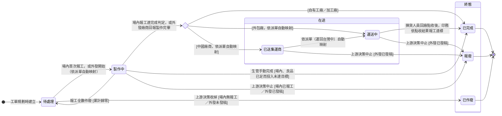

讀完這張卡，你會知道：

- 認識 [[生產任務]]（ProductionTaskStatus）狀態機：生產流程裡真正動手做的最底層單位——一筆實際派給師傅或供應商的活，從派下去走到收尾
- 看懂為什麼它是整條向上反映鏈的源頭：一報工就往上帶動工單、印件與訂單
- 掌握每個轉換由誰觸發、要滿足什麼條件才推得動，工廠類型如何決定走哪一條路徑，以及「做完了」在不同任務變體上看的是哪個數
- 理解外發的回程為什麼要把在途處境顯式建出來，又為什麼只留工單視角的粗進度
- 知道品檢與「東西做壞」為什麼不落在本卡的終態上

## 狀態列舉（正本）

> 本段是生產任務狀態的唯一正本。狀態的新增與修改是商業決策，直接在此卡維護。

| 狀態 | 說明 | 對應營運需求 |
|------|------|------------|
| 待處理 | 初始；生產任務已建立，等待師傅或供應商開始做。指派師傅只是欄位更新，不觸發狀態變更 | 排程定了不等於動工了，狀態忠於現場事實 |
| 製作中 | 已開始做：場內由首次報工觸發；外發則由系統依 [[派單]] 自動映射 | 一推進即往上帶動各層，現場不必另外更新上層狀態 |
| 已送集運商 | 中國廠商做完、貨已交集運商集中（僅中國廠商路徑）；系統依 [[派單]] 大陸處理狀態自動映射 | 跨境物流多一站，顯式標出避免「做完了卻收不到貨」對不上 |
| 運送中 | 貨物在回程路上（外包廠與中國廠商路徑）；依 [[派單]]（運回台灣中）／外發回報自動映射 | 在途與到貨分開看，業務與生管追得出貨卡在哪一段 |
| 已完成 | 終態；這道工序該跑的量已經跑完，或良品已足時由 [[生管]] 手動收尾。完成判定取哪個數依任務變體不同，逐條見 § 轉換條件與觸發事件 | 完成事實往上彙整進齊套統計 |
| 已作廢 | 終態；因上游決策收掉（異動、訂單取消、印件棄用連鎖）且**尚無實際投入事實**——場內任務無任何報工、外發任務其 [[派單]] 尚未發稿（無成本） | 派錯或需求變更時乾淨收掉，不留無效任務污染進度 |
| 報廢 | 終態；因上游決策中止（異動、訂單取消、印件棄用連鎖）且**已有實際投入事實**——場內任務已有報工、外發任務其 [[派單]] 已發稿（含貨已在回程的在途任務；已有成本）。品質缺口不走此終態（見 § 與其他狀態機的關係） | 與已作廢區分有無投入成本，損耗看得見；委外已發稿即算投入，才不會把廠商已做的活記成零損耗 |

### 依工廠類型的路徑

外發物流段（運送中／已送集運商）由 [[派單]] 狀態自動映射；派單的詳細 13 值外部進程見 [[派單狀態]]，兩實體不重疊。

| 工廠類型 | 路徑 |
|---------|------|
| 自有工廠 | 待處理 → 製作中 → 已完成 |
| 加工廠 | 待處理 → 製作中 → 已完成（狀態鏈與自有工廠相同；報工由 [[印務]] 代報，變體正本見 [[報工紀錄]]） |
| 外包廠 | 待處理 → 製作中 → 運送中 → 已完成（外發；外部詳細進程見 [[派單狀態]]，台灣外包派單模組尚未實作） |
| 中國廠商 | 待處理 → 製作中 → 已送集運商 → 運送中 → 已完成（外發；外部詳細進程見 [[派單狀態]]，回台運費關稅見 [[貨運單]]） |

## 狀態機圖（UML）

- 記法：實心圓為初始點、雙圈為終止點、菱形為分流判斷（製作完畢後的去向由工廠類型決定）、轉換標籤採「觸發事件 [轉換條件]」格式。
- 複合狀態＝可被引用的集合詞（成員以本圖為正本，不另立成員表）：「在途」＝外發的貨已離開協力廠、尚未回廠點收的處境；「終態」＝這筆活已收尾、不再推進的處境。
- 圖上另有兩類弧：場內不經報工的手動完成弧（良品已足而投入未達目標時由 [[生管]] 收尾）；上游決策把這條活收掉的弧，落「已作廢」還是「報廢」看有無實際投入事實，故在途兩態各有一條報廢弧。

```mermaid
stateDiagram-v2
    direction LR

    [*] --> s_pending : 工單規劃時建立

    state "待處理" as s_pending
    state "製作中" as s_making
    state route <<choice>>

    state "在途" as Transit {
        direction LR
        state "已送集運商" as s_consolidator
        state "運送中" as s_shipping
        s_consolidator --> s_shipping : 依派單（運回台灣中）自動映射
    }

    state "終態" as Final {
        state "已完成" as s_done
        state "已作廢" as s_void
        state "報廢" as s_scrap
    }

    s_pending --> s_making : 場內首次報工，或外發開始（依派單自動映射）
    s_making --> route : 場內報工達完成判定，或外發廠商回報製作完畢
    route --> s_done : [自有工廠／加工廠]
    route --> s_shipping : [外包廠，依派單自動映射]
    route --> s_consolidator : [中國廠商，依派單自動映射]
    s_shipping --> s_done : 揀貨人員回廠點收後，印務依點收結果報工達標
    s_making --> s_done : 生管手動完成 [場內、良品已足而投入未達目標]

    s_making --> s_pending : 報工全數作廢 [累計歸零]

    s_pending --> s_void : 上游決策收掉 [場內無報工／外發未發稿]
    s_making --> s_scrap : 上游決策中止 [場內已報工／外發已發稿]
    s_consolidator --> s_scrap : 上游決策中止 [外發已發稿]
    s_shipping --> s_scrap : 上游決策中止 [外發已發稿]

    s_done --> [*]
    s_void --> [*]
    s_scrap --> [*]
```

## 轉換條件與觸發事件

| 轉換 | 觸發事件 | 條件 |
|------|---------|------|
| （建立）→ 待處理 | 工單規劃時建立生產任務 | 指派師傅為欄位更新，不觸發狀態變更 |
| 待處理 → 製作中 | 場內：首次報工（自有工廠由師傅報、加工廠由 [[印務]] 代報，報工者變體正本見 [[報工紀錄]]）；外發：系統依 [[派單]] 開始製作（已發稿／大貨製作）自動映射 | 向上反映鏈的起點，往上帶動工單、印件與訂單各層（各層只在自己還處於可推進前態時被推動，見 § 與其他狀態機的關係）|
| 製作中 → 已完成 | 場內工序型與裝訂型任務：報工（自有工廠 [[師傅]]、加工廠 [[印務]] 代報）生產數量（投入）累計達目標數量時系統自動判定完成 | 僅自有工廠／加工廠路徑；目標數量本身就是含放損緩衝的投入計畫（換算見 [[數量換算規則]]），該跑的量跑完即算這道工序做完；報工累計的警示門檻見 [[報工規則]] |
| 製作中 → 已完成 | 場內材料型任務：[[師傅]] 報工，系統即判完成 | 備料報工只回報領用量、沒有投入對產出的對照數；領完即下游工序到料放行 |
| 製作中 → 已完成 | [[生管]] 手動完成本任務 | 場內任務放損低於預期（良品已足下游所需、投入未達目標數量）時的收尾路徑；僅生管可操作、不改任務內容（職責見 [[生管]]），操作人與時間留在 [[生產任務]] 歷程紀錄 |
| 製作中 → 運送中 | 系統依 [[派單]]／外發回報「貨在回程」自動映射 | 僅外包廠路徑 |
| 製作中 → 已送集運商 | 系統依 [[派單]] 大陸處理狀態「已送集運商」自動映射 | 僅中國廠商路徑 |
| 已送集運商 → 運送中 | 系統依 [[派單]]「運回台灣中」自動映射 | 僅中國廠商路徑 |
| 運送中 → 已完成 | [[揀貨人員]] 完成回廠點收後，**[[印務]] 依點收結果對本任務報工、產出數量累計達目標數量即完成** | 外包廠與中國廠商路徑；點收與報工收斂逐項見下方「外發回廠收斂」子表 |
| 製作中 → 待處理 | 本任務的 [[報工紀錄]] 全數被作廢 | 累計歸零後這筆任務事實上沒有開工過——留在製作中會讓待派清單漏掉它，也會讓工單層「首個任務開始製作」的判定失真 |
| 待處理 → 已作廢 | 因異動取消、訂單取消，或印件棄用連鎖 | 尚無實際投入事實：場內任務無任何報工、外發任務其 [[派單]] 尚未發稿（無成本）|
| 製作中 → 報廢 | 因異動、訂單取消中止，或印件棄用連鎖（純上游決策） | 已有實際投入事實：場內任務已有報工，或外發任務其 [[派單]] 已發稿；報廢讓已投入成本可結算（外發的實付額結清路徑見 [[派單狀態]]）；品質缺口不走此轉換（東西做壞的處置見 § 與其他狀態機的關係） |
| 已送集運商／運送中 → 報廢 | 同上（純上游決策） | 僅外發路徑：貨已在回程但派單早已發稿，委外損耗須留帳，不因貨在途而改判無成本 |

**外發回廠收斂**（「運送中 → 已完成」這一段的逐項規則）

| 面向 | 規則 |
|------|------|
| 點收載體 | [[揀貨人員]] 做回廠點收（清點＋秤重）；中國線的點收載體為 [[貨運單]] 明細、台灣外包直接對生產任務點收 |
| 報工收斂 | [[印務]] 依點收結果對本任務報工，產出數量累計達目標數量即完成（外發報工不填生產數量，故取產出算法）|
| 下游放行 | 點收確認只將貨登記暫存區；下游到料放行不因點收啟動，另依 [[工序相依性規則]] 兩軌 |
| 點收短少或損壞－補件 | 回報 [[印務]]，待補件貨到點收後再報工收斂（正本見 [[外發委外與回廠點收]]）|
| 點收短少或損壞－折價 | 回報 [[印務]]，供應商報價依實收調整、[[印務]] 依實收數報工收斂（正本見 [[外發委外與回廠點收]]）|

## 關鍵轉換的營運動機

- 待處理 → 製作中 → 動機：以開始動工為觸發點，現場一開始做、系統各層自動跟上 → 例子：師傅對 ORD-2026-0512 的印刷任務報第一筆工，生產任務轉「製作中」，所屬工單同步反映。
- 製作中 → 已完成（[[生管]] 手動完成）→ 動機：目標數量是含放損緩衝的投入計畫，實際放損比預估低時投入跑不到目標、但良品已經夠下游用，逼現場把剩下的量跑完等於為了系統數字多做廢工；收尾判斷交給現場執行的協調者，比回頭改目標數量乾淨——目標是規劃當時的決定，不因現場好運被改寫，放損估得準不準才看得出來 → 例子：名片 1,000 份的印刷任務目標 1,051 份（放損估 3%），實際只損 10 份，投入 1,030 份時良品已達下游裁切要的 1,020 份，生管直接把任務標完成，剩下 21 份不再上機。
- 外發在途段由派單自動映射（已送集運商／運送中）→ 動機：外發委外單的詳細外部進程（打樣多階、大貨整批分批、補做、海外直發）放在獨立的 [[派單]]（[[派單狀態]]）追蹤，生產任務只留工單視角的粗在途狀態，由廠商在派單回寫、系統映射回工單——兩實體各記各的、不重疊，避免外部細節撐胖內部狀態，也讓「貨卡在哪一段」在工單上一眼可見（取代印務手動同步）→ 例子：某中國廠商盒型派單推進「已送集運商」，對應生產任務同步顯示「已送集運商」；派單轉「運回台灣中」時任務自動轉「運送中」，回場後由揀貨人員做貨運單點收（清點＋秤重）確認，印務依點收結果對該任務報工、達標轉「已完成」。
- 已作廢與報廢分兩個終態、且落點以「有無實際投入事實」為統一判準 → 動機：還沒投入就取消（無成本）與投入後中止（已有成本）對成本與損耗統計意義不同，分開才看得見損耗；判準對場內與外發各有對應事實——場內的投入起點是第一筆報工，外發的投入起點是發稿（球交到廠商手上、對方可能已裁料開工），若外發也拿報工當判準，會因為外發整段沒有場內報工而一律判成無成本，委外損耗就整批消失在帳上 → 例子：異動把 500 份改 300 份，未開工的加工任務作廢、已印一半的印刷任務報廢重開；同一張訂單取消時，一筆已發稿的中國廠盒型任務即使貨還在集運站，仍轉報廢並留下與廠商談定的實付額。

## 與其他狀態機的關係

- 生產任務是向上反映鏈的起點：首次報工依序往上帶動工單、印件、訂單，完整多層鏈路見 [[印件狀態]]。**每一層都帶轉換條件：上層必須還停在可推進的前態才會被推動**，已經越過的層維持原狀不動。

| 層級 | 被推動的轉換 | 前態限制的正本卡 |
|------|-------------|----------------|
| 工單 | 工單已交付 → 製作中 | [[工單狀態]] |
| 印件（印製維度）| 工單已交付 → 部分工單製作中 → 製作中 | [[印件狀態]] |
| 訂單 | 工單已交付 → 製作中 | [[訂單狀態]] |

- 沒有這道前態限制，補做與加量的重新投入會把已經走到後面的上層拉回頭——品檢缺口補做加開的任務首次報工時，該工單可能已經「已完成」、訂單可能已經走到出貨段，照鏈推進等於讓訂單回退（訂單不可回退見 [[訂單狀態]]；補做期間的工單由「異動」態承載，見 [[工單狀態]]）。
- 做齊的數量往上彙整到工單，齊套統計見 [[齊套邏輯]]。
- 異動流程中的取消與中止直接落在本層（作廢／報廢）——印務在生產任務發起異動、生管確認，工單往上鏡像（見 [[工單狀態]]）。本任務轉報廢或已作廢時，旗下**尚未進終態的 [[轉交單]]** 會被自動標示警示且點收被擋下，處置由 [[生管]] 決定（貨已到目的地就作廢原單依實況重建、貨還沒動就直接作廢）——不自動作廢是因為任務報廢是上游的帳務決策，貨在物理上可能已經在路上，系統替人決定「這批貨作廢」會讓現場那落實體貨變成沒有單據對應的孤兒。
- [[印件狀態]] 轉「已棄用」時連鎖到本層：有實際投入事實的轉報廢、沒有的轉已作廢（判準同上，場內看報工、外發看發稿）；旗下工單一律轉「已取消」、成本依當時已投入內容結算（[[PI-003-印件棄用時工單與任務連動行為]] 決議，2026-07-30 拍板已封存）。
- 外發委外的詳細外部進程（大陸處理狀態 13 值）正本在 [[派單狀態]]，本卡的外發在途段（已送集運商／運送中）是工單視角的粗狀態、由派單狀態自動映射；回台跨境物流與運費關稅分攤見 [[貨運單]]。兩實體不重疊。
- 品檢（[[品檢紀錄]]）與本卡的分工：品檢不是生產任務（決策脈絡見 [[QC-002-QC兩張wiki卡退役或保留]]），以印件層 [[品檢紀錄]] 承載——品檢人員對送抵品檢站的貨分次驗、一次驗收一筆，累計通過即入庫（可出貨）；本卡的生產任務只涵蓋**製作工序**，印件工序依賴圖終點（無下游的生產任務）的產出送品檢站，待驗清單與品檢規則見 [[印件生產流程]] 與 [[齊套邏輯]]。
	- **「工作中止」與「東西做壞」分兩軸**：任務終態「報廢／已作廢」只留給整份工作中止（異動、訂單取消、印件棄用連鎖等上游決策）；東西做壞的處置不動任務狀態——工序中途做壞屬過程損耗，報工照常填不良品數（欄位與填報規則見 [[報工紀錄]]）、任務以重做湊齊目標數。
	- 成品缺口由 [[品檢紀錄]] 的不通過數字承載（品檢人員回報），[[印務]] 對累計缺口決策處置（兩個獨立決策的組合：缺口是否補做 × 瑕疵品去向），處置紀錄掛印件層、不另開單據（欄位見 [[印件]] § 品檢缺口處置），補做接力見 [[QC不通過補生產]]。

## 範圍外

- **多筆生產任務怎麼彙整成工單與印件完成度**：系統會自動彙整——本卡只承諾此行為，公式屬 [[齊套邏輯]]（規則正本；齊套取最慢的單位是生產任務），實作時勿自行發明
- 外發回場的銜接已定（中國線與台灣外包流程一致）：揀貨人員做回廠點收（清點＋秤重）確認、貨登記暫存區（下游到料放行不因點收啟動，依 [[工序相依性規則]] 兩軌），[[印務]] 依點收結果對該任務報工、達標推進本卡「運送中 → 已完成」（B1 定案 2026-08-05）；中國線的點收載體為 [[貨運單]] 明細、台灣外包直接對生產任務做點收確認（外包派單模組成形後再評估掛單），決策脈絡見 [[PT-008-外發回廠流轉的系統設計範圍]]
- **任務已完成後的報工作廢**：系統擋下——本卡沒有「已完成 → 待處理」的回退路徑，完成事實已往上彙整進齊套統計；要更正改走既有的人工更正程序，程序正本見 [[場內轉交與更正]]
- 數量在不同計量單位間的換算 → 見 [[數量換算規則]]
- 派工怎麼分組、生管怎麼指派 → 場內合批見 [[工作包]]、外包分組見 [[派單]]，派工排程規劃屬排程模組
- 品檢的判定標準與不良品處置細節 → 屬品檢規則（[[品檢紀錄]]），不在本卡
- 重做湊齊目標數時的加生產與扣庫存系統機制 → 留待 MES 設計階段定，現況為印務、生管、師傅口頭協調＋紙本改工單或重打新單（見 [[PT-014-加生產系統機制]]）

## 相關卡

- 規則：[[齊套邏輯]]（向上彙整與做齊判定正本）、[[數量換算規則]]、[[印件生產流程]]
- 實體：[[生產任務]]（本狀態機依附的主實體）、[[報工紀錄]]（報工欄位與填報規則正本）、[[派單]]（外發委外的詳細外部進程，外發在途段由其狀態自動映射回本卡）、[[貨運單]]（中國回台跨境物流與成本分攤）
- 狀態機：[[工單狀態]]／[[印件狀態]]／[[訂單狀態]]（由下往上的反映鏈）、[[派單狀態]]（外發外部進程，自動映射來源）
- 角色：[[師傅]]／供應商（報工推進）、[[印務]]（異動下的作廢與報廢）、[[生管]]（放損低於預期時手動完成）
- 情境：[[場內轉交與更正]]（報工作廢被擋下時的人工更正程序）
