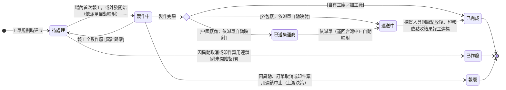

讀完這張卡，你會知道：

- 認識 [[生產任務]]（ProductionTaskStatus）狀態機：生產流程裡真正動手做的最底層單位——一筆實際派給師傅或供應商的活，從派下去走到收尾
- 看懂為什麼它是整條向上反映鏈的源頭：一報工就往上帶動工單、印件與訂單
- 掌握每個轉換由誰觸發、要滿足什麼條件才推得動，以及工廠類型如何決定走哪一條路徑
- 理解外發的回程為什麼要把在途處境顯式建出來，又為什麼只留工單視角的粗進度
- 知道品檢與「東西做壞」為什麼不落在本卡的終態上

## 狀態列舉（正本）

> 本段是生產任務狀態的唯一正本。狀態的新增與修改是商業決策，直接在此卡維護。

| 狀態 | 說明 | 對應營運需求 |
|------|------|------------|
| 待處理 | 初始；生產任務已建立，等待師傅或供應商開始做。指派師傅只是欄位更新，不觸發狀態變更 | 排程定了不等於動工了，狀態忠於現場事實 |
| 製作中 | 已開始做：場內由首次報工觸發；外發則由系統依 [[派單]] 自動映射 | 一推進即往上帶動各層，現場不必另外更新上層狀態 |
| 已送集運商 | 中國廠商做完、貨已交集運商集中（僅中國廠商路徑）；系統依 [[派單]] 大陸處理狀態自動映射 | 跨境物流多一站，顯式標出避免「做完了卻收不到貨」對不上 |
| 運送中 | 貨物在回程路上（外包廠與中國廠商路徑）；依 [[派單]]（運回台灣中）／外發回報自動映射 | 在途與到貨分開看，業務與生管追得出貨卡在哪一段 |
| 已完成 | 終態；場內製作完畢（自有／加工廠），或外發貨物回廠點收後由 [[印務]] 依點收結果報工、累計達目標完成（B1 定案 2026-08-05，中國線與台灣外包流程一致） | 完成事實往上彙整進齊套統計 |
| 已作廢 | 終態；尚未開始製作即因異動取消（無成本） | 派錯或需求變更時乾淨收掉，不留無效任務污染進度 |
| 報廢 | 終態；製作中因上游決策中止——異動、訂單取消或印件棄用連鎖（已有成本）。品質缺口不走此終態（見 § 與其他狀態機的關係） | 與已作廢區分有無投入成本，損耗看得見 |

### 依工廠類型的路徑

外發物流段（運送中／已送集運商）由 [[派單]] 狀態自動映射；派單的詳細 13 值外部進程見 [[派單狀態]]，兩實體不重疊。

| 工廠類型 | 路徑 |
|---------|------|
| 自有工廠 | 待處理 → 製作中 → 已完成 |
| 加工廠 | 待處理 → 製作中 → 已完成（與自有工廠相同） |
| 外包廠 | 待處理 → 製作中 → 運送中 → 已完成（外發；外部詳細進程見 [[派單狀態]]，台灣外包派單模組尚未實作） |
| 中國廠商 | 待處理 → 製作中 → 已送集運商 → 運送中 → 已完成（外發；外部詳細進程見 [[派單狀態]]，回台運費關稅見 [[貨運單]]） |

## 狀態機圖（UML）

依 UML 狀態機圖記法繪製：實心圓為初始點、雙圈為終止點、菱形為分流判斷、轉換標籤採「觸發事件 [轉換條件]」格式。製作完畢後的去向由工廠類型決定；外發的在途段由 [[派單]] 狀態自動映射（外部詳細進程不在本圖，屬 [[派單狀態]]）。

```mermaid
stateDiagram-v2
    direction LR

    [*] --> s_pending : 工單規劃時建立

    state "待處理" as s_pending
    state "製作中" as s_making
    state "已送集運商" as s_consolidator
    state "運送中" as s_shipping
    state "已完成" as s_done
    state "已作廢" as s_void
    state "報廢" as s_scrap
    state route <<choice>>

    s_pending --> s_making : 場內首次報工，或外發開始（依派單自動映射）
    s_making --> route : 製作完畢
    route --> s_done : [自有工廠／加工廠]
    route --> s_shipping : [外包廠，依派單自動映射]
    route --> s_consolidator : [中國廠商，依派單自動映射]
    s_consolidator --> s_shipping : 依派單（運回台灣中）自動映射
    s_shipping --> s_done : 揀貨人員回廠點收後，印務依點收結果報工達標

    s_making --> s_pending : 報工全數作廢 [累計歸零]

    s_pending --> s_void : 因異動取消或印件棄用連鎖 [尚未開始製作]
    s_making --> s_scrap : 因異動、訂單取消或印件棄用連鎖中止（上游決策）

    s_done --> [*]
    s_void --> [*]
    s_scrap --> [*]
```

## 轉換條件與觸發事件

| 轉換 | 觸發事件 | 條件 |
|------|---------|------|
| （建立）→ 待處理 | 工單規劃時建立生產任務 | 指派師傅為欄位更新，不觸發狀態變更 |
| 待處理 → 製作中 | 場內：師傅（自有／加工）首次報工；外發：系統依 [[派單]] 開始製作（已發稿／大貨製作）自動映射 | 向上反映鏈的起點，往上帶動工單、印件與訂單各層（各層只在自己還處於可推進前態時被推動，見 § 與其他狀態機的關係）|
| 製作中 → 已完成 | 場內製作完畢 | 僅自有工廠／加工廠路徑 |
| 製作中 → 運送中 | 系統依 [[派單]]／外發回報「貨在回程」自動映射 | 僅外包廠路徑 |
| 製作中 → 已送集運商 | 系統依 [[派單]] 大陸處理狀態「已送集運商」自動映射 | 僅中國廠商路徑 |
| 已送集運商 → 運送中 | 系統依 [[派單]]「運回台灣中」自動映射 | 僅中國廠商路徑 |
| 運送中 → 已完成 | [[揀貨人員]] 完成回廠點收（清點＋秤重，中國線載體為 [[貨運單]] 明細、台灣外包直接對生產任務點收）後，**[[印務]] 依點收結果對本任務報工、報工累計達目標即完成**（同場內報工規則，B1 定案 2026-08-05：派單與工單各自資料流、任務靠報工收斂）；點收確認同時將貨登記暫存區、啟動下游到料放行 | 外包廠與中國廠商路徑；點收短少或損壞回報 [[印務]]，處置二路（正本見 [[外發委外與回廠點收]]）：補件——待補件貨到點收後再報工收斂；折價——供應商報價依實收調整、印務依實收數報工收斂 |
| 製作中 → 待處理 | 本任務的 [[報工紀錄]] 全數被作廢 | 累計歸零後這筆任務事實上沒有開工過——留在製作中會讓待派清單漏掉它，也會讓工單層「首個任務開始製作」的判定失真 |
| 待處理 → 已作廢 | 因異動取消，或印件棄用連鎖 | 尚未開始製作（無成本） |
| 製作中 → 報廢 | 因異動、訂單取消中止，或印件棄用連鎖（純上游決策） | 已有投入成本，報廢讓已報工成本可結算；品質缺口不走此轉換（東西做壞的處置見 § 與其他狀態機的關係） |

## 關鍵轉換的營運動機

- 待處理 → 製作中 → 動機：以開始動工為觸發點，現場一開始做、系統各層自動跟上 → 例子：師傅對 ORD-2026-0512 的印刷任務報第一筆工，生產任務轉「製作中」，所屬工單同步反映。
- 外發在途段由派單自動映射（已送集運商／運送中）→ 動機：外發委外單的詳細外部進程（打樣多階、大貨整批分批、補印、海外直發）放在獨立的 [[派單]]（[[派單狀態]]）追蹤，生產任務只留工單視角的粗在途狀態，由廠商在派單回寫、系統映射回工單——兩實體各記各的、不重疊，避免外部細節撐胖內部狀態，也讓「貨卡在哪一段」在工單上一眼可見（取代印務手動同步）→ 例子：某中國廠商盒型派單推進「已送集運商」，對應生產任務同步顯示「已送集運商」；派單轉「運回台灣中」時任務自動轉「運送中」，回場後由揀貨人員做貨運單點收（清點＋秤重）確認，印務依點收結果對該任務報工、達標轉「已完成」。
- 已作廢與報廢分兩個終態 → 動機：還沒開做就取消（無成本）與做到一半中止（已有成本）對成本與損耗統計意義不同，分開才看得見損耗 → 例子：異動把 500 份改 300 份，未開工的加工任務作廢、已印一半的印刷任務報廢重開。

## 與其他狀態機的關係

- 生產任務是向上反映鏈的起點：首次報工 → [[工單狀態]]「工單已交付 → 製作中」→ [[印件狀態]] 印製維度「工單已交付 → 部分工單製作中 →（所有工單皆進入製作中）製作中」→ [[訂單狀態]]「工單已交付 → 製作中」。完整多層鏈路見 [[印件狀態]]。**每一層都帶轉換條件：上層必須還停在可推進的前態才會被推動**（工單限「工單已交付」、印件印製維度限「工單已交付」與「部分工單製作中」、訂單限「工單已交付」），已經越過的層維持原狀不動。沒有這道條件，補做與加量的重新投入會把已經走到後面的上層拉回頭——品檢缺口補做加開的任務首次報工時，該工單可能已經「已完成」、訂單可能已經走到出貨段，照鏈推進等於讓訂單回退（[[訂單狀態]] 不可回退是既有鐵則，補做期間的工單改由「異動」態承載）。
- 做齊的數量往上彙整到工單，齊套統計見 [[齊套邏輯]]。
- 異動流程中的取消與中止直接落在本層（作廢／報廢）——印務在生產任務發起異動、生管確認，工單往上鏡像（見 [[工單狀態]]）。本任務轉報廢或已作廢時，旗下**尚未進終態的 [[轉交單]]** 會被自動標示警示且點收被擋下，處置由 [[生管]] 決定（貨已到目的地就作廢原單依實況重建、貨還沒動就直接作廢）——不自動作廢是因為任務報廢是上游的帳務決策，貨在物理上可能已經在路上，系統替人決定「這批貨作廢」會讓現場那落實體貨變成沒有單據對應的孤兒。
- [[印件狀態]] 轉「已棄用」時連鎖到本層：已報工的轉報廢、未開工的轉已作廢；旗下工單一律轉「已取消」、成本依當時報工內容結算（[[PI-003-印件棄用時工單與任務連動行為]] 決議，2026-07-30 拍板已封存）。
- 外發委外的詳細外部進程（大陸處理狀態 13 值）正本在 [[派單狀態]]，本卡的外發在途段（已送集運商／運送中）是工單視角的粗狀態、由派單狀態自動映射；回台跨境物流與運費關稅分攤見 [[貨運單]]。兩實體不重疊。
- 品檢（[[品檢紀錄]]）與本卡的分工：品檢不是生產任務（決策脈絡見 [[QC-002-QC兩張wiki卡退役或保留]]），以印件層 [[品檢紀錄]] 承載——品檢人員對送抵品檢站的貨分次驗、一次驗收一筆，累計通過即入庫（可出貨）；本卡的生產任務只涵蓋**製作工序**，印件工序依賴圖終點（無下游的生產任務）的產出送品檢站，待驗清單與品檢規則見 [[印件生產流程]] 與 [[齊套邏輯]]。
	- **「工作中止」與「東西做壞」分兩軸**：任務終態「報廢／已作廢」只留給整份工作中止（異動、訂單取消、印件棄用連鎖等上游決策）；東西做壞的處置不動任務狀態——工序中途做壞屬過程損耗，師傅報工照常填不良品數（不設「正常損耗」門檻、無現場分支判斷）、任務以重做湊齊目標數。
	- 成品缺口由 [[品檢紀錄]] 的不通過數字承載（品檢人員回報），[[印務]] 對累計缺口決策處置（兩個獨立決策的組合：缺口是否補做 × 瑕疵品去向），處置紀錄掛印件層、不另開單據（欄位見 [[印件]] § 品檢缺口處置），補做接力見 [[QC不通過補生產]]。

## 範圍外

- **多筆生產任務怎麼彙整成任務／工單完成度**（取最少原則、四層計算）：系統會自動彙整——本卡只承諾此行為，公式屬 [[齊套邏輯]]（規則正本），實作時勿自行發明
- 外發回場的銜接已定（中國線與台灣外包流程一致）：揀貨人員做回廠點收（清點＋秤重）確認、貨登記暫存區並啟動下游到料放行，[[印務]] 依點收結果對該任務報工、達標推進本卡「運送中 → 已完成」（B1 定案 2026-08-05）；中國線的點收載體為 [[貨運單]] 明細、台灣外包直接對生產任務做點收確認（外包派單模組成形後再評估掛單），決策脈絡見 [[PT-008-外發回廠流轉的系統設計範圍]]
- 數量在不同計量單位間的換算 → 見 [[數量換算規則]]
- 派工怎麼分組、生管怎麼指派 → 場內合批見 [[工作包]]、外包分組見 [[派單]]，派工排程規劃屬排程模組
- 品檢的判定標準與不良品處置細節 → 屬品檢規則（[[品檢紀錄]]），不在本卡
- 重做湊齊目標數時的加生產與扣庫存系統機制 → 留待 MES 設計階段定，現況為印務、生管、師傅口頭協調＋紙本改工單或重打新單（見 [[PT-014-加生產系統機制]]）

## 相關卡

- 規則：[[齊套邏輯]]（向上彙整與做齊判定正本）、[[數量換算規則]]、[[印件生產流程]]
- 實體：[[生產任務]]（本狀態機依附的主實體）、[[派單]]（外發委外的詳細外部進程，外發在途段由其狀態自動映射回本卡）、[[貨運單]]（中國回台跨境物流與成本分攤）
- 狀態機：[[工單狀態]]／[[印件狀態]]／[[訂單狀態]]（由下往上的反映鏈）、[[派單狀態]]（外發外部進程，自動映射來源）
- 角色：[[師傅]]／供應商（報工推進）、[[印務]]（異動下的作廢與報廢）
