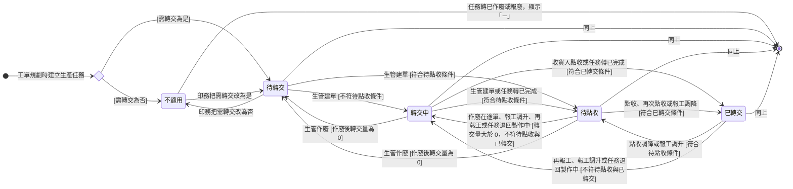

讀完這張卡，你會知道：

- 認識 [[生產任務]] 的「轉交狀態」：系統依數量推導的衍生狀態，回答這筆任務做出來的良品送到下游手上了沒
- 看懂各個轉交狀態代表什麼處境，以及任務收掉之後為什麼改顯示「－」
- 掌握推導條件的判定順序，以及哪些動作會讓結果前進或退回
- 理解為什麼「待點收」與「已轉交」要等任務完成才會出現
- 知道並列顯示的轉交進度文字怎麼組成

## 狀態列舉（正本）

> 本段是生產任務轉交狀態的唯一正本。狀態的新增與修改是商業決策，直接在此卡維護。

| 狀態  | 說明                         | 對應營運需求                               |
| --- | -------------------------- | ------------------------------------ |
| 不適用 | 初始（需轉交為否時）；本任務不靠轉交單搬貨      | 不靠轉交單搬的任務不顯示轉交進度                     |
| 待轉交 | 初始（需轉交為是時）；轉交量為 0，含良品數為 0  | 做出來的貨還沒有任何一張轉交單，還沒動的量看得見             |
| 轉交中 | 轉交量大於 0，且不符合待點收與已轉交        | 貨已開始送，還沒送完或任務還在做                     |
| 待點收 | 任務已完成，轉交量不小於良品數，轉交點收量小於良品數 | 該送的都成單了，等下游收下或等短少處置；任務停在這格就是看得見的停下訊號 |
| 已轉交 | 任務已完成，良品數大於 0，轉交點收量等於良品數   | 這筆任務的良品全部到下游手上                       |

本狀態不設終態：生產任務狀態轉「已作廢」或「報廢」後，本欄改顯示「－」、不再推導。

### 推導條件

依序判定，第一個成立的就是結果。轉交量、轉交點收量、良品數的算式見 [[生產任務]]。

| 順序 | 結果 | 條件 |
|------|------|------|
| 1 | 「－」 | 生產任務狀態為「已作廢」或「報廢」（[[生產任務狀態]]） |
| 2 | 不適用 | 需轉交為否 |
| 3 | 已轉交 | 生產任務狀態為「已完成」，且良品數大於 0，且轉交點收量等於良品數 |
| 4 | 待點收 | 生產任務狀態為「已完成」，且轉交量不小於良品數，且轉交點收量小於良品數 |
| 5 | 轉交中 | 轉交量大於 0 |
| 6 | 待轉交 | 轉交量等於 0 |

下列動作發生時，系統依當下數字重新判定：

| 動作類別 | 動作 |
|---------|------|
| 轉交單 | 建單、作廢、點收、再次點收、點收修改 |
| 報工 | 報工、報工修改、報工作廢 |
| 生產任務 | 生產任務狀態變化、需轉交變更 |

### 轉交進度文字

轉交進度與本狀態並列顯示「轉交量 N／點收量 M／良品 K」：N 為轉交量、M 為轉交點收量、K 為良品數。不另設貨已送達、待點收的標記。

## 狀態機圖（UML）

- 記法：實心圓為初始點、菱形為選擇偽狀態（依需轉交分流）、轉換標籤採「觸發事件 [轉換條件]」格式；本狀態沒有手動轉換，每條弧都是動作發生後依推導條件重新判定的結果。
- 本狀態不設終態、不設複合狀態：任務轉「已作廢」或「報廢」時改顯示「－」，「－」不是狀態，圖上畫成直接結束。
- 銜接：數量取自 [[轉交單狀態]] 的各張單，前提取自 [[生產任務狀態]]；本狀態只讀取兩者，不反過來推動它們。

## 轉換條件與觸發事件

| 轉換 | 觸發事件 | 條件 |
|------|---------|------|
| （建立）→ 不適用 | 工單規劃時建立生產任務 | 需轉交為否 |
| （建立）→ 待轉交 | 工單規劃時建立生產任務 | 需轉交為是 |
| 不適用 → 待轉交 | [[印務]] 把需轉交改為是 | 需轉交可改的時機見 [[生產任務]] 需轉交欄 |
| 待轉交 → 不適用 | [[印務]] 把需轉交改為否 | 同上 |
| 待轉交 → 轉交中 | [[生管]] 建 [[轉交單]] | 不符待點收條件 |
| 待轉交 → 待點收 | [[生管]] 建轉交單 | 符合待點收條件 |
| 轉交中 → 待點收 | [[生管]] 建轉交單，或任務轉「已完成」（[[生產任務狀態]]） | 符合待點收條件 |
| 轉交中 → 已轉交 | 收貨人點收，或任務轉「已完成」 | 符合已轉交條件 |
| 待點收 → 已轉交 | 收貨人點收或再次點收，或報工修改調降良品數 | 符合已轉交條件 |
| 待點收 → 轉交中 | [[生管]] 作廢在途的轉交單、報工修改調升良品數、再報工，或任務因報工修改退回「製作中」 | 轉交量仍大於 0，且不符待點收與已轉交 |
| 已轉交 → 待點收 | 收貨人修改調降點收量，或報工修改調升良品數 | 符合待點收條件 |
| 已轉交 → 轉交中 | 再報工、報工修改調升良品數，或任務因報工修改退回「製作中」 | 不符待點收與已轉交 |
| 轉交中 → 待轉交 | [[生管]] 作廢轉交單 | 作廢後轉交量為 0 |
| 待點收 → 待轉交 | [[生管]] 作廢轉交單 | 作廢後轉交量為 0 |
| 任一狀態 → 「－」 | 任務轉「已作廢」或「報廢」（[[生產任務狀態]]） | 不再推導 |

> 點收、再次點收、點收修改由誰做見 [[轉交單狀態]]；報工修改由誰做見 [[報工紀錄]]；兩者的擋下條件正本見 [[場內轉交與更正]]。

## 關鍵轉換的營運動機

- 待點收、已轉交以任務已完成為前提 → 動機：任務還在做時良品數還會長，「全部送到」沒有比對基準；任務完成後良品數才是該送的總量 → 例子：印刷任務完成、良品 1,000，分兩張單送 600 與 400；第一張點收 600 時轉交量 1,000、轉交點收量 600，為「待點收」；第二張點收 400 後轉交點收量 1,000 等於良品數，轉「已轉交」。
- 短少不另存差額、任務停在待點收 → 動機：差額直接由設定量與點收量的差看得到，任務停在這格就是停下訊號，不必另設異常標記或結案動作 → 例子：設定 500、點收 480，良品 500，進度文字「轉交量 500／點收量 480／良品 500」、停在「待點收」；再點收 20 後 500 等於 500，轉「已轉交」；或良品修改為 480，480 等於 480，同樣轉「已轉交」。
- 任務已完成但良品數大於轉交量時停在轉交中、不另設出口 → 動機：剩餘良品沒成單，停在轉交中正好看得出還有貨沒送；要送由 [[生管]] 建單，不送就一直停留 → 例子：[[生管]] 手動完成時良品已足、剩餘不送，或 [[印務]] 在印件層短出結案、旗下任務被批次推完成，良品 1,000、轉交量 900，狀態維持轉交中。
- 轉交點收量大於良品數時點收不擋、推導落在轉交中 → 動機：不加把關，差異由進度文字看得見，修改報工留紀錄 → 例子：良品因搬運短少改為 480 後貨又找回，收貨人再點收 20，進度文字「轉交量 500／點收量 500／良品 480」，[[印務]] 把報工改回 500 後轉「已轉交」。

## 與其他狀態機的關係

- [[轉交單狀態]]：轉交量取未作廢單的明細設定量；轉交點收量取已點收單明細的點收紀錄（含再次點收、含修改後的值）。本狀態不推動轉交單。
- [[生產任務狀態]]：「已完成」是待點收與已轉交的前提；「已作廢」「報廢」時顯示「－」；任務因報工修改退回「製作中」時，本狀態依當下數字重新判定。
- [[工序相依性規則]]：下游任務的到料量取本任務的轉交點收量，與本狀態推導用的是同一個數。
- [[生產任務交付狀態]]：同一筆任務的另一條衍生進度，兩者互不影響。

## 範圍外

- 轉交量、轉交點收量、良品數、轉交可申請上限的算式 → [[生產任務]]（正本）
- 點收短少的處置過程（貨補到再點收、修改來源任務的報工）與分批轉交、邊做邊送的完成過程 → [[場內轉交與更正]]
- 手動轉換：不設；每一格都由數字推導，沒有人能直接改本狀態
- 待搬視圖怎麼列出可搬量：存在但屬實作規格，不在本卡；可搬量的算式見 [[生產任務]]

## 相關卡

- 規則：[[工序相依性規則]]（到料量取轉交點收量）、[[齊套邏輯]]（良品數的彙整）
- 情境：[[場內轉交與更正]]（分批轉交、邊做邊送、短少處置的完成過程）
- 實體：[[生產任務]]（本狀態依附的主實體，推導用數量的算式正本）、[[轉交單]]
- 狀態機：[[轉交單狀態]]、[[生產任務狀態]]、[[生產任務交付狀態]]
- 角色：[[生管]]（建單、作廢）、[[師傅]]／[[品檢人員]]（點收、再次點收、點收修改）、[[印務]]（設定需轉交）
