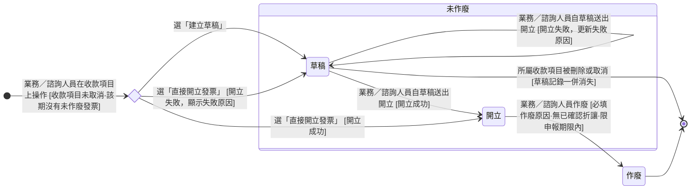

讀完這張卡，你會知道：

- 認識發票（InvoiceStatus）狀態機涵蓋的生命週期：從業務在收款項目上建立草稿或直接開立，到開立生效，再到開錯時作廢另開
- 看懂發票有草稿、開立、作廢三種處境，以及哪一種計入對帳的發票淨額
- 掌握每個轉換由誰觸發、開立失敗時發票停在哪裡、作廢要滿足什麼條件
- 理解為什麼開立前留一格草稿，而開立後只能作廢、不能刪改
- 知道一期只容一張未作廢發票、流水號不重用、作廢即退出對帳的營運理由

## 狀態列舉（正本）

> 本段是發票狀態的唯一正本。狀態的新增與修改是商業決策，直接在此卡維護。

| 狀態 | 說明 | 對應營運需求 |
|------|------|------------|
| 草稿 | 初始；業務在收款項目上建立、尚未送平台開立的發票。不驗證任何內容，沒有發票號碼；送出開立失敗時停在本態並顯示失敗原因 | 開票資訊還沒齊時先存下來；開立失敗有地方停、有原因可看。不計入發票淨額，也不能被折讓單引用 |
| 開立 | 初始（直接開立成功時）；發票開立成功、正式生效，可被折讓單引用 | 有效發票計入對帳的發票淨額 |
| 作廢 | 終態；開錯（金額、抬頭、統編）時作廢並留原因，同一收款項目需要時再建草稿或直接開立 | 失效發票退出三方對帳，作廢原因留稽核 |

## 狀態機圖（UML）

- 記法：實心圓為初始點、雙圈為終止點、菱形為選擇偽狀態、轉換標籤採「觸發事件 [轉換條件]」格式；「草稿」指向終止點的弧代表草稿記錄隨收款項目一併消失，不是新狀態。
- 複合狀態「未作廢」＝發票尚未作廢、仍佔住所屬收款項目的處境（可被他卡規則句引用的集合詞；成員以本圖為正本），一個收款項目同一時間至多一張。
- 「開立」是持續有效態，多數發票停留於此，只有開錯才走作廢。

## 轉換條件與觸發事件

| 轉換 | 觸發事件 | 條件 |
|------|---------|------|
| （建立）→ 草稿 | 業務／諮詢人員在收款項目上選「建立草稿」 | 收款項目未取消，且該期沒有未作廢發票（一期一張，見表下說明）；不驗證任何內容；發票欄位於建立當下帶入（發票金額的目標值見 [[付款發票邏輯]]）；訂單任何狀態皆可（含草稿、已取消） |
| （建立）→ 開立 | 業務／諮詢人員選「直接開立發票」，開立成功 | 同上；送出當下套用開立檢核（平台硬檢核見 [[發票法規硬約束-ezPay-MIG]]，含稅與未稅目標值檢核見 [[付款發票邏輯]]） |
| （建立）→ 草稿 | 業務／諮詢人員選「直接開立發票」，開立失敗 | 開立失敗＝送出當下系統檢核未過，或平台當下回應拒絕；發票停在草稿並顯示失敗原因 |
| 草稿 → 開立 | 業務／諮詢人員自草稿送出開立，開立成功 | 送出當下套用開立檢核；以草稿內容送出，不重新帶入 |
| 草稿 → 草稿 | 業務／諮詢人員自草稿送出開立，開立失敗 | 留在草稿，失敗原因更新為最近一次 |
| 草稿 →（記錄消失） | 業務／諮詢人員刪除或取消所屬收款項目 | 草稿一併消失、不必作廢；不設草稿單獨刪除，放棄草稿即取消該收款項目（收款項目取消規則見 [[付款發票邏輯]]） |
| 開立 → 作廢 | 業務／諮詢人員執行「作廢」並填入原因 | (1) 須無已確認折讓，有折讓先作廢折讓（見 [[折讓單狀態]]）。(2) 限申報期限內，逾期只能折讓（時限與法源見 [[發票法規硬約束-ezPay-MIG]] § 四）。(3) 作廢後流水號不重用，重開時新發票流水號順延。(4) 作廢後同一收款項目可再建草稿或直接開立 |

- **一期一張**：一個收款項目同一時間至多一張未作廢發票。系統在寫入那一刻檢查；兩人同時送出時，先寫入者成立，後到者被拒。
- **隔日財政部上傳失敗不算開立失敗**：發票維持「開立」，處置見 [[發票法規硬約束-ezPay-MIG]]。

> 開發票時機、發票金額怎麼定、收款項目怎麼拆，規則正本見 [[付款發票邏輯]]。

## 關鍵轉換的營運動機

- 開立 → 作廢 → 動機：台灣統一發票制度下，發票開出去就是正式文件，不能刪除也不能修改；開錯（金額、抬頭、統編）只能作廢另開，作廢原因留存供稽核 → 例子：ORD-2026-0512 的發票 INV-01 統編打錯，業務作廢 INV-01 並重開 INV-02。
- （建立）→ 草稿、開立失敗停在草稿 → 動機：開票資訊常要等客戶回覆才齊，先存下來就不必等齊才動手；送出被擋回時發票有地方停、有原因可看，改完再送，不必重打一次 → 例子：ORD-2026-0925 第 1 期，業務先建草稿等客戶提供統編，客戶回覆後補上統編送出，發票轉「開立」。
- 草稿不計入發票淨額 → 動機：草稿沒送平台、沒有號碼，客戶手上沒有這張發票；計入會讓帳面以為這張發票已經開出（發票淨額的算法正本見 [[對帳一致性]]）。
- 一期只容一張未作廢發票 → 動機：同一期若同時留著兩張未作廢發票，平台上可能多開一張、對帳多出一筆；在寫入那一刻擋下，就不必另設「送出中」的處境。
- 發票序號的唯一性 → 動機：每張發票的序號要能唯一追溯到一筆交易，作廢後重用同一個號碼會讓會計對不出這個號指的是哪一筆。
- 作廢退出對帳 → 動機：作廢的發票不該再撐著帳面，否則對帳會虛報一筆已經失效的金額。
- 作廢前須先作廢已確認折讓 → 動機：折讓是掛在發票底下的減額憑證，發票整張失效前要先清掉掛在上面的有效折讓，否則發票淨額會殘留一筆扣減不存在發票的折讓 → 例子：發票 INV-01 已有一筆已確認折讓 2,100 元，業務要作廢 INV-01 時系統擋下並提示先作廢折讓單。

## 與其他狀態機的關係

- 發票與收款的對應透過 [[收款項目狀態]] 中介：一個收款項目同一時間至多一張未作廢發票（含草稿），收款項目與收款多對多，發票不直接掛款項紀錄。
- 發票開立成功才帶動收款項目的開發票狀態轉「已開立」；發票停在草稿期間，開發票狀態維持原值（見 [[收款項目狀態]]）。
- 收款項目被刪除或取消時，該期的草稿記錄一併消失；發票作廢後，同一收款項目可再建草稿或直接開立。
- 折讓單只引用「開立」狀態的發票；草稿沒有號碼，不能被引用，見 [[折讓單狀態]]。
- 發票的建立、開立與作廢不影響 [[訂單狀態]] 或 [[訂單異動狀態]]；訂單狀態也不限制發票的建立與開立。

## 範圍外

- **電子發票平台的串接細節**（開立流程的技術步驟、字軌與配號機制）：系統會經電子發票加值服務（藍新）開立——本卡只承諾此行為，串接細節屬實作規格，實作時勿自行發明
- 開發票時機、發票金額怎麼定、收款項目怎麼拆 → 見 [[付款發票邏輯]]（規則正本）
- 草稿不送平台、不取號，以及開立時的平台硬檢核、跨期作廢限制與法規邊界 → 見 [[發票法規硬約束-ezPay-MIG]]
- 發票的欄位（發票號碼、開立失敗原因、哪些欄位草稿期可改）→ 見 [[帳務]]
- 折讓單自身的進度 → 走 [[折讓單狀態]]
- 三方對帳底線等式與完整邏輯 → 見 [[對帳一致性]]

## 相關卡

- 規則：[[付款發票邏輯]]（開發票時機與收款項目關係正本）、[[對帳一致性]]（三方對帳底線）、[[發票法規硬約束-ezPay-MIG]]（法規與平台限制）
- 流程：[[收款項目開立發票]]（建立草稿與開立的操作過程）
- 實體：[[帳務]]（發票欄位正本）
- 狀態機：[[收款項目狀態]]（一期同一時間至多一張未作廢發票）、[[折讓單狀態]]（引用開立的發票）、[[訂單狀態]]（互不限制）
- 角色：[[業務]]／[[諮詢]]（建立草稿、開立與作廢）、[[會計]]（月結對帳）
