## 概述

[[訂單]]（OrderStatus）從成立到結案的整體進度狀態機。訂單依來路區分類型，現階段先支援三種，各自的入口與走法：

- **線下單**：需求單成交後由業務轉入。前段走主管審核與客戶回簽（草稿 → … → 已回簽），之後進入共用流程
- **線上單**：客戶在電商前台下單。前段等客戶付款（等待付款 → 已付款），之後進入共用流程
- **諮詢訂單**：諮詢收尾的結算單據，由系統在三種情境自動建立——不做大貨、需求單流失（收尾方式與不做大貨相同）、待諮詢取消。建立當下即收於終態，沒有前段、不進共用流程；付諮詢費與諮詢過程都發生在 [[諮詢單]] 上，不在本狀態機

線下與線上合流後的共用流程（審稿 → 製作 → 出貨）一路走到結案。

進入審稿與製作之後，整張訂單的進度大多不是人工一格一格手動改，而是隨著底下的印件、工單、生產任務做到哪裡，自動往上反映成訂單的進度——業務不必盯著每張工單去手動更新訂單狀態。怎麼算製作完成的判定規則正本在 [[齊套邏輯]]；諮詢收尾的退費與對帳規則正本在 [[付款發票邏輯]]，本卡只定義狀態與轉換、不複述規則。

## 狀態列舉（正本）

> 本段是訂單狀態的唯一正本。狀態的新增與修改是商業決策，直接在此卡維護。轉換的系統行為規格（Given/When/Then）在 OpenSpec [order-management/spec.md](../../../../openspec/specs/order-management/spec.md)。

### 線下前段（審核段；訂單類型 = 線下，來自需求單成交）

| 狀態 | 說明 | 對應營運需求 |
|------|------|------------|
| 草稿 | 初始；需求單成交轉訂單後的起點，業務可自由調整帶入內容 | 給業務一個成交條件還沒定稿前的編輯空間 |
| 待業務主管審核 | 業務送出後等業務主管核准（不核准時停在此態，業務可續改再等審） | 落實成交條件（收款條件、報價總額）出門前有人把關 |
| 審核通過 | 主管已核可、業務尚未把報價單送給客戶；訂單內容自此鎖定 | 區分「審完未送客戶」與「已送客戶等回簽」，業務照狀態篩選追蹤待辦 |
| 報價待回簽 | 業務已送出報價單，等客戶回簽確認 | 追蹤哪些單卡在客戶手上 |
| 已回簽 | 客戶回簽完成（業務確認或上傳回簽檔案），隨即依印件審稿狀態進入共用段 | 留下回簽時點紀錄，作為成交證明 |

### 線上前段（付款段；訂單類型 = 線上，來自電商下單）

| 狀態 | 說明 | 對應營運需求 |
|------|------|------------|
| 等待付款 | 初始；客戶在線上前台下單，尚未完成付款 | 未付款的單不往下走，避免做白工 |
| 已付款 | 客戶完成付款（電商系統自動觸發），隨即依印件審稿狀態進入共用段 | 收到錢才開始投入審稿與製作 |

### 共用段（線下「已回簽」後、線上「已付款」後合流）

| 狀態 | 說明 | 對應營運需求 |
|------|------|------------|
| 稿件未上傳 | 進入審稿流程，等待業務或客戶上傳稿件（審稿段） | 提醒業務追稿，稿不來生產動不了 |
| 等待審稿 | 有稿件在審、或已全數合格但業務尚未逐件確認可製作（審稿段） | 審核品質之外，留給業務「客戶確定不改稿了」的最後把關 |
| 待補件 | 存在審稿不合格的印件，等補件（審稿段；與「等待審稿」可雙向互換） | 標示球在客戶端，業務知道要去催件 |
| 製作等待中 | 全部印件已確認可製作，等待印務主管建立工單交付（製作段） | 投產前的派工緩衝，印務主管安排產能 |
| 工單已交付 | 印務主管已建立工單並交付產線（製作段） | 業務知道單子已進工廠排程 |
| 製作中 | 至少一個生產任務已開始製作（製作段） | 業務可回覆客戶「已在生產」 |
| 製作完成 | 全部印件皆已完成製作（製作段；齊套判定見 [[齊套邏輯]]） | 不能有一款印件漏做就出貨，避免客戶收到缺件 |
| 出貨中 | 至少一張出貨單已建立（出貨段） | 追蹤出貨進行中的訂單，支援分批出貨 |

### 終態

| 狀態 | 說明 | 適用訂單類型 |
|------|------|------------|
| 訂單完成 | 終態；全部印件出貨完成（線下／線上）；諮詢正常收尾（不做大貨／需求單流失） | 線下／線上／諮詢 |
| 已取消 | 終態；訂單取消，不可逆；諮詢取消（半額退費）亦收於此態 | 線下／線上／諮詢 |

### 諮詢短路徑（訂單類型 = 諮詢）

諮詢訂單不進入共用段（無印件、無製作、無出貨），只在收尾情境由系統建立、建立即推進至終態：

- 結束諮詢不做大貨、需求單流失 → 「訂單完成」（正常收尾、有完整應收，非取消）
- 待諮詢取消（半額退費）→ 「已取消」（沒成交的生意，不計入成交統計）

### 段落間可逆性規則

- 前段（線下審核段／線上付款段）→ 審稿段 → 製作段 → 出貨段，**段落之間不可回退**
- 審稿段內「等待審稿」與「待補件」**允許雙向互換**（補件完成回到等待審稿，不視為回退）
- 訂單一旦進入製作段，即使有印件被退回改稿，**維持製作段不退回審稿段**（搭配警示標記提醒業務）
- 其他段落內子狀態單向推進

## 狀態機圖（UML）

依 UML 狀態機圖記法繪製：實心圓為初始點、雙圈為終止點、菱形為選擇偽狀態（依守衛條件分流）、轉換標籤採「觸發事件 [守衛條件]」格式。「業務取消訂單」轉換自五個段落複合狀態的邊界出發，依 UML 語意適用該段落內全部子狀態，合計表達「任一非終態皆可取消」（不可逆，下層連鎖作廢）。審稿段三狀態的詳細歸納優先序見 OpenSpec [order-management/spec.md](../../../../openspec/specs/order-management/spec.md)。

```mermaid
stateDiagram-v2
    direction LR

    state c_create <<choice>>
    [*] --> c_create

    state "線下前段（審核段）" as Offline {
        direction LR
        state "草稿" as s_draft
        state "待業務主管審核" as s_pending
        state "審核通過" as s_approved
        state "報價待回簽" as s_quote
        state "已回簽" as s_signed
        s_draft --> s_pending : 業務送主管審核
        s_pending --> s_approved : 主管核准
        s_approved --> s_quote : 業務送出報價單
        s_quote --> s_signed : 確認回簽／上傳回簽檔
    }

    state "線上前段（付款段）" as Online {
        direction LR
        state "等待付款" as s_unpaid
        state "已付款" as s_paid
        s_unpaid --> s_paid : 客戶完成付款（電商自動）
    }

    state c_route <<choice>>

    state "審稿段" as Review {
        direction LR
        state "稿件未上傳" as s_nofile
        state "等待審稿" as s_review
        state "待補件" as s_supp
        s_nofile --> s_review : 稿件上傳觸發審稿
        s_review --> s_supp : 任一印件審稿不合格
        s_supp --> s_review : 補件完成 [無其他不合格印件]
    }

    state "製作段" as Production {
        direction LR
        state "製作等待中" as s_pwait
        state "工單已交付" as s_wo
        state "製作中" as s_prod
        state "製作完成" as s_pdone
        s_pwait --> s_wo : 印務主管建立工單並交付
        s_wo --> s_prod : 第一個生產任務開始製作（系統自動）
        s_prod --> s_pdone : 全部印件製作完成（齊套，系統自動）
    }

    state "出貨段" as Shipping {
        direction LR
        state "出貨中" as s_ship
    }

    s_signed --> c_route : 系統依印件審稿狀態歸納
    s_paid --> c_route : 系統依印件審稿狀態歸納
    c_route --> s_nofile : [等待上傳稿件]
    c_route --> s_review : [有稿件在審]
    c_route --> s_supp : [存在審稿不合格印件]
    c_route --> s_pwait : [全部印件已確認可製作] 免審稿快速路徑
    s_review --> s_pwait : 業務確認最後一件印件可製作 [全部印件已確認可製作]
    s_pdone --> s_ship : 第一張出貨單建立

    state "訂單完成" as s_done
    state "已取消" as s_cancel

    c_create --> s_draft : [訂單類型＝線下] 需求單成交轉訂單
    c_create --> s_unpaid : [訂單類型＝線上] 客戶線上下單
    c_create --> s_done : [訂單類型＝諮詢] 結束諮詢不做大貨／需求單流失
    c_create --> s_cancel : [訂單類型＝諮詢] 待諮詢取消（半額退費）

    s_ship --> s_done : 全部印件出貨完成（系統自動）
    Offline --> s_cancel : 業務取消訂單
    Online --> s_cancel : 業務取消訂單
    Review --> s_cancel : 業務取消訂單
    Production --> s_cancel : 業務取消訂單
    Shipping --> s_cancel : 業務取消訂單

    s_done --> [*]
    s_cancel --> [*]
```



## 狀態轉換

線下前段（業務與業務主管驅動）：

```
（需求單成交轉訂單）─▶ 草稿 ─業務送主管審核─▶ 待業務主管審核 ─主管核准─▶ 審核通過 ─業務送出報價單─▶ 報價待回簽 ─業務確認回簽或上傳回簽檔─▶ 已回簽
```

線上前段（電商系統驅動）：

```
（客戶線上下單）─▶ 等待付款 ─客戶完成付款（電商自動）─▶ 已付款
```

進入共用段（「已回簽」／「已付款」後，系統依印件審稿狀態自動歸納落點）：

```
已回簽／已付款 ─系統歸納─▶ 稿件未上傳／等待審稿／待補件（依印件審稿現況落入對應狀態）
已回簽／已付款 ─系統歸納：全部印件已確認可製作─▶ 製作等待中（免審稿快速路徑，跳過審稿段）
```

審稿段（由印件審稿狀態自動歸納，詳細歸納規則見 OpenSpec）：

```
稿件未上傳 ─稿件上傳觸發審稿─▶ 等待審稿 ─任一印件審稿不合格─▶ 待補件 ─補件完成、無其他不合格─▶ 等待審稿
等待審稿 ─業務確認最後一件印件可製作─▶ 製作等待中
```

製作段與出貨段（由下層工單、生產任務、出貨單自動往上反映）：

```
製作等待中 ─印務主管建立工單並交付─▶ 工單已交付 ─第一個生產任務開始製作─▶ 製作中 ─全部印件製作完成（齊套）─▶ 製作完成 ─建立第一張出貨單─▶ 出貨中 ─全部印件出貨完成─▶ 訂單完成
```

諮詢短路徑（系統建立即推進終態）：

```
結束諮詢不做大貨／需求單流失 ─系統建立諮詢訂單─▶ 訂單完成
待諮詢取消（半額退費）─系統建立諮詢訂單─▶ 已取消
```

取消路徑（負向，適用任何非終態狀態）：

```
任何非終態狀態 ─業務取消訂單─▶ 已取消
```

## 轉換條件與觸發事件

| 轉換 | 觸發事件 | 條件 |
|------|---------|------|
| （建立）→ 草稿 | 業務於成交的需求單執行「轉訂單」 | 訂單類型 = 線下 |
| 草稿 → 待業務主管審核 | 業務點「送主管審核」（寫入送審時間） | 草稿與待審兩態業務皆可編輯；主管不核准時停在待審、無退回草稿動作 |
| 待業務主管審核 → 審核通過 | 業務主管點「核准訂單」 | 核可當下鎖定成交條件，金額異動自此改走 [[訂單異動狀態|訂單異動單]] |
| 審核通過 → 報價待回簽 | 業務以外部管道送出報價單後，手動點「已送報價單」 | 僅訂單類型 = 線下 |
| 報價待回簽 → 已回簽 | 業務點「確認回簽」**或**上傳回簽檔案（任一即觸發，寫入回簽時間） | 追加上傳不重複觸發、不覆寫回簽時間 |
| （建立）→ 等待付款 | 客戶於線上前台下單 | 訂單類型 = 線上 |
| 等待付款 → 已付款 | 客戶完成付款（電商系統自動） | — |
| 已回簽／已付款 → 稿件未上傳／等待審稿／待補件 | 系統依印件審稿狀態自動歸納落點 | 依歸納規則落入審稿段對應狀態（詳細優先序見 OpenSpec） |
| 已回簽／已付款 → 製作等待中 | 系統依印件審稿狀態自動歸納（免審稿快速路徑） | 全部印件已確認可製作（免審印件直接合格；線上單合格後自動確認，線下單由業務逐件確認） |
| 稿件未上傳 → 等待審稿 | 稿件上傳觸發審稿（印件審稿狀態向上歸納） | — |
| 等待審稿 → 待補件 | 審稿人員退件（任一印件審稿不合格） | — |
| 待補件 → 等待審稿 | 客戶／業務補件完成 | 無其他不合格印件；此互換不視為回退 |
| 等待審稿 → 製作等待中 | 業務確認最後一件印件可製作（線上單由系統自動確認） | 全部印件已確認可製作；全數合格但尚有未確認件時停在「等待審稿」（球在業務） |
| 製作等待中 → 工單已交付 | 印務主管建立工單並交付產線 | — |
| 工單已交付 → 製作中 | 第一個生產任務開始製作（系統自動向上反映） | — |
| 製作中 → 製作完成 | 全部印件印製狀態到達「製作完成」（系統自動，齊套判定見 [[齊套邏輯]]） | 訂單類型 = 線下／線上 |
| 製作完成 → 出貨中 | 第一張出貨單建立 | — |
| 出貨中 → 訂單完成 | 全部印件出貨完成（系統自動） | — |
| （建立）→ 訂單完成 | 諮詢人員執行「結束諮詢－不做大貨」，或系統處理需求單流失事件 | 訂單類型 = 諮詢；系統建立諮詢訂單即推進終態 |
| （建立）→ 已取消 | 諮詢人員／業務主管執行「確認取消諮詢」（選取消原因） | 訂單類型 = 諮詢；系統同步建立半額退費的訂單異動單 |
| 任何非終態狀態 → 已取消 | 業務點「取消訂單」 | 不可逆；由上而下連鎖：工單轉已取消、任務轉已作廢、生產任務轉已作廢或報廢，已報工數量計入成本 |

> 審稿段三狀態的詳細歸納優先序（含混合情境）與各轉換的系統行為規格，見 OpenSpec [order-management/spec.md](../../../../openspec/specs/order-management/spec.md) § 訂單審稿段 Bubble-up 派生。為什麼這樣分權與認列，見 [[齊套邏輯]] 與 [[付款發票邏輯]]。

## 關鍵轉換的營運動機

- 線下前段插入「審核通過」（待業務主管審核 → 審核通過 → 報價待回簽）→ 動機：主管核可成交條件的當下就鎖定（收款條件、報價總額、客戶），避免「核可後、外發報價單前」業務偷改金額繞過把關 → 例子：訂單經主管核可進「審核通過」後，業務想再加一筆運費已不能直接改報價總額，必須改走 [[訂單異動狀態|訂單異動單]]（額外費用凍結點亦前移至「審核通過」，見 [[ORD-027-訂單額外費用凍結時點與審核通過成交鎖定對齊]]）。
- 「合格」之上再設「已確認可製作」門檻（等待審稿 → 製作等待中）→ 動機：審稿合格代表品質過關，但客戶可能還要改稿；線下單由業務逐件確認「客戶不會再改了」才放行投產，避免做完才退稿整批報廢 → 例子：線下訂單三款印件全數合格，業務確認了兩件，第三件客戶說圖樣還要再調，訂單就停在「等待審稿」，不會進入製作段。
- 製作中 → 製作完成 → 動機：要全部印件都做齊才算完成，不能有一款漏做就出貨，否則客戶會收到缺件的訂單 → 例子：#ORD-2026-0512 下三款印件，前兩款先做完、第三款還在印，訂單仍停在「製作中」，等第三款做完才一起轉「製作完成」。
- 製作等待中 → 工單已交付 → 製作中（自動向上反映）→ 動機：訂單進度自動跟著底下工單與生產任務走，業務不必逐張工單手動回填訂單狀態 → 例子：生產端把 #ORD-2026-0512 的第一張工單交付出去，訂單自動從「製作等待中」變「工單已交付」，第一個生產任務一開做又自動變「製作中」。
- 諮詢取消收於「已取消」（而非訂單完成）→ 動機：諮詢取消是沒談成的生意，若算成「訂單完成」會讓成交統計虛胖、業務月會數字失真 → 例子：客戶付了 2000 諮詢費後在諮詢階段喊停，系統建好諮詢訂單後直接收為「已取消」，並退一半（1000）給客戶，這筆不計入成交業績。

## 與其他狀態機的關係

- 製作段與出貨段的進度由下層自動往上反映：[[生產任務狀態|生產任務]] → [[任務狀態|任務]] → [[工單狀態|工單]] → [[印件狀態|印件]] → 訂單。底層做到哪一步，訂單就顯示到哪一步；雙維度的判定細節在 [[印件狀態]]，本卡只接收結果。
- 審稿段三狀態由印件的審稿維度自動歸納。打樣印件也是印件、同樣計入歸納，且會走完自己的審稿與製作流程做出實體樣品——打樣生產期間大貨印件尚未全部確認可製作，訂單整體停留在審稿段（訂單顯示審稿段不代表工廠沒在動）。客戶確認打樣沒問題後，業務才確認大貨印件可製作、訂單進入製作段。打樣結果的處置（通過進大貨／重新打樣／棄用重建）走 [[打樣流程]] 與 [[印件狀態]]，不是訂單狀態機的獨立段落。
- 訂單取消時由上而下連鎖：工單全數轉「已取消」（[[工單狀態]]）、任務轉「已作廢」（[[任務狀態]]）、生產任務轉「已作廢」或「報廢」（[[生產任務狀態]]）。
- 諮詢取消會連帶建立一張半額退費的 [[訂單異動狀態|訂單異動單]]，但那張單據自己的審核與認列進度走 [[訂單異動狀態]]，後續退款完成與否不影響訂單已收於「已取消」終態。
- 開票與收款的進度（先收後開、頭尾款分期）走 [[分期請款狀態]]；本卡只管訂單整體走到哪一格。
- 出貨單自身的備料、運送、送達進度走 [[出貨單狀態]]；本卡的出貨段只接收「出貨單建立」與「全部出貨完成」兩個結果。

## 範圍外

- 訂單成立後的金額增減（加印、補運費、退費）→ 走 [[訂單異動狀態]]
- 開票與收款進度 → 走 [[分期請款狀態]]；發票自身的開立與作廢 → 走 [[發票狀態]]
- 諮詢階段本身（待諮詢、認領、結束諮詢）→ 走 [[諮詢單狀態]]；本卡只從諮詢收尾接手「諮詢訂單」的終態
- 取消後的退款金流（退款申請 → 處理中 → 已退款）→ 屬款項層收尾，走 [[訂單異動狀態]] 與付款紀錄，不是訂單狀態
- 製作完成的齊套判定準則、諮詢收尾退費與對帳的完整規則 → 見 [[齊套邏輯]] 與 [[付款發票邏輯]]（規則正本）
- 出貨後的客訴與補救 → 走 [[售後服務狀態]]，不影響訂單終態

## 相關卡

- 規則：[[齊套邏輯]]（製作完成自動推進的判定正本）、[[付款發票邏輯]]（諮詢收尾退費與終態、對帳規則正本）、[[打樣流程]]（打樣決策點與 NG 處置）、[[明細時點分界]]（訂單完成前後的明細調整分界）
- 流程：[[線下訂單流程]]（線下端到端服務藍圖）、[[諮詢服務流程]]（諮詢三出口收尾）
- 實體：[[訂單]]（本狀態機依附的主實體）
- 狀態機：[[印件狀態]]／[[工單狀態]]／[[任務狀態]]／[[生產任務狀態]]（由下往上反映進度）、[[訂單異動狀態]]（金額增減獨立流轉）、[[分期請款狀態]]（開票收款獨立流轉）、[[諮詢單狀態]]（諮詢收尾接手）、[[出貨單狀態]]（出貨進度）、[[售後服務狀態]]（出貨後客訴）、[[發票狀態]]／[[折讓單狀態]]（開票折讓獨立流轉）
- 角色：[[業務]]（送審、送報價單、確認回簽、確認可製作、取消）、[[業務主管]]（核准訂單、代理取消諮詢）、[[諮詢]]（諮詢收尾觸發）、[[審稿人員]]（審稿段把關）、[[印務主管]]（建立工單交付）、[[出貨]]（出貨段推進）

## 來源

- OpenSpec [order-management/spec.md](../../../../openspec/specs/order-management/spec.md)：實作於 § 訂單狀態機、§ 訂單前段審核通過狀態（線下前段五階段權威定義）、§ 訂單狀態不可逆、§ 訂單審稿段 Bubble-up 派生（審稿段歸納五規則與已確認可製作門檻）、§ 諮詢取消諮詢訂單終態收斂、§ 訂單取消流程（任何狀態可取消與下層連鎖）、§ 打樣決策點
- 狀態列舉實作：[sens-erp-prototype/src/types/order.ts](../../../../../sens-erp-prototype/src/types/order.ts)
- 迭代脈絡見 [[changelog]]
