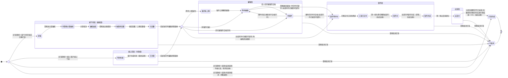

讀完這張卡，你會知道：

- 認識 [[訂單]]（OrderStatus）狀態機涵蓋的生命週期：從訂單成立走到結案，現階段支援線下、線上、諮詢三種來路
- 看懂各來路先走完自己的前段，線下與線上才合流進審稿、製作、出貨的共用流程
- 掌握每個轉換由誰觸發、要滿足什麼條件才推得動
- 理解為什麼審稿與製作之後的進度多半不由人一格一格手動改，而是隨底下印件、工單、生產任務做到哪裡自動往上反映
- 知道諮詢訂單為什麼建立當下就收於終態、不進共用流程

## 狀態列舉（正本）

> 本段是訂單狀態的唯一正本。狀態的新增與修改是商業決策，直接在此卡維護。

### 線下前段（審核段；訂單類型 = 線下，來自需求單成交）

| 狀態      | 說明                                 | 對應營運需求                           |
| ------- | ---------------------------------- | -------------------------------- |
| 草稿      | 初始；需求單成交轉訂單後的起點，業務可自由調整帶入內容        | 給業務一個成交條件還沒定稿前的編輯空間              |
| 待業務主管審核 | 業務送出後等業務主管核准（不核准時停在此態，業務可續改再等審）    | 落實成交條件（收款條件、應收總額）出門前有人把關         |
| 審核通過    | 主管已核可、業務尚未把報價單送給客戶；收款條件備註自此鎖定（金額明細不鎖，見 [[明細時點分界]]）| 區分「審完未送客戶」與「已送客戶等回簽」，業務照狀態篩選追蹤待辦 |
| 報價待回簽   | 業務已送出報價單，等客戶回簽確認                   | 追蹤哪些單卡在客戶手上                      |
| 已回簽     | 客戶回簽完成（業務確認或上傳回簽檔案），隨即依印件審稿狀態進入共用段 | 留下回簽時點紀錄，作為成交證明                  |

### 線上前段（付款段；訂單類型 = 線上，來自電商下單）

| 狀態 | 說明 | 對應營運需求 |
|------|------|------------|
| 等待付款 | 初始；客戶在線上前台下單，尚未完成付款 | 未付款的單不往下走，避免做白工 |
| 已付款 | 客戶完成付款（電商系統自動觸發），隨即依印件審稿狀態進入共用段 | 收到錢才開始投入審稿與製作 |

### 共用段（線下「已回簽」後、線上「已付款」後合流）

| 狀態    | 說明                               | 對應營運需求                     |
| ----- | -------------------------------- | -------------------------- |
| 稿件未上傳 | 進入審稿流程，等待業務或客戶上傳稿件（審稿段）          | 提醒業務追稿，稿不來生產動不了            |
| 等待審稿  | 有稿件在審、或已全數合格但業務尚未逐件確認可製作（審稿段）    | 審核品質之外，留給業務「客戶確定不改稿了」的最後把關 |
| 待補件   | 存在審稿不合格的印件，等補件（審稿段；與「等待審稿」可雙向互換） | 標示球在客戶端，業務知道要去催件           |
| 製作等待中 | 全部印件已確認可製作，等待製作細節確認、工單產生與交付（製作段）| 投產前的派工緩衝——線下單先經訂單管理人確認製作細節，印務主管再安排產能 |
| 工單已交付 | 工單經製程審核完成後由印務交付產線（製作段）              | 業務知道單子已進工廠排程               |
| 製作中   | 至少一個生產任務已開始製作（製作段）               | 業務可回覆客戶「已在生產」              |
| 製作完成  | 全部印件皆已完成製作（製作段；齊套判定見 [[齊套邏輯]]）   | 不能有一款印件漏做就出貨，避免客戶收到缺件      |
| 出貨中   | 至少一張出貨單已建立（出貨段）                  | 追蹤出貨進行中的訂單，支援分批出貨          |

### 終態

| 狀態 | 說明 | 適用訂單類型 |
|------|------|------------|
| 訂單完成 | 終態；全部**未棄用**印件已送達（線下／線上，系統自動；未棄用的打樣印件另須打樣結果＝OK——樣品送達後客戶評審通過才算收尾，純打樣訂單靠此避免評審前誤完成）；未棄用印件集合為空時不觸發完成，系統提示 [[業務]] 改走取消；諮詢正常收尾（不做大貨／需求單流失）。完成與發票、收款脫鉤——錢由對帳差額警示追、完成後客訴走售後服務單 | 線下／線上／諮詢 |
| 已取消 | 終態；訂單取消，不可逆；諮詢取消（半額退費）亦收於此態 | 線下／線上／諮詢 |

### 諮詢短路徑（訂單類型 = 諮詢）

諮詢訂單不進入共用段（無印件、無製作、無出貨），只在收尾情境由系統建立、建立即推進至終態：

- 結束諮詢不做大貨、需求單流失 → 「訂單完成」（正常收尾、有完整應收，非取消）
- 待諮詢取消（半額退費）→ 「已取消」（沒成交的生意，不計入成交統計）

### 段落間可逆性規則

- 前段（線下審核段／線上付款段）→ 審稿段 → 製作段 → 出貨段，**段落之間不可回退**
- 審稿段內「等待審稿」與「待補件」**允許雙向互換**（補件完成回到等待審稿，不視為回退）
- 訂單一旦進入製作段，即使有印件被退回改稿，**維持製作段不退回審稿段**（搭配警示標記提醒業務）
- 其他段落內子狀態單向推進

## 狀態機圖（UML）

依 UML 狀態機圖記法繪製：實心圓為初始點、雙圈為終止點、菱形為選擇偽狀態（依轉換條件分流）、轉換標籤採「觸發事件 [轉換條件]」格式。「業務取消訂單」轉換自五個段落複合狀態的邊界出發，依 UML 語意適用該段落內全部子狀態，合計表達「任一非終態皆可取消」（不可逆；下層五層連鎖的落點見轉換表該列）。**手動推進不另畫弧**：業務手動推進走的是圖上「審核通過」之後既有的每一條弧，只是把觸發者由系統自動換成業務，沒有新的轉換路徑；「草稿」與「待業務主管審核」兩態不提供手動推進（見轉換表最後一列）。

```mermaid
stateDiagram-v2
    direction LR

    state c_create <<choice>>
    [*] --> c_create

    state "線下前段（審核段）" as Offline {
        direction LR
        state "草稿" as s_draft
        state "待業務主管審核" as s_pending
        state "審核通過" as s_approved
        state "報價待回簽" as s_quote
        state "已回簽" as s_signed
        s_draft --> s_pending : 業務送主管審核
        s_pending --> s_approved : 主管核准
        s_approved --> s_quote : 業務送出報價單
        s_quote --> s_signed : 確認回簽／上傳回簽檔
    }

    state "線上前段（付款段）" as Online {
        direction LR
        state "等待付款" as s_unpaid
        state "已付款" as s_paid
        s_unpaid --> s_paid : 客戶完成付款（電商自動）
    }

    state c_route <<choice>>

    state "審稿段" as Review {
        direction LR
        state "稿件未上傳" as s_nofile
        state "等待審稿" as s_review
        state "待補件" as s_supp
        s_nofile --> s_review : 稿件上傳觸發審稿
        s_review --> s_supp : 任一印件審稿不合格
        s_supp --> s_review : 補件完成 [無其他不合格印件]
    }

    state "製作段" as Production {
        direction LR
        state "製作等待中" as s_pwait
        state "工單已交付" as s_wo
        state "製作中" as s_prod
        state "製作完成" as s_pdone
        s_pwait --> s_wo : 印務交付工單至產線
        s_wo --> s_prod : 第一個生產任務開始製作（系統自動）
        s_prod --> s_pdone : 全部印件製作完成（齊套，系統自動）
    }

    state "出貨段" as Shipping {
        direction LR
        state "出貨中" as s_ship
    }

    s_signed --> c_route : 系統依印件審稿狀態歸納
    s_paid --> c_route : 系統依印件審稿狀態歸納
    c_route --> s_nofile : [等待上傳稿件]
    c_route --> s_review : [有稿件在審]
    c_route --> s_supp : [存在審稿不合格印件]
    c_route --> s_pwait : [全部印件已確認可製作] 免審稿快速路徑
    s_review --> s_pwait : 業務確認最後一件印件可製作 [全部印件已確認可製作]
    s_supp --> s_pwait : 補件的印件判合格 [全部印件已確認可製作]
    s_pdone --> s_ship : 第一張出貨單建立

    state "訂單完成" as s_done
    state "已取消" as s_cancel

    c_create --> s_draft : [訂單類型＝線下] 需求單成交轉訂單
    c_create --> s_unpaid : [訂單類型＝線上] 客戶線上下單
    c_create --> s_done : [訂單類型＝諮詢] 結束諮詢不做大貨／需求單流失
    c_create --> s_cancel : [訂單類型＝諮詢] 待諮詢取消（半額退費）

    s_ship --> s_done : 全部未棄用印件已送達 [未棄用的打樣印件另須打樣結果＝OK]（系統自動）
    Offline --> s_cancel : 業務取消訂單
    Online --> s_cancel : 業務取消訂單
    Review --> s_cancel : 業務取消訂單
    Production --> s_cancel : 業務取消訂單
    Shipping --> s_cancel : 業務取消訂單

    s_done --> [*]
    s_cancel --> [*]
```

## 轉換條件與觸發事件

| 轉換 | 觸發事件 | 條件 |
|------|---------|------|
| （建立）→ 草稿 | 業務於成交的需求單執行「轉訂單」 | 訂單類型 = 線下 |
| 草稿 → 待業務主管審核 | 業務點「送主管審核」（寫入送審時間） | 草稿與待審兩態業務皆可編輯；主管不核准時停在待審、無退回草稿動作 |
| 待業務主管審核 → 審核通過 | 業務主管點「核准訂單」 | 核可當下鎖定收款條件備註；金額明細（印件單價／購買數量／折扣金額／其他費用）仍可直接改至訂單完成或已取消為止，分界正本見 [[明細時點分界]] |
| 審核通過 → 報價待回簽 | 業務以外部管道送出報價單後，手動點「已送報價單」 | 僅訂單類型 = 線下 |
| 報價待回簽 → 已回簽 | 業務點「確認回簽」**或**上傳回簽檔案（任一即觸發，記下回簽時間） | 回簽時間以首次回簽為準（之後追加文件不改變成交時點） |
| （建立）→ 等待付款 | 客戶於線上前台下單 | 訂單類型 = 線上 |
| 等待付款 → 已付款 | 客戶完成付款（電商系統自動） | — |
| 已回簽／已付款 → 稿件未上傳／等待審稿／待補件 | 系統依印件審稿狀態自動歸納落點 | 依印件審稿現況落入審稿段對應狀態；印件停在「待分派」時看稿件有無——稿件已上傳者併入「等待審稿」、尚未上傳者併入「稿件未上傳」（審稿段不因尚未分派另立狀態）|
| 已回簽／已付款 → 製作等待中 | 系統依印件審稿狀態自動歸納（免審稿快速路徑） | 全部印件已確認可製作（免審印件直接合格；線上單合格後自動確認，線下單由業務逐件確認） |
| 稿件未上傳 → 等待審稿 | 稿件上傳觸發審稿（印件審稿狀態向上歸納） | — |
| 等待審稿 → 待補件 | 審稿人員退件（任一印件審稿不合格） | — |
| 待補件 → 等待審稿 | 客戶／業務補件完成 | 無其他不合格印件；此互換不視為回退 |
| 待補件 → 製作等待中 | 補件的印件判合格後全部印件已確認可製作（系統自動） | 混合印件情境——其餘印件早已確認可製作，最後一件補件過關即離開審稿段，不必經「等待審稿」中繼；歸納優先序屬實作規格（見 § 範圍外）|
| 等待審稿 → 製作等待中 | 業務確認最後一件印件可製作（線上單由系統自動確認） | 全部印件已確認可製作；全數合格但尚有未確認件時停在「等待審稿」（球在業務） |
| 製作等待中 → 工單已交付 | 印務交付工單至產線 | 印件印製維度須已至「製程已確認」（線下單經訂單管理人確認製作細節、線上單自動到位）且工單已完成製程審核，見 [[印件狀態]] |
| 工單已交付 → 製作中 | 第一個生產任務開始製作（系統自動向上反映） | — |
| 製作中 → 製作完成 | 全部印件印製狀態到達「製作完成」（系統自動，齊套判定見 [[齊套邏輯]]） | 訂單類型 = 線下／線上 |
| 製作完成 → 出貨中 | 第一張出貨單建立 | — |
| 出貨中 → 訂單完成 | 全部未棄用印件已送達（系統自動） | 判定只看未棄用的印件，已棄用者不進分母（NG-稿件棄用的舊打樣印件其打樣結果永停 NG，若照收會永遠卡住完成）；未棄用的打樣印件另須打樣結果＝OK（樣品送達後客戶評審中＝訂單停在出貨段，NG-製程回頭重跑不破終態；主要保護純打樣訂單）；全部印件皆已棄用時不觸發完成，系統提示 [[業務]] 改走取消（沒有一件要交付的訂單不該認列成交）；完成與發票收款脫鉤；完成後客訴由售後服務單承接，不設客訴觀察期 |
| （建立）→ 訂單完成 | 諮詢人員執行「結束諮詢－不做大貨」，或系統處理需求單流失事件 | 訂單類型 = 諮詢；系統建立諮詢訂單即推進終態 |
| （建立）→ 已取消 | 諮詢人員／業務主管執行「確認取消諮詢」（選取消原因） | 訂單類型 = 諮詢；系統同步建立半額退費的訂單異動 |
| 任何非終態狀態 → 已取消 | 業務點「取消訂單」 | 不可逆；由上而下五層連鎖——印件任一非終態轉「已棄用」；任一**非終態**工單轉「已取消」（已收於「已完成」的工單不動，製作帳保留）；生產任務依**有無實際投入事實**分流（場內看報工、外發看派單是否已發稿，落點見 [[生產任務狀態]]）；名下派單由系統提示 [[印務]] 處理、不自動作廢（見 [[派單狀態]]）；**未離廠的出貨單（未處理／打包中／待出貨）由系統自動作廢**、運送中與已送達的單不動（見 [[出貨單狀態]]）。同時**終止進行中的工單異動**：取消當下尚未確認的異動自 [[生管]] 待確認佇列移除、不得再確認（異動確認會把工單推回原狀態，與已取消相斥）。已完工入庫的實體成品不設系統處置、由場內人工處理 |
| 「審核通過」之後的任何非終態狀態 → 順序上的下一個狀態（手動推進） | [[業務]] 手動推進訂單狀態 | **範圍限主管核准之後**：自「審核通過」（含）起的非終態狀態才提供手動推進；**「草稿」與「待業務主管審核」兩態不提供**，避免業務自行推過 [[業務主管]] 核准那一格（線上前段無主管核准關卡，不在此限）。走的是本表既有的每一條轉換、只換觸發者（系統自動改為業務手動），**不新增狀態、不新增路徑**；只能沿既有狀態順序**往前**推、**不可逆**、無回退動作；每次推進寫入訂單活動紀錄（誰在什麼時候推的）。用於系統事件湊不齊的收尾情境——例如全部印件都以短出結案收掉、從未建過任何出貨單的訂單，沒有「出貨單建立」與「全部印件送達」兩個事件可觸發，由業務手動推進至「訂單完成」。**防呆＝逐格推進＋確認對話**：一次只能推一格（不得跨格跳到後面的狀態）、每次推進前出確認對話並寫明這一步推完不可逆；推進到終態那一格的確認文案另寫，明講金額明細將自此鎖定、之後的金額增減改走售後軌（分界見 [[明細時點分界]]）|

> 為什麼這樣分權與認列，見 [[齊套邏輯]] 與 [[付款發票邏輯]]。

## 關鍵轉換的營運動機

- 線下前段插入「審核通過」（待業務主管審核 → 審核通過 → 報價待回簽）→ 動機：把「主管已核可」與「已送客戶等回簽」分成兩格，讓業務照狀態篩追蹤待辦，並確立報價單外發前必經核可 → 例子：訂單經主管核可進「審核通過」後，業務才手動點「已送報價單」外發，兩個動作各留時間戳。金額明細的可改邊界不在此格——印件單價、購買數量、折扣金額、其他費用一律到「訂單完成／已取消」訂單完成或已取消才鎖，分界正本見 [[明細時點分界]]；核可當下鎖定的只有收款條件備註。
- 「合格」之上再設「已確認可製作」門檻（等待審稿 → 製作等待中）→ 動機：審稿合格代表品質過關，但客戶可能還要改稿；線下單由業務逐件確認「客戶不會再改了」才放行投產，避免做完才退稿整批報廢 → 例子：線下訂單三款印件全數合格，業務確認了兩件，第三件客戶說圖樣還要再調，訂單就停在「等待審稿」，不會進入製作段。
- 製作中 → 製作完成 → 動機：要全部印件都做齊才算完成，不能有一款漏做就出貨，否則客戶會收到缺件的訂單 → 例子：ORD-2026-0512 下三款印件，前兩款先做完、第三款還在印，訂單仍停在「製作中」，等第三款做完才一起轉「製作完成」。
- 製作等待中 → 工單已交付 → 製作中（自動向上反映）→ 動機：訂單進度自動跟著底下工單與生產任務走，業務不必逐張工單手動回填訂單狀態 → 例子：生產端把 ORD-2026-0512 的第一張工單交付出去，訂單自動從「製作等待中」變「工單已交付」，第一個生產任務一開做又自動變「製作中」。
- 訂單狀態容許業務手動往前推進 → 動機：訂單的進度多半靠底下印件、工單、生產任務的事件自動往上反映，但事件湊不齊的收尾情境是存在的——所有印件都以短出結案收掉、一張出貨單都沒建過的訂單，永遠等不到「出貨單建立」與「全部印件送達」這兩個事件，訂單就卡在製作段回不了家，業務的待辦清單也永遠清不掉。與其為每一種湊不齊的組合補一條自動規則（每補一條就多一個要維護的判定，而且下一種情況又漏），不如留一個人可以按的出口。限制只往前推、不可逆、每次留紀錄，是因為往回退會讓已經發生的事（貨出了、單開了）在系統上憑空消失，而往前推頂多是提早宣告收尾、留紀錄就查得出是誰決定的。範圍從「審核通過」才起算，是因為前面兩格（草稿、待業務主管審核）卡的是成交條件出門前的主管核准——那不是「事件湊不齊」，是刻意設的分權，開了手動推進等於讓業務自己核准自己的單 → 例子：ORD-2026-0488 兩件印件都因客戶同意少收由印務短出結案，全程沒有出貨單，業務手動把訂單推到「訂單完成」，活動紀錄留下推進人與時間。
- 諮詢取消收於「已取消」（而非訂單完成）→ 動機：諮詢取消是沒談成的生意，若算成「訂單完成」會讓成交統計虛胖、業務月會數字失真 → 例子：客戶付了 2000 諮詢費後在諮詢階段喊停，系統建好諮詢訂單後直接收為「已取消」，並退一半（1000）給客戶，這筆不計入成交業績。

## 與其他狀態機的關係

- 製作段與出貨段的進度由下層自動往上反映：[[生產任務狀態]] → [[工單狀態]] → [[印件狀態]] → 訂單（任務層已移除）。底層做到哪一步，訂單就顯示到哪一步；雙維度的判定細節在 [[印件狀態]]，本卡只接收結果。
- 審稿段三狀態由印件的審稿維度自動歸納。打樣印件也是印件、同樣計入歸納，且會走完自己的審稿與製作流程做出實體樣品——打樣生產期間大貨印件尚未全部確認可製作，訂單整體停留在審稿段（訂單顯示審稿段不代表工廠沒在動）。客戶確認打樣沒問題後，業務才確認大貨印件可製作、訂單進入製作段。打樣結果的處置（通過進大貨／重新打樣／棄用重建）走 [[打樣流程]] 與 [[印件狀態]]，不是訂單狀態機的獨立段落。
- 訂單取消時由上而下連鎖五層，各層落點的規則正本在各自的狀態機卡：印件轉「已棄用」（[[印件狀態]]）、**非終態**工單轉「已取消」（[[工單狀態]]）、生產任務轉「已作廢」或「報廢」（[[生產任務狀態]]）、名下派單僅提示印務、不自動作廢（[[派單狀態]]）、未離廠出貨單自動作廢（[[出貨單狀態]]）。
- 諮詢取消會連帶建立一張半額退費的 [[訂單異動狀態]]，但那張單據自己的審核與認列進度走 [[訂單異動狀態]]，後續退款完成與否不影響訂單已收於「已取消」終態。
- 開發票與收款的進度（先收後開、頭尾款分期）走 [[收款項目狀態]]；本卡只管訂單整體走到哪一格。
- 出貨單自身的備料、運送、送達進度走 [[出貨單狀態]]；本卡的出貨段只接收「出貨單建立」與「全部出貨完成」兩個結果。

## 範圍外

- **審稿段落點與免審快速路徑的歸納細則**：訂單回簽／付款後落入哪個審稿狀態、混合情境（部分免審＋部分待上傳）怎麼判，系統會自動歸納——本卡只承諾此行為與業務條件，**詳細優先序屬實作規格、不在本卡，實作時勿自行發明**
- 訂單成立後的金額增減（加印、補運費、退費）→ 走 [[訂單異動狀態]]
- 開發票與收款狀態 → 走 [[收款項目狀態]]；發票自身的開立與作廢 → 走 [[發票狀態]]
- 諮詢階段本身（待諮詢、認領、結束諮詢）→ 走 [[諮詢單狀態]]；本卡只從諮詢收尾接手「諮詢訂單」的終態
- 取消後的退款金流（退款訂單異動於確認生效時認列調整應收 + 退款款項紀錄切已完成核銷收款差額，見 [[對帳一致性]]）→ 屬款項層收尾，走 [[訂單異動狀態]] 與付款紀錄，不是訂單狀態
- 製作完成的齊套判定準則、諮詢收尾退費與對帳的完整規則 → 見 [[齊套邏輯]] 與 [[付款發票邏輯]]（規則正本）
- 出貨後的客訴與補救 → 走 [[售後服務狀態]]，不影響訂單終態

## 相關卡

- 規則：[[齊套邏輯]]（製作完成自動推進的判定正本）、[[付款發票邏輯]]（諮詢收尾退費與終態、對帳規則正本）、[[打樣流程]]（打樣決策點與 NG 處置）、[[明細時點分界]]（訂單完成前後的明細調整分界）
- 流程：[[線下訂單流程]]（線下端到端服務藍圖）、[[諮詢服務流程]]（諮詢三出口收尾）
- 實體：[[訂單]]（本狀態機依附的主實體）
- 狀態機：[[印件狀態]]／[[工單狀態]]／[[生產任務狀態]]（由下往上反映進度）、[[訂單異動狀態]]（金額增減獨立流轉）、[[收款項目狀態]]（開發票收款獨立流轉）、[[諮詢單狀態]]（諮詢收尾接手）、[[出貨單狀態]]（出貨進度）、[[售後服務狀態]]（出貨後客訴）、[[發票狀態]]／[[折讓單狀態]]（開發票折讓獨立流轉）
- 角色：[[業務]]（送審、送報價單、確認回簽、確認可製作、取消）、[[業務主管]]（核准訂單、代理取消諮詢）、[[諮詢]]（諮詢收尾觸發）、[[審稿人員]]（審稿段把關）、[[印務主管]]（工單加開分派、製程審核）、[[印務]]（工單交付產線、取消時處理名下派單）、[[生管]]（取消時進行中工單異動的終止對象）、[[出貨人員]]（出貨段推進）
