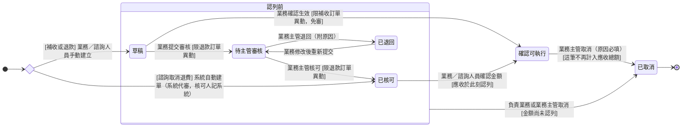

讀完這張卡，你會知道：

- 認出訂單異動的六個處境，以及哪一個代表金額已經算進應收
- 分辨補收與退款兩條來路差在哪一站
- 說出每一次處境變化由誰觸發、要滿足什麼條件
- 判斷一張單走到哪裡還能取消、取消要誰點頭
- 理解退款為什麼要停一站等業務與客戶談定金額

## 狀態列舉（正本）

> 本段是訂單異動狀態的唯一正本。狀態的新增與修改是商業決策，直接在此卡維護。

| 狀態    | 說明                                                                                                     | 對應營運需求                                            |
| ----- | ------------------------------------------------------------------------------------------------------ | ------------------------------------------------- |
| 草稿    | 初始；業務或諮詢人員建好還沒送出。補收與退款都先落這一站                                                                           | 金額、原因填到一半可先存的暫存空間；送出之前發現填錯可直接收掉                    |
| 待主管審核 | 業務提交後等業務主管核可（只有退款訂單異動會經過這一站）                                                                              | 落實退錢出去前有主管把關，補收不經此站                               |
| 已核可   | 審核已通過、金額尚待確認。線下退款由業務主管核可後落此態、諮詢取消退費因退費金額固定改由系統代審建單即落此態。確認前可調整金額（不需重審，每次改留稽核記錄）                          | 退款金額在退錢之前常與客戶再談定，給業務與諮詢人員一個可校正的窗口；核可金額保留主管當時核准的數字供事後監督 |
| 已退回   | 主管退回（附原因），業務改完可重送                                                                                      | 讓主管擋下不合理退款，並給業務修正機會                               |
| 確認可執行 | 金額於進入此態時認列進應收——補收與退款都由業務或諮詢人員執行「確認生效」。**不是終態**：業務主管仍可取消（附原因），這筆金額不再計入應收總額                                    | 金額增減有明確且統一的認列點；已認列的單發現建錯時，由主管這一關取消，不必另建反向單把帳弄複雜   |
| 已取消   | 終態；任一處境都可以取消。金額尚未認列的由該單負責業務自己取消，已認列的限業務主管取消並附原因                                                          | 建錯、不必要或決定不退的單可作廢，不留無效單據；把關強度跟著「錢有沒有算進應收」走         |

## 狀態機圖（UML）

依 UML 狀態機圖記法繪製：實心圓為初始點、雙圈為終止點、菱形為選擇偽狀態、轉換標籤採「觸發事件 [守衛條件]」格式。「認列前」是一個複合狀態，框住金額尚未算進應收的四個處境；從它邊界出發的取消轉換適用框內全部處境。已認列（確認可執行）的取消單獨畫一條，因為把關的人不同。

```mermaid
stateDiagram-v2
    direction LR

    state c_create <<choice>>
    [*] --> c_create

    state "認列前" as g_pre {
        state "草稿" as s_draft
        state "待主管審核" as s_pending
        state "已核可" as s_approved
        state "已退回" as s_returned

        s_draft --> s_pending : 業務提交審核 [限退款訂單異動]
        s_pending --> s_approved : 業務主管核可 [限退款訂單異動]
        s_pending --> s_returned : 業務主管退回（附原因）
        s_returned --> s_pending : 業務修改後重新提交
    }

    state "確認可執行" as s_executed
    state "已取消" as s_cancelled

    c_create --> s_draft : [補收或退款] 業務／諮詢人員手動建立
    c_create --> s_approved : [諮詢取消退費] 系統自動建單（系統代審，核可人記系統）

    s_draft --> s_executed : 業務確認生效 [限補收訂單異動，免審]
    s_approved --> s_executed : 業務／諮詢人員確認金額 [應收於此刻認列]

    g_pre --> s_cancelled : 負責業務或業務主管取消 [金額尚未認列]
    s_executed --> s_cancelled : 業務主管取消（原因必填）[這筆不再計入應收總額]

    s_cancelled --> [*]
```

## 轉換條件與觸發事件

| 轉換 | 觸發事件 | 條件 |
|------|---------|------|
| （建立）→ 草稿 | 業務或諮詢人員建立訂單異動 | 補收或退款；金額為零時不建單 |
| （建立）→ 已核可 | 諮詢取消時系統自動建單 | 「負向異動須審核」不破例——因退費金額固定，審核由系統代行（核可人記為系統）；此時應收尚未認列；此類型業務不可手動建立 |
| 草稿 → 待主管審核 | 業務點「提交審核」 | 限退款訂單異動 |
| 草稿 → 確認可執行 | 業務點「確認生效」 | 限補收訂單異動（免審）；核可人記為業務本人、核可時間與生效時間記為當下，應收即時加上這筆 |
| 待主管審核 → 已核可 | 業務主管核可 | 限退款訂單異動；核可時寫入核可人、核可時間與核可金額，應收此刻尚未認列 |
| 待主管審核 → 已退回 | 業務主管退回（附原因） | — |
| 已退回 → 待主管審核 | 業務修改後重新提交 | — |
| 已核可 → 確認可執行 | 業務或諮詢人員與客戶確認金額後，執行「確認生效」 | 全部退款訂單異動；**應收於此刻認列減去**、寫入生效時間；確認前可調整金額（不需重審，每次改留稽核記錄，核可金額不變） |
| 草稿／待主管審核／已退回／已核可 → 已取消 | 該單負責業務或業務主管點「取消」 | 金額尚未認列，取消不動應收 |
| 確認可執行 → 已取消 | 業務主管點「取消」並填取消原因 | 限業務主管；這筆金額不再計入應收總額；取消後若應收低於已開發票淨額或已收款淨額，對帳提示差額 |

> 為什麼補收不用審、退款要主管核可、諮詢取消為什麼由系統代審、認列為什麼與實際退錢分開、已認列的單為什麼限主管才能取消，見 [[訂單異動規則]]（規則正本）。

## 關鍵轉換的營運動機

- 補收先落草稿、確認生效才認列（草稿 → 確認可執行）→ 動機：客戶加錢是送上門的生意，不必等主管，但也不該一按就定案；先落草稿讓業務在送出前看一眼金額與訂單，確認生效那一刻才動應收 → 例子：客戶對 ORD-2026-0512 追加 500 份、加收 6,000，業務建單先落草稿，覆核金額無誤後點「確認生效」，應收當下變多 6,000，全程不經任何審核站。
- 退款核可後停「已核可」、確認生效才認列（待主管審核 → 已核可 → 確認可執行）→ 動機：「能不能退」由主管核可把關，「退多少」在退錢之前常與客戶再談定，故留一個可校正金額的窗口（改不需重審、每次改留稽核記錄、核可金額不變供事後監督）；認列擺在確認那一刻，確認後應收就不再回頭改。「退好沒」另由對帳的收款差額盯住 → 例子：主管核可退 5,000 的單，單停在已核可、應收未動；業務與客戶談定改退 4,800 後執行「確認生效」，單轉確認可執行、應收此刻減 4,800（核可金額仍記 5,000）。
- 已認列的單由業務主管取消（確認可執行 → 已取消）→ 動機：訂單異動只影響應收、不牽動任何款項或發票單據，所以建錯的單可以直接取消，不必另開一張反向單把帳面弄成兩筆；但這筆金額一旦不再計入應收，已開的發票與已收的款就可能對不上，所以這一關限業務主管、原因必填，並由對帳的差額提醒接住後續 → 例子：業務把 600 元的補收誤打成 6,000 並已確認生效，主管在訂單異動上取消該單並填「金額誤植」，應收少掉這 6,000，活動紀錄留下取消前金額與原因。

## 與其他狀態機的關係

- 訂單異動不卡主訂單：就算這張單還在等主管核可，主訂單的生產與出貨照常往前走；主訂單自己的收尾走 [[訂單狀態]]。
- 訂單異動認列會讓訂單應收總額重算，但**不會**自動建立或修改 [[收款項目狀態]]——分幾期收、何時開發票是業務另行規劃。
- 訂單完成後的客訴退款與原單善後的加收，都是在 [[售後服務狀態]] 內建立訂單異動，單據本身仍走本卡的路徑（標記來源售後單，規則一致）。
- 諮詢取消的退費單由 [[諮詢單狀態]] 的取消出口觸發系統建立。

## 範圍外

- **退款實際匯出與核銷的運作**：錢退好沒由對帳的收款差額盯住（退款款項標已完成才核銷歸零）——本卡只承諾各狀態的認列語意，對帳機制屬 [[對帳一致性]] 與 [[付款發票邏輯]]，不在本卡，實作時勿在訂單異動狀態上疊加退款進度
- 誰能核可、誰能取消、應收總額怎麼算、哪些狀態能改哪些欄位 → 見 [[訂單異動規則]]（規則正本）
- 訂單完成前的減量退款不開訂單異動（業務直接在款項紀錄退）→ 規則見 [[訂單異動規則]]
- 售後服務單自身的受理與結案進度 → 走 [[售後服務狀態]]
- 純規格調整（金額為零）不建訂單異動，走通知與活動紀錄 → 規則見 [[訂單異動規則]]

## 相關卡

- 規則：[[訂單異動規則]]（分權、認列、可改範圍、取消、監督的規則正本）、[[對帳一致性]]（收款差額核銷的對帳底線）、[[付款發票邏輯]]（款項與發票全景）
- 實體：[[訂單]]（訂單異動依附的主實體）、[[訂單異動]]（欄位正本）、[[售後服務]]（完成後善後的受理容器）
- 狀態機：[[訂單狀態]]（主訂單不被訂單異動卡住）、[[收款項目狀態]]（認列不自動動收款項目）、[[售後服務狀態]]（售後單內的訂單異動走本卡）、[[諮詢單狀態]]（諮詢取消觸發系統建單）
- 角色：[[業務]]／[[諮詢]]（建單；補收確認生效、退款送審）、[[業務主管]]（退款核可與退回、已認列單的取消）、[[會計]]（月結時依收款差額核對退款是否退好）
