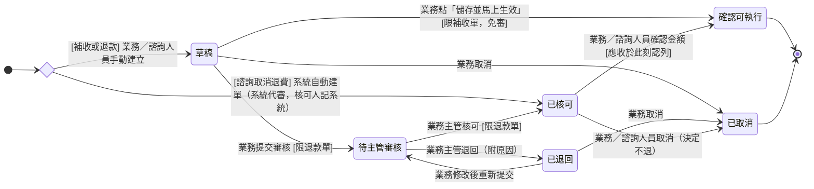

## 概述

訂單異動單（OrderAdjustmentStatus）的狀態機。[[訂單]] 成立後遇到金額增減（追加印量、加運費、急件費、退費），就用一張訂單異動單記錄這筆增減；這張單自己跑自己的審核與生效進度，**不卡主訂單的生產與出貨**。異動單的來路現階段有兩種：

- **業務／諮詢人員手動建立**：補收（向客戶加收）或退款（退錢給客戶）
- **系統自動建立**：諮詢取消時的固定退費單（系統建立即帶「已核可」）

誰能核可、錢什麼時候算進應收、退錯了怎麼還原，規則正本在 [[訂單異動規則]]，本卡只定義狀態與轉換、不複述規則。

## 狀態列舉（正本）

> 本段是訂單異動單狀態的唯一正本。狀態的新增與修改是商業決策，直接在此卡維護。

| 狀態    | 說明                                                                                                             | 對應營運需求                                                |
| ----- | -------------------------------------------------------------------------------------------------------------- | ----------------------------------------------------- |
| 草稿    | 初始（手動建立的單）；業務／諮詢人員建好但還沒送出                                                                                      | 金額、原因填到一半可先存的暫存空間                                     |
| 待主管審核 | 業務提交後等業務主管核可（只有退款單會經過這一站）                                                                                      | 落實退錢出去前有主管把關，補收不經此站                                   |
| 已核可   | 審核已通過、金額尚待確認。**所有退款單核可後都停在此態**：線下退款由業務主管核可後落此態、諮詢取消退費因退費金額固定改由**系統代審**建單即落此態。確認前可調整金額（不需重審，每次改留稽核記錄）、也可取消（決定不退） | 退款金額在退錢之前常與客戶再談定，給業務與諮詢人員一個可校正的窗口；核可金額快照保留主管當時核准的數字供事後監督 |
| 已退回   | 主管退回（附原因），業務改完可重送                                                                                              | 讓主管擋下不合理退款，並給業務修正機會                                   |
| 確認可執行 | 終態（不可逆）；金額於進入此態時認列進應收——補收於建單生效時、退款於確認金額時（線下退款由業務確認、諮詢取消由諮詢人員確認）                                                      | 金額增減有明確且統一的認列點；之後的折讓（或作廢重開發票）與實際退款由對帳把發票淨額、收款淨額對回應收淨額 |
| 已取消   | 終態；在草稿、已退回階段主動撤掉，或諮詢取消退費單於已核可階段決定不退                                                                            | 建錯、不必要或決定不退的單可作廢，不留無效單據                               |

## 狀態機圖（UML）

依 UML 狀態機圖記法繪製：實心圓為初始點、雙圈為終止點、菱形為選擇偽狀態、轉換標籤採「觸發事件 [守衛條件]」格式。一般退款由主管核可**當下即生效**（帳面上瞬間經過「已核可」、不停留），圖上畫為直達「確認可執行」；「已核可」作為停留狀態只出現在諮詢取消路徑。

```mermaid
stateDiagram-v2
    direction LR

    state c_create <<choice>>
    [*] --> c_create

    state "草稿" as s_draft
    state "待主管審核" as s_pending
    state "已核可" as s_approved
    state "已退回" as s_returned
    state "確認可執行" as s_executed
    state "已取消" as s_cancelled

    c_create --> s_draft : [補收或退款] 業務／諮詢人員手動建立
    c_create --> s_approved : [諮詢取消退費] 系統自動建單（系統代審，核可人記系統）

    s_draft --> s_pending : 業務提交審核 [限退款單]
    s_draft --> s_executed : 業務點「儲存並馬上生效」 [限補收單，免審]
    s_draft --> s_cancelled : 業務取消
    s_pending --> s_approved : 業務主管核可 [限退款單]
    s_pending --> s_returned : 業務主管退回（附原因）
    s_returned --> s_pending : 業務修改後重新提交
    s_returned --> s_cancelled : 業務取消
    s_approved --> s_executed : 業務／諮詢人員確認金額 [應收於此刻認列]
    s_approved --> s_cancelled : 業務／諮詢人員取消（決定不退）

    s_executed --> [*]
    s_cancelled --> [*]
```

## 轉換條件與觸發事件

| 轉換 | 觸發事件 | 條件 |
|------|---------|------|
| （建立）→ 草稿 | 業務／諮詢人員手動建立異動單 | 補收或退款；純規格調整金額為零時不建單 |
| （建立）→ 已核可 | 諮詢取消時系統自動建單 | 「負向異動須審核」不破例——因退費金額固定，審核由系統代行（核可人記為系統）；此時應收尚未認列；此類型業務不可手動建立 |
| 草稿 → 待主管審核 | 業務點「提交審核」 | 限退款單 |
| 草稿 → 確認可執行 | 業務點「儲存並馬上生效」 | 限補收單（免審）；核可人記為業務本人、生效時間記為當下，應收即時加上這筆 |
| 草稿 → 已取消 | 業務點「取消」 | — |
| 待主管審核 → 已核可 | 業務主管核可 | 限退款單；核可時寫入核可人與核可金額快照，應收此刻尚未認列 |
| 待主管審核 → 已退回 | 業務主管退回（附原因） | — |
| 已退回 → 待主管審核 | 業務修改後重新提交 | — |
| 已退回 → 已取消 | 業務點「取消」 | — |
| 已核可 → 確認可執行 | 業務或諮詢人員與客戶確認金額後，執行「確認」 | 全部退款單；**應收於此刻認列減去**、補上生效時間；確認前可調整金額（不需重審，每次改留稽核記錄，核可金額快照不變） |
| 已核可 → 已取消 | 業務或諮詢人員點「取消」（決定不退了） | 全部退款單；取消後不認列、應收不變 |

> 為什麼補收不用審、退款要主管核可、諮詢取消為什麼由系統代審、認列為什麼與實際退錢分開，見 [[訂單異動規則]]（規則正本）。

## 關鍵轉換的營運動機

- 補收免審直達確認可執行（草稿 → 確認可執行）→ 動機：客戶加錢是送上門的生意、風險在公司收錢方向（低），等主管核可會拖延出貨；把關鬆緊跟著錢的流向走 → 例子：客戶對 ORD-2026-0512 追加 500 份、加收 6,000，業務點「儲存並馬上生效」，應收當下變多 6,000，不經任何審核站。
- 退款核可後停「已核可」、確認金額才認列（待主管審核 → 已核可 → 確認可執行）→ 動機：「能不能退」由主管核可把關，「退多少」在退錢之前常與客戶再談定，故留一個可校正金額的窗口（改不需重審、每次改留稽核記錄、核可金額快照不變供事後監督）；認列擺在確認那一刻，確認後應收就不再回頭改。「退好沒」另由對帳的收款差額盯住——認列與物理退款兩層分開，退款分次或建錯重退都不會把這張單的狀態反覆拉扯 → 例子：主管核可退 5,000 的單，單停在已核可、應收未動；業務與客戶談定改退 4,800 後執行確認，單轉確認可執行、應收此刻減 4,800（核可金額快照仍記 5,000）；之後就算業務取消了退款款項重退，這張單維持確認可執行、應收不回退，對帳的收款差額會重新出現引導重退。
- 諮詢取消由系統代審建為已核可、確認金額才認列（已核可 → 確認可執行）→ 動機：「負向異動須審核」的規則不破例，但退一半是既定規則、由系統代行審核，主管的退款審核佇列只留線下單；「已核可」停留態讓諮詢人員在認列前還能調整金額或決定不退，確認金額那一刻應收才減去 → 例子：系統為取消的諮詢自動建退費單（已核可），諮詢人員與客戶確認後執行「確認」，應收於此刻減 1,000；接著開立折讓並實際退款，由對帳把三方數字對平。

## 與其他狀態機的關係

- 異動單不卡主訂單：就算這張單還在等主管核可，主訂單的生產與出貨照常往前走；主訂單自己的收尾走 [[訂單狀態]]。
- 異動單生效會讓訂單應收總額重算，但**不會**自動建立或修改 [[分期請款狀態]]——分幾期收、何時開發票是業務另行規劃。
- 訂單完成後的客訴退款，是在 [[售後服務狀態]] 內建立退款異動單，單據本身仍走本卡的退款路徑（標記來源售後單，規則一致）。
- 諮詢取消的退費單由 [[諮詢單狀態]] 的取消出口觸發系統建立。

## 範圍外

- **退款實際匯出與核銷的運作**：錢退好沒由對帳的收款差額盯住（退款款項標已完成才核銷歸零）——本卡只承諾各狀態的認列語意，對帳機制屬 [[對帳一致性]] 與 [[付款發票邏輯]]，不在本卡，實作時勿在異動單狀態上疊加退款進度
- 誰能核可、應收總額怎麼算、金額哪些狀態能改（編輯閘門）→ 見 [[訂單異動規則]]（規則正本）
- 訂單完成前的減量退款不開異動單（業務直接在款項紀錄退）→ 規則見 [[訂單異動規則]]
- 售後服務單自身的受理與結案進度 → 走 [[售後服務狀態]]
- 純規格調整（金額為零）不建異動單，走通知與活動紀錄 → 規則見 [[訂單異動規則]]

## 相關卡

- 規則：[[訂單異動規則]]（分權、認列、編輯閘門、監督的規則正本）、[[對帳一致性]]（收款差額核銷的對帳底線）、[[付款發票邏輯]]（款項與發票全景）
- 實體：[[訂單]]（異動單依附的主實體）、[[售後服務]]（完成後退款的受理容器）
- 狀態機：[[訂單狀態]]（主訂單不被異動單卡住）、[[分期請款狀態]]（生效不自動動期次）、[[售後服務狀態]]（售後單內的異動單走本卡）、[[諮詢單狀態]]（諮詢取消觸發系統建單）
- 角色：[[業務]]／[[諮詢]]（建單；補收直接生效、退款送審）、[[業務主管]]（退款核可與退回）、[[會計]]（月結時依收款差額核對退款是否退好）
