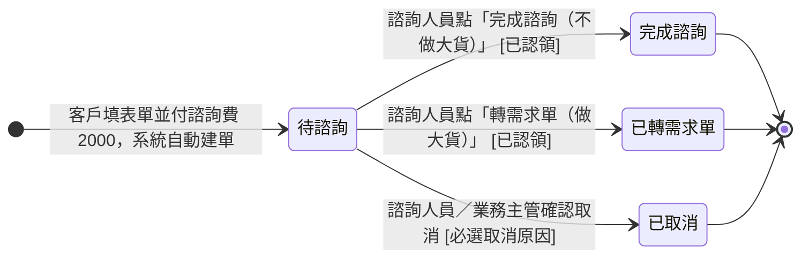

## 概述

[[諮詢單]]（ConsultationRequestStatus）從客戶付費預約到出口選定的狀態機。客戶透過問卷工具填表並預付諮詢費 2000 元，系統收到金流通知自動建單；諮詢人員認領、進行諮詢後，在「待諮詢」這一格直接選定三個出口之一——不做大貨、轉需求單做大貨、或諮詢前取消。

本狀態機的設計原則是**狀態承載商業出口分類、系統判斷靠事件與欄位**：四個狀態就是四種商業狀況（待服務／純諮詢結案／轉入銷售／取消退費），列表按狀態分組即為諮詢成效分布；出口選定後狀態即定格，下游需求單的成交或流失不回寫諮詢單。三個出口的帳務收尾（錢怎麼轉、退多少）規則正本在 [[諮詢收尾規則]]，付款跨單轉移的金流規則在 [[付款發票邏輯]]，本卡只定義狀態與轉換、不複述規則。

## 狀態列舉（正本）

> 本段是諮詢單狀態的唯一正本。狀態的新增與修改是商業決策，直接在此卡維護。

| 狀態 | 說明 | 對應營運需求 |
|------|------|------------|
| 待諮詢 | 初始；系統自動建單後等待認領與諮詢。認領、主管代派、改派、進行諮詢都停在此態（只記負責人） | 標示「諮詢服務還沒收尾」的所有單；刻意不設「諮詢中」過渡態，諮詢完當下就選出口、少一次無意義點擊 |
| 完成諮詢 | 終態；諮詢完客戶不做大貨，系統建諮詢訂單把 2000 元結算收尾 | 純諮詢結案的單有歸屬，諮詢費有帳可對 |
| 已轉需求單 | 終態；諮詢完客戶要做大貨，系統建需求單接走（**狀態就此定格**，下游成交或流失由需求單承載、不回寫本單） | 「轉入銷售流程」的商業分類；列表數這格就是轉介量，不必穿透下游 |
| 已取消 | 終態；諮詢前客戶反悔，系統建諮詢訂單（已取消）並半額退費（收 2000 退 1000），必選取消原因 | 沒成交的預約有明確分類與原因紀錄，不灌水成交數 |

## 狀態機圖（UML）

依 UML 狀態機圖記法繪製：實心圓為初始點、雙圈為終止點、轉換標籤採「觸發事件 [守衛條件]」格式。認領與改派不是轉換（只記負責人、狀態不動），故不在圖上。「已轉需求單」為終態定格——下游需求單成交（建一般訂單、諮詢費併入）或流失（系統建諮詢訂單收尾）皆不再改變本狀態，結局由 [[需求單狀態]] 承載。

## 轉換條件與觸發事件

| 轉換 | 觸發事件 | 條件 |
|------|---------|------|
| （建立）→ 待諮詢 | 客戶填問卷表單並付款成功，系統收到金流通知自動建單 | 同步建立付款紀錄（+2000）綁諮詢單；不建任何訂單 |
| 待諮詢 → 完成諮詢 | 諮詢人員點「完成諮詢（不做大貨）」 | 已認領；系統同步建諮詢訂單收尾、付款紀錄轉移過去 |
| 待諮詢 → 已轉需求單 | 諮詢人員點「轉需求單（做大貨）」 | 已認領；系統建需求單、諮詢人員自動成為負責業務；不建任何訂單，付款紀錄留在諮詢單等需求單結局 |
| 待諮詢 → 已取消 | 諮詢人員／業務主管於取消視窗選定取消原因後確認 | 必選取消原因（六選一）；系統建諮詢訂單（已取消）＋半額退費的異動單與退款紀錄；離開待諮詢後不可再取消 |

> 認領、業務主管代為認領、改派負責人都**不是轉換**——只記負責人、狀態維持「待諮詢」。錢怎麼轉、退多少的規則見 [[諮詢收尾規則]]。

## 關鍵轉換的營運動機

- 認領／改派不觸發轉換 → 動機：認領只是決定誰來服務，諮詢還沒發生、單據進度不該前進；也刻意不設「諮詢中」過渡態——諮詢完當下就知道結局，多一格只是多一次手動點擊 → 例子：諮詢人員上午認領 CR-2026-0607、下午與客戶視訊諮詢，全程單據停在「待諮詢」，諮詢完選出口才動。
- 已轉需求單為終態定格（不隨下游更新）→ 動機：諮詢單狀態承載商業出口分類，列表按狀態分組就是諮詢成效報表，不必穿透下游；同時刪掉「需求單流失回寫諮詢單」的跨單自動轉換，少一類時序與漏觸發風險 → 例子：六月 10 張諮詢單按狀態分組直接得出——待諮詢 2、完成諮詢 2、已轉需求單 5、已取消 1，主管一眼看出一半轉入了銷售流程；其中轉出的 5 張做成幾張，點開關聯需求單看成交或流失。
- 流失收尾照走但不動狀態 → 動機：建諮詢訂單的觸發靠「需求單流失事件＋需求單上的諮詢來源欄位」，從來不看諮詢單狀態——**狀態給人看、欄位給系統判斷**，兩層分離 → 例子：CR-2026-0604 轉出的需求單在議價中流失，系統檢查該需求單的諮詢來源欄位後自動建諮詢訂單、把 2000 元轉過去結算，諮詢單維持「已轉需求單」、只在關聯欄位記下收尾諮詢訂單編號。
- 取消限「待諮詢」＋半額退費 → 動機：出口一旦選定（服務已交付或已轉介）就不能退費；諮詢前反悔退一半（留 1000 補償已投入的安排）是既定政策，系統自動建已核可的退費單免人工判斷 → 例子：客戶付 2000 後隔天反悔，諮詢人員選「找到其他廠商」原因後確認，系統建諮詢訂單收為「已取消」並自動開退 1000 的異動單。

## 與其他狀態機的關係

- 轉需求單時把客戶接給 [[需求單狀態]]（諮詢人員成為負責業務）。下游兩種結局都不回寫本卡：成交時業務轉建一般訂單、諮詢費併入主訂單（走 [[訂單狀態]] 草稿起走）；流失時系統自動建諮詢訂單收尾。
- 「完成諮詢」「已取消」與流失收尾建立的諮詢訂單，其終態與善後（開票、退款金流）走 [[訂單狀態]]；本卡只管諮詢這一段。
- 半額退費單據自己的審核與認列進度走 [[訂單異動狀態]]（系統建立即已核可，退款完成後推進已執行），不影響本卡已定格的狀態。

## 範圍外

- **轉需求單／建諮詢訂單時的資料帶入明細**：系統會自動帶入客戶資料、轉移付款紀錄——本卡只承諾此行為，哪些欄位怎麼帶屬實作規格、不在本卡，實作時勿自行發明
- 三出口的帳務收尾規則（錢怎麼轉、退多少、發票誰開）→ 見 [[諮詢收尾規則]]（規則正本）
- 付款紀錄跨單轉移與對帳 → 見 [[付款發票邏輯]]
- 諮詢訂單建立後的善後（開票、退款金流、對帳警示）→ 走 [[訂單狀態]] 與 [[分期請款狀態]]
- 轉出後需求單的報價議價流程 → 走 [[需求單狀態]]
- 「轉出的諮詢做成沒做成」→ 看關聯需求單的狀態（成交／流失），本卡不承載

## 相關卡

- 規則：[[諮詢收尾規則]]（三出口帳務收尾正本）、[[付款發票邏輯]]（付款跨單轉移與退費金流）
- 流程：[[諮詢服務流程]]（諮詢端到端服務藍圖，三出口的上層敘事）
- 實體：[[諮詢單]]（本狀態機依附的主實體）
- 狀態機：[[需求單狀態]]（轉需求單後接手）、[[訂單狀態]]（諮詢訂單終態與善後）、[[訂單異動狀態]]（半額退費單據進度）、[[分期請款狀態]]（諮詢費請款期次）
- 角色：[[諮詢|諮詢人員]]（認領、選出口、處理退款與開票）、[[業務主管]]（代為認領、改派、取消）
