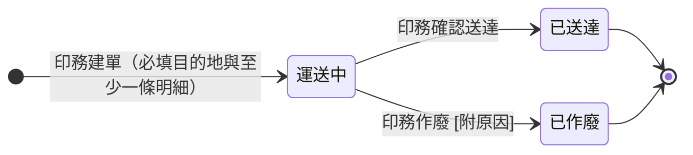

## 概述

轉交單（TransferTicketStatus）從建立到送達的進度狀態機，轉交單實體的欄位見 [[轉交單]]。狀態極簡——印件在站間移動只有三種處境：在路上、到了、這趟取消。建立即進入「運送中」（不設草稿，要送才建單）；送達與作廢都是終態、不可回退（要修正走作廢原單＋開新單）。物理搬運由[[廠務]]執行，狀態的推進由[[印務]]在系統操作。

哪些生產任務需要轉交、轉交作為下游派工前置的規則正本在 [[工序相依性規則]]，本卡只定義狀態與轉換、不複述規則。

## 狀態列舉（正本）

> 本段是轉交單狀態的唯一正本。狀態的新增與修改是商業決策，直接在此卡維護。

| 狀態 | 說明 | 對應營運需求 |
|------|------|------------|
| 運送中 | 初始；轉交單建立即進入此態，貨在站間移動 | 要送才建單，不留草稿；「貨在路上」明確標出 |
| 已送達 | 終態；印務確認送達，系統寫入實際轉交日與確認人 | 作為下游「需轉交才可製作」的前置放行依據 |
| 已作廢 | 終態；這趟轉交取消（附原因），明細數量不佔可申請上限、紀錄留稽核 | 建錯或不送了乾淨收掉，額度回補 |

## 狀態機圖（UML）

依 UML 狀態機圖記法繪製：實心圓為初始點、雙圈為終止點、轉換標籤採「觸發事件 [守衛條件]」格式。建立即運送中，兩個終態不可回退。

## 轉換條件與觸發事件

| 轉換 | 觸發事件 | 條件 |
|------|---------|------|
| （建立）→ 運送中 | 印務建立轉交單 | 目的地必填（內部產線或外部廠商）、至少一條明細；印件下至少一個生產任務已有報工量；每條明細數量不超過可申請上限 |
| 運送中 → 已送達 | 印務確認送達 | 系統寫入實際轉交日＝當日、確認操作人＝當前印務；外廠配送回廠的件由[[廠務]]收件拍照、通知印務後確認 |
| 運送中 → 已作廢 | 印務作廢並填原因 | 系統寫入作廢時間／操作人／原因；該單明細不計入其他單的可申請上限佔用 |

## 關鍵轉換的營運動機

- 建立即運送中（無草稿）→ 動機：轉交單就是「要送了」才開，多一個草稿態只增操作無實務意義 → 例子：印刷在 A 廠完成，印務建轉交單指定送 B 廠裱貼，單一建立就是運送中。
- 已送達為下游前置 → 動機：跨站工序的下一道要等貨到才能開工，把「到了沒」做成可查的狀態，取代現場口頭確認；下游任務的前置設「本轉交單已送達」，貨到自動可派工（見 [[工序相依性規則]]）。
- 終態不回退、修正走作廢＋開新單 → 動機：送達與作廢都是已發生的事實，回退會讓稽核軌跡與下游放行判斷錯亂；要改就作廢原單、額度回補後另開新單，每筆都留痕。

## 與其他狀態機的關係

- 轉交單「已送達」是 [[生產任務狀態|下游生產任務]] 派工的前置之一（需轉交才可製作，見 [[工序相依性規則]]）。
- 一張 [[印件]] 可有多張轉交單（分批轉交），各自獨立推進與確認送達。
- 明細的可申請上限跟著 [[生產任務狀態|生產任務]] 的已報工量走（見 [[齊套邏輯]]）。

## 範圍外

- **可申請上限的計算**（已報工 − 已抽走、作廢回補）：系統會自動計算——本卡只承諾此行為，公式屬 [[齊套邏輯]]，實作時勿自行發明
- 轉交單的欄位與明細結構 → [[轉交單]]（實體正本）
- 哪些工序要設「需轉交」前置 → [[工序相依性規則]]（規則正本）
- 撤回機制（已送達 → 運送中）：主流程跑通後再評估，目前不設

## 相關卡

- 規則：[[工序相依性規則]]（轉交作為派工前置）、[[齊套邏輯]]（可申請上限）、[[印件生產流程]]
- 實體：[[轉交單]]（本狀態機依附的主實體）
- 狀態機：[[生產任務狀態]]（前置放行的對象）、[[印件狀態]]
- 角色：[[印務]]（建單、確認送達、作廢）、[[廠務]]（物理搬運、外廠收件拍照）
