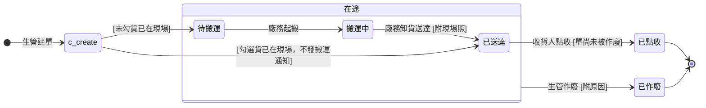

讀完這張卡，你會知道：

- 認識 [[轉交單]]（TransferTicketStatus）狀態機涵蓋的生命週期：從生管建單、廠務起搬與卸貨送達，到下游點收或這趟取消
- 看懂轉交單有哪幾種處境、每一格代表這批貨是還沒人去搬、在路上、卸在目的地，還是下游已經收下
- 掌握每個轉換由誰觸發、要滿足什麼條件才推得動（建單與作廢歸生管、搬運與送達歸廠務、點收歸目的地收貨人）
- 理解為什麼把「該送而還沒搬」獨立成一格、為什麼不設草稿態，以及兩個終態為什麼互斥
- 知道「已點收」為什麼是下游工序開工的到料放行依據，而不是「已送達」

## 狀態列舉（正本）

> 本段是轉交單狀態的唯一正本。狀態的新增與修改是商業決策，直接在此卡維護。

| 狀態 | 說明 | 對應營運需求 |
|------|------|------------|
| 待搬運 | 初始；生管建單完成、系統已通知廠務，貨還沒有人去搬 | 讓「該送而還沒動」在系統裡看得見，卡在廠務那一段查得出來；這一格的單還只是計畫，明細與數量可改 |
| 搬運中 | 廠務已起搬，貨在站間移動 | 貨在路上這件事明確標出，起搬之後單上的數字對應一趟真實發生過的搬運，不再可改 |
| 已送達 | 廠務卸貨並附現場照，貨已放在目的地但下游還沒確認收下 | 送達是搬運方的單方宣稱，把它與收方確認分開，貨到底在不在下游手上不會含糊 |
| 已點收 | 終態；目的地收貨人確認收到 | 作為下游「需轉交才可製作」的前置放行依據；由要動手做的人說了算 |
| 已作廢 | 終態；這趟轉交取消（附原因），明細數量退出可申請上限的佔用、紀錄留稽核 | 建錯或不送了乾淨收掉，額度當下回到來源任務 |

## 狀態機圖（UML）

依 UML 狀態機圖記法繪製：實心圓為初始點、雙圈為終止點、轉換標籤採「觸發事件 [轉換條件]」格式。建單即待搬運；作廢是群組型轉換，待搬運、搬運中、已送達三個非終態都走得到，因此自複合狀態邊界出發（依 UML 語意，自複合狀態邊界出發的轉換適用其內全部子狀態）；已點收與已作廢兩個終態互斥、皆不可回退。

```mermaid
stateDiagram-v2
    direction LR

    [*] --> c_create : 生管建單
    state c_create <<choice>>

    state "在途" as g_active {
        state "待搬運" as s_pending
        state "搬運中" as s_moving
        state "已送達" as s_arrived

        s_pending --> s_moving : 廠務起搬
        s_moving --> s_arrived : 廠務卸貨送達 [附現場照]
    }

    state "已點收" as s_received
    state "已作廢" as s_void

    c_create --> s_pending : [未勾貨已在現場]
    c_create --> s_arrived : [勾選貨已在現場，不發搬運通知]

    s_arrived --> s_received : 收貨人點收 [單尚未被作廢]
    g_active --> s_void : 生管作廢 [附原因]

    s_received --> [*]
    s_void --> [*]
```

## 轉換條件與觸發事件

| 轉換 | 觸發事件 | 條件 |
|------|---------|------|
| （建立）→ 待搬運 | [[生管]] 在待搬視圖勾選要送的量與目的地建單 | 至少一條明細（生產任務 × 數量）；一張單只能有一個目的地；每條明細不超過該來源任務的轉交可申請上限，檢核以按下建立那一刻的最新額度計，任一條超額則整張單擋下、不做部分成立；系統寫入建單人與建單時間，並通知 [[廠務]] |
| （建立）→ 已送達 | [[生管]] 建單時勾選「貨已在現場」 | 用於作廢重開而貨已經在目的地的處境；該單不發搬運通知、無起搬紀錄，勾選這件事記入歷程 |
| 待搬運 → 搬運中 | [[廠務]] 回報起搬 | 系統寫入廠內執行者；此後明細與數量鎖定，要更正只能作廢重開 |
| 搬運中 → 已送達 | [[廠務]] 回報卸貨送達並附現場照 | 系統寫入實際轉交日＝當日、確認操作人＝當前廠務 |
| 已送達 → 已點收 | 目的地收貨人按下點收（目的地＝產線由該產線的 [[師傅]]、目的地＝品檢站由 [[品檢人員]]；站上無人時 [[生管]] 代點收並留標記） | 該單尚未被作廢；點收為純確認、不可改量；系統寫入實際操作人與點收時間（動作即認領）。來源生產任務已轉報廢或已作廢時，點收被擋下、由生管處置 |
| 待搬運／搬運中／已送達 → 已作廢 | [[生管]] 作廢並填原因 | 該單尚未被點收；系統寫入作廢時間、作廢人與原因；該單明細即退出來源任務的可申請上限佔用 |

## 關鍵轉換的營運動機

- 生管建單、建單即待搬運（無草稿）→ 動機：建單就是決定「這一趟送哪幾筆、各送多少」，那是內容決策，而 [[廠務]] 的職責邊界是只管流動、不管內容；把成單時點放在搬運之前，「該送而還沒有人去搬」才在系統裡存在、才查得出哪一批卡在廠務手上。不設草稿態的理由不變——轉交是常態且滾動，多一個草稿態只增操作 → 例子：印刷今天報工良品 200，生管在待搬視圖看到裁切站可送 200，勾選建單，系統通知廠務，單即待搬運。
- 起搬之後不可改、只能作廢重開 → 動機：待搬運的單是一張還沒兌現的指示，改它不會讓任何人白跑一趟；起搬之後單上的數字對應一趟真實發生過的搬運，改數字等於改寫已發生的事 → 例子：生管發現裁切站那張單少填 50，若還在待搬運就直接改明細，若廠務已起搬就作廢重開，重開時貨已在現場者勾選該標記、新單直接以已送達生成。
- 已點收才是下游到料依據 → 動機：送達是搬運方單方面的宣稱，點收是接手方的確認，放行的意思是「下游可以開始做這批」，該由要動手做的人說了算；中間差的那一段（已送達未點收）在系統裡看得見 → 例子：裁切站師傅在行動版點收 200，下游到料量才加 200、可以開工。
- 兩個終態互斥、先到先贏 → 動機：生管在桌機按作廢的同時師傅可能正在現場按點收，先寫入的那個成立、後到的被拒絕並提示重新整理；終態一旦成立就是事實，額度與到料量都已依它結算，讓第二個終態也成立會讓同一批量同時被回補又被放行 → 例子：已作廢的單掃不進點收畫面，已點收的單按作廢會被擋下。

## 與其他狀態機的關係

- 轉交單「已點收」的數量是 [[生產任務狀態]] 的到料量來源（需轉交才可製作、數量級滾動放行，見 [[工序相依性規則]]）。
- 一張 [[印件]] 可有多張轉交單（分批轉交），各自獨立推進；同一目的地的一張單也可含多張印件的貨。
- 來源生產任務轉報廢或已作廢時，其尚未進終態的轉交單會被標示警示且點收被擋下，處置由生管決定（見 [[生產任務狀態]]）。
- 明細的可申請上限跟著已報工良品走（算式見 [[生產任務]] 轉交可申請上限欄）。
- 回運單與一般轉交單走同一套狀態，被點收時對誤收站的到料量減記、並解除原誤送明細的佔用（單別與原轉交單連結兩欄見 [[轉交單]]）。

## 範圍外

- **可申請上限的計算**：系統會自動計算——本卡只承諾此行為，算式正本在 [[生產任務]] 轉交可申請上限欄，實作時勿自行發明
- 轉交單的欄位與明細結構 → [[轉交單]]（實體正本）
- 哪些工序要設「需轉交」前置 → [[工序相依性規則]]（規則正本）
- 點收佇列怎麼過濾到人、清單怎麼排序 → 屬實作規格；判定依據的資料欄位（人員的所屬產線）見 [[人員]]
- 撤回機制（已點收 → 已送達）：不設。貨送錯站的更正走回運單，把貨真的搬回來，不回捲狀態（見 [[轉交單]]）
- 涉及暫存區的三類搬運路徑（產線 → 暫存區、品檢站 → 暫存區、暫存區 → 產線）：不擴充、不走本狀態機——貨進了暫存區之後掛不回單一生產任務。此排除**不涵蓋**「以回台點收後的外發生產任務為來源、目的地品檢站」那條路徑（該路徑照走本狀態機，來源定義見 [[轉交單]]）；品檢完成品的例外移置由 [[廠務]] 以現場方式留痕、不成單

## 相關卡

- 規則：[[工序相依性規則]]（轉交作為到料放行依據）、[[齊套邏輯]]（數量守恆底線）、[[印件生產流程]]
- 情境：[[場內轉交與更正]]（本狀態機各節點的完成過程與更正路徑）
- 實體：[[轉交單]]（本狀態機依附的主實體）
- 狀態機：[[生產任務狀態]]（前置放行的對象）、[[印件狀態]]
- 角色：[[生管]]（建單、修改、作廢、代點收）、[[廠務]]（起搬、卸貨送達＋現場照）、[[師傅]]／[[品檢人員]]（點收）
