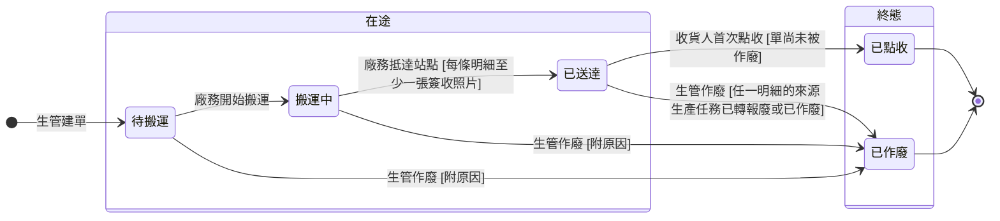

讀完這張卡，你會知道：

- 認識 [[轉交單]]（TransferTicketStatus）狀態機涵蓋的生命週期：從生管建單、廠務開始搬運與抵達站點，到下游點收或這趟取消
- 看懂轉交單有哪幾種處境、每一格代表這批貨是還沒人去搬、在路上、卸在目的地，還是下游已經收下
- 掌握每個轉換由誰觸發、要滿足什麼條件才推得動（建單與作廢歸生管、搬運與送達歸廠務、點收歸目的產線的人員）
- 理解為什麼把「該送而還沒搬」獨立成一格、為什麼不設草稿態，以及兩個終態為什麼互斥
- 知道點收量為什麼是下游工序開工的到料放行依據，以及單頭已點收之後同一條明細還能再點收與修改點收量

## 狀態列舉（正本）

> 本段是轉交單狀態的唯一正本。狀態的新增與修改是商業決策，直接在此卡維護。

| 狀態  | 說明                                                    | 對應營運需求                                          |
| --- | ----------------------------------------------------- | ----------------------------------------------- |
| 待搬運 | 初始；生管建單完成、系統已通知廠務，貨還沒有人去搬                             | 讓「該送而還沒動」在系統裡看得見，卡在廠務那一段查得出來；這一格的單還只是計畫，明細與數量可改 |
| 搬運中 | 廠務已開始搬運，貨在站間移動                                        | 貨在路上這件事明確標出，開始搬運之後單上的數字對應一趟真實發生過的搬運，不再可改        |
| 已送達 | 廠務回報抵達站點並逐條明細附簽收照片，貨已放在目的地但下游還沒確認收下                   | 送達是搬運方的單方宣稱，把它與收方確認分開，貨到底在不在下游手上不會含糊            |
| 已點收 | 終態；目的地收貨人首次點收，逐條明細填實際收到的量。之後同一條明細可再點收追加、點收量可修改，單頭維持本態 | 點收量是下游「需轉交才可製作」的到料放行依據；收到多少由要動手做的人說了算           |
| 已作廢 | 終態；這趟轉交取消並附原因，可作廢的處境、額度回補與留痕見轉換表「→ 已作廢」列              | 建錯或不送了乾淨收掉，額度當下回到來源任務                           |

## 狀態機圖（UML）

- 記法：實心圓為初始點、雙圈為終止點、轉換標籤採「觸發事件 [轉換條件]」格式；已點收之後的再次點收與點收修改不改單頭狀態，圖上不畫。
- 複合狀態＝可被引用的集合詞（成員以本圖為正本，不另立成員表）：「在途」＝這趟轉交已成單、貨還沒被下游收下的處境；「終態」＝這趟轉交已收束的處境，兩個終態互斥且不可回退。
- 作廢分兩類：待搬運、搬運中由生管附原因直接作廢；已送達只在來源生產任務已轉報廢或已作廢時可作廢，各畫一條弧。

```mermaid
stateDiagram-v2
    direction LR

    [*] --> s_pending : 生管建單

    state "在途" as g_active {
        state "待搬運" as s_pending
        state "搬運中" as s_moving
        state "已送達" as s_arrived

        s_pending --> s_moving : 廠務開始搬運
        s_moving --> s_arrived : 廠務抵達站點 [每條明細至少一張簽收照片]
    }

    state "終態" as Final {
        state "已點收" as s_received
        state "已作廢" as s_void
    }

    s_arrived --> s_received : 收貨人首次點收 [單尚未被作廢]
    s_pending --> s_void : 生管作廢 [附原因]
    s_moving --> s_void : 生管作廢 [附原因]
    s_arrived --> s_void : 生管作廢 [任一明細的來源生產任務已轉報廢或已作廢]

    s_received --> [*]
    s_void --> [*]
```

## 轉換條件與觸發事件

| 轉換 | 觸發事件 | 條件 |
|------|---------|------|
| （建立）→ 待搬運 | [[生管]] 在待搬視圖勾選要送的量建單，或作廢後重開（目的地的取數見 [[轉交單]] 目的產線欄） | 逐項見下方「建單檢核」子表；建單一律進本態，作廢重開的新單同樣重走開始搬運與抵達站點 |
| 待搬運 → 搬運中 | [[廠務]] 回報開始搬運 | 系統寫入廠內執行者；此後明細與設定量鎖定。搬運中要更正只能作廢重開，送達後數量不對由收貨人照實點收 |
| 搬運中 → 已送達 | [[廠務]] 回報抵達站點並逐條明細上傳簽收照片 | 每條明細至少一張，任一條不足即擋下這次回報；廠務不填量；系統寫入實際轉交日＝當日、確認操作人＝當前廠務 |
| 已送達 → 已點收 | 所屬產線含本單目的產線的人員首次點收（所屬產線欄見 [[人員]]；目的產線為品檢站時適用同一條規則，不看角色）；站上無人時由 [[生管]] 代點收並留標記，[[印務]] 與 [[印務主管]] 可代行（見 [[生管]]） | 該單尚未被作廢（兩個終態先寫入的那個成立，後到的被拒絕並提示重新整理）；收貨人逐條明細填實際量，預設帶設定量，每條明細的點收量不得超過設定量，超過即擋下；每條明細各留一筆點收紀錄，記點收量、按下的人、時間與代點收標記（欄位見 [[轉交單]]）。來源生產任務已轉報廢或已作廢時，點收被擋下、由生管處置 |
| 待搬運／搬運中 → 已作廢 | [[生管]] 作廢並填原因 | 系統寫入作廢時間、作廢人與原因；該單明細即退出來源任務的可申請上限佔用 |
| 已送達 → 已作廢 | [[生管]] 作廢並填原因 | 限任一明細的來源生產任務已轉報廢或已作廢；其他情形的已送達單不可作廢，數量不對由收貨人照實點收。寫入與佔用退出同上一列 |

**建單檢核**

| 面向 | 規則 |
|------|------|
| 明細 | 至少一條明細（生產任務 × 設定量）|
| 目的地 | 一張單只能有一個目的地 |
| 額度上限 | 每條明細不超過該來源任務的轉交可申請上限 |
| 檢核時點 | 以按下建立那一刻的最新額度計 |
| 超額處置 | 任一條超額則整張單擋下，不做部分成立 |
| 留痕與通知 | 系統寫入建單人與建單時間，並只通知生管指派的那位 [[廠務]]（指派廠務欄見 [[轉交單]]） |

**已點收之後的再次點收與點收修改**（單頭維持已點收）

| 面向 | 規則 |
|------|------|
| 再次點收 | 同一條明細可再點收追加，預設帶尚未點收的量；每次各留一筆點收紀錄；明細的點收累計同樣不得超過設定量 |
| 點收修改 | 可改任一筆點收紀錄的點收量；修改前後值、修改人、時間與原因記入歷程紀錄（欄位見 [[轉交單]]） |
| 誰能做 | 與點收同一群人 |
| 擋下條件與檢核時點 | 正本見 [[場內轉交與更正]] |
| 來源生產任務已轉報廢或已作廢 | 再次點收與點收修改一併擋下，由生管處置 |

## 關鍵轉換的營運動機

- 生管建單、建單即待搬運（無草稿）→ 動機：建單就是決定「這一趟送哪幾筆、各送多少」，那是內容決策，而 [[廠務]] 的職責邊界是只管流動、不管內容；把成單時點放在搬運之前，「該送而還沒有人去搬」才在系統裡存在、才查得出哪一批卡在廠務手上。不設草稿態的理由不變——轉交是常態且滾動，多一個草稿態只增操作 → 例子：印刷今天報工良品 200，生管在待搬視圖看到裁切站可送 200，勾選建單，系統通知廠務，單即待搬運。
- 開始搬運之後不可改、只能作廢重開 → 動機：待搬運的單是一張還沒兌現的指示，改它不會讓任何人白跑一趟；開始搬運之後單上的數字對應一趟真實發生過的搬運，改數字等於改寫已發生的事 → 例子：生管發現裁切站那張單少填 50，若還在待搬運就直接改明細；若廠務已開始搬運、單在搬運中，就作廢重開，新單重走開始搬運與抵達站點。
- 點收量才是下游到料依據 → 動機：送達是搬運方單方面的宣稱，點收是接手方清點後的事實，放行的意思是「下游可以開始做這批」，該由要動手做的人說了算；中間差的那一段（已送達未點收）在系統裡看得見 → 例子：單上設定 200，裁切站師傅清點只有 180、點收 180，下游到料量加 180、可以開工。
- 已送達不可作廢 → 動機：貨已經卸在目的地，作廢重開只會讓帳重來一遍、現場再走一次搬運與送達；照實點收讓差額留在原單上，設定量與點收累計的差一眼看得到，來源任務停在待點收（[[生產任務轉交狀態]]）。例外留給來源任務已被收掉的情形，那時這批貨已沒有任務可歸 → 例子：設定 200、點收 180，剩下 20 補到後收貨人對同一條明細再點收 20，點收累計回到 200。
- 點收可修改並留痕 → 動機：點錯數字的人能自己改正，不必繞回生管作廢重開；改了什麼、誰改、為什麼改都留在歷程，掩蓋短少的風險靠事後查紀錄承擔 → 例子：師傅把 180 誤點成 108，發現後改回 180，歷程記下修改前 108、修改後 180 與原因。
- 兩個終態互斥 → 動機：生管在桌機按作廢的同時，師傅可能正在現場按點收；終態一旦成立就是事實，額度與到料量都已依它結算，讓第二個終態也成立會讓同一批量同時被回補又被放行（先後怎麼判見轉換表）→ 例子：已作廢的單掃不進點收畫面，已點收的單按作廢會被擋下。

## 與其他狀態機的關係

- 已點收單明細的點收量合計（含再次點收、含修改後的值）是下游生產任務的到料量來源（需轉交才可製作、數量級滾動放行，見 [[工序相依性規則]]）。
- [[生產任務轉交狀態]] 由本卡推導：轉交量取未作廢單的明細設定量，轉交點收量取已點收單明細的點收紀錄。本卡不受它推動。
- 一張 [[印件]] 可有多張轉交單（分批轉交），各自獨立推進；同一目的地的一張單也可含多張印件的貨。
- 來源生產任務轉報廢或已作廢時，其尚未進終態的轉交單會被標示警示且點收被擋下，已點收單的再次點收與點收修改同樣擋下；處置由生管決定，已送達的單此時可由生管作廢（見 [[生產任務狀態]]）。
- 明細的可申請上限跟著已報工良品走（算式見 [[生產任務]] 轉交可申請上限欄）。

## 範圍外

- **可申請上限的計算**：系統會自動計算——本卡只承諾此行為，算式正本在 [[生產任務]] 轉交可申請上限欄，實作時勿自行發明
- 轉交單的欄位與明細結構 → [[轉交單]]（實體正本）
- 哪些工序要設「需轉交」前置 → [[工序相依性規則]]（規則正本）
- 點收佇列怎麼過濾到人、清單怎麼排序 → 屬實作規格；判定依據的資料欄位（人員的所屬產線）見 [[人員]]
- 單條明細作廢：不設，作廢一律以整張單為單位
- 點收短少的後續處置（貨補到再點收、修改來源任務的報工）→ [[場內轉交與更正]]
- 撤回機制（已點收 → 已送達）：不設。貨送錯站時現場溝通後直接把貨搬到正確的站，系統不回捲狀態、也不另開單（處置見 [[場內轉交與更正]]）
- 涉及暫存區的三類搬運路徑（產線 → 暫存區、品檢站 → 暫存區、暫存區 → 產線）：不擴充、不走本狀態機——貨進了暫存區之後掛不回單一生產任務。此排除**不涵蓋**「以回台點收後的外發生產任務為來源、目的地品檢站」那條路徑（該路徑照走本狀態機，來源定義見 [[轉交單]]）；品檢完成品的例外移置由 [[廠務]] 以現場方式留痕、不成單

## 相關卡

- 規則：[[工序相依性規則]]（轉交作為到料放行依據）、[[齊套邏輯]]（數量守恆底線）、[[印件生產流程]]
- 情境：[[場內轉交與更正]]（本狀態機各節點的完成過程與更正路徑）
- 實體：[[轉交單]]（本狀態機依附的主實體）
- 狀態機：[[生產任務狀態]]（前置放行的對象）、[[生產任務轉交狀態]]（由本卡推導的任務層轉交進度）、[[印件印製狀態]]
- 角色：[[生管]]（建單、修改、作廢、代點收；代行範圍的正本）、[[印務]]／[[印務主管]]（代行上述生管操作）、[[廠務]]（開始搬運、抵達站點＋逐條明細簽收照）、[[師傅]]／[[品檢人員]]（點收、再次點收、點收修改）
