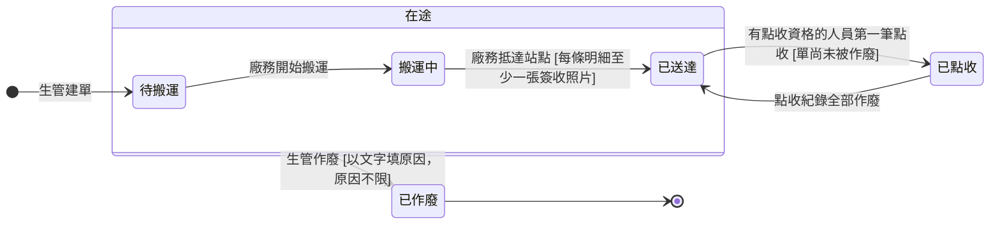

讀完這張卡，你會知道：

- 認識 [[轉交單]]（TransferTicketStatus）狀態機涵蓋的生命週期：從生管建單、廠務開始搬運與抵達站點，到下游點收或這趟取消
- 看懂轉交單有哪幾種處境、每一格代表這批貨是還沒人去搬、在路上、卸在目的地，還是下游已經收下
- 掌握每個轉換由誰觸發、要滿足什麼條件才推得動（建單與作廢歸生管、搬運與送達歸負責廠務、點收歸有點收資格的人員）
- 理解為什麼把「該送而還沒搬」獨立成一格、為什麼不設草稿態，以及為什麼點收前能作廢、點收後不能
- 知道點收量為什麼是下游工序開工的到料放行依據，以及開始搬運之後還能怎麼修改搬運數量、點收、修改與作廢點收紀錄

## 狀態列舉（正本）

> 本段是轉交單狀態的唯一正本。狀態的新增與修改是商業決策，直接在此卡維護。

| 狀態  | 說明                                                    | 對應營運需求                                          |
| --- | ----------------------------------------------------- | ----------------------------------------------- |
| 待搬運 | 初始；生管建單完成、系統已通知廠務，貨還沒有人去搬                             | 讓「該送而還沒動」在系統裡看得見，卡在廠務那一段查得出來；這一格的單還只是計畫，明細與數量可改 |
| 搬運中 | 廠務已開始搬運，貨在站間移動                                        | 貨在路上這件事明確標出，開始搬運之後單上的明細對應一趟真實發生過的搬運，不再直接改；搬運數量只能經修改留痕更正        |
| 已送達 | 廠務回報抵達站點並逐條明細附簽收照片，貨已放在目的地但下游還沒確認收下                   | 送達是搬運方的單方宣稱，把它與收方確認分開，貨到底在不在下游手上不會含糊            |
| 已點收 | 本單有未作廢的點收紀錄，逐條明細填了實際收到的量。之後每次點收只新增點收紀錄、點收紀錄可修改或作廢，單頭維持本態；點收紀錄全部作廢時退回已送達 | 點收量是下游「需轉交才可製作」的到料放行依據；收到多少由要動手做的人說了算           |
| 已作廢 | 終態；這趟轉交在點收前取消並附原因，可作廢的處境、額度回補與留痕見轉換表「→ 已作廢」列              | 點收前發現不該這樣送就乾淨收掉，搬運數量當下退回來源任務；已點收的單不作廢，下游已在做的任務不受影響 |

## 狀態機圖（UML）

- 記法：實心圓為初始點、雙圈為終止點、轉換標籤採「觸發事件 [轉換條件]」格式；已點收之後的再點收、點收修改與部分點收紀錄作廢不改單頭狀態，圖上不畫。
- 複合狀態＝可被引用的集合詞（成員以本圖為正本，不另立成員表）：「在途」＝這趟轉交已成單、貨還沒被下游收下的處境。已作廢是唯一終態；已點收不是終態，點收紀錄全部作廢時退回已送達。
- 作廢自「在途」的邊界出發畫一條弧：依 UML 語意，在途內的每一格都可作廢；已點收不在在途內，沒有作廢弧。

```mermaid
stateDiagram-v2
    direction LR

    [*] --> s_pending : 生管建單

    state "在途" as g_active {
        state "待搬運" as s_pending
        state "搬運中" as s_moving
        state "已送達" as s_arrived

        s_pending --> s_moving : 廠務開始搬運
        s_moving --> s_arrived : 廠務抵達站點 [每條明細至少一張簽收照片]
    }

    state "已點收" as s_received
    state "已作廢" as s_void

    s_arrived --> s_received : 有點收資格的人員第一筆點收 [單尚未被作廢]
    s_received --> s_arrived : 點收紀錄全部作廢
    g_active --> s_void : 生管作廢 [以文字填原因，原因不限]

    s_void --> [*]
```

## 轉換條件與觸發事件

| 轉換 | 觸發事件 | 條件 |
|------|---------|------|
| （建立）→ 待搬運 | [[生管]] 在待轉交任務勾選要送的量建單，或作廢後重開（目的地的取數見 [[轉交單]] 目的產線欄） | 逐項見下方「建單與改單檢核」子表；建單一律進本態，作廢重開的新單同樣重走開始搬運與抵達站點 |
| 待搬運 → 搬運中 | 負責廠務（[[廠務]]）回報開始搬運 | 回報者為本單的負責廠務（欄位見 [[轉交單]]）；此後明細的生產任務鎖定，搬運數量只能經修改更正（見下方「搬運數量修改」子表）。明細的生產任務建錯時，點收前作廢重開 |
| 搬運中 → 已送達 | 負責廠務（[[廠務]]）回報抵達站點並逐條明細上傳簽收照片 | 每條明細至少一張，任一條不足即擋下這次回報；廠務不填量；系統寫入實際轉交日＝當日 |
| 已送達 → 已點收 | 有點收資格的人員（資格見下方「點收資格」子表）點收，寫入本單第一筆未作廢的點收紀錄 | 該單尚未被作廢（作廢與點收同時發生時，先寫入的那個成立，後到的被拒絕）；收貨人逐條明細填實際量；點收量多於搬運數量時不擋（處置見 [[場內轉交與更正]]）；每條明細各新增一筆點收紀錄（欄位見 [[轉交單]]）。來源生產任務已轉報廢或已作廢時，點收被擋下、由生管處置 |
| 待搬運／搬運中／已送達 → 已作廢 | [[生管]] 作廢並以文字填寫原因 | 原因不限，點收前都可作廢；已點收的單不可作廢。系統寫入作廢時間、作廢人與原因；該單明細的搬運數量即退出來源任務的轉交量，額度當下回到來源任務 |
| 已點收 → 已送達 | 有點收資格的人員作廢本單最後一筆未作廢的點收紀錄，使本單點收紀錄全部作廢 | 點收紀錄作廢的擋下條件見 [[工序相依性規則]]；退回後可重新點收，或由 [[生管]] 作廢本單 |

**點收資格**（點收、點收修改與點收紀錄作廢適用同一條資格）

| 持有的權限 | 單據要在什麼範圍內 |
|-----------|------------------|
| 管理點收佇列（產線） | 本單在點收佇列的產線範圍內 |
| 管理轉交單（產線） | 本單在轉交單的產線範圍內 |

- 任一列成立即可點收、修改與作廢點收紀錄；兩個單元的點收功能相同，只差可視範圍（各單元的產線範圍怎麼判定，正本見 [[印件生產流程]] § 生產管理單元的權限範圍；所屬產線欄見 [[人員]]）。
- 不看角色：誰按下誰就是點收人，不另區分由誰代為點收，操作人記在點收紀錄與歷程紀錄（欄位見 [[轉交單]]）。
- 目的產線為品檢線時適用同一條資格。

**建單與改單檢核**

| 面向 | 規則 |
|------|------|
| 明細 | 至少一條明細（生產任務 × 搬運數量）|
| 目的地 | 明細限同一條目的產線（資料約束正本見 [[轉交單]]） |
| 額度上限 | 每條明細不超過該來源任務的轉交可申請上限 |
| 檢核時點 | 以按下建立或儲存那一刻的最新額度計 |
| 超額處置 | 任一條超額則整張單擋下，不做部分成立；一次勾多筆建多張單時，任一張超額即全部擋下，生管重新勾選後再送出 |
| 待搬運改單 | 適用同一道額度上限；改單時本單原佔用怎麼計，見 [[生產任務]] 轉交可申請上限欄 |
| 留痕與通知 | 系統寫入建單人與建單時間，並只通知本單的負責廠務（欄位見 [[轉交單]]）；待搬運時改了負責廠務，通知新的負責廠務 |

**搬運數量修改**（開始搬運之後；不改變單頭狀態）

| 面向 | 規則 |
|------|------|
| 適用處境 | 搬運中、已送達、已點收；待搬運的單直接改單，適用上方「建單與改單檢核」 |
| 調降 | 不受額度上限管制，只受下方「下限」限制 |
| 調升 | 受來源任務的轉交可申請上限管制；本單這條明細原本的搬運數量怎麼計，見 [[生產任務]] 轉交可申請上限欄 |
| 下限 | 大於 0（欄位見 [[轉交單]]），且不得低於該明細的點收數量；要改得比點收數量低，先修改或作廢點收紀錄 |
| 留痕 | 修改原因必填；每次修改記一筆搬運數量修改紀錄並記入歷程紀錄（欄位見 [[轉交單]]） |
| 誰能做 | 同建單與作廢：[[生管]]，[[印務]] 與 [[印務主管]] 可代行（代行範圍見 [[生管]]） |
| 來源生產任務已轉報廢或已作廢 | 擋下，比照點收修改；由生管處置 |

**已點收之後的點收、點收修改與點收紀錄作廢**（單頭維持已點收，點收紀錄全部作廢時除外）

| 面向 | 規則 |
|------|------|
| 點收 | 每次點收都對各條明細新增一筆點收紀錄，不分首次或再次 |
| 點收修改 | 數字錯時用：可改任一筆點收紀錄的點收量與備註；修改原因必填，每次修改記一筆點收修改紀錄並記入歷程紀錄（欄位見 [[轉交單]]） |
| 點收紀錄作廢 | 整筆不該存在時用（如點到別張單）：作廢原因必填，作廢後該筆不計入點收數量（欄位見 [[轉交單]]）；本單點收紀錄全部作廢時退回已送達（見轉換表） |
| 誰能做 | 適用上方「點收資格」 |
| 點收量下限與檢核時點 | 點收修改與點收紀錄作廢共用，正本見 [[工序相依性規則]] |
| 來源生產任務已轉報廢或已作廢 | 點收、點收修改與點收紀錄作廢一併擋下，由生管處置 |

## 關鍵轉換的營運動機

- 生管建單、建單即待搬運（無草稿）→ 動機：建單就是決定「這一趟送哪幾筆、各送多少」，那是內容決策，而 [[廠務]] 的職責邊界是只管流動、不管內容；把成單時點放在搬運之前，「該送而還沒有人去搬」才在系統裡存在、才查得出哪一批卡在廠務手上。不設草稿態的理由不變——轉交是常態且滾動，多一個草稿態只增操作 → 例子：印刷今天報工良品 200，生管在待轉交任務看到裁切站可送 200，勾選建單，系統通知廠務，單即待搬運。
- 開始搬運之後明細不可直接改、搬運數量只能經修改留痕更正 → 動機：待搬運的單是一張還沒兌現的指示，改它不會讓任何人白跑一趟；開始搬運之後單上的明細對應一趟真實發生過的搬運，直接改等於改寫已發生的事。搬運數量若完全不能改，報錯的數量只能改報工與點收，上游任務還在做時會永遠停在待點收；所以開放修改，但每次留下前後值與原因 → 例子：生管發現裁切站那張單少填 50，若還在待搬運就直接改明細；若單已在搬運中，改搬運數量並填修改原因，修改紀錄留下 200 改 250 這一筆；若是明細的生產任務選錯，點收前作廢重開，新單重走開始搬運與抵達站點。
- 點收量才是下游到料依據 → 動機：送達是搬運方單方面的宣稱，點收是接手方清點後的事實，放行的意思是「下游可以開始做這批」，該由要動手做的人說了算；中間差的那一段（已送達未點收）在系統裡看得見 → 例子：單上搬運數量 200，裁切站師傅清點只有 180、點收 180，下游到料量加 180、可以開工。
- 點收前可作廢、點收後不可作廢 → 動機：點收前貨還沒被下游收下，作廢這張單不會動到下游已在做的任務；點收之後點收量已計入下游的到料量，下游可能已經開工，整張單作廢會讓下游已做的量失去料源。已送達而數量不對時，可作廢重建，也可照實點收後逐層更正 → 例子：搬運數量 200 的單已送達，現場清點只有 180：生管可作廢原單、重建一張 180 的單；或收貨人照實點收 180，剩下 20 補到後對同一條明細再點收一筆 20。
- 點收可修改或作廢並留痕 → 動機：點錯數字的人能自己改正，不必繞回生管作廢重開；整筆點錯單時作廢那一筆，不必把數字改成沒意義的值。改了什麼、作廢了什麼、誰做、為什麼都留在歷程，掩蓋短少的風險靠事後查紀錄承擔 → 例子：師傅把 180 誤點成 108，發現後改回 180，歷程記下修改前 108、修改後 180 與原因。
- 點收紀錄全部作廢時退回已送達 → 動機：點錯單的貨要能收到正確的單上；全部點收紀錄作廢後，這張單回到「貨已卸下、還沒人收」的事實處境，才能重新點收或作廢；要作廢已點收的單，得先經點收紀錄作廢那一道擋下檢查，下游已在做的量受到保護 → 例子：師傅把 TT-002 的貨誤點收到 TT-003，作廢 TT-003 那筆點收紀錄後，TT-003 退回已送達，師傅再到 TT-002 點收。
- 作廢與點收同時發生時先寫入者成立 → 動機：生管在桌機按作廢的同時，師傅可能正在現場按點收；兩者都成立會讓同一批量同時被退回額度又被放行 → 例子：已作廢的單再點收會被擋下；已點收的單再作廢也會被擋下。

## 與其他狀態機的關係

- 明細未作廢點收紀錄的點收量合計（含同一明細的多筆點收紀錄、含修改後的值）是下游生產任務的到料量來源（需轉交才可製作、數量級滾動放行，見 [[工序相依性規則]]）。
- [[生產任務轉交狀態]] 由本卡推導：轉交量取未作廢單的明細搬運數量，轉交點收量取各明細未作廢的點收紀錄。本卡不受它推動。
- 一張 [[印件]] 可有多張轉交單（分批轉交），各自獨立推進；同一條目的產線的一張單也可含多張印件的貨。
- 來源生產任務轉報廢或已作廢時，其在途的轉交單會被標示警示且點收被擋下，已點收單的點收、點收修改、點收紀錄作廢與搬運數量修改同樣擋下；處置由生管決定，在途的單可作廢（見 [[生產任務狀態]]）。
- 明細的可申請上限跟著已報工良品走（算式見 [[生產任務]] 轉交可申請上限欄）。

## 範圍外

- **可申請上限的計算**：系統會自動計算——本卡只承諾此行為，算式正本在 [[生產任務]] 轉交可申請上限欄，實作時勿自行發明
- 轉交單的欄位與明細結構 → [[轉交單]]（實體正本）
- 哪些工序要設「需轉交」前置 → [[工序相依性規則]]（規則正本）
- 點收佇列與轉交單清單的呈現與排序 → 屬介面設計，不在本知識庫；可視範圍的判定見 [[印件生產流程]] § 生產管理單元的權限範圍
- 單條明細作廢：不設，作廢一律以整張單為單位
- 點收短少的後續處置（貨補到再點收、修改搬運數量與來源任務的報工）→ [[場內轉交與更正]]；點收之後才發現數量報錯的逐層更正 → [[生產數量錯誤的逐層更正]]
- 貨送錯站：已點收的單不因此退回或作廢；現場溝通後直接把貨搬到正確的站，系統不另開單（處置見 [[場內轉交與更正]]）。已點收退回已送達只在點收紀錄全部作廢時發生（見轉換表）
- 涉及暫存區的三類搬運路徑（產線 → 暫存區、品檢站 → 暫存區、暫存區 → 產線）：不擴充、不走本狀態機——貨進了暫存區之後掛不回單一生產任務。此排除**不涵蓋**「以回台點收後的外發生產任務為來源、目的站點為品檢站」那條路徑（該路徑照走本狀態機，來源定義見 [[轉交單]]）；品檢完成品的例外移置由 [[廠務]] 以現場方式留痕、不成單

## 相關卡

- 規則：[[工序相依性規則]]（轉交作為到料放行依據、點收修改的擋下條件）、[[齊套邏輯]]（數量守恆底線）、[[印件生產流程]]
- 情境：[[場內轉交與更正]]（本狀態機各節點的完成過程與更正路徑）、[[生產數量錯誤的逐層更正]]（點收與搬運數量逐層修改的過程）
- 實體：[[轉交單]]（本狀態機依附的主實體）
- 狀態機：[[生產任務狀態]]（前置放行的對象）、[[生產任務轉交狀態]]（由本卡推導的任務層轉交進度）、[[印件印製狀態]]
- 角色：[[生管]]（建單、修改、作廢、修改搬運數量；代行範圍的正本）、[[印務]]／[[印務主管]]（代行上述生管操作）、[[廠務]]（開始搬運、抵達站點＋逐條明細簽收照）、[[師傅]]／[[品檢人員]]（點收、點收修改、點收紀錄作廢）；點收不看角色，看「點收資格」
