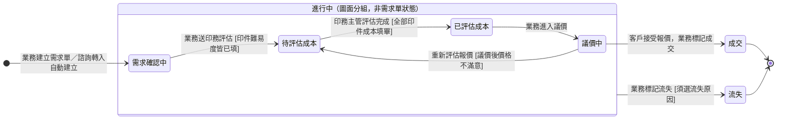

## 概述

[[需求單]]（QuoteStatus）從蒐集客戶需求、送印務主管評估成本、報價議價到成交或流失的進度狀態機。這整段刻意讓業務獨立跑、不設業務主管簽核關卡——報價議價是業務的本職，每動一步都要主管核會拖垮回應客戶的速度；真正需要把關的是錢與承諾落定的訂單階段，所以主管審核放在訂單、不放這裡。

狀態之所以分這幾格，是因為這段有一次跨角色的交接：業務蒐集完需求要交給印務主管評估成本，主管評完業務才拿得到成本去報價。把交接前後切成兩格，雙方才看得出球在誰手上、不會互等。報價怎麼算的規則正本在 [[報價邏輯]]，本卡只定義狀態與轉換、不複述規則。

## 狀態列舉（正本）

> 本段是需求單狀態的唯一正本。狀態的新增與修改是商業決策，直接在此卡維護。

| 狀態 | 說明 | 對應營運需求 |
|------|------|------------|
| 需求確認中 | 初始；業務蒐集客戶需求、填印件規格與難易度 | 給業務一個與客戶來回確認需求的編輯空間 |
| 待評估成本 | 業務送出後等指定印務主管評估製程成本 | 標示球在印務主管手上，主管從待辦清單接手，業務不空等 |
| 已評估成本 | 印務主管評估完成，業務拿到成本可報價；成本數字要修正由主管直接改，不退回狀態 | 標示球回到業務手上，可向客戶報價 |
| 議價中 | 業務對客戶報價、來回議價 | 記錄議價歷程，管理層看得到在途的議價單 |
| 成交 | 終態；客戶接受報價，業務一鍵轉建訂單 | 把承諾落定的時點標出來，後續主管把關與生產才有起點 |
| 流失 | 終態；客戶不成交（任一階段皆可標記，須選流失原因），標記後鎖定 | 沒談成的需求有歸屬與原因紀錄，供管理層分析流失趨勢 |

## 狀態機圖（UML）

依 UML 狀態機圖記法繪製：實心圓為初始點、雙圈為終止點、轉換標籤採「觸發事件 [守衛條件]」格式。「進行中」外框是圖面分組（表達「任一非終態皆可標記流失」的一條轉換），不是需求單的實際狀態。成交後由業務一鍵轉建一般訂單（從草稿開始，見 [[訂單狀態]]）；諮詢來源的流失會觸發系統建諮詢訂單收尾（見 [[諮詢單狀態]]）。

## 轉換條件與觸發事件

| 轉換 | 觸發事件 | 條件 |
|------|---------|------|
| （建立）→ 需求確認中 | 業務建立需求單；諮詢轉需求單時由系統自動建立（諮詢人員成為負責業務） | — |
| 需求確認中 → 待評估成本 | 業務指定評估印務主管後執行「送印務評估」（系統通知該主管） | 每筆印件的難易度必填，未填不可送出；送出後評估主管欄位鎖定 |
| 待評估成本 → 已評估成本 | 印務主管執行「評估完成」 | 所有印件項目成本填寫完畢才允許 |
| 已評估成本 → 議價中 | 業務點「進入議價」 | 無業務主管把關 |
| 議價中 → 成交 | 業務依議價結果標記「成交」 | — |
| 議價中 → 待評估成本 | 業務點「重新評估報價」 | 議價後價格不滿意才退回重評；歷史報價保留，重評後系統建新報價紀錄。已評估成本階段要修成本由主管直接改，不退回 |
| 任一非終態 → 流失 | 業務標記「流失」 | 須選流失原因；流失後需求單鎖定不可再變更 |

> 為什麼業務與印務主管這樣分工，見 [[報價邏輯]]。

## 關鍵轉換的營運動機

- 待評估成本 → 已評估成本（交接切兩格）→ 動機：業務不會算製程成本，要先把需求送印務主管評估、拿到成本才報得出價；切成「等評估／評估完」兩格，雙方看得出評估卡在誰那、避免業務空等或主管漏接 → 例子：業務送 1,000 本 A4 型錄的需求給印務主管估價，主管回成本 35,000 後單轉「已評估成本」，業務據此報價 50,000。
- 議價中 → 待評估成本（重新評估）→ 動機：議價後客戶對價格不滿意（嫌貴、要改規格壓成本）才退回重抓成本；還沒進議價、只是成本數字要修，由印務主管在「已評估成本」直接改，不必退回 → 例子：客戶嫌 50,000 太貴想換磅數較低的紙張，業務點「重新評估報價」退回重估，原報價紀錄保留可追溯。
- 議價中 → 成交 → 動機：客戶接受報價即標成交，把承諾落定的時點明確標出來；之後業務一鍵轉建訂單，系統自動帶入需求單資料建立訂單（從草稿開始），後續主管把關與生產才有起點 → 例子：45,000 成交後業務點「轉訂單」，系統帶入客戶、印件、交期建立草稿訂單。
- 任一非終態 → 流失 → 動機：客戶在任何階段都可能取消或消失，每一格都要有收尾出口，否則沒談成的單會永遠掛在在途清單、污染統計 → 例子：客戶在成本評估期間說不做了，業務直接在「待評估成本」標流失（原因選「客戶取消」），單子不會懸在評估清單裡。
- 全程無自動推進 → 動機：這段都是人在跟客戶互動（蒐集、報價、議價），沒有底層事件可自動驅動，所有轉換由業務或印務主管手動觸發。

## 與其他狀態機的關係

- 成交後由業務一鍵轉建訂單（系統自動帶入需求單資料），建立的是**一般訂單、從「草稿」開始走** [[訂單狀態]]；諮詢來源的需求單成交同樣建一般訂單，並把諮詢費帶入訂單作為額外費用（不建諮詢訂單）。
- **諮詢來源的需求單流失**會觸發系統建立諮詢訂單收尾：諮詢訂單即時推進「訂單完成」、諮詢費留在諮詢訂單請款；諮詢單狀態維持「已轉需求單」定格不回寫（商業出口分類）——這條收尾鏈見 [[諮詢服務流程]] 出口與 [[諮詢單狀態]]、[[訂單狀態]]。
- 上游：諮詢人員執行「轉需求單」時系統自動建立需求單（帶入客戶資料），諮詢人員自動成為負責業務，見 [[諮詢單狀態]]。
- 業務在需求單階段就會填難易度與免審判定，供成交轉訂單後的審稿分派與排程使用，規則見 [[難易度機制]]／[[免審決策樹]]。

## 範圍外

- **成交轉訂單的資料帶入明細**：系統會自動帶入需求單資料建立草稿訂單——本卡只承諾此行為，哪些欄位怎麼帶屬實作規格、不在本卡，實作時勿自行發明
- 業務主管審核 → 發生在訂單階段（訂單建立後的審核段），不在需求單階段；本段刻意無把關
- 報價金額怎麼算、成本怎麼帶入、毛利率 → 見 [[報價邏輯]]（規則正本）
- 成交轉訂單後的回簽、付款、製作、出貨進度 → 走 [[訂單狀態]]
- 諮詢費 2,000 元的帳務處理 → 走 [[諮詢收尾規則]]
- 電商規格品不走需求單報價流程（價格在商品建立時已設定）

## 相關卡

- 規則：[[報價邏輯]]（報價計算與分工正本）、[[難易度機制]]／[[免審決策樹]]（業務在需求單階段填寫）、[[諮詢收尾規則]]（諮詢來源的費用處理）
- 流程：[[線下訂單流程]]（步驟 1-3 了解需求／報價評估／成交建訂單）、[[諮詢服務流程]]（出口 A 轉需求單）
- 實體：[[需求單]]（本狀態機依附的主實體）
- 狀態機：[[訂單狀態]]（成交轉訂單後接手）、[[諮詢單狀態]]（諮詢轉入的上游；諮詢來源流失的收尾連動）
- 角色：[[業務]]／[[諮詢]]（蒐集需求、報價、議價、標記終態）、[[印務主管]]（成本評估）
