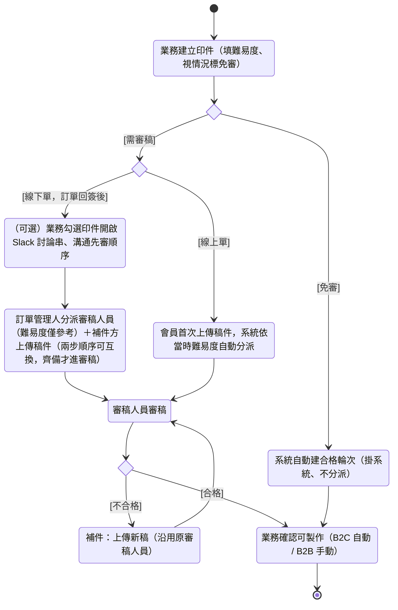

## 概述

一個印件的稿件從客戶交來到審稿過關、業務確認可投產，[[業務]] 要把這份稿件接力到「不會再改、可以投料」的承諾點——值得做，是因為稿件沒審過或審完還要改就先投產，等於拿料和工時去賭客戶不退稿，做完才退就是整批報廢。觸發是業務在需求單上建立一個印件並評估難易度（1-10 分整數，必填，量表語意見 [[難易度機制]] 與 [[PI-001-難易度分數業務含義]]）。

變體為接力型——過程在業務、訂單管理人（線下單分派）、系統（線上單分派）、審稿人員、補件方（[[業務]] 代 B2B 客戶補件／B2C 會員自行補件）之間交棒，球可能在審稿人員與補件方之間來回數輪。具現自 [[線下訂單流程]] 階段 6 稿件審查。

整體觸發者是業務填難易度與免審標記。分派的執行者依訂單來源分型：線下單於訂單回簽後由 [[訂單管理人]] 手動分派、線上單於首次上傳稿件時由系統自動分派，規則正本在 [[審稿分配規則]] 與 [[難易度機制]]；多輪紀錄怎麼保留、檔案怎麼鎖在 [[稿件管理規則]]；哪些印件可免審在 [[免審決策樹]]；審稿維度各狀態與轉換正本在 [[印件狀態]]。本卡只描述這份稿件如何一步步接力到「已確認可製作」，引用規則卡與狀態卡、不重述候選條件、優先序、門檻與轉換。

具體例子：訂單 ORD-2026-0512 的型錄印件，業務評難易度 8、不免審。訂單回簽後業務勾選這件與另兩件交期緊的印件開啟 Slack 討論串說明先審；訂單管理人依討論把它分派給審稿人員小陳。客戶交稿後第 1 輪因解析度不足被退（退件原因：解析度過低），業務向客戶取得新稿、代為補件，原審稿人員重審後合格。業務跟客戶確認內容無誤、確認可製作，印件收斂到「已確認可製作」、放行建工單。

## 主成功過程（一般印件審稿）

> 印件非免審，稿件需經審稿人員至少一輪判定才能放行投產。

1. **[[業務]]** 在需求單上建立印件並評估難易度（1-10 分整數，必填）、視情況標記免審。判準：依 [[難易度機制]]，每個印件都帶一個難易度分數，未填難易度的印件無法送出需求單；難易度與免審於成交轉訂單時帶入，**訂單完成前業務仍可於訂單印件調整**（已分派後次一輪生效，見 [[難易度機制]]／[[免審決策樹]]，本卡不複述量表與閘門）。
2. **分派審稿人員**——執行者依訂單來源分型（規則正本 [[審稿分配規則]]，本卡不複述候選條件）：線下單於訂單回簽後由 **[[訂單管理人]]** 手動分派（候選列全部在崗審稿人員、難易度僅參考標示；業務得先開 Slack 討論串溝通先審哪些，見延伸岔路「審稿討論」）；線上單於印件首次上傳稿件時由**系統**依難易度自動分派。判準：印件有負責審稿人員、離開「待分派」（[[印件狀態]]）。
3. **補件方**（B2B 由 [[業務]] 代客戶上傳、B2C 由會員於電商會員中心自行上傳）上傳印件原稿。線下單的上傳與第 2 步分派順序可互換——稿件先到而尚未分派的印件停在「待分派」並通知訂單管理人。判準：稿件已上傳且已有負責審稿人員時，審稿維度進入「等待審稿」（[[印件狀態]]），球落在審稿端。
4. **[[審稿人員]]** 對本輪稿件逐輪判定合格或不合格。判準：判定合格時上傳審稿後檔案與縮圖、可選填審稿備註；判定不合格時須擇一退件原因並填審稿備註補充說明，印件審稿維度轉「不合格」、系統通知補件方。本輪審稿備註送出後仍可回頭修正（糾正錯字或補充說明），每輪紀錄與三類檔案完整保留（規則背書見 [[稿件管理規則]]，本卡不複述輪次保留與退件原因分類）。不合格時走補件迴圈（見延伸岔路），補正再審直到合格。
5. **判定合格後**，B2B 由 **[[業務]]** 跟客戶確認內容無誤後確認可製作、B2C 訂單由系統自動確認可製作。判準：印件審稿維度自「合格」轉「已確認可製作」（[[印件狀態]]）；合格代表審稿人員品質判定通過，已確認可製作代表客戶不會再改稿、可投產，兩步分離品質判定與製作決策。
6. 印件審稿維度收斂於「已確認可製作」終態，觸發後續工單建立。判準：印件審稿維度為「已確認可製作」，這份稿件不會再改、可以投料。

## 流程視圖（分派／免審決策）

> 本圖以 **UML 標準記法**繪製審稿的流程／決策視角，採與 [[印件狀態]] 相同的 mermaid `stateDiagram-v2` 記法：`[*]` 為初始／終止節點、`<<choice>>` 為判斷節點（分支標 `[守衛條件]`）。與 [[印件狀態]] **互補而非重複**——印件狀態圖的節點是**印件的狀態**（等待審稿、合格…），本圖的節點是**流程動作與決策**（免審判斷、分派、審稿…），把分派與免審的決策點顯式畫出。狀態與規則引用 [[印件狀態]]／[[審稿分配規則]]／[[免審決策樹]]，本圖不另定義。退回重審等其他岔路見下方「延伸岔路」。

難易度／免審為印件可編輯欄位：**訂單完成前可改，已分派審稿人員後改於次一輪生效**；審稿維度到「已確認可製作」後改之無實質效果（審稿不可逆）。

## 延伸岔路

- **審稿討論（線下單）｜掛載步：主成功過程第 2 步分派之前｜條件：線下單回簽後，業務判斷需與訂單管理人溝通審核先後順序**：**[[業務]]** 於訂單內勾選要一起審核的印件、點「開啟討論」，ERP 透過 webhook 建立 Slack 討論串、帶入訂單與印件資訊並 mention [[訂單管理人]]（介面約束見 [[審稿討論Slack串接約束]]）；雙方於討論串確認先審哪些後，訂單管理人回 ERP 執行分派。判準：討論串已建立且訂單管理人已被 mention、討論串連結留存於訂單。討論串為可選輔助——簡單案件訂單管理人可不經討論直接分派。順序不落系統欄位。

- **免審直通｜掛載步：主成功過程第 1 步業務已標記免審｜條件：印件在需求單階段標記免審**：跳過第 2 步分派與第 3-4 步審稿，**系統** 在訂單成立時自動為該印件建立一筆合格輪次、印件審稿維度自「待分派」直達「合格」（[[印件狀態]]），免審印件不進入審稿人員的待審清單；B2C 訂單接著自動確認可製作、B2B 仍由 [[業務]] 手動確認可製作（自此同主成功過程第 5 步起）。免審的判定準則見 [[免審決策樹]] 與 [[AR-8-免審稿適用條件與核可機制]]、[[PI-002-免審決策準則]]，本卡只描述免審印件走的捷徑、不複述哪些情境算免審。

- **批次審稿｜掛載步：主成功過程第 4 步審稿人員判定時｜條件：同訂單內有多個分派給同一審稿人員的待審印件（「等待審稿」或「已補件」），審稿人員決定一次判定**：**[[審稿人員]]** 於待審清單勾選同訂單內多個自己負責的待審印件批次送審，整批同一結果（全合格或全不合格）；判定合格時上傳一張稿件縮圖套用整批、審稿後檔案逐印件分別上傳，判定不合格時退件原因整批共用、審稿備註預設共用可逐印件覆寫（檔案與備註規則正本見 [[稿件管理規則]]，本卡不複述）。判準：批次內每個印件各自產生一筆審稿輪次、審稿維度各自轉移（狀態名依 [[印件狀態]]）。批次內個別印件有問題時，自批次移除、另行單獨送審（回主成功過程第 4 步逐件判定）。線上單線下單皆適用。

- **補件迴圈（B2B）｜掛載步：主成功過程第 4 步審稿人員判定不合格後｜條件：客戶決定就同一印件補正稿件再審**：**[[業務]]** 在訂單詳情查看退件原因與審稿備註，向客戶取得修改後的新稿、代為上傳並選填補件說明；送出後印件審稿維度自「不合格」轉「已補件」（[[印件狀態]]），由**原審稿人員**重審、不重新跑分派（規則背書見 [[審稿分配規則]] 與 [[稿件管理規則]]）。原審稿人員不在崗時由 [[訂單管理人]] 或 [[審稿主管]] 重新分派（見 [[覆寫審稿分派]]）。自此回到主成功過程第 4 步重審。

- **補件迴圈（B2C）｜掛載步：主成功過程第 4 步審稿人員判定不合格後｜條件：B2C 會員決定就同一印件補正稿件再審**：B2C 會員於電商會員中心查看歷史輪次與最新一輪審稿意見、重新上傳稿件，由電商系統回寫至 ERP；送出後印件審稿維度自「不合格」轉「已補件」（[[印件狀態]]），同樣由原審稿人員重審、不重新派件。自此回到主成功過程第 4 步重審。

- **業務退回重審｜掛載步：主成功過程第 5 步合格之後、確認可製作之前｜條件：印件已合格但業務判斷客戶需改稿（換標誌、改文字等內容變更）**：**[[業務]]** 將印件退回重審並填退回原因，印件審稿維度自「合格」轉「待改稿」、客戶上傳新稿後再轉「等待審稿」（[[印件狀態]]），同一印件重走審稿（自此回到主成功過程第 4 步）。僅限「合格」狀態可退回；印件一旦進「已確認可製作」即不可退回重審。退回重審用於同一印件改稿，與印件規格全換的棄用重建分工（規則背書見 [[稿件管理規則]]，本卡不複述兩者邊界）。

- **補件停滯｜掛載步：補件迴圈中補件方遲遲未補正｜條件：審稿不合格後補件方長時間未補件、或來回輪次過多**：補件輪次目前無上限、停滯的處置機制尚未定案，待 [[AR-11-補件停滯處理機制與輪次上限]]。

## 收斂狀態

做完後這份稿件處於 [[印件狀態]] 審稿維度的「已確認可製作」終態——審稿人員品質判定已通過、業務已確認客戶不再改稿，這份稿件可以投料、觸發工單建立。免審印件同樣收斂於此終態（經免審直通的合格與確認）。

## 範圍外

- 分派的規則本體——線上單自動分派的候選條件、能力匹配優先序、溢位處理；線下單手動分派的候選呈現與參考標示 → [[審稿分配規則]] 與 [[難易度機制]]（規則正本，本卡只引用「依規則指定一名審稿人員」的業務結果）。已分派印件的換人完整過程 → [[覆寫審稿分派]]。
- Slack 討論串的建立方式、帶入內容、失敗補救 → [[審稿討論Slack串接約束]]（介面約束正本）與 [[AR-15-審稿討論webhook建立失敗補救]]。
- 審稿維度各狀態怎麼轉、守衛條件 → [[印件狀態]]（狀態與轉換的標準依據，本卡只引用狀態名）。
- 多輪審稿紀錄怎麼保留、退件原因如何分類、工單建立時檔案如何鎖定、稿件備註與審稿備註的所有權差異 → [[稿件管理規則]]（規則正本）。
- 哪些情境算免審、免審核可機制 → [[免審決策樹]]、[[AR-8-免審稿適用條件與核可機制]]、[[PI-002-免審決策準則]]。
- 審稿人員待審清單的預設排序與急單標記 → [[AR-5-待審清單預設排序與急單標記]]。
- 不合格率（退件率）指標的分母口徑與技術性退件如何排除 → 屬實作規格層 KPI 定義，存在但不在本卡。
- 管理層監控當日審稿工作量、比對審稿人員績效、追蹤部門審稿完成紀錄 → 屬查看類，無完成弧線、不構成審稿目標的完成步驟，由實作規格層工作台承載，不在本卡。
- 打樣後判定稿件問題、原印件棄用並複製新印件重新進入新審稿週期（前提為原印件已合格終態）→ [[打樣後稿件問題重審]]（與本卡補件迴圈本質不同：本卡是同週期內補正再審、該卡是跨階段重新進入新審稿週期）。

## 相關卡

### 服務藍圖

- [[線下訂單流程]]（本卡具現其階段 6 稿件審查）

### 規則

- [[審稿分配規則]]（分派執行者雙型與改派規則正本）
- [[難易度機制]]（難易度分數用途規則正本）
- [[稿件管理規則]]（審稿輪次保留與檔案鎖定規則正本）
- [[免審決策樹]]（免審直通判定規則正本）
- [[審稿討論Slack串接約束]]（審稿討論串介面約束）

### 角色

- [[業務]]（填難易度與免審標記、發起審稿討論並決定先審順序、B2B 代客戶補件、確認可製作、退回重審）
- [[訂單管理人]]（線下單分派審稿人員、承接審稿討論、換人）
- [[審稿人員]]（逐輪判定合格／不合格、上傳審稿後檔案、重審補件）
- [[審稿主管]]（分派同權、能力等級管理）

### 狀態機

- [[印件狀態]]（審稿維度狀態與轉換，本卡引用狀態名）

### 實體

- [[印件]]（本卡審稿過程依附的主實體）
- [[需求單]]（業務填難易度與免審標記的起點單據）

### 情境

- [[覆寫審稿分派]]（已分派印件的換人完整過程）
- [[打樣後稿件問題重審]]（合格後打樣判定稿件問題、棄用重建後重新進入新審稿週期）

### OQ

- [[PI-001-難易度分數業務含義]]（1-10 分量化準則待釐清）
- [[AR-8-免審稿適用條件與核可機制]]（免審適用條件與核可機制待釐清）
- [[PI-002-免審決策準則]]（免審決策準則待規約化）
- [[AR-11-補件停滯處理機制與輪次上限]]（補件輪次上限與停滯處置待釐清）
- [[AR-5-待審清單預設排序與急單標記]]（待審清單預設排序與急單標記待釐清）
