# Odoo 供應鏈參考架構（生產 → 報工 → 廠間移轉 → 品檢 → 揀貨 → 出貨）

> 外部系統參考卡（非公司商業記憶正本）：Odoo 18.0 供應鏈實作方式的圖解精練版，供生產關規劃與後續 insight 對照。事實出處與逐段官方文件 URL 見文末參考資料的兩張 raw 卡；本卡只呈現架構，不重複敘述。

## 概述

Odoo 供應鏈的所有流程共用三個原語：**位置**（供應商、客戶、生產區、報廢區、在途全部建模為位置，狀態即位置）、**作業類型**（每張移轉單的類別與行為設定）、**路線規則**（push／pull rule 自動生成鏈式單據，前段驗證完成、後段才變 Ready）。六段流程（生產、報工、廠間移轉、品檢、揀貨、出貨）都是這三者的組合。

## 一、資料結構（ER-Model）

### 1. 庫存核心與路線

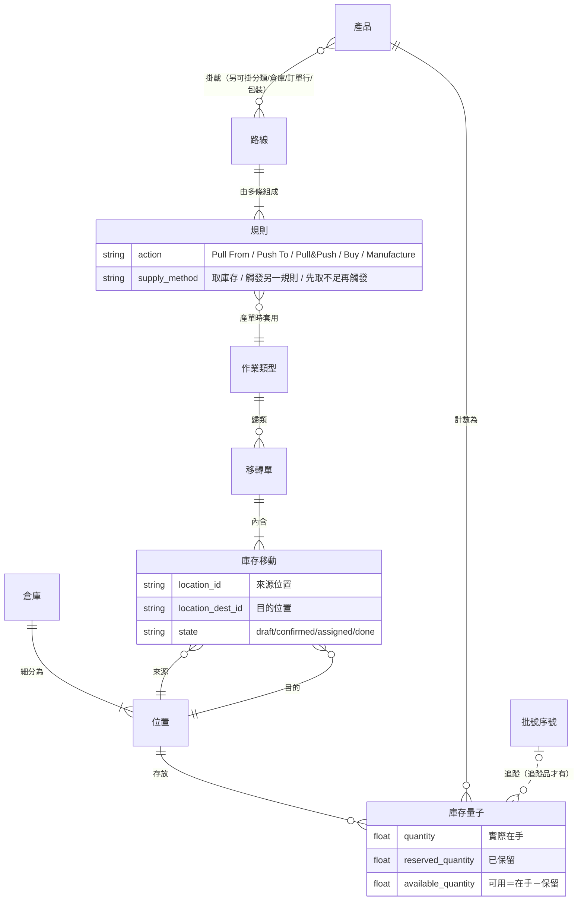

位置類型七種：供應商、View（純組織）、內部儲位、客戶、盤損、生產區、在途。

### 2. 製造與報工

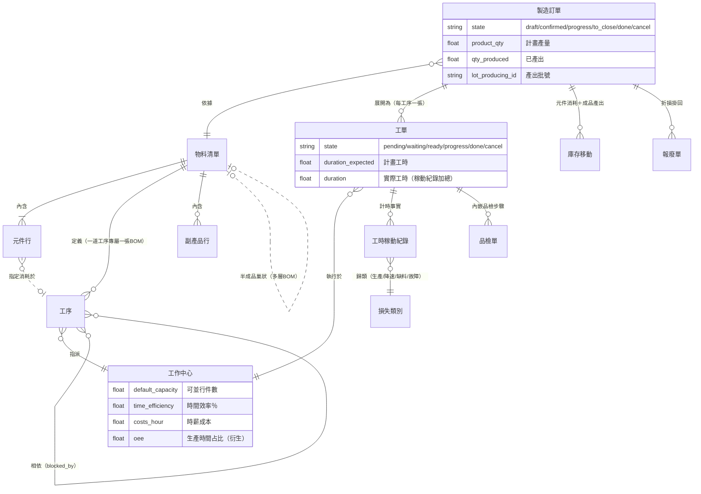

### 3. 品質

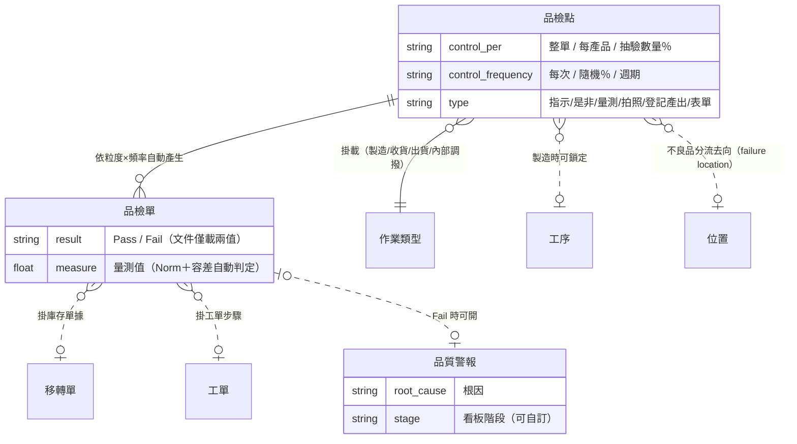

### 4. 揀貨與出貨

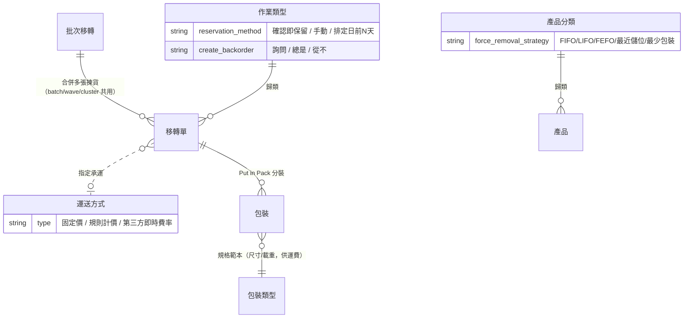

## 二、端到端角色分工（泳道圖）

概覽層級；各段細節見 § 三。

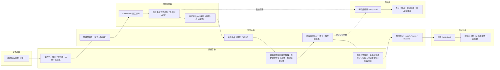

## 三、各段流程

### 1. 生產單據鏈（1／2／3 步製造，倉庫層設定）

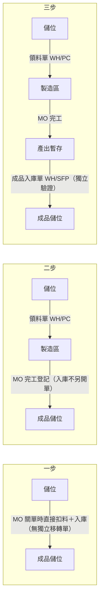

三步制下半成品／成品入庫是顯式單據，停留在中間位置的數量即在製品。半成品走多層 BOM：子層各開 MO、子層完工才能開上層。

### 2. 報工（Shop Floor，循序圖）

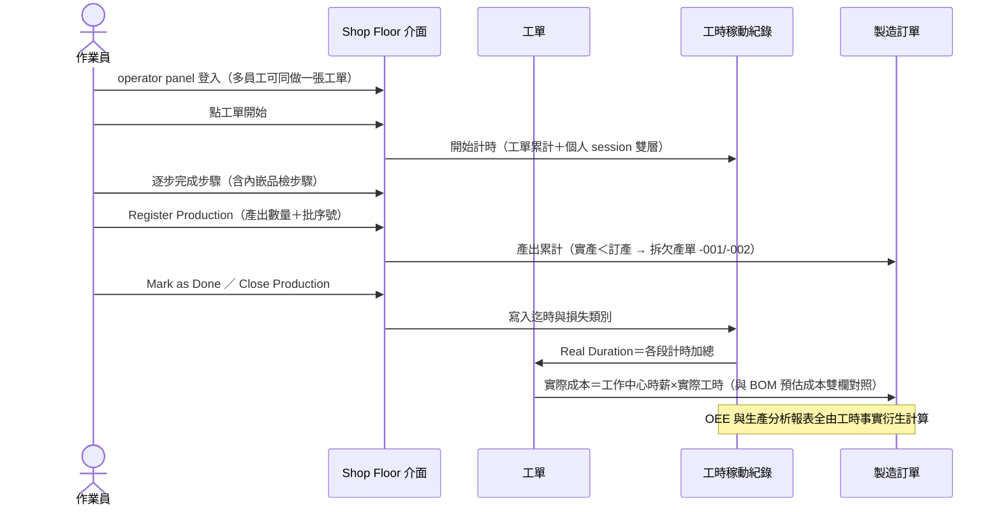

### 3. 廠間移轉（泳道圖）

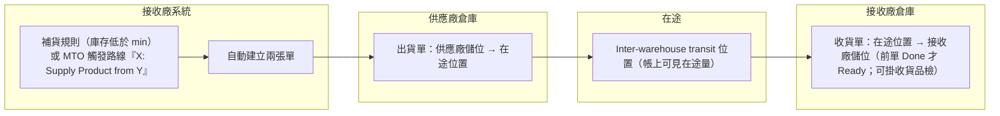

兩張單各自驗證＝兩端各自確認交接；設定面為接收倉勾「Resupply From」供應倉即自動生成路線。

### 4. 品檢分流（活動圖）

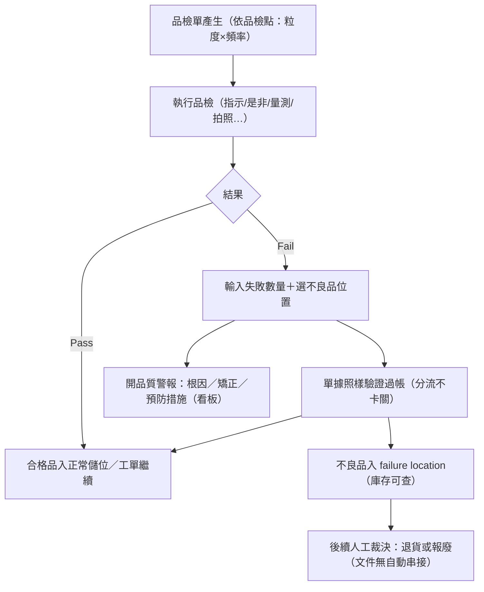

### 5. 揀貨與出貨單據鏈（3 步出貨）

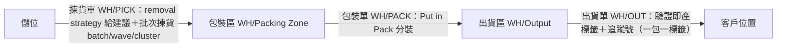

批次揀貨三模式：batch（合併揀、事後分）、wave（先拆單再組波次）、cluster（揀時即分入各單容器）。庫存保留時機設在作業類型層（確認即保留／手動／排定日前 N 天）。

## 四、狀態機（UML）

狀態列舉出自 17.0 原始碼查證（見 [[2026-06-14-claude-research-Odoo製造與庫存模組]]）；18.0 使用者文件僅呈現部分狀態。

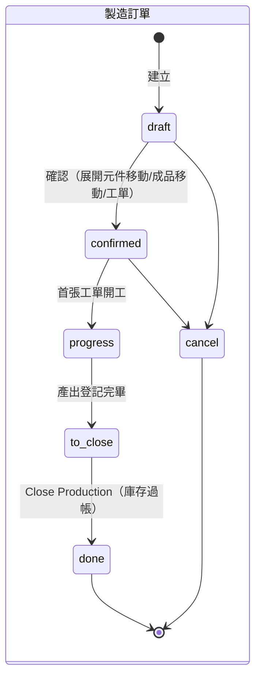

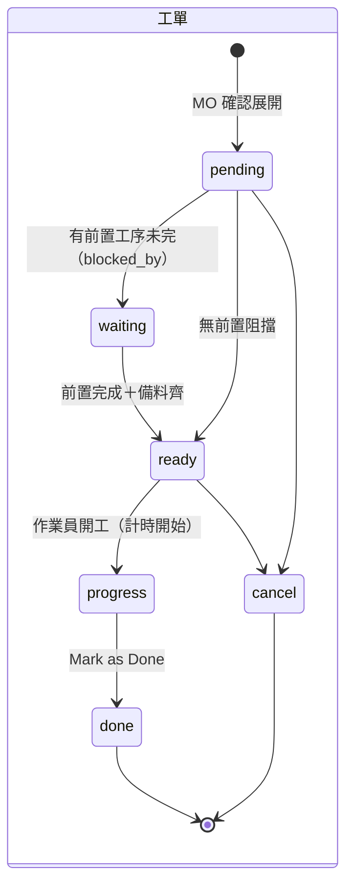

## 五、設計原則對照（對感官生產關規劃）

| Odoo 選擇 | 對照議題 |
|-----------|---------|
| 揀貨＝出貨鏈的一段移轉單，多一張單而非多一個狀態 | 揀貨階段已確立（[[出貨單狀態]] 出貨單即揀貨指令）；載體與狀態顆粒度設計時對照本行（[[SHP-007-揀貨裝箱回報載體與出貨單狀態顆粒度|SHP-007]]） |
| 品檢分流不卡關（位置隔離），品質問題走警報軌道 | 工序間品檢已取消、品檢收斂為入庫前最終品檢（[[工序相依性規則]]），方向同構 |
| 報工無獨立單據，內建工單；事實表先行、KPI 全衍生 | [[報工規則]]、[[報工紀錄]] 的現場回報體系設計 |
| 廠間移轉＝兩張單＋在途位置，兩端各自確認 | [[派單狀態]] 中國線三實體分離（方向同構） |
| 欠產與欠交同構：拆單保留原單號脈絡（-001/-002） | 分批生產／分批出貨的單據設計 |

## 參考資料

- [[2026-07-08-claude-research-Odoo供應鏈生產到出貨流程]] — 18.0 官方使用文件端到端調研（六段流程細節、逐段 URL 總表、查無清單 11 項）
- [[2026-06-14-claude-research-Odoo製造與庫存模組]] — 17.0 原始碼級資料結構（逐欄位、計算式、WIP 建模、OEE 公式、對抗式驗證標記）
- 官方文件入口：[Odoo 18.0 Inventory & MRP](https://www.odoo.com/documentation/18.0/applications/inventory_and_mrp.html)

## 關聯區域

- 狀態機對照：[[工單狀態]]、[[生產任務狀態]]、[[QC 狀態]]、[[出貨單狀態]]、[[派單狀態]]
- 商業邏輯對照：[[工序相依性規則]]、[[報工規則]]、[[齊套邏輯]]、[[生產流程]]
- 實體對照：[[報工紀錄]]、[[成品庫存]]、[[轉交單]]
